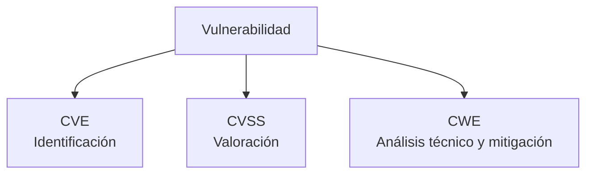
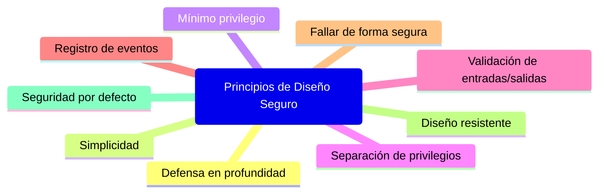

# Notas De Estudio – Tema 1: Seguridad Del Software

## 1. Introducción a la Seguridad Del Software

### Definición

La **seguridad del software** es el conjunto de principios de diseño y buenas prácticas que deben implantarse a lo largo del ciclo de vida del software con el objetivo de **detectar, prevenir y corregir defectos de seguridad**, tanto en el desarrollo como en la adquisición del software.

Su finalidad es obtener software:

- **Confiable**
    
- **Robusto frente a ataques maliciosos**
    
- **Libre de vulnerabilidades** (intencionadas o accidentales)
    
- Capaz de garantizar **integridad, disponibilidad y confidencialidad**.

### Relación Con El Ciclo De Vida

La seguridad debe considerarse en:

- **Desarrollo**
    
- **Adquisición**
    
- **Configuración**
    
- **Mantenimiento**

---

## 2. Vulnerabilidades Del Software

### Definición

Una **vulnerabilidad** es una debilidad que puede set explotada por un atacante para comprometer un sistema.

### Orígenes De Las Vulnerabilidades

|Origen|Descripción|Ejemplo|
|---|---|---|
|**Errores de diseño**|Deficiencias en la arquitectura o protocolos|Envío de usuario/contraseña en claro o codificados en Base64|
|**Errores de codificación**|Fallos introducidos por el desarrollador por desconocimiento o descuido|Validaciones incorrectas, buffer overflow|
|**Errores de configuración**|Configuraciones inseguras o por defecto|Falta de endurecimiento del sistema, parámetros inseguros|

---

## 3. Gestión De Vulnerabilidades

Existen estándares ampliamente utilizados para identificar, clasificar y comprender vulnerabilidades.

### CVE – _Common Vulnerabilities and Exposures_

- Registro de vulnerabilidades conocidas.
    
- Usado por empresas, herramientas y organismos.

### CVSS – _Common Vulnerability Scoring System_

- Permite **calificar la gravedad** de una vulnerabilidad.
    
- Escala de 0 a 10.
    
- Vulnerabilidades con **más de 8** y con exploit disponible son críticas y deben corregirse prioritariamente.

### CWE – _Common Weakness Enumeration_

- Catálogo técnico de debilidades en software.
    
- Describe:
    
    - El error técnico
        
    - Cómo se produce
        
    - Ejemplos de código
        
    - Mitigaciones
        
    - Requisitos de diseño para evitarlo
        
- Altamente útil para especialistas de seguridad del software.

#### Relación De Los Estándares

---

## 4. Propiedades De Un Software Seguro

### Propiedades Esenciales

|Propiedad|Definición|
|---|---|
|**Confidencialidad**|Información accessible solo por usuarios o procesos autorizados.|
|**Integridad**|Los datos no pueden set alterados sin autorización.|
|**Disponibilidad**|El sistema debe estar operativo cuando sea necesario.|

### Propiedades Complementarias

|Propiedad|Explicación|
|---|---|
|**Autenticación**|Verifica que el usuario o proceso es quien dice set.|
|**Trazabilidad**|Permite registrar y rastrear acciones.|
|**Robustez**|Capacidad de operar bajo condiciones adversas.|
|**Resiliencia**|Recuperación rápida ante fallos o ataques.|
|**Tolerancia a fallos**|Capacidad de seguir funcionando ante un fallo parcial.|

---

## 5. Principios De Diseño Seguro

Principios fundamentales que deben aplicarse al diseñar software seguro:

### Defensa En Profundidad

Múltiples capas de defensa para evitar que un fallo en una capa comprometa todo el sistema.

### Simplicidad En El Diseño

Diseños simples reducen errores.  
Ejemplo: una máquina de estados con 4 estados es menos propensa a fallos que una con 10.

### Mínimo Privilegio

Lo que no está explícitamente permitido está prohibido.

### Separación De Privilegios

Separación de dominios, código, procesos y permisos para evitar escaladas de privilegios.

### Entorno De Ejecución Seguro

Validación estricta de entradas y salidas.

### Registro De Eventos De Seguridad

Permite detectar ataques y activar respuestas adecuadas.

### Fallar De Forma Segura

El software debe fallar minimizando el impacto.

### Diseño Resistente

El sistema debe soportar condiciones inesperadas y ataques.

### Seguridad Por Defecto

La configuración inicial debe set segura sin necesidad de pasos adicionales.

---

## Resumen De Puntos Clave

- La seguridad del software debe integrarse en todas las fases del ciclo de vida.
    
- Las vulnerabilidades provienen del diseño, la codificación o la configuración.
    
- CVE identifica, CVSS puntúa y CWE analiza técnicamente las vulnerabilidades.
    
- Propiedades esenciales: confidencialidad, integridad y disponibilidad.
    
- Los principios de diseño seguro ayudan a prevenir fallos y ataques desde el diseño inicial.
    
- La simplicidad, el mínimo privilegio y la defensa en profundidad son pilares básicos.

---

## MicroTest

## (Espacio Para preguntas)