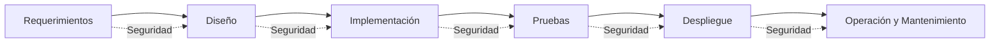
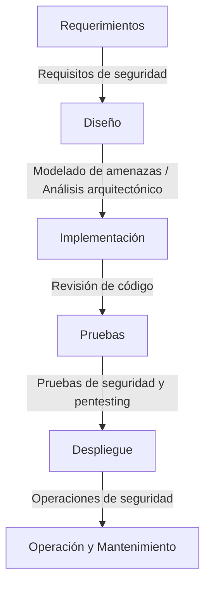

# Notas De Estudio

## Seguridad En El Ciclo De Vida Del Software (SDLC)

---

## 1. Concepto De Seguridad Del Software

### Definición

La **seguridad del software** es el conjunto de **principios de diseño** y **buenas prácticas** incorporadas durante el SDLC para **detectar, prevenir y corregir** defectos de seguridad. Su objetivo es desarrollar software **confiable, robusto y libre de vulnerabilidades**, capaz de mantener:

- **Integridad**: los datos no son alterados sin autorización.
    
- **Disponibilidad**: el sistema está accessible cuando se necesita.
    
- **Confidencialidad**: la información solo es accessible a quienes corresponda.

### Importancia

El incremento de ataques a software vulnerable demuestra que la protección **solo a nivel de infraestructura es insuficiente**. Es necesario reducir las vulnerabilidades directamente en la **capa de aplicación**, donde suelen set más críticas y explotables.

---

## 2. Seguridad Más Allá De Vulnerabilidades Y Pentesting

La seguridad del software **no se limita** a la eliminación de vulnerabilidades o a realizar pruebas de penetración.  
Incluye un enfoque **sistémico**, donde los gerentes y equipos incorporan prácticas formales de seguridad a lo largo de todo el ciclo de vida, como en el enfoque **Touchpoints**, que integra seguridad en cada fase del SDLC.

Objetivos:

- Producir software **más seguro y confiable**.
    
- Poder **verificar su seguridad** mediante prácticas trazables.

---

## 3. La Seguridad En El SDLC

No existe una única metodología superior en ingeniería de seguridad de software.  
**Lo esencial** es que la seguridad sea considerada desde las **primeras etapas** del SDLC, independientemente del modelo (cascada, iterativo, ágil).

### Representación Del SDLC Con Seguridad

El modelo mencionado se basa en un esquema similar al modelo en cascada, donde se asignan actividades y prácticas de seguridad a cada fase.

---

## 4. Buenas Prácticas De Seguridad En Cada Fase

La siguiente tabla resume las prácticas mencionadas y su propósito general:

|Práctica|Descripción|
|---|---|
|**Modelado de amenazas**|Identificación sistemática de posibles ataques.|
|**Casos de abuso**|Escenarios donde un actor intenta usar el sistema de forma maliciosa.|
|**Modelado de ataques**|Representación detallada de cómo un atacante podría explotar el sistema.|
|**Requisitos de seguridad**|Definición formal de necesidades de protección desde la fase de requisitos.|
|**Análisis de riesgo arquitectónico**|Evaluación temprana de riesgos en el diseño de la arquitectura.|
|**Patrones de diseño seguros**|Uso de soluciones de diseño probadas que reducen vulnerabilidades.|
|**Pruebas de seguridad basadas en riesgo**|Priorización de pruebas según impacto y probabilidad.|
|**Revisión de código**|Inspección del código para detectar defectos de seguridad.|
|**Pruebas de penetración**|Intento controlado de explotar vulnerabilidades del sistema.|
|**Operaciones de seguridad**|Controles para mantener la seguridad durante el uso y mantenimiento.|
|**Revisión externa**|Auditorías de seguridad realizadas por terceros independientes.|

![[Pasted image 20251120144231.png]]

---

## 5. Integración De Buenas Prácticas En El SDLC

---

## Resumen De Puntos Clave

- La seguridad del software es un conjunto de prácticas integradas en todo el SDLC, no una fase aislada.
    
- Va más allá del pentesting: implica diseño seguro, análisis de riesgos y revisiones continuas.
    
- Debe considerarse desde las primeras etapas del desarrollo para reducir vulnerabilidades explotables.
    
- Las buenas prácticas aplican en cualquier modelo de ciclo de vida.
    
- Integrar prácticas como modelado de amenazas, revisión de código y pruebas basadas en riesgo aumenta la confiabilidad del software.

---

## MicroTest

1. El desarrollo de software seguro y confiable require la adopción de un proceso sistemático o disciplina que aborde la seguridad en cada una de las fases de su ciclo de vida. Se debe integrar en él dos tipos de actividades:
    
    - **La respuesta:** C. Seguimiento de unos principios de diseño seguro y una series de buenas prácticas de seguridad.
        
    - **Justificación:** El transcript señala que la seguridad del software se basa en **principios de diseño seguro** y **buenas prácticas** integradas en todo el SDLC (como modelado de amenazas, análisis de riesgos, revisión de código, etc.), lo que coincide exactamente con la opción C.
        
2. Un producto software ofensivo no necesita utilizar un S-SDLC:
    
    - **La respuesta:** B. Sí puede necesitarlo, porque es un desarrollo software como otro cualquiera.
        
    - **Justificación:** Aunque el propósito del software ofensivo sea atacar, **sigue siendo software**, por lo que require calidad, fiabilidad y ausencia de vulnerabilidades no deseadas. El S-SDLC aplica a cualquier tipo de desarrollo para garantizar robustez y control de riesgos.
        
3. ¿Qué incluye la seguridad del software?
    
    - **La respuesta:** B. Principios de diseño seguro.
        
    - **Justificación:** En el contenido estudiado se explica que la seguridad del software integra **principios de diseño**, buenas prácticas en el SDLC y actividades como modelado de amenazas y análisis de riesgos. Los principios de diseño seguro forman parte esencial de este enfoque.

<iframe title="Secure Development Lifecycles (SDLC): Introduction and Process Models - Bart De Win" src="https://www.youtube.com/embed/L-gL1YQUrwg?start=14&amp;feature=oembed" height="113" width="200" allowfullscreen="" allow="fullscreen" style="aspect-ratio: 1.76991 / 1; width: 100%; height: 100%;"></iframe>

****