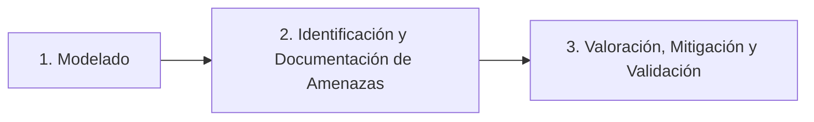
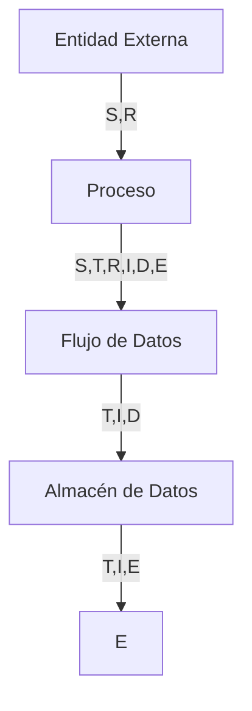
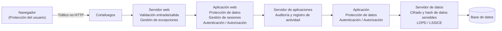
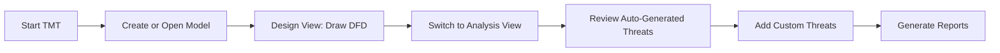
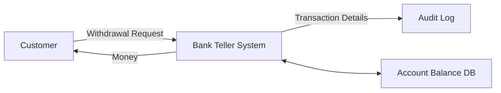
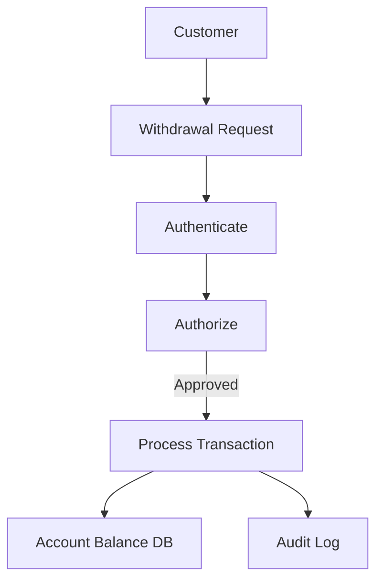

# Notas De Estudio

## Modelado De Amenazas

---

## 1. Introducción Al Modelado De Amenazas

### Definición De Amenaza

Una **amenaza** es cualquier actor, agente, evento o circunstancia con el **potential** de causar daño a los datos, aplicaciones o recursos de un sistema.  
El énfasis está en _potencial_, ya que una amenaza no necesita estar ocurriendo para representar un riesgo.

### ¿Qué Es El Modelado De Amenazas?

El **modelado de amenazas** es una herramienta que permite evaluar riesgos inherentes a una **aplicación durante su desarrollo**.  
No debe confundirse con el análisis de riesgos organizacional; se centra exclusivamente en riesgos derivados del diseño y funcionamiento de una aplicación.

Es un **framework estructurado** que ayuda a:

- Identificar amenazas.
    
- Analizar riesgos en el diseño.
    
- Planificar y seleccionar mitigaciones.
    
- Mejorar la arquitectura mediante un proceso sistemático.

---

## 2. Metodologías De Modelado De Amenazas

Existen varias metodologías, entre ellas:

|Metodología|Estado / Característica|
|---|---|
|CORA|Utilizada en ciertos entornos técnicos.|
|Microsoft SDL Threat Modeling (MSTAM / Microsoft Threat Modeling Tool)|Una de las más usadas. Basada en STRIDE.|
|PASTA (Process for Attack Simulation and Threat Analysis)|Desarrollada por OWASP. En desuso.|
|TRIKE|Menor adopción actual.|
|OCTAVE / PTA|Antiguas o poco aplicadas hoy.|

La metodología utilizada en el transcript es una **adaptación del modelo Microsoft (STRIDE + DFD + DREAD)**.

---

## 3. Fases Del Modelado De Amenazas

El proceso propuesto se divide en **tres fases principales**:

---

## 4. Fase 1: Modelado Inicial

### 4.1 Identificación De Activos

Incluye:

- Datos confidenciales
    
- Servidores
    
- Páginas web
    
- Disponibilidad del sistema
    
- Components críticos

### 4.2 Definición De Arquitectura

Se detallan:

- Funcionalidades
    
- Flujos de datos
    
- Tecnologías
    
- Components internos y externos

### 4.3 Descomposición Mediante DFD

El **Diagrama de Flujo de Datos (DFD)** permite visualizar cómo se mueve la información entre components.

#### Elementos Del DFD

| Elemento                 | Ejemplos                                                                 |
| ------------------------ | ------------------------------------------------------------------------ |
| **Entidades externas**   | Actores, otros sistemas, servicios externos (Microsoft, Google).         |
| **Procesos**             | Servicios web, ejecutables, objetos, components.                         |
| **Flujos de datos**      | Llamadas de función, tráfico HTTP/HTTPS, RPC, llamadas a procedimientos. |
| **Almacenes de datos**   | Bases de datos, archivos, registros, colas, memoria.                     |
| **Límites de confianza** | Fronteras del sistema, DMZ, Internet, microservicios.                    |

### Herramienta Recomendada

- **Microsoft Threat Modeling Tool**, que permite dibujar el DFD y generar amenazas automáticamente según el modelo STRIDE.

---

## 5. Fase 2: Identificación Y Documentación De Amenazas

### Modelo STRIDE

Se utilize para clasificar amenazas detectadas en cada componente del DFD.

|Letra|Tipo de amenaza|Significado|
|---|---|---|
|S|Spoofing|Suplantación de identidad.|
|T|Tampering|Manipulación de datos.|
|R|Repudiation|Negación de acciones.|
|I|Information Disclosure|Pérdida de confidencialidad.|
|D|Denial of Service|Interrupción de disponibilidad.|
|E|Elevation of Privilege|Escalada de privilegios.|

#### Aplicabilidad En DFD

### Documentación De Amenazas

Se usa una tabla con campos típicos:

- Nombre
    
- Descripción
    
- Componente afectado
    
- Tipo STRIDE
    
- Evidencia
    
- Mitigación propuesta

---

## 6. Fase 3: Valoración Y Priorización (Modelo DREAD)

### Modelo DREAD

Cada amenaza se puntúa de 1 a 3 (bajo, medio, alto).

|Parámetro|Descripción|
|---|---|
|**Damage potential**|Daño que provocaría su explotación.|
|**Reproducibility**|Facilidad para reproducir el ataque.|
|**Exploitability**|Facilidad de explotación.|
|**Affected users**|Número de usuarios afectados.|
|**Discoverability**|Facilidad de encontrar la vulnerabilidad.|

### Cálculo Del Riesgo

- **Probabilidad** = Reproducibility + Exploitability + Discoverability
    
- **Impacto** = Damage potential + Affected users
    
- **Riesgo total** = Suma de ambos
    
- Máximo possible (ejemplo utilizado): **54**

---

## 7. Fase 4: Mitigación De Amenazas

Ejemplos de mitigaciones típicas según tipo STRIDE:

| Amenazas                         | Propiedad          | Salvaguardas |
|----------------------------------|--------------------|--------------|
| **Spoofing identity** (suplementación de identidad) | Autenticación | - Procesos de autenticación, autorización y auditoría (AAA): hash, firma digital.   - Protección de secretos.   - No almacenamiento de secretos.   - Single sign on.   - IPSEC. |
| **Tempering with data** (manipulación de datos) | Integridad | - Procesos de AAA: hash, firma digital.   - Códigos de autenticación de mensajes.   - Firmas digitales.   - Protocolos resistentes a la manipulación.   - Listas de control de acceso ACL. |
| **Repudiation** (repudio)       | No repudio         | - Procesos de autenticación: hash, firma digital.   - Proceso de auditoría.   - Sellado de tiempo. |
| **Information disclosure** (revelación de información) | Confidencialidad | - Procesos de AAA: hash, firma digital.   - Protección de secretos.   - No almacenamiento de secretos.   - Protocolos seguros.   - Encriptado. |
| **Denial of service** (denegación de servicio) | Disponibilidad | - Procesos de AAA: hash, firma digital.   - Listas de control de acceso ACL.   - Calidad de servicio. |
| **Elevation of privilege** (elevación de privilegios) | Autorización | - Listas de control de acceso ACL.   - Control de acceso basado en roles.   - Trabajar con el mínimo privilegio.   - Validación de entradas. |

---

## 8. Fase 5: Validación

Consiste en:

- Verificar la eficacia de las mitigaciones.
    
- Rediseñar controles si no reducen el riesgo a niveles aceptables.
    
- Repetir el ciclo si es necesario.

![[Pasted image 20251120150332.png]]

---

## 9. Beneficios Del Modelado De Amenazas

- Mejora significativamente el diseño de aplicaciones.
    
- Ayuda a identificar debilidades difíciles de detectar en fases posteriores.
    
- Aporta insumos para revisiones de código orientadas a seguridad.
    
- Facilita seleccionar tecnologías y controles de seguridad adecuados.
    
- DFD y STRIDE ayudan a identificar vulnerabilidades de diseño.

---

## Resumen De Puntos Clave

- El modelado de amenazas analiza riesgos directamente en el diseño de la aplicación.
    
- Usa herramientas como **DFD**, **STRIDE** y **DREAD** para estructurar el proceso.
    
- Detecta amenazas antes del desarrollo final, reduciendo costos y fallos críticos.
    
- Permite definir mitigaciones y validar su eficacia en un ciclo iterativo.
    
- Es una práctica esencial para fortalecer arquitecturas y minimizar vulnerabilidades.

---

## MicroTest

### **1. Un Acercamiento a Un Prototipo De Análisis Y Gestión De Riesgo Típico Implica Varias actividades…**

- **La respuesta:** D. Identificar las amenazas y las fuentes relevantes de ataque.
    
- **Justificación:** El análisis y gestión de riesgos inicia identificando **amenazas y actores de ataque**, actividad esencial en cualquier metodología (OCTAVE, NIST, ISO 27005). Aunque identificar vulnerabilidades también es importante, la fase inicial siempre se centra en **identificar amenazas**, porque el resto del análisis depende de ello.

---

### **2. Una De Las Fases Del Proceso De Desarrollo Para Llevar a Cabo El Modelado De Amenazas es:**

- **La respuesta:** A. Fase de arquitectura y diseño.
    
- **Justificación:** El modelado de amenazas se realiza típicamente en la **fase de arquitectura y diseño**, cuando se definen components, flujos de datos y límites de confianza. Si se hace después (codificación, pruebas o implantación), ya es demasiado tarde para influir de forma eficiente en el diseño.

---

### **3. STRIDE es:**

- **La respuesta:** A. Una metodología de soporte al modelado de amenazas.
    
- **Justificación:** STRIDE es un marco de Microsoft que clasifica amenazas (Spoofing, Tampering, Repudiation, Information disclosure, Denial of service, Elevation of privilege). Se usa específicamente para **modelado de amenazas**, no para evaluación de riesgos ni como vulnerabilidad o ataque.

## Tmt

## Microsoft Threat Modeling Tool (TMT) 2016 – Study Notes

## Introduction to Microsoft Threat Modeling

### What is a Threat Model

A threat model is a structured representation of:

- Software or device components.
    
- Data flows between these components.
    
- Trust boundaries that separate levels of privilege or security.

It helps identify potential design vulnerabilities by analyzing:

- Security properties.
    
- Possible threats.
    
- Mitigations needed.

### Approaches to Threat Modeling

1. **Software-centric threat modeling**  
    Focuses on design and data flows rather than infrastructure. It tends to be systematic, repeatable, and integrated with STRIDE.
    
2. **Brainstorming-based threat modeling**  
    Uses expert discussion to gather threat ideas.  
    Weaknesses: lack of structure, bias, unbounded discussions.

### STRIDE Method

|Category|Meaning|Threat Example|
|---|---|---|
|Spoofing|Pretending to be someone else|Fake login credentials|
|Tampering|Modifying data|Altering request data|
|Repudiation|Denying an action|No logs for transactions|
|Information Disclosure|Exposing sensitive info|Leaking account details|
|Denial of Service|Blocking service availability|Overloading authentication|
|Elevation of Privilege|Gaining unauthorized privileges|Bypassing authorization|

---

## Microsoft Threat Modeling Tool (TMT) Overview

### Core Features

- Built-in drawing environment for Data Flow Diagrams (DFDs).
    
- Automatic threat generation based on STRIDE.
    
- Template customization:
    
    - Create personal stencils.
        
    - Define custom threats.
        
    - Remove unused components.
        
- Design View → draw system diagrams.
    
- Analysis View → tool generates threats tied to diagram elements.
    
- Reporting:
    
    - Full reports show diagrams, levels, and threat breakdowns.

### Drawing Environment Elements (Stencils)

TMT provides multiple stencil items, but the _generic_ ones are most commonly used:

- **Process** (circle)
    
- **Data Store** (cylinder)
    
- **External Entity** (square)
    
- **Data Flow** (arrow)
    
- **Trust Boundary** (dashed line)

Each element must be **labeled clearly**.

### Workflow Summary

---

## Getting Started Guide – Key Concepts

### Main Goals of the Guide

- Explain tool functionality.
    
- Show installation steps and OS requirements.
    
- Demonstrate drawing and analysis modes.
    
- Introduce custom template creation.
    
- Provide examples of reports and export behaviors.

### DFD Structure and Behavior

- Drawing area = central workspace.
    
- Stencil pane = reusable components.
    
- Properties pane = contextual info based on selected item.
    
- Switching to **Analysis View** reveals:
    
    - Threat lists.
        
    - STRIDE categorization.
        
    - Threat state, priority, mitigation notes.
        
    - Sorting by underlined column headers.

### Creating Custom Templates

Purpose:

- Simplify modeling by selecting only relevant elements.
    
- Improve speed and accuracy.
    
- Provide consistency across teams.

---

## User Guide – Detailed Concepts

### Tool Menu Breakdown

The User Guide includes descriptions of:

- **File menu:** new, open, export, report.
    
- **Edit menu:** copy, paste, duplicate threats.
    
- **View menu:** toggle between Design/Analysis view.
    
- **Settings menu:** templates, threat definitions, configuration.
    
- **Toolbar features:** quick access to frequently used drawing items.

### Stencil Definitions

Each stencil category includes multiple variants. Examples:

- **Process types:** generic, logging process, service process, etc.
    
- **Data stores:** relational DB, file storage, cache systems.
    
- **Data flows:** HTTP, encrypted flow, unencrypted flow.
    
- **External entities:** user, system, service.

### Appendix

- Explains how to:
    
    - Create custom stencils.
        
    - Modify existing threat models to adopt new templates.
        
    - Understand modeling outputs.
        
    - File bugs using threat copies into security tracking systems.

---

## Practical Example: Bank Teller System

### Context Diagram (Level 0)

Purpose: show the system at the highest level with minimal components.

**Components**

- **Customer (External Entity)**
    
- **Bank Teller System (Process)**
    
- **Account Balance Database (Data Store)**
    
- **Audit Log (Data Store)**

**Key Flows**

- Customer → Withdrawal Request
    
- System → Dispensed Money
    
- System → Audit Log Entry
    
- System ↔ Account Balance Data

### Level 1 Diagram (Expanded)

Breakdown of the original “transaction” process:

- **Authenticate (AUTHN)**
    
- **Authorize (AUTHZ)**

Workflow:

1. Customer sends withdrawal request.
    
2. System authenticates identity.
    
3. System authorizes against account permissions and balance.
    
4. If approved:
    
    - Transaction is processed.
        
    - Balance updated.
        
    - Audit logged.

More detailed diagram:

---

## Identifying Assets, Entry Points, and Vulnerabilities

### Entry Points

- Customer request input.
    
- Account information lookup.
    
- Possible bad account list (added later).
    
- Law enforcement notifications (optional extension).

### Protective Assets

- Cash.
    
- Account details.
    
- Audit logs.

### Updating the DFD

When new assets or flows emerge (e.g., bad account list), the DFD must be updated to reflect:

- New external entities (e.g., police).
    
- New flows (e.g., fraud alerts).

---

## Summary of Key Points

- The Microsoft TMT uses STRIDE to automatically generate threats.
    
- Threat modeling begins with a simple **context diagram**, then expands to more detailed levels.
    
- Clear labeling and consistent stencil use are essential.
    
- Analysis View categorizes threats and allows sorting and editing.
    
- Custom templates and stencils improve efficiency.
    
- Reports consolidate diagrams and threat analysis for documentation.
    
- Example bank system demonstrates how authentication, authorization, and auditing integrate into modeling.

---

## MicroTest

## 1. Señala la Respuesta Incorrecta. Los Casos De Abuso

- **La respuesta:** A
    
- **Justificación:**  
    La opción A describe **buenas prácticas para obtener requisitos funcionales**, pero los casos de abuso **no se utilizan** para requisitos funcionales positivos.  
    Su propósito es identificar **acciones que el sistema NO debe permitir**, amenazas y comportamientos maliciosos. Las demás opciones describen correctamente la naturaleza y utilidad de los casos de abuso.

---

## 2. Indicar Diferencias Entre Los Casos De Uso De Seguridad Y Los Casos De Abuso

- **La respuesta:** A
    
- **Justificación:**  
    La opción A es la única que establece correctamente la diferencia clave:
    
    - El **caso de abuso** identifica y describe **amenazas o comportamientos maliciosos**.
        
    - El **caso de uso de seguridad** especifica **requisitos de seguridad** que deben implementarse para mitigar dichas amenazas.  
        Las demás opciones son incorrectas:
        
    - B: el éxito del atacante **no** es el criterio de éxito del caso de uso de seguridad.
        
    - C: está formulada de forma incoherente (se refiere a "casos de abuso de seguridad").
        
    - D: ambos tipos pueden set usados por equipos de seguridad _y_ desarrollo, por lo que no establece diferencias.

---

## 3. Señalar la Respuesta Incorrecta. Los Casos De Abuso Permiten Comprender Mejor Las Áreas De Riesgo Del Sistema Mediante

- **La respuesta:** B
    
- **Justificación:**  
    La opción B es incorrecta porque los casos de abuso **no buscan identificar puntos “no susceptibles” de set atacados**, sino todo lo contrario: descubren **puntos vulnerables**, amenazas y escenarios negativos.  
    Las demás opciones sí describen beneficios reales del uso de casos de abuso en seguridad.

https://ieeexplore.ieee.org/document/1306981
