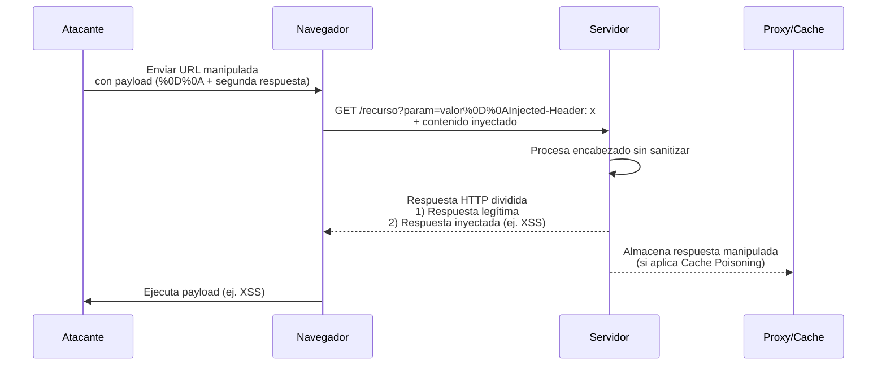
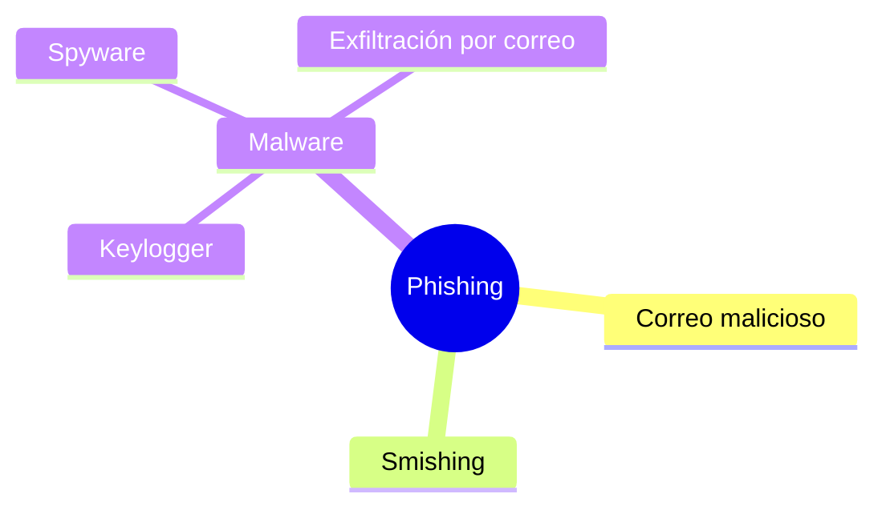

# Modelado De Ataques

## Perspectivas En El Desarrollo Seguro

El desarrollo de software seguro require que el equipo adopte dos perspectivas simultáneas:

### Perspectiva Del Defensor

- Enfoque tradicional en el desarrollo.
    
- Objetivo: construir software con propiedades de seguridad que lo hagan resistente a ataques.
    
- Se busca minimizar debilidades del diseño y errores de implementación.

### Perspectiva Del Atacante

- Menos considerada, pero esencial.
    
- Objetivo: comprender la naturaleza de las amenazas más probables.
    
- Permite enfocar los esfuerzos defensivos en los riesgos con mayor impacto y probabilidad.

---

# Herramientas Para Desarrollar la Perspectiva Del Atacante

El transcript describe dos herramientas fundamentales:

## 1. Patrones De Ataque (Attack Patterns)

### Definición

Un **patrón de ataque** es una representación estructurada del conocimiento, métodos y pensamiento del atacante. Describe cómo se ejecuta un ataque típico y qué vulnerabilidades aprovecha.

### Relevancia

- Permiten al equipo obtener la perspectiva real del atacante.
    
- Facilitan identificar debilidades del sistema y especificar requisitos de seguridad.
    
- Útiles para el diseño seguro, análisis de amenazas y pruebas de penetración.

### Repositorio CAPEC (MITRE)

- CAPEC: Common Attack Pattern Enumeration and Classification.
    
- Aproximadamente 528 patrones catalogados.
    
- Contienen información detallada que puede reutilizarse sin necesidad de construir patrones desde cero.

### Información Incluida En Un Patrón CAPEC

|Componente|Descripción|
|---|---|
|Seguridad requerida|Condiciones para que el ataque sea possible.|
|Métodos de ataque|Pasos y técnicas usadas por el atacante.|
|Conocimiento del atacante|Habilidades y recursos necesarios.|
|Métodos de prueba|Cómo verificar si la aplicación es vulnerable.|
|Mitigaciones|Salvaguardas recomendadas.|
|Vulnerabilidades relacionadas|Debilidades asociadas al patrón.|
|Payload e impacto|Efectos del ataque en el sistema.|
|Requisitos de seguridad|Requisitos sugeridos para mitigación.|
|Descripción y ejemplos|Contexto y casos reales.|
|Motivación y consecuencias|Razones del atacante e impacto final.|
|Indicadores|Señales que permiten detectar el ataque.|

### Ejemplo: CAPEC-34 – HTTP Response Splitting

**Concepto:**  
Manipulación de encabezados HTTP para dividir la respuesta del servidor en dos partes mediante caracteres de control (`%0D%0A`).

**Funcionamiento paso a paso:**

1. El atacante envía una petición GET manipulada.
    
2. Incluye caracteres `%0D` (carriage return) y `%0A` (line feed).
    
3. Estos fuerzan la separación de la respuesta HTTP en dos secciones.
    
4. El atacante inserta en la segunda sección un script (p. ej., XSS).
    
5. El servidor devuelve dos respuestas: una legítima y otra inyectada.

**Riesgos asociados:**

- Cross-Site Scripting (XSS).
    
- Envenenamiento de caché (cache poisoning).
    
- Manipulación de contenido entregado al usuario.

---

## 2. Árboles De Ataque (Attack Trees)

### Definición

Representación jerárquica que organiza los pasos, combinaciones y dependencias que un atacante puede seguir para comprometer un sistema.

### Relevancia

- Permiten visualizar rutas alternativas de ataque.
    
- Facilitan priorizar vulnerabilidades en función de su facilidad de explotación.
    
- Útiles para análisis de amenazas, modelado estructurado y evaluación de riesgos.

### Características

- El nodo raíz representa el **objetivo del atacante**.
    
- Los nodos hijos representan métodos o subpasos.
    
- Pueden modelar ataques complejos mediante combinaciones AND/OR.

### Ejemplo Representado

Objetivo: realizar un ataque de phishing.

---

# Relación Entre Patrones De Ataque Y Árboles De Ataque

- Los **patrones de ataque** aportan conocimiento detallado sobre técnicas específicas.
    
- Los **árboles de ataque** organizan ese conocimiento para analizar rutas completas y dependencias.
    
- Usados en conjunto permiten:
    
    - Entender cómo se combinan los ataques.
        
    - Diseñar controles más efectivos.
        
    - Preparar pruebas de penetración alineadas con escenarios reales.

---

# Resumen De Puntos Clave

- El desarrollo seguro require pensar como defensor y como atacante.
    
- Los patrones de ataque (CAPEC) proporcionan información detallada sobre técnicas de ataque y requisitos de seguridad.
    
- Los árboles de ataque permiten estructurar y visualizar rutas de ataque.
    
- La combinación de ambas herramientas fortalece el análisis de amenazas, el diseño seguro y las pruebas de penetración.
    
- CAPEC ofrece más de 500 patrones reutilizables, completos y listos para integrar en procesos de ingeniería de seguridad.

---

# MicroTest

1. Señala la respuesta incorrecta. Respecto a los patrones de ataque:
    
    - **La respuesta:** C
        
    - **Justificación:**  
        Los patrones de ataque **no proporcionan el contexto del software para diseñarlo correctamente**. Su función es describir _cómo_ un atacante ejecuta un ataque, qué debilidades explota, qué requisitos de éxito existen y qué mitigaciones aplican. El contexto de diseño del software pertenece a otras disciplinas (arquitectura, análisis de requisitos), no a los patrones de ataque. Las demás opciones sí representan características reales de los patrones de ataque.

---

1. El modelado de ataques es aplicable en las siguientes fases del ciclo de vida del desarrollo del software:
    
    - **La respuesta:** B
        
    - **Justificación:**  
        El modelado de ataques se aplica desde **Requisitos**, donde se identifican amenazas, pasando por **Diseño**, **Codificación**, **Pruebas**, **Despliegue** y **Operación**, porque cada fase incorpora controles y revisiones de seguridad basados en amenazas. La opción B es la única que incluye todas las fases relevantes. Las otras omiten fases importantes como el diseño o el despliegue.

---

1. Señala la respuesta incorrecta. Un árbol de ataque básicamente:
    
    - **La respuesta:** D
        
    - **Justificación:**  
        Un árbol de ataque **no** representa directrices de codificación segura ni patrones de seguridad. Su propósito es **modelar cómo un atacante puede comprometer un sistema**, mostrando objetivos, subobjetivos, dependencias y vulnerabilidades explotables. Las opciones A, B y C sí describen características del árbol de ataque (aunque C menciona algo limitado, sigue siendo cierto: el árbol se centra en vulnerabilidades, no en contramedidas).

https://capec.mitre.org/