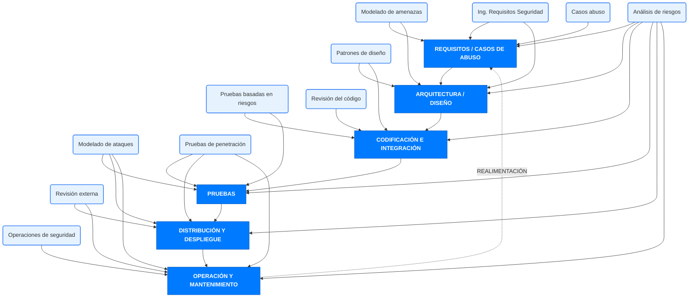
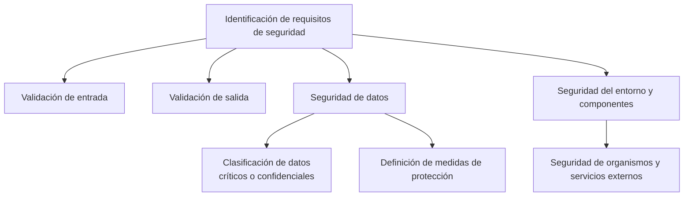

# Notas De Estudio

## Ingeniería De Requisitos De Seguridad

---

## 1. Importancia De Los Requisitos De Seguridad

### Errores Comunes En Requisitos

- Muchos problemas de seguridad en software provienen de **requisitos inadecuados, incompletos o ambiguous**.
    
- Es frecuente encontrar frases como “la aplicación será segura”, lo cual no define **qué significa seguridad** ni cómo verificarse.
    
- Errores en requisitos pueden representar hasta **30–50% del costo del desarrollo**, llegando incluso al **85%** cuando requieren correcciones tardías.

### Impacto Organizacional

- La ambigüedad genera conflictos entre desarrolladores y clientes, causando:
    
    - Interpretaciones diferentes.
        
    - Retrasos en el desarrollo.
        
    - Pérdida de confianza y reputación.

---

## 2. Tipos De Requisitos De Seguridad

Los requisitos de seguridad se dividen en dos tipos principales:

### 2.1 Requisitos De Servicios De Seguridad (Funcionales / Positivos)

Definen **funcionalidades de seguridad** que el sistema debe implementar.

**Objetivo:** garantizar los servicios esenciales de seguridad.

**Ejemplos de servicios incluidos:**

- Confidencialidad
    
- Integridad
    
- Disponibilidad
    
- Autenticación
    
- Autorización
    
- Trazabilidad

### 2.2 Requisitos Del Software Seguro (No Funcionales / Negativos)

Definen **restricciones** que evitan comportamientos inseguros.

**Ejemplos:**

- No permitir la entrada de caracteres prohibidos (ej.: `'` para evitar SQL Injection).
    
- Usar **procedimientos parametrizados** para todas las consultas SQL.
    
- Requisitos de:
    
    - Gestión de sesiones
        
    - Gestión y tratamiento de errores
        
    - Recuperación ante fallos
        
    - Prevención de condiciones de carrera
        
    - Validación de entrada y salida

### Tabla Comparativa

| Tipo de requisito          | Naturaleza                 | Enfoque                                            | Ejemplos                                               |
| -------------------------- | -------------------------- | -------------------------------------------------- | ------------------------------------------------------ |
| **Servicios de seguridad** | Funcionales / positivos    | Qué funciones de seguridad debe incluir el sistema | Autenticación, autorización, trazabilidad              |
| **Software seguro**        | No funcionales / negativos | Restricciones que prohíben conductas inseguras     | Validación de entrada, evitar SQLi, gestión de errores |
|                            |                            |                                                    |                                                        |

---

## 3. Otros Requisitos Relacionados Con la Seguridad (no específicos)

Contribuyen indirectamente a la seguridad del sistema:

- Requisitos del entorno de producción
    
- Hardening y configuración
    
- Interoperabilidad
    
- Auditoría y validación de seguridad
    
- Cumplimiento normativo:
    
    - Leyes de protección de datos
        
    - Esquema Nacional de Seguridad
        
    - ISO/IEC 27001 y 27002

---

## 4. Fuentes Comunes Para Extraer Requisitos De Seguridad

### Principales Fuentes

- **Normativas y estándares** (ISO 27001, 27002, ENS).
    
- **Modelado de ataques** y análisis de amenazas.
    
- **Análisis de riesgos arquitectónico**.
    
- **Reuniones con usuarios y stakeholders**.
    
- **Políticas de seguridad de la organización**.
    
- **Casos de uso** y sus implicaciones de seguridad.
    
- **Components a reutilizar**, tecnología existente y vulnerabilidades conocidas.
    
    - Aquí se utilize el **Software Composition Analysis (SCA)**.
        
- **Tendencias tecnológicas** y nuevas soluciones de seguridad.

---

## 5. Diagrama General Para Especificar Requisitos De Seguridad

---

## 6. Ejemplos De Requisitos (del transcript)

### 6.1 Requisito Positivo

“El sistema deberá registrar todas las acciones de acceso y modificación de datos.”

### 6.2 Requisito Negativo

“No se permitirá el uso de comillas simples en los parámetros de entrada para evitar inyección SQL.”

---

## 7. Información Adicional Relevante

- La especificación de requisitos de seguridad debe set:
    
    - Clara
        
    - Medible
        
    - Verificable
        
    - No ambigua
        
- Dejar requisitos abiertos o subjetivos incrementa riesgos técnicos y contractuales.

---

## Resumen De Puntos Clave

- La mayoría de vulnerabilidades provienen de **requisitos inadecuados o mal definidos**.
    
- Existen **dos tipos**: requisitos funcionales de seguridad y requisitos no funcionales (restricciones).
    
- Fuentes principales: **normativas, análisis de amenazas, políticas internas y SCA**.
    
- La especificación debe incluir validación de entrada/salida, seguridad de datos, seguridad del entorno y consideraciones normativas.

---

## MicroTest

1. Señalar la respuesta incorrecta. Respecto a la ingeniería de requisitos de seguridad:
    
    - **La respuesta:** B
        
    - **Justificación:**  
        La opción B describe **funciones de seguridad** (mecanismos como autenticación, autorización, cifrado), no **requisitos de software seguro**. Los requisitos de software seguro son condiciones que reducen la probabilidad de fallos de seguridad, mientras que las funciones mencionadas en B corresponden a requisitos funcionales de seguridad. Por lo tanto, es la afirmación incorrecta.

---

1. Los requisitos que se especifican para protegerse contra la destrucción de la información o el propio software se denominan comúnmente:
    
    - **La respuesta:** B
        
    - **Justificación:**  
        La destrucción de información o software es una violación de **integridad**, que implica proteger los datos contra modificaciones no autorizadas, corrupción o eliminación. Confidencialidad, disponibilidad y autenticación no se enfocan en evitar la destrucción de la información.

---

1. ¿Cuál de los siguientes bloques de requisitos debe incluir el siguiente requisito? «Todos los programas de procesamiento de transacciones financieras deben utilizar más de un factor para verificar la identidad de la entidad que solicita el acceso»:
    
    - **La respuesta:** B
        
    - **Justificación:**  
        El uso de más de un factor para verificar la identidad corresponde directamente a **autenticación multifactor**. Su objetivo es validar la identidad del sujeto antes de permitir acceso. No es un requisito de autorización, auditoría ni disponibilidad.