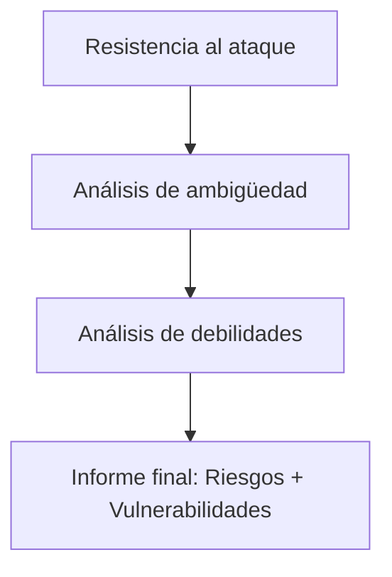

# Notas De Estudio

## Análisis De Riesgo Arquitectónico

---

## Introducción Al Análisis De Riesgo Arquitectónico

El análisis de riesgo arquitectónico busca identificar debilidades de seguridad en las fases tempranas del diseño del sistema. Aproximadamente el 50% de los defectos de seguridad provienen de errores de diseño, y estos suelen set más difíciles de detectar que los errores de programación. Esta práctica se sitúa entre la fase de requisitos y la fase de arquitectura.

---

## Ubicación Del Análisis Dentro Del Ciclo De Desarrollo

El análisis de riesgos se inicia desde los requisitos mediante diagrams DFD y modelos preliminares de amenazas. Sin embargo, solo cuando la arquitectura está definida puede realizarse un análisis completo. La secuencia comienza con casos de uso, sigue con detección temprana de amenazas y culmina con un análisis arquitectónico profundo.

---

## Fase 1: Análisis De la Resistencia Al Ataque

Esta fase consiste en un modelado de amenazas aplicado ya a la arquitectura final. Se puede utilizar STRIDE y herramientas como Microsoft Threat Modeling Tool. Se toma como entrada un primer modelo de amenazas construido durante los requisitos.

**Objetivo:** Identificar amenazas específicas sobre la arquitectura real y evaluar la viabilidad de ataques.

---

## Fase 2: Análisis De Ambigüedad

Consiste en revisar el diseño respecto a principios de diseño seguro, tales como mínimo privilegio, defensa en profundidad, validación de entradas o separación de ambientes. Se examina si el diseño implementa correctamente estos principios.

**Actividad recomendada:**  
El equipo de diseño explica su arquitectura al equipo de seguridad, quien identifica posibles debilidades basadas en estos principios.

---

## Fase 3: Análisis De Debilidades

Se estudia la arquitectura en función de todos los components que intervienen: middleware, sistema operativo, bases de datos, librerías externas y otros módulos. Se buscan vulnerabilidades conocidas mediante escáneres como Nessus, OpenVAS, Nexpose.  
Para librerías y dependencias, se aplica Software Composition Analysis (SCA), como OWASP Dependency-Check.

---

## Proceso General Del Análisis De Riesgo Arquitectónico

### Components Del Proceso

|Etapa|Descripción|
|---|---|
|**Resistencia al ataque**|Modelado de amenazas contra la arquitectura; mapeo a patrones de ataque (CAPEC, MITRE).|
|**Análisis de ambigüedad**|Revisión del diseño frente a principios de seguridad; reflexión sobre implicaciones arquitectónicas.|
|**Análisis de debilidades**|Escaneo de vulnerabilidades en infraestructura, frameworks y dependencias.|

![[Pasted image 20251121152222.png]]

---

## Resultados Finales

El análisis concluye con:

- Un informe de riesgos arquitectónicos.
    
- Una lista de vulnerabilidades detectadas en todos los components.
    
- Relación entre amenazas, patrones de ataque y funciones críticas afectadas.

Este análisis es considerado la segunda práctica de seguridad más importante después del análisis estático de código.

---

## Resumen De Puntos Clave

- La mitad de los defectos de seguridad surgen en el diseño, y son difíciles de detectar posteriormente.
    
- El análisis de riesgo arquitectónico se construye a partir de un modelado de amenazas inicial.
    
- Incluye tres grandes bloques: resistencia al ataque, ambigüedad del diseño y análisis de debilidades.
    
- Utilize escáneres y herramientas SCA para descubrir vulnerabilidades en components externos.
    
- Es fundamental para prevenir fallos futuros y mejorar la seguridad desde etapas tempranas.

---

## MicroTest

1. **Señala la respuesta incorrecta. El análisis de riesgo arquitectónico implica tres pasos básicos:**
    
    - **La respuesta:** C. Análisis de robustez.
        
    - **Justificación:** Los tres pasos del análisis de riesgo arquitectónico son: análisis de resistencia al ataque, análisis de ambigüedad y análisis de debilidad. _Análisis de robustez_ no forma parte del proceso descrito.

2. **¿Cuál de las siguientes opciones identifica las actividades que están implicadas en el paso de resistencia al ataque?**
    
    - **La respuesta:** A. Modelado, identificación de amenazas, mitigación y validación.
        
    - **Justificación:** El paso de resistencia al ataque consiste en modelar amenazas, identificar amenazas relevantes, definir mitigaciones y validar la viabilidad de los ataques. Las otras opciones incluyen actividades que pertenecen a fases distintas (como vulnerabilidades o fuzzing).
3. **Indica la respuesta incorrecta. Indicar en qué fase del ciclo de vida es aplicable el análisis de riesgo arquitectónico:**
    
    - **La respuesta:** C. Codificación.
        
    - **Justificación:**  
        El análisis de riesgo arquitectónico se aplica principalmente en la **especificación de requisitos** y de forma completa en la **fase de diseño**, cuando ya existe una arquitectura definida que puede evaluarse contra amenazas. Aunque sus resultados pueden influir en la codificación, **el análisis en sí no se realiza durante la fase de codificación**, ya que en ese punto el diseño ya está cerrado. La fase realmente incorrecta no es Operación (pues aún pueden revisarse riesgos residuales del diseño), sino **Codificación**, que no es una fase propia del análisis.