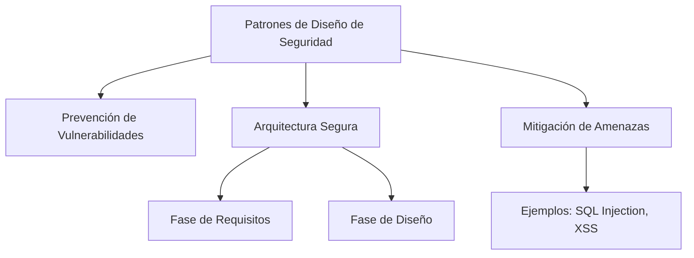

# Patrones De Diseño De Seguridad

## Introducción a Los Patrones De Diseño De Seguridad

### Definición General

Un **patrón de diseño de seguridad** es una solución general, repetible y probada para resolver problemas de seguridad que aparecen de forma recurrente en el desarrollo de software.  
Estos patrones buscan reducir vulnerabilidades, aumentar la resiliencia y tolerar ataques.

### Objetivo Principal

Los patrones de diseño permiten **controlar o mitigar amenazas** mediante mecanismos de seguridad integrados en un contexto específico.

---

## Características Y Propósito De Los Patrones

### Relación Con la Ingeniería De Software

Los patrones son familiares en el diseño arquitectónico y estructural de sistemas.  
Se aplican en todas las fases del ciclo de vida: **requisitos, diseño, codificación, pruebas**.

### Impacto En la Seguridad

El uso adecuado de patrones remedia fallos de seguridad comunes, como validación defectuosa o falta de controles.  
Ejemplo: un patrón de _validación de entrada_ permite prevenir ataques de inyección SQL.

---

## Importancia De Los Patrones En El Desarrollo Seguro

### Necesidad De Seguridad En El Software

Las aplicaciones modernas deben set funcionales y seguras. Si un sistema es comprometido, puede causar daños reputacionales y económicos.

### Razón Para Usar Patrones

Existen múltiples catálogos y herramientas diseñados para mitigar ataques comunes.  
Implementar patrones permite construir **arquitecturas seguras y mantenibles**, evitando vulnerabilidades frecuentes.

---

## Rol De Los Patrones En la Arquitectura Del Software

### Aplicación Temprana

Los patrones deben emplearse lo antes possible en el ciclo de vida del software para asegurar que la arquitectura resulte sólida.

### Revisión De Catálogos

Es necesario comparar catálogos de patrones para identificar similitudes, diferencias y aplicabilidad al tipo de sistema que se desarrolla.

---

## Catálogos Relevantes De Patrones De Seguridad

### Catálogo De Eduardo Fernández–Buglioni

Basado en su libro _Security Patterns in Practice_. Incluye:

|Tipo de patrón|Enfoque|
|---|---|
|Patrones arquitectónicos|Construcción de arquitectura segura|
|Patrones de diseño|Diseño orientado a la seguridad|
|Patrones de análisis|Restricciones para evitar ataques (validación entrada/salida, mitigación de inyección y XSS)|
|Patrones especiales|Ataques emergentes, investigaciones recientes|

### Catálogo CORSAIR (Core Security Patterns)

Incluye patrones aplicables a:

- J2EE
    
- Web Services
    
- Identity Management

Estos patrones se aplican mayormente en la fase de arquitectura, aunque es recomendable iniciar su uso desde los requisitos.

---

## Relaciones Conceptuales

_Diagrama: Funciones y aplicación de los patrones de seguridad._

---

## Resumen De Puntos Clave

- Los patrones de diseño de seguridad son soluciones reutilizables para amenazas recurrentes.
    
- Pueden aplicarse desde requisitos hasta codificación y pruebas.
    
- Son esenciales para construir arquitecturas seguras y fáciles de mantener.
    
- Existen diversos catálogos, como los de Fernández–Buglioni y CORSAIR.
    
- Su aplicación temprana reduce vulnerabilidades como inyección SQL o XSS.

---

## MicroTest

1. **Señala la práctica de seguridad a la que corresponde la afirmación: “Son soluciones generales repetibles… destinadas a obtener un software menos vulnerable…”**
    
    - **La respuesta:** D. Patrones de diseño
        
    - **Justificación:** La descripción coincide exactamente con la definición formal de _patrones de diseño de seguridad_: soluciones generales, repetibles y aplicadas para mitigar amenazas comunes y fortalecer la arquitectura y diseño del software.
        
2. **Indique la fase del ciclo de desarrollo en la que es aplicable los patrones de diseño:**
    
    - **La respuesta:** A. Requisitos
        
    - **Justificación:** Aunque los patrones pueden aplicarse también en diseño y codificación, la práctica recomendada es utilizarlos _lo más temprano posible_, especialmente desde la fase de requisitos, para guiar una arquitectura segura desde su origen.
        
3. **El uso de los patrones de diseño conduce a:**
    
    - **La respuesta:** A. La remediación de los principales fallos de seguridad
        
    - **Justificación:** Los patrones de diseño de seguridad aportan mecanismos probados que mitigan fallos comunes (inyección, validación deficiente, falta de controles), por lo que su uso adecuado conlleva directamente a disminuir o remediar fallos de seguridad frecuentes.

https://learn.microsoft.com/en-us/previous-versions/msp-n-p/ff649452(v=pandp. 10)? Redirectedfrom=MSDN