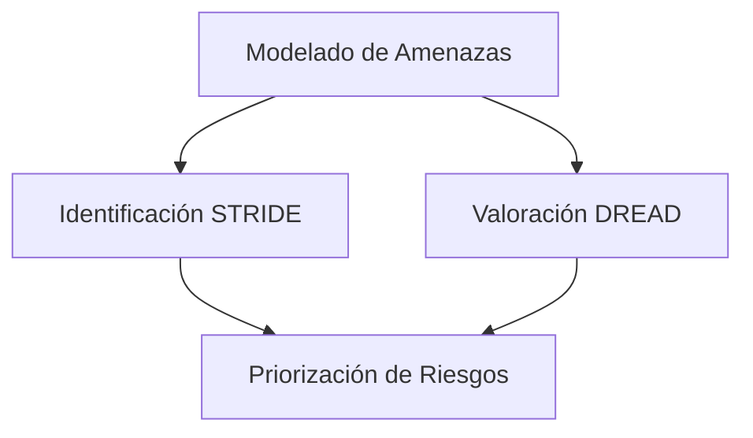
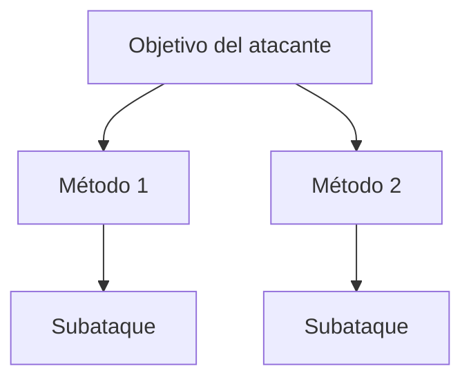

# Notas De Estudio – Seguridad En El Ciclo De Vida Del Software (Tema 2)

## 1. Introducción

El tema se centra en las **buenas prácticas de seguridad** a integrar en las fases de **análisis** y **diseño** del ciclo de vida del software. Su propósito es mejorar la robustez de las aplicaciones frente a amenazas, fallos y ataques.

---

## 2. Modelado De Amenazas

### Definición

Proceso sistemático para **evaluar y valorar los riesgos de una aplicación durante su desarrollo**.  
No debe confundirse con un análisis de riesgos organizacional, que tiene un alcance distinto y más amplio.

### Objetivo

Identificar amenazas antes de que el software esté implementado, para minimizar vulnerabilidades desde el diseño.

### Uso De Diagrams De Flujo De Datos (DFD)

Los DFD permiten representar:

- Components del sistema
    
- Flujo de información
    
- Entradas y salidas
    
- Límites de confianza

Herramientas como **Microsoft Threat Modeling Tool** utilizan estos diagrams para estimar amenazas automáticamente.

### Método STRIDE

Framework utilizado para clasificar amenazas encontradas en el sistema.

|Letra|Categoría|Descripción|
|---|---|---|
|S|Spoofing|Suplantación de identidad|
|T|Tampering|Manipulación de datos|
|R|Repudiation|Negación de acciones realizadas|
|I|Information Disclosure|Pérdida o exposición de información|
|D|Denial of Service|Interrupción de servicio|
|E|Elevation of Privilege|Escalada de privilegios|

### Método DREAD

Sistema de valoración de amenazas para priorizar riesgos.

|Letra|Criterio|Descripción|
|---|---|---|
|D|Damage|Daño potential|
|R|Reproducibility|Facilidad para reproducir el ataque|
|E|Exploitability|Facilidad de explotación|
|A|Affected Users|Usuarios afectados|
|D|Discoverability|Probabilidad de descubrimiento|

Cada criterio se puntúa de 1 a 3 (bajo, medio, alto).

### Relación Del Proceso

---

## 3. Modelado De Ataque

### Definición

Método que representa la **perspectiva del atacante** para identificar los puntos más vulnerables de una aplicación.  
Complementa el enfoque defensivo tradicional del desarrollador.

### Herramientas Principales

#### 3.1 Patrones De Ataque (MITRE – CAPEC)

- Catalogados por MITRE.
    
- Contienen información útil para:
    
    - Realizar valoración DREAD
        
    - Identificar requisitos de seguridad
        
    - Determinar mitigaciones
        
    - Describir vectors de ataque

#### 3.2 Árboles De Ataque

Representan de forma jerárquica cómo un atacante puede lograr un objetivo.

---

## 4. Casos De Abuso Y Casos De Uso De Seguridad

### Casos De Abuso

- Son la **inversión de los casos de uso tradicionales**.
    
- Representan acciones que la aplicación **nunca debe permitir**.
    
- Se derivan desde la perspectiva del atacante.

**Ejemplo:**  
"El sistema no debe permitir la entrada de metacaracteres SQL para prevenir SQL Injection."

### Casos De Uso De Seguridad

Casos de uso especiales que representan **funcionalidades de seguridad**, como:

- Autenticación
    
- Autorización
    
- Gestión de contraseñas
    
- Acceso seguro

Su función es asegurar que los mecanismos de seguridad estén debidamente especificados y diseñados.

---

## 5. Ingeniería De Requisitos De Seguridad

### Problema Habitual

Los requisitos de seguridad se suelen omitir o redactar de forma **ambigua**, lo que genera:

- Fallos de diseño
    
- Incremento de costos
    
- Implementaciones incorrectas

### Tipos De Requisitos

|Tipo|Descripción|
|---|---|
|**Funcionales de seguridad**|Definen funciones de seguridad: autenticación, autorización, etc.|
|**No funcionales / negativos**|Restringen comportamientos para prevenir ataques; provienen de casos de abuso.|

**Ejemplo de requisito negativo:**  
"No se permitirá la entrada de metacaracteres SQL."

---

## 6. Análisis De Riesgo Arquitectónico

Es la **segunda práctica de seguridad más importante** después del análisis estático de código.

### Fases Del Análisis

|Fase|Actividad|Objetivo|
|---|---|---|
|**1. Ambigüedad**|Confirmar claridad del diseño y requisitos|Evitar malas interpretaciones|
|**2. Resistencia al ataque**|Revisión del diseño frente a amenazas|Garantizar robustez según los 12 principios de diseño seguro|
|**3. Debilidad**|Evaluar dependencias externas y librerías|Identificar vulnerabilidades en software de terceros|

### Software Composition Analysis (SCA)

Analiza librerías, middleware y components para detectar vulnerabilidades conocidas o desconocidas.

---

## 7. Patrones De Diseño De Seguridad

### Definición

Son patrones utilizados tradicionalmente en ingeniería de software, aplicados aquí para **mitigar amenazas** y reforzar la arquitectura desde etapas tempranas.

### Utilidad

Proporcionan:

- Soluciones reutilizables
    
- Estandarización
    
- Diseño menos vulnerable
    
- Arquitecturas más mantenibles

Se aplican especialmente en fases de **diseño**, aunque pueden considerarse desde requisitos.

---

## Resumen De Puntos Clave

- El **modelado de amenazas** identifica riesgos tempranos mediante STRIDE y DREAD.
    
- El **modelado de ataque** adopta la visión del atacante para encontrar vectors de explotación.
    
- Los **casos de abuso** y **casos de uso de seguridad** permiten definir requisitos claros y evitar ambigüedades.
    
- La **ingeniería de requisitos de seguridad** debe evitar definiciones generales y asegurar claridad.
    
- El **análisis de riesgo arquitectónico** evalúa ambigüedades, resistencia al ataque y debilidades en components externos.
    
- Los **patrones de diseño** fortalecen la arquitectura y mitigan amenazas comunes.

---

## MicroTest