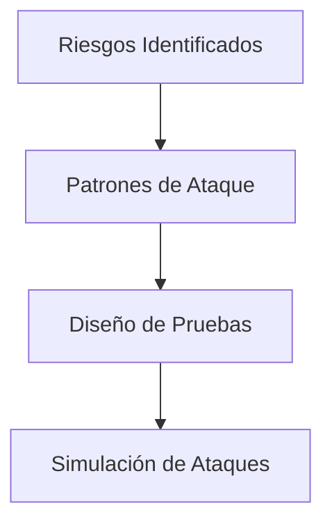
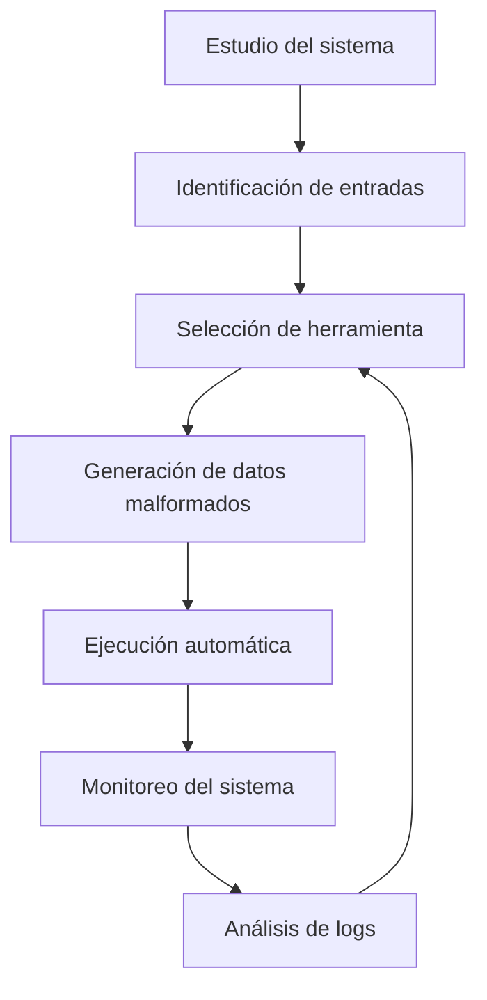

# Pruebas De Seguridad Basadas En Riesgo

## Introducción

Las **pruebas de seguridad basadas en riesgo** son un enfoque de evaluación de la seguridad del software que prioriza las pruebas en función de los riesgos identificados en el sistema. Antes de diseñar este tipo de pruebas, es imprescindible realizar un **análisis de riesgo arquitectónico**, ya que permite identificar las áreas más críticas y potencialmente vulnerables.

Este enfoque se basa en analizar el sistema desde la **perspectiva de un atacante**, un analista de seguridad o un probador de seguridad, para anticipar cómo y dónde podría set explotado el software.

---

## Diferencia Entre Pruebas Funcionales Y Pruebas De Seguridad

### Pruebas Funcionales

- Verifican que el software cumple con los requisitos funcionales.
    
- Evalúan comportamientos esperados (por ejemplo, que un botón muestre un mensaje correcto).
    
- No permiten identificar cómo se comporta el sistema bajo condiciones anómalas o ataques.

### Pruebas De Seguridad

- Evalúan el comportamiento del sistema bajo **condiciones hostiles**.
    
- Permiten identificar **vulnerabilidades**, su criticidad y su impacto.
    
- Buscan comprobar si el sistema es resistente a ataques reales.

---

## Aplicación De Las Pruebas Basadas En Riesgo En El Ciclo De Vida Del Software

Las pruebas de seguridad basadas en riesgo pueden aplicarse en distintas fases:

- Diseño
    
- Codificación
    
- Integración
    
- Fase de pruebas

Esto permite detectar errores de seguridad tanto tempranos como tardíos en el desarrollo.

---

## Aproximaciones En Las Pruebas De Seguridad

Las pruebas de seguridad deben combinar **dos enfoques principales**:

### 1. Pruebas De Seguridad Funcionales

Se basan en:

- Casos de uso de seguridad
    
- Mecanismos de seguridad
    
- Funcionalidades de seguridad

**Ejemplos de funcionalidades evaluadas:**

- Autenticación
    
- Autorización
    
- Trazabilidad
    
- Auditoría

### 2. Pruebas Desde la Perspectiva Del Atacante

- Se diseñan a partir del riesgo calculado.
    
- Se basan en **patrones de ataque conocidos**.
    
- Simulan el comportamiento real de un atacante.

---

## Objetivos De Las Pruebas De Seguridad Basadas En Riesgo

- Verificar la **operación confiable** del software bajo condiciones hostiles.
    
- Validar la **fiabilidad del comportamiento seguro** del sistema.
    
- Asegurar **cambios de estado confiables** (evitar bloqueos o estados colgados).
    
- Detectar **debilidades explotables**, tanto de diseño como de implementación.
    
- Verificar la **capacidad de supervivencia** del software ante anomalías y errores.
    
- Evaluar la correcta **gestión de errores** para minimizar el impacto de ataques.

---

## Tipos De Pruebas De Seguridad Basadas En Riesgo

### Clasificación Según Acceso Al Sistema

|Tipo de prueba|Acceso|Descripción|
|---|---|---|
|Caja blanca|Acceso al código y diseño|Permite analizar el software internamente|
|Caja negra|Sin acceso al código|Evalúa el sistema como lo haría un atacante|
|Análisis híbrido|Acceso parcial|Combina análisis estático y dinámico|

![[Pasted image 20251225110407.png]]

---

## Pruebas De Caja Blanca

Se realizan con acceso al código fuente y al diseño del sistema.

### Técnicas Principales

- **Revisión de diseño**: Evaluación del diseño según principios de seguridad.
    
- **Análisis estático de código**: Inspección del código sin ejecutarlo.
    
- **Inyección de fallos en código fuente**: Se introducen fallos para observar el comportamiento del sistema.

---

## Pruebas De Caja Negra

No requieren acceso al código fuente.

### Técnicas Principales

#### Pruebas De Penetración

- Simulan ataques reales.
    
- Se envían peticiones maliciosas al sistema.

#### Análisis Dinámico

- Especialmente usado en aplicaciones web.
    
- Consiste en enviar peticiones GET y POST maliciosas.

#### Escaneo De Vulnerabilidades

- Uso de herramientas automatizadas para detectar fallos conocidos.

**Herramientas comunes:**

- OpenVAS
    
- Nessus
    
- Nexpose

---

## Análisis Híbrido

Combina:

- Análisis estático de código
    
- Análisis dinámico

Se utilize principalmente en aplicaciones web para:

- Rastrear peticiones maliciosas exitosas
    
- Identificar la línea de código responsible del fallo

---

## Pruebas De Fuzzing

### Definición

El **fuzzing** consiste en enviar grandes volúmenes de **datos malformados** a un sistema para provocar fallos, bloqueos o comportamientos inesperados.

### Ciclo De Pruebas De Fuzzing

### Métodos De Generación De Datos Fuzzing

- Basado en longitud
    
- Basado en formato de archivo
    
- Basado en mutaciones
    
- Basado en proxies intermedios
    
- Basado en especificaciones

---

## Herramientas De Fuzzing

|Herramienta|Tipo de aplicación|
|---|---|
|Tamás Mangal|Aplicaciones web|
|Wfuzz|Aplicaciones web|
|SPIKE|Web y no web|

SPIKE destaca por set una colección completa de fuzzers.

---

## Análisis Dinámico En Aplicaciones Web

Proceso general:

1. Rastreo de la aplicación web (crawler).
    
2. Uso de credenciales para acceder a todas las páginas.
    
3. Envío automático de peticiones maliciosas.
    
4. Identificación de páginas vulnerables.

Este enfoque permite descubrir vulnerabilidades de forma automatizada y sistemática.

---

## Información Adicional Relevante

- Los estados "colgados" son puntos críticos donde los atacantes suelen lanzar exploits.
    
- Los errores de diseño suelen set más críticos que los errores de implementación.
    
- La combinación de enfoques aumenta significativamente la cobertura de seguridad.

---

## Resumen De Puntos Clave

- Las pruebas de seguridad basadas en riesgo priorizan según impacto y probabilidad.
    
- Requieren un análisis de riesgo previo.
    
- Combinan pruebas funcionales y perspectiva del atacante.
    
- Se clasifican en caja blanca, caja negra e híbridas.
    
- El fuzzing es una técnica clave para descubrir fallos ocultos.
    
- El objetivo final es garantizar un comportamiento seguro bajo condiciones hostiles.

---

## MicroTest

1. Las pruebas de seguridad necesariamente deben implicar algún tipo de las aproximaciones siguientes:
    
    - La respuesta: B. Pruebas de seguridad perspectiva defensor.
        
    - Justificación: Las pruebas de seguridad siempre deben considerar la perspectiva del defensor para evaluar cómo proteger el sistema frente a ataques, independientemente de que también se incluyan otras aproximaciones como diseño, funcionales o físicas.
        
2. Señalar la respuesta incorrecta. Los objetivos de las pruebas de seguridad basadas en el riesgo son:
    
    - La respuesta: A. Verificar la operación del software bajo en su entorno de producción.
        
    - Justificación: Las pruebas de seguridad basadas en riesgo se centran en identificar, priorizar y mitigar riesgos de seguridad, no en verificar el funcionamiento general del software en producción, lo cual corresponde más a pruebas operativas o de despliegue.
        
3. Identificando los riesgos del sistema y diseñando las pruebas en base a ellos, bajo la perspectiva de un atacante, un probador de seguridad de software puede enfocar correctamente las áreas de código donde un ataque probablemente pudiera tener éxito. Este es el principal objetivo de:
    
    - La respuesta: D. El modelado de amenazas.
        
    - Justificación: El modelado de amenazas analiza el sistema desde la perspectiva de un atacante, identificando riesgos y posibles vectors de ataque para enfocar las pruebas de seguridad en las áreas más vulnerables del software.