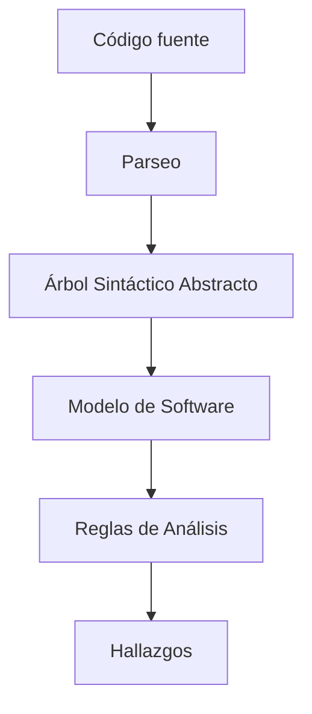

# Revisión De Código Y Seguridad Del Software

## Introducción

La **revisión de código** es una de las prácticas más importantes dentro de la seguridad del software. Su objetivo principal es identificar errores y vulnerabilidades en el código fuente antes de que la aplicación llegue a producción, reduciendo riesgos de explotación por atacantes.

---

# Tipos De Errores En El Código

## Errores Simples

**Definición:**  
Errores cometidos por descuidos humanos, cansancio, confusión o distracciones momentáneas.

**Características:**

- Son comunes y comprensibles.
    
- No implican necesariamente falta de conocimiento técnico.
    
- Suelen set fáciles de corregir.

## Errores Por Carencias De Conocimiento

**Definición:**  
Errores derivados de no conocer técnicas de **codificación segura** ni las implicaciones de seguridad.

**Características:**

- Son más graves y menos “perdonables”.
    
- Pueden generar vulnerabilidades explotables.
    
- Se relacionan con desconocimiento del comportamiento de atacantes.

---

# Importancia Del Análisis Estático De Código

## Definición

El **análisis estático de código** es la revisión del código fuente sin ejecutar la aplicación, con el fin de detectar vulnerabilidades, errores y malas prácticas.

## Relevancia

- Es la **práctica de seguridad más importante** durante el desarrollo.
    
- Detecta más errores que otras técnicas como:
    
    - Tests de penetración.
        
    - Análisis de riesgo arquitectónico.
        
- Debe realizarse al menos una vez durante el desarrollo.
    
- Solo aplica en la fase de **codificación e integración**.

---

# Herramientas De Análisis Estático

## Necesidad De Herramientas

Aunque el análisis puede hacerse manualmente, no es viable por el tiempo que require. Por ello se utilizan **analizadores estáticos de código**.

## Herramientas Mencionadas

|Tipo|Herramienta|
|---|---|
|Comerciales|Checkmarx, Fortify (Micro Focus), Synopsis|
|Libre|SonarQube|

**Observación:**  
Existe una brecha importante entre herramientas libres y de pago, aunque SonarQube intenta reducirla.

---

# Falsos Positivos Y Falsos Negativos

## Definiciones

- **Falso positivo:** La herramienta detecta una vulnerabilidad que en realidad no existe.
    
- **Falso negativo:** Existe una vulnerabilidad real que la herramienta no detecta.

## Importancia

- Los falsos negativos son más peligrosos porque generan un **falso sentido de seguridad**.
    
- Es preferible tener:
    
    - Muchos falsos positivos.
        
    - Muy pocos falsos negativos.

## Rol Del Analista

El **analista de seguridad** debe:

- Revisar los hallazgos.
    
- Eliminar falsos positivos.
    
- Confirmar vulnerabilidades reales.

---

# Funcionamiento General Del Análisis Estático

## Construcción Del Modelo De Software

A partir del código fuente, la herramienta:

- Analiza el código.
    
- Construye un **modelo interno** del software.

---

# Tipos De Análisis Realizados

## Análisis Léxico

- Elimina espacios en blanco.
    
- Revisa saltos de línea.
    
- Detecta errores básicos de sintaxis.

## Análisis Sintáctico

- Convierte tokens léxicos en una estructura en forma de árbol.
    
- Verifica la correcta estructura del lenguaje.

## Análisis Semántico

- Comprueba tipos de datos.
    
- Verifica restricciones semánticas.

## Análisis Estructural

- Valida reglas de la gramática.
    
- Usa el **árbol sintáctico abstracto (AST)**.

## Análisis De Propagación De Datos (Taint Analysis)

**Definición:**  
Analiza cómo un dato malicioso se propaga desde una entrada hasta una possible vulnerabilidad.

**Clave:**

- Si no es alcanzable desde la entrada → no es vulnerabilidad.
    
- Si es alcanzable → vulnerabilidad real y grave.

## Otros Análisis

- **Análisis de punteros:** evitar referencias a la misma memoria.
    
- **Análisis local y global:** flujos de datos y llamadas entre funciones.
    
- **Model checking:** validación de propiedades (ej. liberar memoria solo una vez).
    
- **Solvers:** resolución de expresiones lógicas y condiciones.

---

# Reglas Y Hallazgos

## Reglas De Seguridad

Funcionan de forma similar a las firmas de un IDS:

- Se aplican sobre el modelo del software.
    
- Generan hallazgos cuando coinciden patrones.

## Clasificación De Hallazgos

- Vulnerabilidad real.
    
- Mala práctica.
    
- Falso positivo.

---

# Proceso De Revisión De Código

## Pasos Principales

1. Definir objetivos del análisis.
    
2. Estudiar el diseño del código.
    
3. Ejecutar las herramientas.
    
4. Analizar los hallazgos uno a uno.
    
5. Clasificar cada hallazgo.
    
6. Generar informe.
    
7. Reunión con desarrolladores.
    
8. Corrección del código.
    
9. Nueva revisión y ajuste de herramientas.

---

# Interacción Con Desarrolladores

## Recomendaciones

- Explicar resultados y correcciones.
    
- Evitar caer en la “trampa de la explotabilidad”.
    
- El auditor no debe crear exploits.
    
- El foco es la **auditoría**, no la demostración del ataque.

---

# Métricas En la Revisión De Código

## Densidad De Vulnerabilidades

**Definición:**  
Número de vulnerabilidades por líneas de código.

**Uso:**  
Permite comparar proyectos entre sí.

## Severidad

Clasificación de vulnerabilidades:

- Críticas
    
- Altas
    
- Medias
    
- Bajas

## Tendencia

- Mide la evolución de vulnerabilidades entre revisiones.
    
- Idealmente deben disminuir con el tiempo.

## Métricas Del Proceso

- Tiempo estimado para revisar código.
    
- Ejemplo: 20,000 líneas de código en dos semanas.
    
- Ayuda a planificar el alcance de la revisión.

---

# Importancia Final De la Revisión De Código

La revisión de código es considerada **la práctica de seguridad más importante** dentro del desarrollo de software, ya que permite detectar y corregir vulnerabilidades antes de que sean explotadas.

---

# Resumen De Puntos Clave

- Existen errores simples y errores por falta de conocimiento.
    
- El análisis estático es fundamental en la seguridad del software.
    
- Es preferible tolerar falsos positivos que falsos negativos.
    
- Las herramientas construyen modelos del código y aplican reglas.
    
- El analista valida y clasifica los hallazgos.
    
- Las métricas permiten medir calidad y evolución de la seguridad.

---

# MicroTest

1. Señala la respuesta incorrecta. Entre los tipos de pruebas de caja negra tenemos:
    
    - La respuesta: B. Análisis estático de código.
        
    - Justificación: El análisis estático de código require acceso al código fuente y examina su estructura interna, por lo que corresponde a pruebas de caja blanca, no de caja negra.
        
2. Una herramienta de análisis de código reporta que existe una vulnerabilidad de inyección SQL. Sin embargo, después de la correspondiente verificación, se comprueba que en realidad no existe tal vulnerabilidad. ¿Qué tipo de limitación de las herramientas de análisis de código se ha expuesto?
    
    - La respuesta: A. Un falso positivo.
        
    - Justificación: Se trata de un falso positivo porque la herramienta indicó una vulnerabilidad que, tras el análisis manual, se comprobó que no existía realmente.
        
3. Señala la respuesta incorrecta. Los factores principales prácticos que determinan la utilidad de una herramienta de análisis estático son:
    
    - La respuesta: A. El equilibrio que la herramienta hace entre la extensión del código fuente y el tipo de lenguaje de programación.
        
    - Justificación: Los factores prácticos clave son el porcentaje de falsos positivos y negativos, el conjunto de errores que detecta y la facilidad de uso; el equilibrio entre extensión del código y lenguaje no es un factor principal de utilidad.