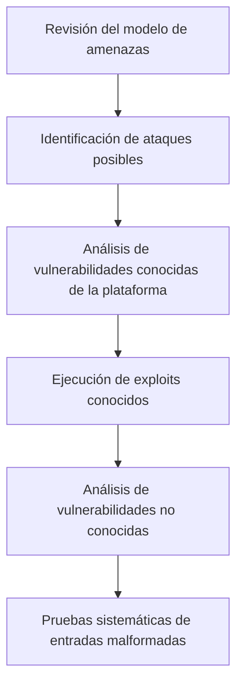

# Pruebas De Penetración

## Introducción

Las **pruebas de penetración** se realizan una vez finalizado el desarrollo y desplegada la aplicación con sus configuraciones finales. Constituyen una **buena práctica de seguridad** y son la **tercera en importancia**, después del análisis estático de código y otras pruebas de seguridad previas.

---

# Objetivos De Las Pruebas De Penetración

## Objetivo Principal

**Comprobar la eficacia de las salvaguardas de seguridad implementadas** y evaluar cómo la aplicación **resiste distintos tipos de ataques**.

## Objetivos Específicos

- Validar controles y mecanismos de seguridad.
    
- Evaluar el comportamiento del sistema ante ataques reales.
    
- Probar el cumplimiento de **requisitos no funcionales de seguridad**.
    
- Identificar debilidades explotables en el entorno de ejecución.

---

# Planificación De Las Pruebas De Penetración

## Plan De Pruebas

Antes de ejecutar pruebas de penetración es necesario elaborar un **plan**, que incluya:

- Amenazas del sistema.
    
- Secuencias de ataque probables.
    
- Casos de abuso.
    
- Riesgos arquitectónicos.
    
- Modelos de ataque.

## Fuentes De Información

- **Patrones de ataques** (catálogos de ataques conocidos).
    
- Buenas prácticas de seguridad.
    
- Modelos de amenazas previous.

---

# Enfoque Y Tipo De Pruebas

## Pruebas De Caja Negra

**Definición:**  
Las pruebas de penetración se consideran **pruebas de caja negra**, ya que se realizan sin conocer la implementación interna del sistema.

## Pruebas De Aspectos Negativos

- Verifican si el sistema **resiste ataques**.
    
- Son más complejas que las pruebas funcionales.
    
- Demostrar que algo funciona es más sencillo que demostrar que es resistente a todos los ataques.

---

# Metodología General De Pruebas De Penetración

---

# Tipos De Vulnerabilidades Evaluadas

## Vulnerabilidades Conocidas

- No suelen estar en la aplicación recién desarrollada.
    
- Se encuentran en:
    
    - Sistema operativo.
        
    - Base de datos.
        
    - Middleware.
        
- Incluyen vulnerabilidades de día cero (0-day).

## Vulnerabilidades no Conocidas

- Propias de la aplicación.
    
- Se detectan mediante:
    
    - Envío de entradas malformadas.
        
    - Pruebas sistemáticas de comportamiento.
        
    - Evaluación de estados anómalos o fallos.

---

# Herramientas Utilizadas

## Tipos De Herramientas

|Tipo|Ejemplos|
|---|---|
|Frameworks de explotación|Metasploit|
|Herramientas web|Burp Suite, HTTP Fuzzer|
|Distribuciones especializadas|Kali Linux, Parrot OS|
|Escáneres y fuzzers|Escáneres automáticos, fuzzing|

## Uso De Herramientas

- Ejecución automática o manual.
    
- Apoyo en exploits conocidos.
    
- Análisis de respuestas anómalas del sistema.

---

# Limitaciones De Las Pruebas De Penetración

## Limitaciones Principales

- No garantizan la ausencia total de vulnerabilidades.
    
- Se basan en condiciones y escenarios específicos.
    
- Dependen fuertemente de:
    
    - Experiencia del probador.
        
    - Conocimiento del entorno.
        
    - Tiempo disponible.

## Factores Críticos

- Conocimiento profundo del entorno de producción.
    
- Configuraciones incorrectas como fuente común de vulnerabilidades.
    
- Reducción del tiempo asignado por retrasos en el desarrollo.

---

# Pruebas De Penetración En El Ciclo De Vida

## Memento De Ejecución

- Se realizan al final del desarrollo.
    
- Forman parte del **proceso de aceptación final**.

## Riesgos Habituales

- Falta de tiempo para ejecutarlas correctamente.
    
- Cancelación o ejecución superficial.

---

# Equipo De Pruebas

## Recomendación

- Trabajo en **pareja de probadores**:
    
    - Un probador senior.
        
    - Un probador junior.

## Beneficios

- Mejor cobertura de escenarios.
    
- Complemento entre experiencia y perspectiva fresca.

---

# Resumen De Puntos Clave

- Las pruebas de penetración evalúan la resistencia ante ataques reales.
    
- Son pruebas de caja negra y de aspectos negativos.
    
- Requieren planificación basada en amenazas y riesgos.
    
- Analizan vulnerabilidades conocidas y no conocidas.
    
- Dependen de herramientas especializadas y de la experiencia del probador.
    
- Son críticas en la fase final, pero a menudo se ven limitadas por el tiempo.

---

# MicroTest

1. La principal misión de las pruebas de penetración es:
    
    - La respuesta: C. Verificar cómo el software se comporta y resiste ante diferentes tipos de ataque.
        
    - Justificación: Las pruebas de penetración se centran en evaluar el comportamiento real del sistema frente a ataques, comprobando la eficacia de las salvaguardas de seguridad, no en revisar código ni únicamente listar vulnerabilidades.
        
2. Señala la respuesta incorrecta. Recomendaciones sobre las pruebas de penetración:
    
    - La respuesta: D. Ninguna de las anteriores.
        
    - Justificación: Todas las opciones anteriores son recomendaciones válidas en pruebas de penetración, por lo que no existe una opción incorrecta entre A, B y C.
        
3. Señala la respuesta incorrecta. Las pruebas de penetración:
    
    - La respuesta: B. Revisan el código de la aplicación de forma automática.
        
    - Justificación: Las pruebas de penetración son pruebas de caja negra orientadas a ataques y comportamiento del sistema, no revisan automáticamente el código fuente, lo cual corresponde al análisis estático.