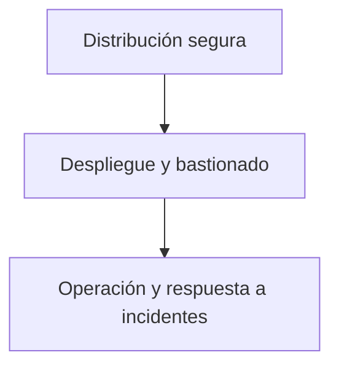

# Operaciones De Seguridad

## Introducción

Las **operaciones de seguridad** constituyen la fase final previa al paso a **producción**. Incluyen todas las actividades necesarias para distribuir, desplegar, configurar y operar el software de forma segura, minimizando riesgos antes y después de su liberación.

---

# Objetivos De Las Operaciones De Seguridad

- Reducir al mínimo las posibilidades de **acceso no autorizado** y **manipulación del software**.
    
- Asegurar una **configuración segura por defecto** en producción.
    
- Preparar la **operación y respuesta a incidentes** una vez el sistema está en uso real.

---

# Fases Principales De Las Operaciones De Seguridad

---

# Distribución Segura Del Software

## Definición

Conjunto de medidas para proteger el software **durante su entrega** desde el proveedor hasta el cliente, ya sea por medios físicos o por red.

## Riesgos Mitigados

- Manipulación del instalable.
    
- Inserción de malware o accesos remotos no autorizados.
    
- Suplantación del software legítimo.

## Medidas Recomendadas

- Uso de **mecanismos estándar de protección**:
    
    - Firmas digitales.
        
    - Hashes de integridad.
        
    - Marcas de agua.
        
- Canales de distribución **seguros e identificables**.
    
- Protección de derechos de propiedad intellectual.
    
- Autenticación de quien ejecuta la instalación en entornos de alto riesgo.

---

# Configuración Segura Por Defecto

## Definición

La aplicación debe entregarse con una **configuración inicial segura**, evitando valores inseguros heredados del entorno de desarrollo.

## Buenas Prácticas

- Cambiar todos los **valores por defecto** usados en desarrollo.
    
- Proporcionar una **guía de configuración segura**:
    
    - Clara.
        
    - Concisa (10–15 páginas).
        
    - Fácilmente entendible.
        
- Evitar documentación excesiva o confusa.

---

# Limpieza Del Código Fuente

## Importancia

Incluso si el código no se distribuye, se assume que un atacante **podrá acceder al diseño o al código** (principio de seguridad por diseño).

## Acciones Clave

- Eliminar comentarios innecesarios.
    
- Quitar información sensible o pistas para atacantes.
    
- No dejar credenciales, rutas internas o detalles de arquitectura.

---

# Herramientas De Instalación Y Configuración

## Instalación Automática

- Preferible el uso de **herramientas de instalación automática**.
    
- En entornos comerciales es habitual; en software libre es menos frecuente.

## Interfaces De Configuración

- Interfaces claras y sencillas.
    
- Scripts de instalación:
    
    - Comprensibles.
        
    - Ejecutables por personal no especializado.
        
- El objetivo es que un administrador no experto pueda realizar la instalación correctamente.

---

# Despliegue Y Bastionado (Hardening)

## Definición

El **bastionado** consiste en asegurar cada capa del sistema para reducir su superficie de ataque.

## Capas a Bastionar

|Capa|Ejemplos|
|---|---|
|Red|Firewalls, segmentación|
|Sistema Operativo|Servicios mínimos, parches|
|Base de Datos|Usuarios, permisos, cifrado|
|Middleware|Configuración segura|
|Aplicación|Autenticación y autorización|
|Interfaz de usuario|Controles de acceso|

## Guías De Bastionado

- CIS Benchmarks.
    
- NIST.
    
- NSA.
    
- Páginas especializadas como guías de hardening por software.

---

# Importancia De la Configuración En Producción

Un software puede estar **bien diseñado y desarrollado**, pero:

- Será inseguro si la configuración en producción no respeta el diseño de seguridad.
    
- La configuración incorrecta es una fuente común de vulnerabilidades reales.

---

# Operaciones De Seguridad En Producción

## Alcance

Las operaciones continúan una vez el sistema está en producción e incluyen:

- Controles de acceso a red y sistema operativo.
    
- Registro de eventos (logging).
    
- Monitorización.
    
- Copias de seguridad.
    
- Recuperación ante fallos.

---

# Respuesta a Incidentes

## Principios Clave

- Los **incidentes y ataques van a ocurrir**.
    
- No hay excusa para no estar preparados.

## Objetivos

- Detectar incidentes rápidamente.
    
- Responder de forma eficaz.
    
- Minimizar el daño causado por un ciberataque.
    
- Recuperar los sistemas afectados.

---

# Resumen De Puntos Clave

- Las operaciones de seguridad son la última fase antes de producción.
    
- Incluyen distribución segura, despliegue, bastionado y operación.
    
- La configuración segura por defecto es crítica.
    
- La limpieza del código evita dar pistas a atacantes.
    
- El bastionado debe aplicarse a todas las capas del sistema.
    
- La preparación para incidentes es obligatoria, no opcional.

---

## MicroTest