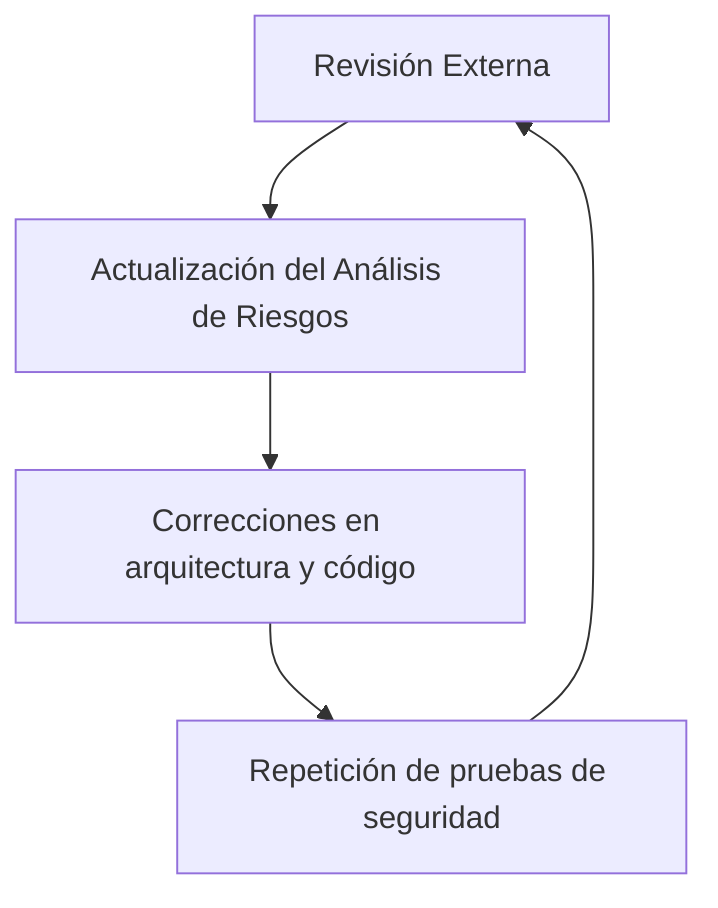

# Revisión Externa De Seguridad

## Introducción

La **revisión externa** es una práctica de seguridad realizada por **personal ajeno al equipo de diseño y desarrollo**. Su finalidad es aportar una visión independiente e imparcial sobre la seguridad del sistema, complementando las revisiones internas.

---

# Objetivos De la Revisión Externa

## Objetivo Principal

- Identificar **amenazas y riesgos residuales** que pueden no haber sido detectados por el equipo interno.

## Objetivos Secundarios

- Aportar una **nueva perspectiva de seguridad**.
    
- Evaluar el sistema con mayor imparcialidad.
    
- Mejorar el nivel global de seguridad de la aplicación.

---

# Ventajas De la Revisión Externa

## Imparcialidad

- Al no formar parte del proyecto, el equipo externo no está condicionado por decisiones previas.
    
- Reduce sesgos comunes del equipo interno.

## Eficacia

- Suele descubrir:
    
    - Nuevas amenazas.
        
    - Riesgos no considerados.
        
    - Debilidades residuales.

---

# Limitaciones Y Viabilidad

## Factores Que Condicionan Su Uso

- **Coste económico**.
    
- Presupuesto y alcance del proyecto.
    
- Importancia y criticidad de la aplicación.

## Ejemplos De Aplicación

|Tipo de aplicación|Recomendación|
|---|---|
|Aplicación de bajo riesgo (ej. negocio pequeño)|No recomendable|
|Sistema crítico (ej. infraestructura nuclear)|Altamente recomendable|

---

# Relación Con la Revisión Interna

## Complementariedad

- La revisión externa **no sustituye** a la revisión interna.
    
- Ambas aportan valor desde perspectivas distintas.

## Prácticas Que Puede Incluir

- Auditoría de código.
    
- Análisis de seguridad del sistema.
    
- Evaluaciones especializadas que el equipo interno no puede realizar.

---

# Revisión Externa En Operación Y Mantenimiento

## Aplicaciones

- Escaneos de vulnerabilidades.
    
- Pruebas de penetración.
    
- Evaluaciones periódicas (recomendado: annual).

## Beneficios

- Detección de nuevas vulnerabilidades.
    
- Adaptación a cambios del entorno y nuevas amenazas.

---

# Impacto De Los Resultados

## Acciones Posteriores

Tras una revisión externa:

- Se debe **actualizar el análisis de riesgos**.
    
- Gestionar nuevas amenazas detectadas.
    
- Aplicar mitigaciones necesarias.

## Cambios Derivados

- Modificaciones en:
    
    - Arquitectura hardware.
        
    - Arquitectura software.
        
    - Código fuente.
        
- Repetición de:
    
    - Revisiones de código.
        
    - Pruebas de seguridad basadas en riesgo.
        
    - Pruebas de penetración.

---

# Carácter Cíclico De la Seguridad

## Explicación

- La seguridad es un proceso **iterativo y cíclico**.
    
- Cada cambio puede introducir nuevos riesgos.
    
- Es necesario repetir evaluaciones en cada iteración.

---

# Revisión Externa Y Modelos De Desarrollo

## Relación Con Modelos Iterativos

- En modelos como el **modelo en espiral**:
    
    - Se refinan prototipos progresivamente.
        
    - Cada versión require nuevas pruebas de seguridad.

## Importancia

- Garantiza que la seguridad evoluciona junto con el sistema.

---

# Conclusiones Sobre la Revisión Externa

- Aporta una visión más imparcial y especializada.
    
- Es especialmente relevante en sistemas críticos.
    
- No entra en conflicto con la revisión interna.
    
- Ambas deben aplicarse si el proyecto y la criticidad lo justifican.

---

# Resumen De Puntos Clave

- La revisión externa la realiza un tercero independiente.
    
- Identifica riesgos y amenazas residuales.
    
- Su aplicación depende del coste y la criticidad.
    
- Complementa, no sustituye, la revisión interna.
    
- La seguridad es un proceso cíclico y continuo.

---

# MicroTest

1. Señala la respuesta incorrecta. Indica en qué fase del ciclo de vida de desarrollo del software es aplicable la contratación de una revisión externa del código de la aplicación (análisis estático):
    
    - La respuesta: A. Especificación de requisitos.
        
    - Justificación: La revisión externa de código (análisis estático) solo es aplicable cuando existe código, por lo que no puede realizarse en la fase de especificación de requisitos.
        
2. ¿Quién realiza la revisión externa de alguno de los aspectos de seguridad de la aplicación?
    
    - La respuesta: C. Un equipo de auditoría externo contratado.
        
    - Justificación: La revisión externa se caracteriza precisamente por set realizada por personal ajeno al equipo interno, contratado específicamente para aportar una visión independiente e imparcial.
        
3. El esquema de seguridad en el ciclo de vida de la aplicación tiene que set:
    
    - La respuesta: C. Cíclico.
        
    - Justificación: La seguridad es un proceso continuo y cíclico, ya que los cambios en el sistema y la aparición de nuevas amenazas obligan a repetir evaluaciones, revisiones y pruebas a lo largo del ciclo de vida del software.