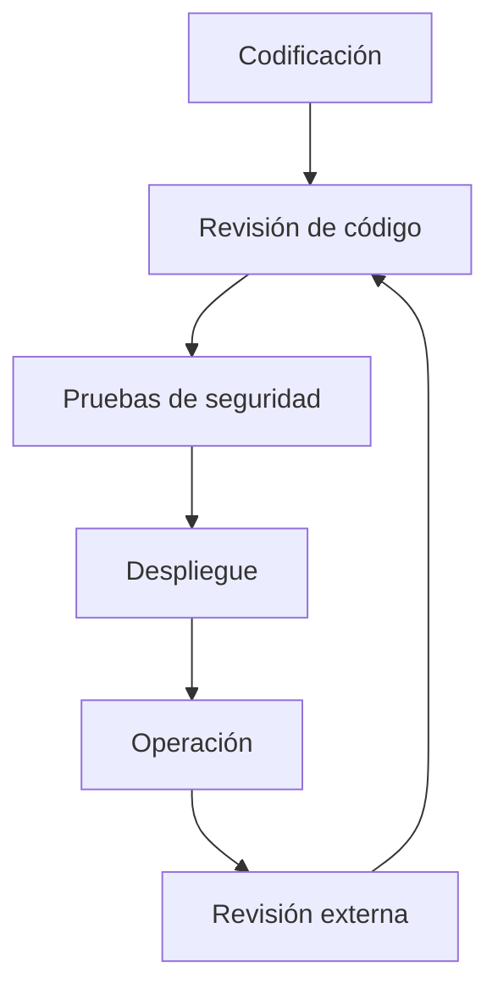

# Tema 3: Seguridad En El Ciclo De Vida Del Software

**Fases: Codificación, Pruebas y Operaciones**

---

## 1. Visión General Del Tema 3

Este tema aborda las **buenas prácticas de seguridad** aplicables a distintas fases del ciclo de vida del software, centrándose especialmente en:

- Codificación
    
- Pruebas
    
- Distribución, despliegue y operaciones

El objetivo es integrar la seguridad como un proceso continuo y no como una actividad aislada.

---

# 2. Pruebas De Seguridad Basadas En Riesgo

## 2.1 Definición

Las **pruebas de seguridad basadas en riesgo** priorizan los esfuerzos de evaluación en función de los riesgos más críticos identificados en la aplicación y su entorno.

## 2.2 Tipos De Pruebas Según El Conocimiento Del Sistema

|Tipo de prueba|Acceso al diseño/código|Ejemplo|
|---|---|---|
|Caja blanca|Acceso total al código y diseño|Análisis estático de código|
|Caja negra|Sin acceso al código ni diseño|Test de penetración web|
|Caja gris|Acceso parcial|Pruebas con credenciales limitadas|

## 2.3 Análisis Estático Vs Análisis Dinámico

- **Análisis estático**:
    
    - Se realiza sin ejecutar la aplicación.
        
    - Es una prueba de **caja blanca**.
        
    - Busca vulnerabilidades directamente en el código fuente.
        
- **Análisis dinámico**:
    
    - Se realiza con la aplicación en ejecución.
        
    - Normalmente es de **caja negra**.
        
    - Ejemplo: test de penetración sobre una aplicación web.

---

# 3. Seguridad En la Fase De Codificación

## 3.1 Revisión De Código

- Es la **buena práctica de seguridad más importante** del ciclo de vida.
    
- Si solo se puede aplicar una práctica de seguridad, debe set esta.
    
- Permite detectar vulnerabilidades de forma temprana, cuando el coste de corrección es menor.

## 3.2 Análisis De Riesgo Arquitectónico

- Complementa la revisión de código.
    
- Evalúa la **explotabilidad de los riesgos** asociados a la arquitectura del sistema.
    
- Es importante, pero secundaria frente a la revisión de código.

---

# 4. Herramientas De Análisis De Código

## 4.1 Herramientas Mencionadas

- Fortify
    
- Checkmarx
    
- Snyk
    
- SonarQube

## 4.2 Herramientas Comerciales Vs Libres

- Existe una **brecha significativa** entre herramientas profesionales y libres.
    
- Las herramientas comerciales suelen ofrecer:
    
    - Mayor precisión
        
    - Menos falsos positivos
        
    - Mejor soporte y reglas avanzadas

## 4.3 Reglas Y Lenguajes

- Algunas herramientas permiten definir reglas personalizadas.
    
- El lenguaje de reglas (por ejemplo, **PQL**) es similar conceptualmente a las reglas de un IDS (sistema de detección de intrusiones).

---

# 5. Métricas En la Revisión De Código

## 5.1 Métricas De Seguridad

- **Densidad de vulnerabilidades**: número de vulnerabilidades por líneas de código.
    
- **Clasificación por severidad**: agrupa vulnerabilidades según su impacto.

## 5.2 Métricas De Proceso

- Permiten estimar:
    
    - El tiempo necesario para una auditoría.
        
    - El esfuerzo en función del tamaño del código (líneas de código).

---

# 6. Pruebas De Penetración

## 6.1 Definición

Las **pruebas de penetración** evalúan la seguridad del sistema simulando ataques reales contra la aplicación y su infraestructura.

## 6.2 Memento De Aplicación

- La aplicación debe estar **desplegada**.
    
- Preferiblemente en un entorno equivalente a producción.

## 6.3 Enfoque Del Test De Penetración

1. **Primera fase**:
    
    - Identificación de vulnerabilidades conocidas en:
        
        - Sistema operativo
            
        - Middleware
            
        - Infraestructura base
            
2. **Segunda fase**:
    
    - Búsqueda de vulnerabilidades desconocidas de la aplicación.
        
    - Uso de:
        
        - Análisis dinámico
            
        - Técnicas de _fuzzing_

## 6.4 Fuzzing

- Técnica que consiste en generar entradas malformadas o inesperadas.
    
- Objetivo: provocar estados inestables y descubrir fallos.
    
- Aplicable a:
    
    - Aplicaciones web
        
    - Aplicaciones no web

---

# 7. Seguridad En la Fase De Operaciones

## 7.1 Distribución Del Software

- El software no debe set alterado durante su distribución.
    
- Medidas clave:
    
    - Firma digital
        
    - Canales de distribución estándar y seguros
        
    - Protección de la propiedad intellectual

## 7.2 Despliegue

- Require **bastionado (hardening)** del sistema:
    
    - Aplicación
        
    - Software base
        
    - Infraestructura de soporte
        
- Objetivo: reducir la superficie de ataque.

## 7.3 Operación

- Los ataques son inevitables.
    
- Es necesario:
    
    - Diseñar procesos de gestión de incidentes
        
    - Definir sistemas de respaldo y recuperación
        
    - Preparar procedimientos de respuesta ante ataques

---

# 8. Revisión Externa De Seguridad

## 8.1 Definición

La **revisión externa** es realizada por una entidad ajena a la organización y aporta una visión más objetiva e imparcial de la seguridad del sistema.

## 8.2 Aplicaciones Típicas

- Auditoría de código
    
- Test de penetración
    
- Revisión general de seguridad

## 8.3 Relación Con la Revisión Interna

- No entra en conflicto con la revisión interna.
    
- Ambas se **complementan** y aportan valor.
    
- Idealmente deben realizarse las dos cuando la criticidad del sistema lo justifica.

---

# 9. Seguridad Como Proceso Cíclico

- La seguridad es **iterativa y cíclica**.
    
- Los cambios en el sistema y la aparición de nuevas amenazas obligan a repetir las evaluaciones.
    
- Especialmente relevante en modelos de desarrollo iterativos o en espiral.

---

# 10. Información Adicional Relevante

- Detectar vulnerabilidades en fases tempranas reduce drásticamente el coste de corrección.
    
- La configuración incorrecta es una de las principales fuentes de vulnerabilidades.
    
- La seguridad debe integrarse tanto en el desarrollo como en la operación continua del sistema.

---

# Resumen De Puntos Clave

- La revisión de código es la práctica de seguridad más importante.
    
- Las pruebas de seguridad se clasifican en caja blanca, negra y gris.
    
- El análisis estático y dinámico son complementarios.
    
- Los test de penetración deben realizarse en entornos similares a producción.
    
- La distribución, despliegue y operación requieren medidas específicas de seguridad.
    
- La revisión externa aporta una visión objetiva y complementaria.
    
- La seguridad en el ciclo de vida del software es un proceso cíclico y continuo.

---
