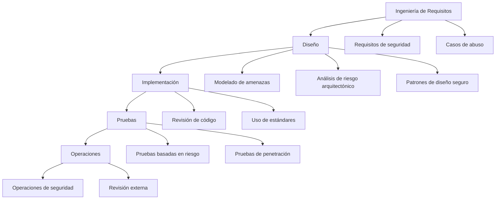

# Notas De Estudio: Prácticas De Codificación Segura

---

## 1. Introducción a la Codificación Segura

La **codificación segura** es el conjunto de prácticas, principios y técnicas orientadas a desarrollar software que minimice vulnerabilidades y reduzca el riesgo de explotación.

### Objetivo Principal

Evitar **defectos de implementación** que puedan derivar en:

- Accesos no autorizados
    
- Fugas de información
    
- Ejecución de código malicioso
    
- Corrupción de datos
    
- Escalamiento de privilegios

---

## 2. Buenas Prácticas De Codificación Segura

### 2.1 Formación Y Mejora Continua

- Formación continua en seguridad.
    
- Conocimiento actualizado de vulnerabilidades comunes (OWASP, CVE).
    
- Uso de estándares y listas de verificación.

**Relevancia:** La seguridad es dinámica; nuevas vulnerabilidades surgen constantemente.

---

### 2.2 Validación Y Manejo De Datos

#### Definición: Validación De Entrada

Proceso mediante el cual se verifica que los datos recibidos cumplen con formato, tipo y rango esperado.

#### Buenas Prácticas

- Validar todos los datos de entrada.
    
- Comprobar límites de estructuras de datos.
    
- Verificar archivos de configuración.
    
- Validar parámetros de línea de commandos.
    
- Comprobar variables de entorno.
    
- Validar cookies.

#### Importancia

La mayoría de los ataques (SQL Injection, XSS, Buffer Overflow) explotan entradas no validadas.

---

### 2.3 Manejo Seguro De Información

- Inicializar correctamente las variables.
    
- Identificar correctamente referencias a ficheros.
    
- Proteger información confidencial.
    
- No almacenar contraseñas en texto plano.
    
- No mostrar contraseñas en pantalla.
    
- No codificar contraseñas directamente en la aplicación.
    
- Usar mecanismos adicionales al sistema operativo para proteger archivos.
    
- Cifrar información sensible almacenada en disco o base de datos.

#### Definición: Información Sensible

Datos cuyo acceso no autorizado puede causar daño:

- Contraseñas
    
- Datos personales
    
- Claves API
    
- Tokens de autenticación

---

### 2.4 Revisión Y Pruebas De Seguridad

- Desechar código no probado.
    
- Revisiones de código.
    
- Revisiones por pares (peer review).
    
- Uso de herramientas de análisis estático.
    
- Pruebas de seguridad basadas en riesgo.
    
- Pruebas de penetración.
    
- Revisiones externas.
    
- Probar todos los cambios de código.
    
- Eliminar código obsoleto.

#### Definición: Revisión Por Pares

Evaluación del código por otro desarrollador para detectar errores lógicos o vulnerabilidades.

---

## 3. Malas Prácticas En Seguridad

### 3.1 Errores Comunes De Implementación

|Mala práctica|Riesgo asociado|
|---|---|
|Usar nombres relativos de archivos|Path Traversal|
|Referirse al mismo fichero dos veces|Inconsistencias o corrupción|
|Invocar programas no confiables|Ejecución de código malicioso|
|Asumir que usuarios no son maliciosos|Vulnerabilidades explotables|
|Usar random no seguro|Claves predecibles|
|Invocar Shell desde commandos|Inyección de commandos|
|Usar IP/MAC/email como identificador|Suplantación|
|Memoria accessible por todos|Exposición de datos|
|Base de datos sin protección|Fuga de información|
|Contraseñas sin cifrar|Compromiso de cuentas|
|Confiar en terceros en operaciones críticas|Dependencia insegura|
|Decisiones basadas en variables de entorno|Manipulación en ejecución|
|Almacenar aplicación en NFS|Riesgo de acceso no controlado|

---

## 4. Seguridad a Lo Largo Del Ciclo De Vida Del Software

La seguridad debe integrarse en todas las fases del desarrollo.

---

## 5. Conceptos Fundamentales

### 5.1 Modelado De Amenazas

Proceso para:

- Identificar activos
    
- Detectar amenazas potenciales
    
- Analizar vectors de ataque
    
- Mitigar riesgos

### 5.2 Casos De Abuso

Escenarios que describen cómo un atacante podría usar el sistema incorrectamente.

Ejemplo:

- Usuario intenta acceder a datos de otro usuario modificando un parámetro en la URL.

### 5.3 Modelado De Ataques

Análisis estructurado de:

- Cómo se ejecuta un ataque
    
- Qué vulnerabilidad explota
    
- Qué impacto tiene

### 5.4 Ingeniería De Requisitos De Seguridad

Definir desde el inicio:

- Políticas de autenticación
    
- Control de acceso
    
- Protección de datos
    
- Auditoría y trazabilidad

---

## 6. Relación Entre Prácticas Y Fases

|Fase|Actividades de Seguridad|
|---|---|
|Requisitos|Requisitos de seguridad, casos de abuso|
|Diseño|Modelado de amenazas, análisis arquitectónico|
|Implementación|Buenas prácticas, revisión de código|
|Pruebas|Pruebas basadas en riesgo, pentesting|
|Operaciones|Monitoreo, revisiones externas|

---

## 7. Principios Fundamentales Derivados

- No confiar en el usuario.
    
- Validar todo.
    
- Minimizar privilegios.
    
- Proteger datos sensibles.
    
- Revisar constantemente el código.
    
- Aplicar seguridad en todas las fases.

---

## 8. Resumen De Puntos Clave

- La codificación segura busca evitar defectos de implementación.
    
- Validar entradas es crítico para prevenir ataques.
    
- Nunca confiar en datos externos.
    
- Las contraseñas deben almacenarse cifradas.
    
- Las revisiones de código y pruebas de penetración son esenciales.
    
- La seguridad debe integrarse desde los requisitos hasta operaciones.
    
- Confiar en terceros o asumir buena fe del usuario es una mala práctica.
    
- El modelado de amenazas y análisis de riesgo fortalecen el diseño.

---

## MicroTest

1. Según las características de una buena implementación, prácticas y defectos a evitar, indica la respuesta que no es una buena práctica:
    
    - La respuesta: C. Invocar programas en los que no se confía desde otros en los que se confía.
        
    - Justificación: Invocar programas no confiables desde programas confiables introduce riesgos de ejecución de código malicioso, escalamiento de privilegios o compromiso del sistema, lo cual es una mala práctica claramente identificada en codificación segura.
        
2. Recomendaciones de buenas prácticas de implementación:
    
    - La respuesta: A. Manejo de los datos con precaución.
        
    - Justificación: El manejo cuidadoso de los datos, incluyendo validación y protección de información sensible, es una recomendación fundamental en prácticas de codificación segura. Las demás opciones corresponden a malas prácticas o conceptos incorrectos.
        
3. ¿Cuál de las siguientes respuestas es una recomendación de buenas prácticas?
    
    - La respuesta: C. Usar listas de comprobación.
        
    - Justificación: Las listas de comprobación ayudan a asegurar que se sigan estándares de seguridad y se revisen aspectos críticos durante el desarrollo. Las otras opciones representan prácticas inseguras o contrarias a los principios de codificación segura.

