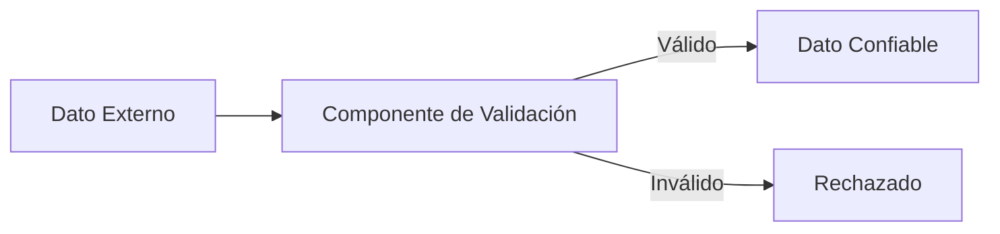
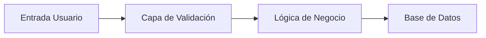

# Notas De Estudio: Manejo De la Entrada De Datos

---

## 1. Introducción Al Manejo De la Entrada De Datos

### Definición

El **manejo de la entrada de datos** es el conjunto de actividades que:

- Aceptan datos de entrada **sin confiar en ellos**.
    
- Verifican su validez antes de utilizarlos.
    
- Limitan los valores a un conjunto considerado seguro.

### Idea Fundamental

Nunca confiar en ningún dato de entrada, independientemente de su origen.

---

## 2. Validación De Entrada

### 2.1 ¿Qué Es la Validación De Entrada?

Es el proceso mediante el cual se verifica que un dato:

- Tiene el formato correcto.
    
- Está dentro de un rango permitido.
    
- Cumple reglas de negocio.
    
- Pertenece a un conjunto permitido (lista blanca).

---

### 2.2 Fuentes De Entrada Que Deben Validarse

Todas las fuentes de entrada deben validarse:

|Fuente de entrada|Ejemplo|
|---|---|
|Formularios web|Campos username, password|
|Datos por red|Peticiones HTTP|
|Sockets|Conexiones externas|
|Ficheros de configuración|config.xml|
|Variables del sistema|Variables de entorno|
|Parámetros de línea de commandos|args[]|

No se debe excluir ninguna fuente.

---

## 3. Fronteras De Confianza

### Definición

Una **frontera de confianza** separa:

- Datos no validados (no confiables)
    
- Datos validados (confiables)

Nunca deben mezclarse.



---

## 4. Cómo Validar Correctamente

### 4.1 Lista Blanca Vs Lista Negra

|Método|Descripción|Recomendación|
|---|---|---|
|Lista Blanca|Permitir solo valores explícitamente válidos|Recomendado|
|Lista Negra|Bloquear valores conocidos como peligrosos|No recomendado|

Las listas negras son incompletas y difíciles de mantener.

---

### 4.2 No Confundir Usabilidad Con Seguridad

Ejemplo: Confirmar contraseña dos veces.

- Esto es una validación de usabilidad.
    
- No protege contra ataques.
    
- Solo previene errores del usuario.

---

### 4.3 Rechazo De Datos Maliciosos

Si el dato es inválido:

- Se rechaza inmediatamente.
    
- No se intenta corregir.
    
- No se intenta "interpretar".

---

### 4.4 Validaciones Mínimas Obligatorias

- Comprobar longitud mínima y máxima.
    
- Limitar valores numéricos.
    
- Validar formato (regex).
    
- Aplicar listas blancas.

---

## 5. Errores Comunes: Inyecciones

Las vulnerabilidades de inyección ocurren cuando el sistema interpreta metacaracteres como instrucciones.

### Definición: Metacaracter

Carácter que tiene significado especial en un lenguaje:

- SQL: `'`, `;`, `--`
    
- Sistema de archivos: `../`
    
- Shell: `&`, `|`, `;`
    
- XML: `<`, `>`

---

## 6. SQL Injection

### Ejemplo Vulnerable

```java
String itemName = request.getParameter("item");
String query = "SELECT * FROM items WHERE name = '" + itemName + "'";
statement.execute(query);
```

### Problema

No hay validación entre:

- Obtención del parámetro
    
- Construcción de la consulta
    
- Ejecución

### Ataque

Entrada maliciosa:

```Python
' OR '1'='1
```

Consulta resultante:

```sql
SELECT * FROM items WHERE name = '' OR '1'='1'
```

Esto devuelve todos los registros.

---

### Solución: Consultas Parametrizadas

```java
PreparedStatement stmt = connection.prepareStatement(
    "SELECT * FROM items WHERE name = ?");
stmt.setString(1, itemName);
ResultSet rs = stmt.executeQuery();
```

### ¿Por Qué Funciona?

- El parámetro no se interpreta como código.
    
- Se trata como dato literal.
    
- Se elimina la ejecución de metacaracteres.

---

## 7. Path Traversal (Manipulación De Ruta)

### Definición

Ataque donde el atacante modifica una ruta para acceder a archivos fuera del directorio esperado.

### Metacaracteres Comunes

- `../`
    
- `..\`
    
- `/`
    
- `\`

---

### Ejemplo Vulnerable

```java
String fileName = request.getParameter("file");
File file = new File("/uploads/" + fileName);
```

### Ataque

Entrada:

```Python
../../conf/config.xml
```

Resultado:

Acceso a un archivo crítico fuera del directorio permitido.

---

### Solución

- Validar contra lista blanca.
    
- Normalizar rutas.
    
- Limitar acceso a directorios específicos.

---

## 8. Inyección De Commandos

### Definición

Ocurre cuando el sistema ejecuta commandos del sistema operativo construidos con entrada del usuario.

---

### Ejemplo Vulnerable

```java
String backupType = request.getParameter("type");
Runtime.getRuntime().exec("backup.sh " + backupType);
```

Si el usuario introduce:

```Python
incremental; rm -rf /
```

Se ejecuta un commando adicional destructivo.

---

### Solución

- Validar contra lista blanca.
    
- No concatenar commandos.
    
- Usar APIs seguras.
    
- Evitar ejecución directa de shell.

---

## 9. Tipos De Inyección

|Tipo|Impacto|
|---|---|
|SQL Injection|Modificación o lectura de base de datos|
|XPath Injection|Manipulación de consultas XML|
|LDAP Injection|Bypass de autenticación|
|SMTP Injection|Envío de spam|
|HTTP Injection|Manipulación de cabeceras|
|Command Injection|Ejecución de commandos del sistema|

---

## 10. Arquitectura Recomendada: Capa De Validación

Se recomienda una capa intermedia:



Ventajas:

- Centraliza validaciones.
    
- Evita duplicación.
    
- Reduce errores.

---

## 11. Buenas Prácticas Resumidas

- Validar toda entrada.
    
- No confiar en ninguna fuente.
    
- Usar listas blancas.
    
- Separar datos validados de no validados.
    
- Usar consultas parametrizadas.
    
- Validar longitud y formato.
    
- Rechazar entradas inválidas.
    
- Evitar ejecución directa de commandos.
    
- Normalizar rutas.

---

## 12. Resumen De Puntos Clave

- Todas las fuentes de entrada son potencialmente peligrosas.
    
- Nunca confiar en datos externos.
    
- Preferir listas blancas sobre listas negras.
    
- Las inyecciones ocurren por falta de validación.
    
- Las consultas parametrizadas eliminan SQL Injection.
    
- Path Traversal explota rutas no validadas.
    
- Command Injection explota concatenación de commandos.
    
- Implementar una capa central de validación mejora la seguridad.

---

## MicroTest

1. ¿Qué tipo de vulnerabilidad se comete en este código?
    
    - La respuesta: D. Manipulación de rutas (path transversal).
        
    - Justificación: El código obtiene un valor externo mediante `System.getProperty("dir")` y lo concatena directamente en un commando del sistema sin validación. Esto permite que un atacante manipule la ruta proporcionada y acceda a directorios no autorizados, característica típica de un ataque de path traversal.
        
2. ¿Qué tipo de vulnerabilidad se comete en este código?
    
    - La respuesta: D. SQL injection.
        
    - Justificación: La consulta SQL se construye concatenando directamente los valores de entrada (username y password) sin validación ni uso de consultas parametrizadas. Esto permite introducir metacaracteres o condiciones maliciosas que alteren la lógica de la consulta, lo que constituye una vulnerabilidad de SQL Injection.
        
3. Señala la respuesta incorrecta. ¿Qué hay que validar en las entradas de una aplicación?
    
    - La respuesta: B. Validar las estructuras de datos del programa.
        
    - Justificación: La validación debe aplicarse a todas las entradas externas y establecer fronteras de confianza. Validar las estructuras internas del programa no forma parte del proceso de validación de entrada, ya que estas no provienen de fuentes externas no confiables.