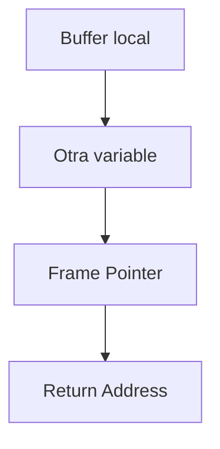
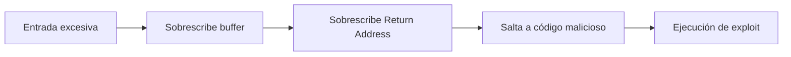

# Notas De Estudio: Desbordamiento De Buffer

---

## 1. Definición De Desbordamiento De Buffer

### ¿Qué Es Un Desbordamiento De Buffer?

Un **desbordamiento de buffer (buffer overflow)** ocurre cuando:

- Un programa escribe datos fuera de los límites de memoria asignados.
    
- Se almacenan más datos de los que el buffer puede container.
    
- Se escriben datos en zonas de memoria fuera del área permitida.

### Definición Según MITRE

Se produce cuando un programa intenta:

- Colocar más datos de los que puede almacenar un buffer.
    
- Escribir fuera de los límites de memoria asignados.

### Impacto

Los desbordamientos de buffer pueden permitir:

- Control total o casi total de la máquina objetivo.
    
- Ejecución de código arbitrario.
    
- Escalamiento de privilegios.
    
- Denegación de servicio.

---

## 2. Desbordamiento En la Pila (Stack-Based Buffer Overflow)

### Conceptos Clave

En la pila (stack) se almacenan:

- Variables locales
    
- Frame Pointer (EBP)
    
- Dirección de retorno (Return Address)

### Esquema Simplificado



Si el buffer recibe más datos de los permitidos:

- Se sobrescriben variables adyacentes.
    
- Se sobrescribe el frame pointer.
    
- Se sobrescribe la dirección de retorno.

Esto permite redirigir la ejecución a código malicioso (exploit).

---

## 3. Ejemplo Clásico: Uso De gets()

### Código Vulnerable

```c
void vulnerable() {
    char buffer[128];
    gets(buffer);
}
```

### Problema

- `gets()` no valida longitud.
    
- Permite introducir más de 128 caracteres.
    
- Provoca sobrescritura de memoria.

### Ataque

1. El atacante introduce más de 128 caracteres.
    
2. Sobrescribe la dirección de retorno.
    
3. Inserta la dirección de su exploit.
    
4. Cuando la función retorna, ejecuta código malicioso (por ejemplo, abrir una shell).

---

## 4. Tipos De Vulnerabilidades De Desbordamiento

|Tipo|Descripción|
|---|---|
|Stack overflow|Desbordamiento en pila|
|Heap overflow|Desbordamiento en memoria dinámica|
|String overflow|Desbordamiento en cadenas|
|Integer overflow|Desbordamiento aritmético|
|Format string|Vulnerabilidad en formato de impresión|

En este tema se profundiza principalmente en Stack y Heap.

---

## 5. Seguridad En Lenguajes De Programación

Para que un lenguaje sea considerado seguro debe ofrecer:

### 5.1 Seguridad En Memoria

- No permitir acceso a memoria de otros procesos.
    
- Control automático de límites.

### 5.2 Seguridad De Tipos

- Conversión segura entre tipos.
    
- Prohibición de conversiones peligrosas.

Lenguajes como C y C++ no imponen estas restricciones por defecto.

---

# 6. Vulnerabilidades En El Heap (Memoria Dinámica)

El heap es la zona de memoria dinámica gestionada manualmente.

---

## 6.1 Memory Leak (Memoria no liberada)

### Definición

Ocurre cuando se reserva memoria dinámica pero nunca se libera.

### Ejemplo

```c
void f() {
    char* a = malloc(8 * 45);
    // No se libera
}
```

### Problema

- Se pierden 360 bytes cada vez que se llama.
    
- Puede causar Denegación de Servicio (DoS).

---

## 6.2 Use After Free

### Definición

Ocurre cuando se utilize memoria después de haber sido liberada.

### Ejemplo

```c
char* a = malloc(160);
free(a);
strcpy(a, "secreto");
```

### Problema

- Se accede a memoria inválida.
    
- Puede provocar fallo de segmentación.
    
- Puede permitir explotación si el atacante controla la memoria reutilizada.

---

## 6.3 Double Free

### Definición

Liberar la misma zona de memoria más de una vez.

### Ejemplo

```c
char* b = malloc(100);
free(b);
free(b);
```

### Problema

- Corrupción del heap.
    
- Fallo de segmentación.
    
- Possible explotación.

---

## 6.4 Null Pointer Dereference

### Definición

Acceder a un puntero con valor NULL.

### Ejemplo

```c
char* p = NULL;
*p = 'A';
```

### Problema

- Fallo de segmentación.
    
- Denegación de servicio.

---

## 7. Comparación De Errores Del Heap

|Vulnerabilidad|Causa|Impacto|
|---|---|---|
|Memory Leak|No liberar memoria|Consumo excesivo|
|Use After Free|Uso tras liberación|Corrupción|
|Double Free|Liberación múltiple|Corrupción heap|
|Null Dereference|Uso de puntero NULL|Crash|

---

## 8. Flujo De Explotación En Stack Overflow



---

## 9. Cómo Mitigar Desbordamientos

### En Stack

- No usar `gets()`.
    
- Usar funciones seguras (`fgets`, `strncpy`).
    
- Validar longitud.
    
- Activar protecciones:
    
    - ASLR
        
    - Stack Canaries
        
    - DEP

### En Heap

- Liberar memoria correctamente.
    
- No reutilizar punteros liberados.
    
- Asignar NULL tras free:

```c
free(ptr);
ptr = NULL;
```

- Evitar double liberación.
    
- Usar herramientas de análisis estático.

---

## 10. Buenas Prácticas Generales

- Validar siempre la longitud de entrada.
    
- Inicializar punteros.
    
- Usar lenguajes con gestión automática de memoria cuando sea possible.
    
- Aplicar principios de mínimo privilegio.
    
- Utilizar herramientas como Valgrind o AddressSanitizer.

---

## 11. Resumen De Puntos Clave

- Un desbordamiento de buffer ocurre al escribir fuera de límites de memoria.
    
- Puede permitir ejecución de código arbitrario.
    
- Stack overflow sobrescribe dirección de retorno.
    
- Heap overflow afecta memoria dinámica.
    
- Use After Free y Double Free son errores críticos.
    
- Null pointer dereference provoca fallo de segmentación.
    
- La validación de longitud es fundamental.
    
- Existen mecanismos modernos de mitigación (ASLR, DEP).

---

## MicroTest

1. ¿Qué tipo de vulnerabilidad se comete en este código?
    
    - La respuesta: B. Desbordamiento de buffer.
        
    - Justificación: Se reserva memoria insuficiente para `buffer` y luego se copia el contenido de `argv[1]` sin validar el tamaño. La función `stringcopy` no verifica límites del destino, lo que puede provocar que se escriba fuera del espacio asignado en memoria, causando un desbordamiento de búfer.
        
2. ¿Qué tipo de vulnerabilidad se comete en este código?
    
    - La respuesta: A. Format string.
        
    - Justificación: El parámetro `fmt` proviene directamente de `buf` leído con `fgets` y es pasado a `vsnprintf` como formato sin validación. Si el usuario controla el contenido de `buf`, puede inyectar especificadores de formato como `%x` o `%n`, explotando una vulnerabilidad de format string.
        
3. ¿Cuál es la línea de código que puede producir un desbordamiento de búfer?
    
    - La respuesta: A.` sprintf(out, "argument %d is %s\n", argc-1, argv[argc-1]);`
        
    - Justificación: `sprintf` no valida el tamaño del buffer destino (`out`), por lo que si el argumento es mayor que el tamaño de `out`, se puede escribir fuera de los límites del arreglo, provocando un desbordamiento de búfer.