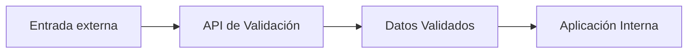
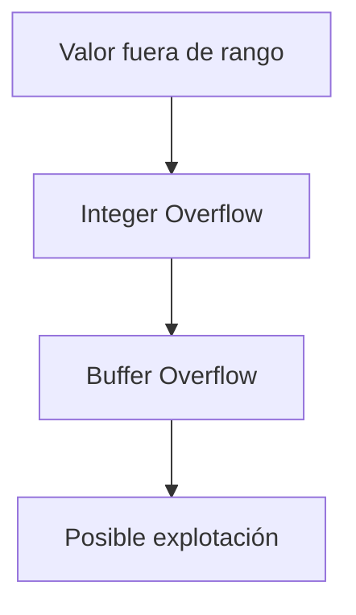
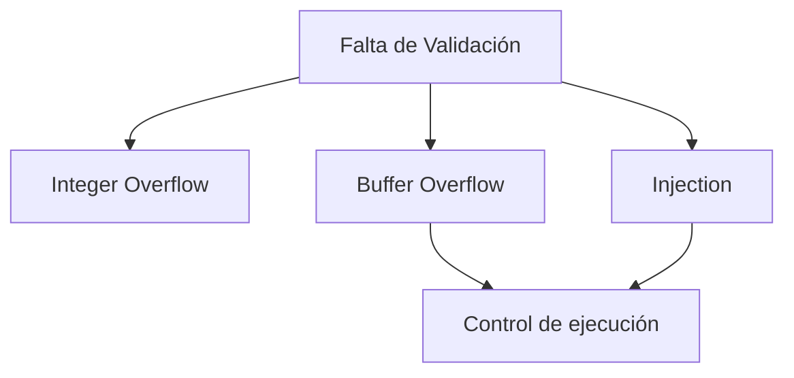

# Tema 4 – Buenas Prácticas De Implementación Y Seguridad

---

## 1. Características De Una Buena Implementación

### 1.1 Principios Generales

Una buena implementación de software seguro debe:

- Validar todas las entradas.
    
- Establecer límites claros de confianza.
    
- Evitar asumir que los datos son seguros.
    
- Controlar tamaños y límites de memoria.
    
- Prevenir inyecciones y desbordamientos.

---

## 2. Límites De Confianza (Trust Boundaries)

### Definición

Un **límite de confianza** es la frontera que separa:

- Datos confiables (ya validados)
    
- Datos no confiables (entrada externa)



### Fuentes De Entrada Que Deben Validarse

|Fuente|¿Debe validarse?|
|---|---|
|Línea de commandos|Sí|
|Formularios web|Sí|
|Socket de red|Sí|
|URL|Sí|
|Fichero de configuración|Sí|
|Variables de entorno|Sí|
|Registro del sistema|Sí|

Principio clave: **Toda entrada es potencialmente maliciosa**.

---

## 3. Validación De Entrada

### 3.1 Lista Blanca Vs Lista Negra

#### Lista Blanca (Recomendada)

Define explícitamente qué valores son permitidos.

Ejemplo:

```plaintext
Solo permitir caracteres alfanuméricos.
```

Ventajas:

- Más segura
    
- Reduce superficie de ataque

#### Lista Negra

Define qué valores están prohibidos.

Problema:

- Siempre puede faltar un caso
    
- Fácil de evadir

### Regla De Oro

Usar lista blanca siempre que sea possible.

---

## 4. API Centralizada De Validación

### Concepto

Construir una **API de validación obligatoria**, donde:

- Toda entrada pase por ella.
    
- No sea possible bypassarla.
    
- Devuelva solo datos confiables.

Ventajas:

- Centralización de lógica.
    
- Consistencia.
    
- Reducción de errores humanos.

---

## 5. Validación De Longitud Y Tipos Numéricos

### 5.1 Control De Tamaño

Siempre verificar:

- Longitud de cadenas
    
- Tamaño de buffers
    
- Rango de variables numéricas

### Ejemplo: Tipo `short`

|Tipo|Rango|
|---|---|
|short (16 bits)|-32,768 a 32,767|

Si se introduce `38,000` → ocurre **Integer Overflow**.

### Relación Con Overflow



---

## 6. Prevención De Metacaracteres

### ¿Qué Son?

Caracteres especiales interpretados por:

- Sistema operativo
    
- Base de datos
    
- Intérprete de commandos

Ejemplos:

- `'`
    
- `;`
    
- `|`
    
- `&`
    
- `../`

---

## 7. SQL Injection

### Definición

Ocurre cuando entrada del usuario altera la consulta SQL.

### Ejemplo Vulnerable

```sql
SELECT * FROM users WHERE username = 'input';
```

Entrada maliciosa:

```sql
'or 1=1 --
```

La consulta se convierte en:

```sql
SELECT * FROM users WHERE username = '' OR 1=1 --';
```

Resultado: devuelve todos los usuarios.

---

### Solución: Consultas Parametrizadas

Ejemplo en pseudocódigo:

```c
prepare("SELECT * FROM users WHERE username = ?");
bind(param);
```

¿Por qué funciona?

- El motor trata la entrada como dato.
    
- No interpreta metacaracteres como código.

---

## 8. Manipulación De Rutas (Path Traversal)

### Ataque Típico

Entrada:

```plaintext
../../etc/passwd
```

Permite acceder a archivos fuera del directorio previsto.

### Prevención

- Validar rutas.
    
- Restringir caracteres como `../`.
    
- Normalizar rutas antes de usarlas.

---

## 9. Desbordamientos De Buffer

### 9.1 Definición

Ocurre cuando se copia más información de la que el buffer puede almacenar.

### Ejemplo

```c
char dest[10];
strcpy(dest, source);
```

Si `source` > 10 caracteres → overflow.

---

## 10. Funciones Peligrosas Y Alternativas Seguras

|Función insegura|Problema|Alternativa|
|---|---|---|
|strcpy|No controla tamaño|strncpy|
|strcat|No controla tamaño|strncat|
|gets|Sin límite|fgets|
|memcpy|Riesgo si tamaño incorrecto|memcpy con validación previa|

Funciones seguras suelen incluir una `n` para indicar límite.

---

## 11. Tipos De Errores De Memoria

### 11.1 Use-After-Free

Uso de memoria después de liberarla.

```c
free(ptr);
ptr->value = 10; // error
```

---

### 11.2 Double Free

Liberar dos veces el mismo puntero.

```c
free(ptr);
free(ptr); // error
```

---

### 11.3 Null Pointer Dereference

Uso de puntero nulo.

```c
int *p = NULL;
*p = 5; // crash
```

---

## 12. Control Del Tamaño En Copias De Buffers

Regla fundamental:

Si el buffer fuente es mayor que el destino → overflow.

Antes de copiar:

```c
if (strlen(source) >= sizeof(dest))
    return ERROR;
```

---

## 13. Relación General De Vulnerabilidades



---

# Resumen De Puntos Clave

- Toda entrada debe validarse.
    
- Usar lista blanca en lugar de lista negra.
    
- Establecer límites de confianza claros.
    
- Centralizar validaciones en una API.
    
- Controlar tamaños de buffers y variables numéricas.
    
- Usar consultas parametrizadas para prevenir SQL Injection.
    
- Evitar funciones inseguras como strcpy.
    
- Validar siempre antes de copiar memoria.
    
- Comprender errores como use-after-free y double free.
    
- La mayoría de vulnerabilidades derivan de mala validación y mal control de memoria.

---

## MicroTest