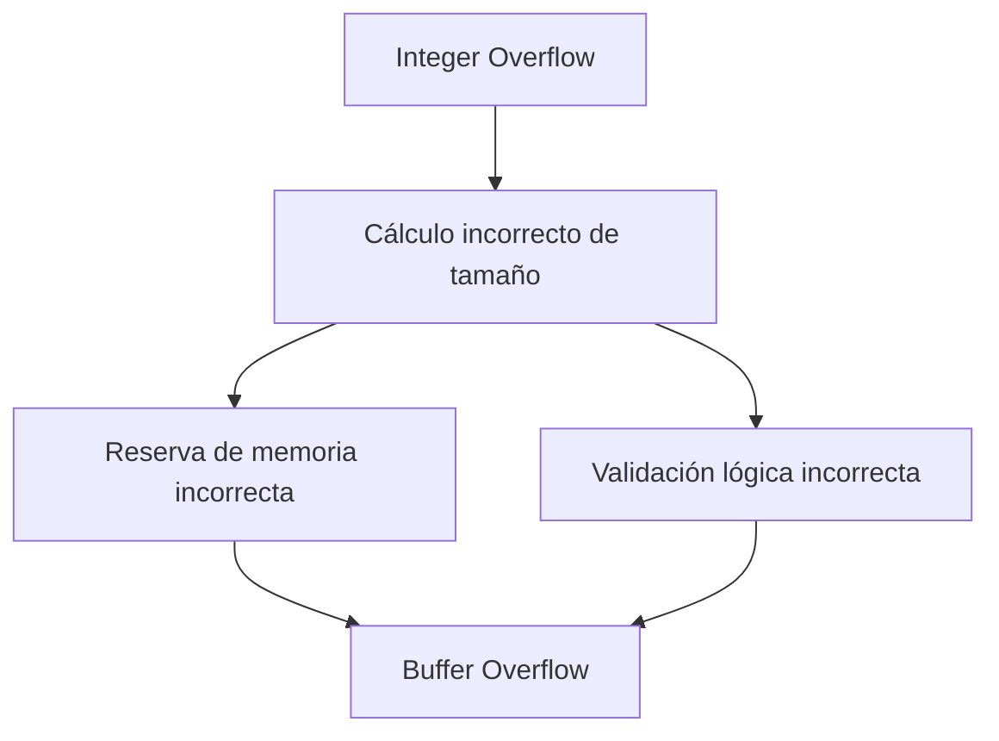

# Integer Overflow

## 1. Introducción

### Definición

**Integer Overflow (Desbordamiento de Enteros)** es un error que ocurre cuando se intenta almacenar en una variable numérica un valor que exceed los límites que su tipo de dato puede representar.

Es considerado una forma específica de **Buffer Overflow**, ya que puede derivar en accesos indebidos a memoria debido a cálculos incorrectos de tamaño.

### Relevancia En Seguridad

- Puede provocar:
    
    - Reservas de memoria excesivas.
        
    - Escrituras fuera de límites.
        
    - Fallos del sistema (crash).
        
    - Vulnerabilidades explotables.

---

## 2. Límites De Los Tipos Enteros

Cada tipo entero tiene un rango definido:

|Tipo|Rango aproximado|
|---|---|
|`int` (32 bits)|-2,147,483,648 a 2,147,483,647|
|`unsigned int`|0 a 4,294,967,295|
|`short` (16 bits)|-32,768 a 32,767|
|`unsigned short`|0 a 65,535|

### Concepto Clave

Si declaramos:

```c
int x = 3000000000;
```

Se produce overflow porque el valor exceed el máximo permitido.

---

## 3. Conversiones Implícitas Y Problemas De Signo

Un error común ocurre cuando se convierte:

- De **entero con signo** → **entero sin signo**

Ejemplo conceptual:

- `-1` en un entero con signo
    
- Al convertirse a `unsigned int`
    
- Se interpreta como `4,294,967,295`

Esto ocurre porque el bit más significativo representa el signo.

---

## 4. Caso 1: Reserva De Memoria Incorrecta

### Código Simplificado

```c
int len = read();
if (len > 1024)
    return -1;

len--;
char* buffer = malloc(len);
```

### Problema

Si el usuario envía:

```Python
len = 0
```

Paso a paso:

1. `len` no es mayor que 1024 → pasa validación.
    
2. `len--` → ahora `len = -1`.
    
3. `malloc(len)` convierte `-1` a `unsigned`.
    
4. Se interpreta como ~4GB.
    
5. Se intenta reservar 4GB → crash.

### Error

Conversión implícita de negativo a unsigned.

---

## 5. Caso 2: Error Off-by-One

### Código

```c
char buffer[255];

if (len1 + len2 > 255)
    return;

memcpy(buffer, buf1, len1);
memcpy(buffer + len1, buf2, len2);
```

### Problema

Si:

```Python
len1 = 255
len2 = 255
```

- El chequeo debería set `>= 255`
    
- El buffer va de índice 0 a 254
    
- Se escribe en la posición 255
    
- Se produce escritura fuera de límites

### Solución Correcta

```c
if (len1 + len2 >= 255)
```

### Definición

**Off-by-One Error**: Error de desbordamiento por exceder el límite por exactamente una posición.

---

## 6. Caso 3: Falta De Control Del Carácter Nulo

### Conceptos Importantes

- El carácter de fin de cadena es: `\0`
    
- Si no se controla correctamente, puede escribirse fuera del buffer.

### Escenario

- Buffer de tamaño 10 → índices 0–9
    
- Se escribe `\0` en la posición 10
    
- Se produce un overflow de una posición

Esto es también un caso de **off-by-one**.

---

## 7. Caso 4: Conversión Y Suma De Enteros

### Código Simplificado

```c
void process(char *str) {
    int len = strlen(str);
    char buffer[512];

    if (len < 512) {
        memcpy(buffer, str, len);
    }
}
```

### Problema

Si `len` resulta negativo (por manipulación o conversión incorrecta):

1. Pasa la condición `len < 512`
    
2. `memcpy` convierte `len` a unsigned
    
3. Se interpreta como número enorme
    
4. Se produce overflow

---

## 8. Relación Entre Integer Overflow Y Buffer Overflow



El Integer Overflow suele set la causa que conduce a un Buffer Overflow.

---

## 9. Buenas Prácticas De Prevención

### 1. Usar Tipos Sin Signo Cuando Corresponda

Evita conversiones implícitas peligrosas.

### 2. Validar Rangos Antes De Operar

- Verificar límites antes de sumar/restar.
    
- No asumir que la entrada es válida.

### 3. Validar Antes De Reservar Memoria

```c
if (len <= 0 || len > MAX_SIZE)
    return ERROR;
```

### 4. Cuidado Con Operaciones Aritméticas

Especial atención a:

- Sumas
    
- Restas
    
- Multiplicaciones
    
- Índices de buffers

### 5. Verificar Precondiciones Y Postcondiciones

- Precondición: los valores deben estar dentro de rango.
    
- Postcondición: el resultado debe set válido.

---

## 10. Conceptos Clave

|Concepto|Definición|
|---|---|
|Integer Overflow|Desbordamiento de un tipo entero por exceder su rango|
|Signed Integer|Entero con signo (puede set negativo)|
|Unsigned Integer|Entero sin signo (solo positivo)|
|Off-by-One|Error por exceder límite por una posición|
|Buffer Overflow|Escritura fuera del espacio reservado|

---

# Resumen De Puntos Clave

- El Integer Overflow ocurre cuando un valor exceed el rango del tipo.
    
- Las conversiones de signed a unsigned son una fuente común de vulnerabilidades.
    
- Un valor negativo puede convertirse en un número enorme positivo.
    
- Los errores off-by-one son extremadamente comunes.
    
- Integer Overflow frecuentemente conduce a Buffer Overflow.
    
- Siempre validar rangos antes de operar o reservar memoria.
    
- Verificar límites al trabajar con buffers.
    
- Comprender cómo el compilador realiza conversiones implícitas.

---

## MicroTest