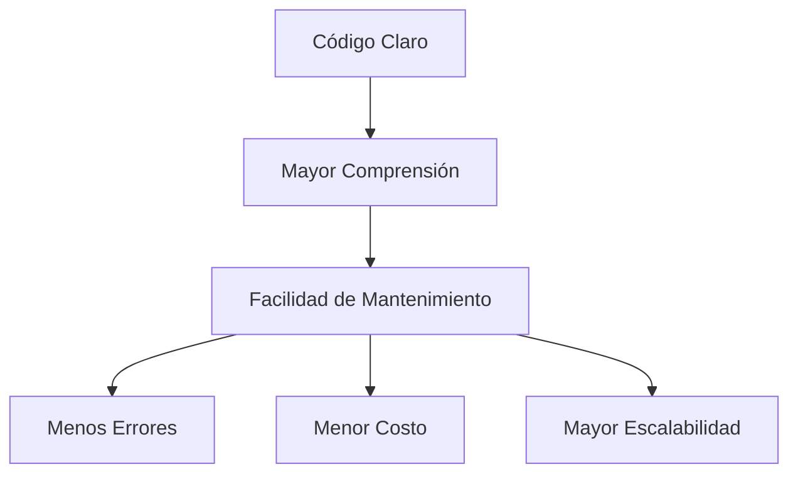
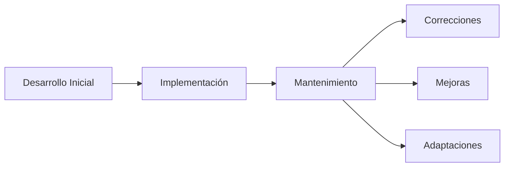

# Notas De Estudio

## 1. Mantenibilidad Del Código

### Definición

**Mantenibilidad** es la capacidad de un sistema de software para set modificado de forma eficiente, incluyendo corrección de errores, mejoras, adaptación a nuev
os requerimientos o refactorización.

En el transcript se menciona que:

> "el mantenimiento de este código es mucho más sencillo de entender"

Esto resalta la relación directa entre **claridad del código** y **facilidad de mantenimiento**.

---

## 2. Relación Entre Comprensión Y Mantenimiento

### Idea Central

Si un código es más fácil de entender, entonces:

- Es más fácil modificarlo.
    
- Es más fácil detectar errores.
    
- Es más sencillo agregar nuevas funcionalidades.
    
- Reduce el tiempo y costo de mantenimiento.

### Relación Conceptual



---

## 3. Factores Que Mejoran la Mantenibilidad

|Factor|Descripción|Impacto|
|---|---|---|
|Legibilidad|Código fácil de leer y entender|Reduce errores|
|Modularidad|División en funciones o módulos|Facilita cambios aislados|
|Bajo acoplamiento|Components poco dependientes|Reduce efectos colaterales|
|Alta cohesión|Cada módulo cumple una sola responsabilidad|Mejora claridad|
|Buen nombrado|Variables y funciones descriptivas|Mejora comprensión|

---

## 4. Conceptos Clave

### 4.1 Legibilidad

Se refiere a qué tan fácil es para un desarrollador entender el código.

Ejemplo:

Código poco claro:

```c
int x = a * b;
```

Código claro:

```c
int totalPrice = unitPrice * quantity;
```

La segunda versión comunica mejor la intención del código.

---

### 4.2 Mantenimiento Correctivo

Modificaciones para corregir errores existentes.

### 4.3 Mantenimiento Evolutivo

Cambios para agregar nuevas funcionalidades.

### 4.4 Mantenimiento Adaptativo

Modificaciones necesarias por cambios en el entorno (sistema operativo, librerías, dependencias).

---

## 5. Impacto En El Ciclo De Vida Del Software

El mantenimiento suele representar entre el 60% y 80% del costo total del software durante su vida útil.



Un código difícil de entender incrementa:

- Tiempo de análisis
    
- Riesgo de introducir nuevos errores
    
- Costo de operación

---

## 6. Buenas Prácticas Para Facilitar El Mantenimiento

1. Aplicar principios SOLID.
    
2. Usar control de versiones.
    
3. Escribir pruebas automatizadas.
    
4. Documentar correctamente.
    
5. Refactorizar regularmente.
    
6. Evitar duplicación de código (DRY).

---

## 7. Información Adicional Relevante

### Deuda Técnica

La deuda técnica surge cuando se toman decisiones rápidas que sacrifican calidad por velocidad. Esto incrementa el costo de mantenimiento a futuro.

### Refactorización

Proceso de mejorar la estructura interna del código sin cambiar su comportamiento externo.

---

## 8. Resumen De Puntos Clave

- La claridad del código impacta directamente en la mantenibilidad.
    
- Código comprensible reduce errores y costos.
    
- La mantenibilidad es una propiedad crítica en el ciclo de vida del software.
    
- Buenas prácticas de diseño mejoran la sostenibilidad del sistema.
    
- El mantenimiento representa la mayor parte del costo del software.

---

## MicroTest

1. Las excepciones tienen dos versiones, la diferencia tiene que ver con si el compilador usará análisis estático para asegurar que la excepción es manejada:
    
    - La respuesta: A. Comprobadas y no comprobadas.
        
    - Justificación: En lenguajes como Java existen excepciones checked (comprobadas), que el compilador obliga a declarar o manejar, y unchecked (no comprobadas), que no requieren verificación obligatoria en tiempo de compilación. La diferencia radica precisamente en el análisis estático del compilador.
        
2. Señala la respuesta correcta:
    
    - La respuesta: A. Si un método declara que lanza una excepción checked, todos los objetos que lo utilizan deben o manejar la excepción o declarar que lo lanzan también.
        
    - Justificación: En Java, cuando un método declara una excepción checked con la cláusula throws, cualquier método que lo invoque debe capturarla con try-catch o volver a declararla en su propia cláusula throws, cumpliendo así las reglas del compilador.
        
3. Señala la respuesta incorrecta:
    
    - La respuesta: D. Dejar excepciones checked con el bloque catch vacío.
        
    - Justificación: Dejar un bloque catch vacío es una mala práctica porque oculta errores y dificulta el diagnóstico de problemas. No manejar adecuadamente una excepción checked contradice las buenas prácticas de manejo de excepciones.