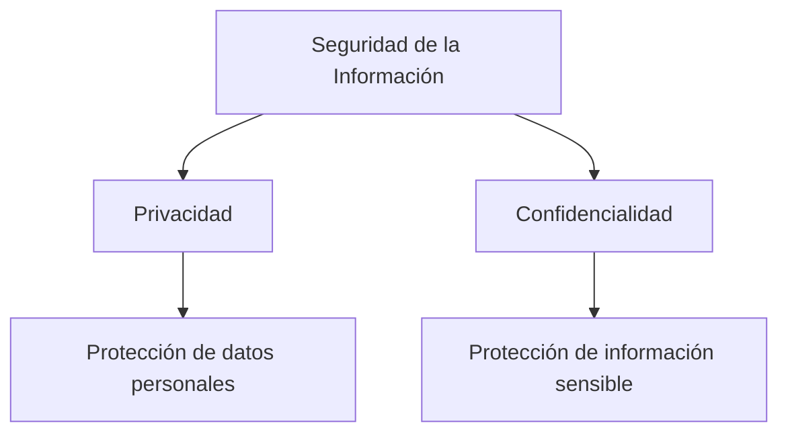
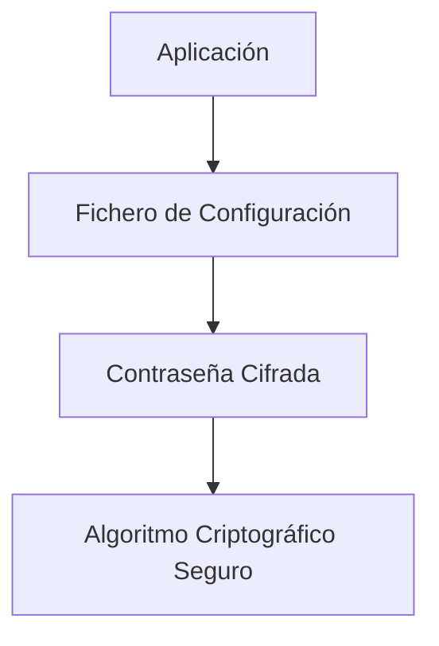

# Privacidad Y Confidencialidad En El Desarrollo De Software

## 1. Introducción

Este tema aborda los errores comunes relacionados con:

- Privacidad
    
- Confidencialidad
    
- Gestión de contraseñas
    
- Generación de números aleatorios
    
- Manejo de secretos en memoria
    
- Almacenamiento seguro de credenciales

Se enfatiza la diferencia entre privacidad y confidencialidad, así como buenas prácticas para proteger secretos en aplicaciones.

---

# 2. Privacidad Vs Confidencialidad

## 2.1 Privacidad

### Definición

La **privacidad** está relacionada con la protección de **datos personales**.

Ejemplos:

- Nombre
    
- Dirección
    
- Correo electrónico
    
- Información médica
    
- Datos de identificación

### Enfoque

Evitar que datos personales sean expuestos públicamente de forma indebida.

---

## 2.2 Confidencialidad

### Definición

La **confidencialidad** se refiere a la protección de información sensible para que solo sea accessible por entidades autorizadas.

Ejemplos:

- Contraseñas
    
- Claves criptográficas
    
- Secretos de aplicación
    
- Cadenas de conexión

---

## Diferencia Clave



|Concepto|Enfoque|Tipo de Datos|
|---|---|---|
|Privacidad|Protección de personas|Datos personales|
|Confidencialidad|Protección de acceso|Información sensible|

Error común: Confundir privacidad con confidencialidad.

---

# 3. Tipos De Contraseñas

Se distinguen dos tipos principales:

## 3.1 Human-Based Password (HBA Password)

### Definición

Contraseña recordada por una persona.

Ejemplo:

- Contraseña de Windows
    
- Login de usuario

### Características

- Debe set memorizable
    
- No puede set extremadamente compleja

---

## 3.2 Machine-Based Password (MBA Password)

### Definición

Contraseña utilizada para autenticación entre sistemas o aplicaciones.

Ejemplos:

- Clave de conexión a base de datos
    
- Contraseña de servicio LDAP
    
- Clave API interna

### Características

- No necesita set memorizable
    
- Debe set extremadamente robusta
    
- Debe generarse automáticamente

---

## Comparación

|Característica|HBA Password|MBA Password|
|---|---|---|
|La recuerda un humano|Sí|No|
|Nivel de complejidad|Medio|Muy alto|
|Uso típico|Login usuario|Comunicación entre sistemas|
|Generación automática|Opcional|Obligatoria|

---

# 4. Generación Segura De Contraseñas

## 4.1 Generadores De Números Aleatorios (PRNG)

### Tipos

|Tipo|Característica|Seguridad|
|---|---|---|
|Estadístico|Secuencia uniforme predecible|Baja|
|Criptográfico|Secuencia difícil de predecir|Alta|

---

## 4.2 Por Qué Usar PRNG Criptográfico

Los PRNG estadísticos:

- Son predecibles
    
- No son aptos para generar secretos

Los PRNG criptográficos:

- Generan secuencias difíciles de adivinar
    
- Son adecuados para claves y tokens

---

## 4.3 Ejemplo En Java

### Código Incorrecto

```java
Random random = new Random();
int number = random.nextInt();
```

### Problema

- `Random` es un generador estadístico
    
- No es seguro para generar contraseñas

---

### Código Correcto

```java
SecureRandom secureRandom = new SecureRandom();
int number = secureRandom.nextInt();
```

### Explicación Paso a Paso

1. `SecureRandom` usa un PRNG criptográfico.
    
2. La secuencia generada es impredecible.
    
3. Es apropiado para generar secretos, claves o tokens.

---

## 4.4 En C/C++

### Funciones NO Seguras

- rand()
    
- random()

### Funciones Seguras

- RtlGenRandom (Windows)
    
- arc4random (más usada)

---

# 5. Manejo De Secretos En El Código

## 5.1 Error Común: Contraseñas En El Código Fuente

Ejemplo:

```java
String url = "jdbc:mysql://localhost/db";
String user = "admin";
String password = "123456";
```

### Problemas

- Fácil extracción mediante herramientas como:
    
    - strings
        
    - binwalk
        
- Si el binario se analiza, la contraseña queda expuesta
    
- Especialmente crítico en lenguajes interpretados

---

## 5.2 Buenas Prácticas

### 1. No Almacenar Contraseñas En El Código Fuente

### 2. No Almacenarlas En Texto Plano

### 3. Cifrarlas Con Algoritmos Robustos

### 4. Guardarlas En Ficheros De Configuración Protegidos

---

## 5.3 Arquitectura Recomendada



---

# 6. Secretos En Memoria

Los secretos deben:

- No permanecer más tiempo del necesario en memoria
    
- Set borrados tras su uso
    
- No almacenarse en texto claro
    
- No registrarse en logs

---

# 7. Errores Frecuentes En Auditorías

- Contraseñas en texto plano
    
- Contraseñas en código fuente
    
- Uso de PRNG no criptográficos
    
- Confusión entre privacidad y confidencialidad
    
- Claves de servicios con baja complejidad

---

# 8. Información Adicional Relevante

## Algoritmos Recomendados Para Cifrado

- AES-256
    
- RSA (para intercambio de claves)
    
- SHA-256 (para hashing)

## Buenas Prácticas Modernas

- Uso de gestores de secretos (Vault, AWS Secrets Manager)
    
- Variables de entorno protegidas
    
- Rotación periódica de claves
    
- Principio de mínimo privilegio

---

# 9. Resumen De Puntos Clave

- Privacidad protege datos personales; confidencialidad protege información sensible.
    
- No todas las contraseñas son iguales: distinguir entre humanas y de máquina.
    
- Las contraseñas de máquina deben generarse con PRNG criptográficos.
    
- Nunca almacenar credenciales en código fuente.
    
- Cifrar secretos antes de almacenarlos.
    
- Usar algoritmos criptográficos robustos.
    
- La generación aleatoria insegura es una vulnerabilidad común.

---

## MicroTest

1. ¿Qué tipo de vulnerabilidad se comete en este código?
    
    - La respuesta: C. Confidencialidad.
        
    - Justificación: El código muestra credenciales (usuario y contraseña) directamente en la llamada a `DriverManager.getConnection`, lo que implica exposición de información sensible dentro del código fuente. Esto vulnera el principio de confidencialidad al dejar secretos accesibles y potencialmente extraíbles del binario.
        
2. Se deberán cifrar las contraseñas con algoritmo seguro y almacenarlas fuera del código. Una buena estrategia consiste en:
    
    - La respuesta: D. Todas la anteriores.
        
    - Justificación: Todas las opciones describen buenas prácticas complementarias: cifrar contraseñas con algoritmos robustos y almacenarlas fuera del código (A), generar contraseñas robustas mediante PRNG criptográficos (B), y utilizar fuentes seguras de números aleatorios como base para secretos fuertes (C).
        
3. Señala la respuesta incorrecta. Los generadores de números pseudoaleatorios caen en las siguientes categorías:
    
    - La respuesta: C. PRGNS matemáticos.
        
    - Justificación: Las categorías correctas son PRNG estadísticos y PRNG criptográficos. “PRGNS matemáticos” no es una clasificación reconocida dentro de la taxonomía estándar de generadores pseudoaleatorios, por lo que es la opción incorrecta.