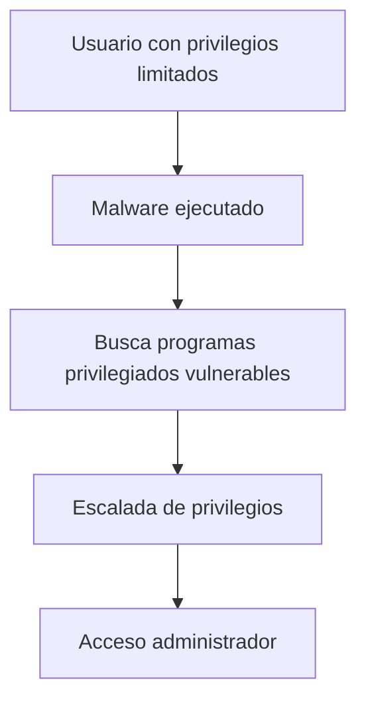
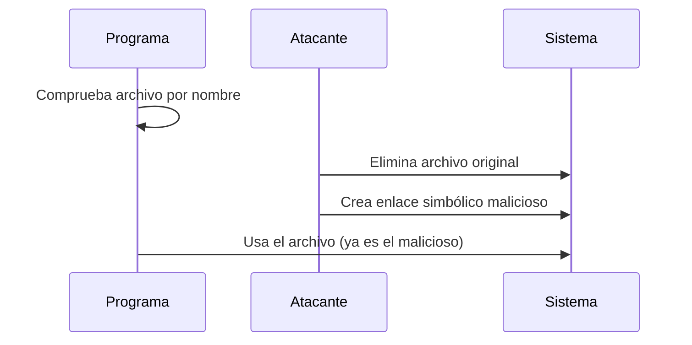
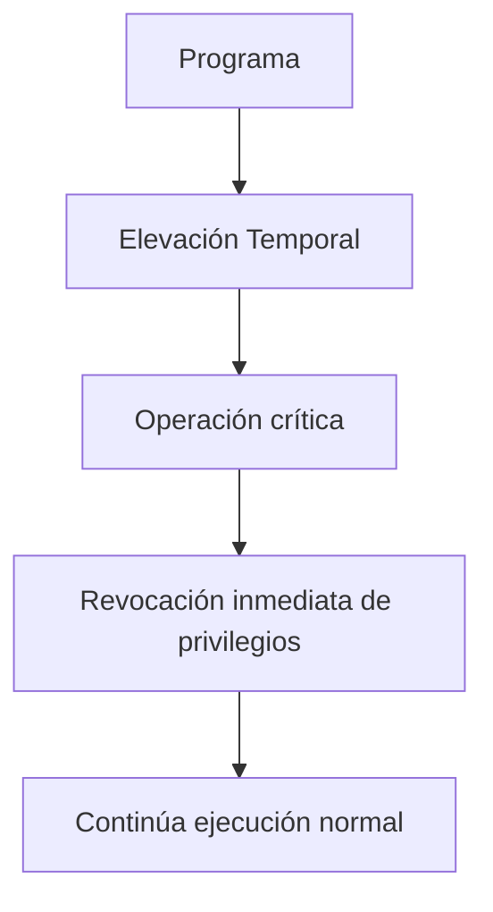

# Programas Privilegiados Y Vulnerabilidades Asociadas

---

# 1. Concepto De Programas Privilegiados

## 1.1 ¿Qué Es Un Programa Privilegiado?

Un **programa privilegiado** es una aplicación que, durante su ejecución, necesita elevar temporalmente sus privilegios para realizar ciertas operaciones que un usuario normal no puede hacer.

### Contexto De Ejecución Normal

- Los programas normalmente se ejecutan con los privilegios del usuario que los lanza.
    
- Lo recomendable es trabajar con **usuarios con privilegios limitados**.
    
- Los usuarios administradores deben utilizarse únicamente para tareas administrativas.

---

## 1.2 Riesgo De Seguridad

Escenario típico:

1. El atacante ya está dentro del sistema (ej. malware ejecutado por el usuario).
    
2. El atacante tiene privilegios limitados.
    
3. Su objetivo es realizar una **escalada de privilegios vertical** para convertirse en administrador.
    
4. Buscará vulnerabilidades en programas privilegiados mal diseñados.

---

## 1.3 Escalada De Privilegios



---

# 2. Superficie De Ataque En Programas Privilegiados

Los atacantes analizan principalmente:

|Elemento|Riesgo|
|---|---|
|Sistema de archivos|Manipulación de archivos|
|Variables de entorno|Alteración del comportamiento|
|Argumentos de entrada|Inyección de datos maliciosos|
|Archivos temporales|Acceso no autorizado|
|Descriptores estándar|Redirección indebida|

---

# 3. Tipos De Errores En Programas Privilegiados

Se identifican cinco categorías principales:

1. Condiciones de carrera (TOCTOU)
    
2. Permisos de archivos débiles
    
3. Archivos temporales inseguros
    
4. Inyección de commandos
    
5. Mal uso de descriptores estándar

---

# 4. Condiciones De Carrera (TOCTOU)

## 4.1 Definición

**TOCTOU (Time Of Check To Time Of Use)** es una vulnerabilidad que ocurre cuando:

- Se verifica una condición sobre un recurso.
    
- Entre la verificación y su uso, el recurso es modificado por un atacante.

---

## 4.2 Problema Principal

El programa verifica un archivo por su nombre, no por su identificador interno del sistema:

- En Linux: inode
    
- En Windows: handle

El nombre puede cambiar.  
El identificador interno no.

---

## 4.3 Secuencia Del Ataque



---

## 4.4 Ejemplo Explicado

Supongamos un código como:

```c
FILE *f = fopen(argv[1], "r");
```

### Paso a Paso Del Ataque

1. El programa recibe un archivo como parámetro.
    
2. Verifica su existencia.
    
3. El atacante detiene la ejecución (ej. con debugger).
    
4. Borra el archivo original.
    
5. Crea un enlace simbólico con el mismo nombre apuntando a `/etc/shadow`.
    
6. El programa continúa.
    
7. Ahora abre el archivo malicioso.
    
8. Se imprime el contenido sensible (ej. contraseñas).

Resultado: exposición de información crítica.

---

# 5. Permisos De Archivos Débiles

## Definición

Archivos con permisos demasiado amplios que permiten escritura o lectura a usuarios no autorizados.

### Ejemplo

Permisos 777 en Linux:

- Cualquiera puede leer, escribir o ejecutar.

### Riesgo

- Modificación de archivos críticos
    
- Inyección de código
    
- Sustitución de binarios

---

# 6. Archivos Temporales Inseguros

## Problema

Crear archivos temporales con nombres predecibles.

Ejemplo inseguro:

```c
tmpfile = fopen("/tmp/file.tmp", "w");
```

Un atacante puede crear ese archivo antes y controlar su contenido.

---

# 7. Inyección De Commandos

## Definición

Ocurre cuando un programa ejecuta commandos del sistema utilizando entrada del usuario sin validación adecuada.

Ejemplo conceptual:

```c
system("ls " + userInput);
```

Si el usuario introduce:

```Python
; rm -rf /
```

Se ejecutan commandos adicionales.

---

# 8. Mal Uso De Descriptores Estándar

Los descriptores estándar son:

- stdin
    
- stdout
    
- stderr

Si no se controlan adecuadamente, pueden redirigirse hacia archivos sensibles.

---

# 9. Buenas Prácticas En Programas Privilegiados

1. Minimizar el tiempo de elevación de privilegios.
    
2. Aplicar el principio de mínimo privilegio.
    
3. Usar identificadores internos del sistema (inode, handle).
    
4. Validar entradas rigurosamente.
    
5. No usar nombres predecibles para archivos temporales.
    
6. Evitar ejecutar commandos con entrada directa del usuario.
    
7. Eliminar privilegios inmediatamente después de usarlos.

---

# 10. Arquitectura Segura De Programa Privilegiado



---

# 11. Información Adicional Relevante

- La mayoría de exploits locales buscan escaladas de privilegios.
    
- Las condiciones de carrera son difíciles de detectar en pruebas estáticas.
    
- Las auditorías deben revisar manejo de archivos y privilegios elevados.
    
- La seguridad debe diseñarse desde el inicio, no añadirse al final.

---

# 12. Resumen De Puntos Clave

- Los programas privilegiados elevan permisos temporalmente.
    
- Son objetivo principal para escaladas de privilegios.
    
- TOCTOU es la vulnerabilidad más común en esta categoría.
    
- Nunca confiar en nombres de archivos.
    
- Aplicar mínimo privilegio.
    
- Validar entradas y proteger archivos temporales.
    
- Reducir superficie de ataque.

---

## MicroTest

1. Se tienen dos opciones para crear archivos temporales de forma segura:
    
	  - La respuesta: B. Almacenar los archivos temporales bajo un directorio que no es públicamente accessible, eliminando así toda la discusión con respecto a ataques.
	    
	- Justificación: Una forma segura de manejar archivos temporales es almacenarlos en un directorio con permisos restringidos, donde otros usuarios no puedan leer, escribir ni crear archivos. Al no set públicamente accessible, se elimina el riesgo de ataques como enlaces simbólicos maliciosos o condiciones de carrera sobre nombres predecibles, ya que el atacante no puede interactuar con ese espacio de almacenamiento.
        
2. Señala la respuesta incorrecta. Los ataques de escalada de privilegios pueden tener como objetivo cualquier variedad de vulnerabilidades de software, que son principalmente un riesgo en programas privilegiados:
    
    - La respuesta: A. Archivos de sistema.
        
    - Justificación: Aunque los archivos de sistema pueden set objetivo de ataques, no constituyen en sí una categoría de vulnerabilidad. En cambio, condiciones de carrera, inyección de commandos y mal uso de descriptores estándar sí son vulnerabilidades explotables típicas en programas privilegiados.
        
3. ¿Qué tipo de vulnerabilidad se comete en este código?
    
    - La respuesta: B. Condiciones de carrera (TOCTOU).
        
    - Justificación: El código verifica la existencia del archivo (usando `access`) y posteriormente lo abre con `fopen`. Entre la verificación y el uso, un atacante podría reemplazar el archivo (por ejemplo, mediante un enlace simbólico), explotando una condición de carrera Time Of Check To Time Of Use.