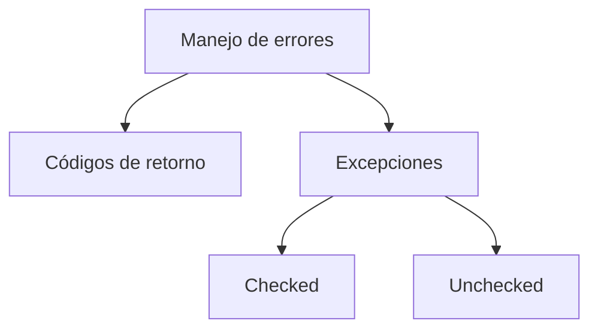
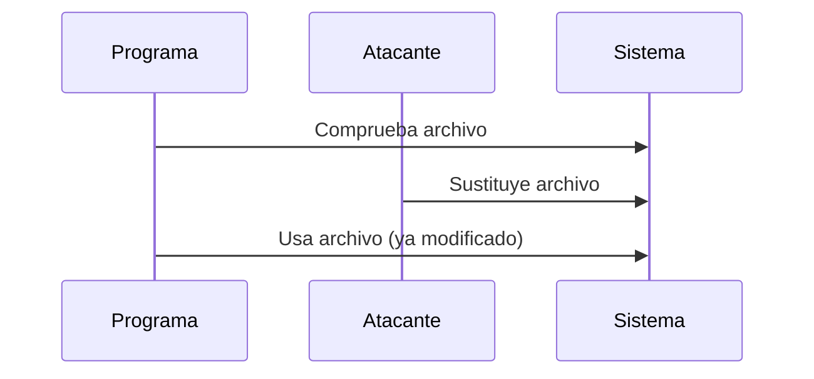

# Resumen Tema 5 – Codificación Segura

---

# 1. Errores Numéricos

## 1.1 Integer Overflow

### Definición

Un **integer overflow** ocurre cuando se almacena un número que exceed la capacidad máxima del tipo de dato.

Ejemplo:

Si un entero con signo tiene rango:

- −2,147,483,648 a 2,147,483,647

Y se introduce:

- 3,000,000,000 → se produce overflow.

### Consecuencias

- Resultados incorrectos
    
- Comportamiento inesperado
    
- Posibles vulnerabilidades de memoria

---

## 1.2 Errores De Truncado

### Definición

El **truncado** ocurre cuando un dato se reduce de tamaño (por ejemplo, de 8 bytes a 4 bytes), perdiendo información.

Ejemplo conceptual:

```c
uint64_t bigNumber = 5000000000;
uint32_t smallNumber = bigNumber;
```

### Paso a Paso

1. `bigNumber` ocupa 8 bytes.
    
2. Se asigna a una variable de 4 bytes.
    
3. Se pierden los bits más significativos.
    
4. El valor cambia semánticamente.

### Riesgo

- Alteración lógica del programa
    
- Fallos de validación
    
- Vulnerabilidades explotables

---

# 2. Manejo De Errores

## 2.1 Manejo En C Mediante Códigos De Retorno

### Características

- Devuelve valores como:
    
    - 0 (éxito)
        
    - −1 (error)
        
    - Otros códigos personalizados

### Problemas

|Problema|Explicación|
|---|---|
|No estandarizado|Cada función puede usar códigos distintos|
|Difícil mantenimiento|Mezcla lógica normal con manejo de errores|
|No obligatorio|El desarrollador puede ignorar el error|

---

## 2.2 Manejo Mediante Excepciones

### En C++

- Excepciones comprobadas
    
- Excepciones no comprobadas

### En Java

- Excepciones checked (obligatorias)
    
- Excepciones unchecked

### Ventajas

- Obligan a manejar errores
    
- Separan lógica normal del manejo de errores
    
- Mejoran mantenibilidad



---

# 3. Privacidad Y Confidencialidad

## 3.1 Error Común

Guardar usuario y contraseña en texto plano en un fichero de configuración.

Ejemplo inseguro:

```properties
db.user=admin
db.password=123456
```

### Problema

- Exposición directa de credenciales
    
- Fácil acceso si el fichero es leído

---

## 3.2 Buenas Prácticas

- Almacenar credenciales fuera del código fuente
    
- Cifrarlas con algoritmos robustos
    
- Restringir permisos del fichero

---

# 4. Human Password Vs Machine Password

## 4.1 Human-Based Password

- Recordada por personas
    
- No puede set extremadamente compleja

## 4.2 Machine-Based Password (MBA Password)

- Utilizada entre sistemas
    
- No necesita set recordada
    
- Debe generarse con PRNG criptográfico
    
- Es objetivo frecuente de atacantes

---

## Generación Segura

Se debe usar un generador de números pseudoaleatorios criptográfico.

Ejemplo conceptual en Java:

```java
SecureRandom secureRandom = new SecureRandom();
byte[] password = new byte[32];
secureRandom.nextBytes(password);
```

### Paso a Paso

1. Se instancia `SecureRandom`.
    
2. Se genera un arreglo de bytes aleatorios.
    
3. Se obtiene una contraseña fuerte e impredecible.

---

# 5. Programas Privilegiados

## 5.1 Principio De Mínimo Privilegio

Un programa debe tener:

- Solo los privilegios necesarios
    
- Durante el tiempo estrictamente necesario

"Un privilegio es un peligro."

---

## 5.2 Riesgo Principal

Un atacante dentro del sistema buscará:

- Escalar privilegios
    
- Convertirse en administrador
    
- Explotar aplicaciones mal diseñadas

---

## 5.3 Superficie De Ataque

|Elemento|Riesgo|
|---|---|
|Sistema de archivos|Manipulación de archivos|
|Archivos temporales|Sustitución maliciosa|
|Descriptores estándar|Redirección|
|Entrada de usuario|Inyección|

---

# 6. Condiciones De Carrera (TOCTOU)

## Definición

Time Of Check To Time Of Use: se verifica un recurso y luego se usa; entre ambos momentos puede set modificado.

---

## Ejemplo Simplificado

1. Programa verifica archivo.
    
2. Atacante lo sustituye por enlace simbólico.
    
3. Programa usa archivo incorrecto.



---

# 7. Inyección De Commandos

## Definición

Ejecutar commandos del sistema utilizando entrada no validada.

Ejemplo conceptual:

```c
system("ls " + input);
```

Si `input` contiene:

```Python
; rm -rf /
```

Se ejecuta código adicional malicioso.

---

# 8. Archivos Temporales Seguros

## Problema

Nombres predecibles.

## Solución

- Generar nombres con números aleatorios grandes.
    
- Usar PRNG criptográficos.
    
- Ubicarlos en directorios restringidos.

---

# 9. Resumen De Puntos Clave

- Evitar integer overflow y truncado.
    
- Las excepciones mejoran el manejo de errores frente a códigos de retorno.
    
- No almacenar credenciales en texto plano.
    
- Las contraseñas de máquina deben generarse con PRNG criptográficos.
    
- Aplicar el principio de mínimo privilegio.
    
- Prevenir condiciones de carrera.
    
- Validar entradas para evitar inyección de commandos.
    
- Generar nombres de archivos temporales impredecibles.

---

## MicroTest