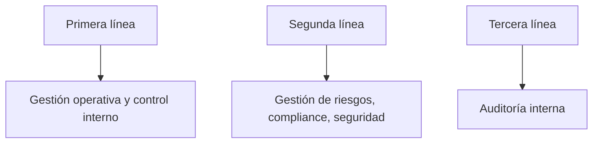
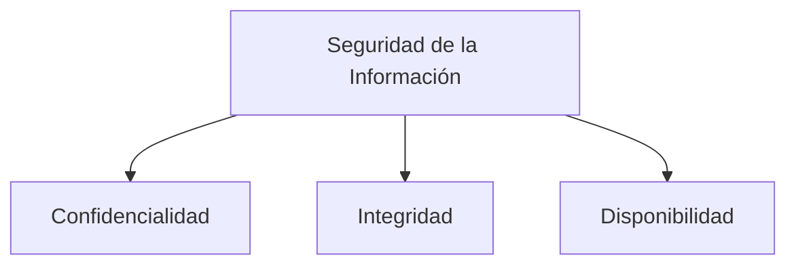
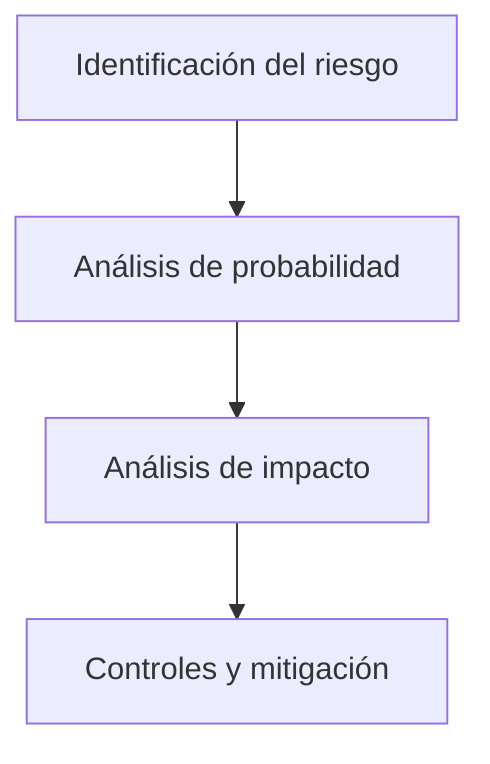

# Introducción a Los Sistemas De Información Y El Rol De la Auditoría Informática

---

# 1. Contexto Actual De Las TIC

## 1.1 Impacto De Las Tecnologías De Información

Las Tecnologías de la Información y Comunicaciones (TIC):

- Han transformado la sociedad.
    
- Han modificado la forma en que operan las organizaciones.
    
- Han incrementado la dependencia tecnológica.
    
- Han aumentado la exposición a Internet.

### Consecuencia

Mayor complejidad = Mayor probabilidad de vulnerabilidades.

---

## 1.2 Nuevas Amenazas

Factores que aumentan el riesgo:

- Mayor digitalización de negocios.
    
- Pagos electrónicos y móviles.
    
- Exposición en redes sociales.
    
- Dependencia de plataformas digitales.
    
- Empleado desleal.
    
- Hacktivistas.
    
- Ciberdelincuentes.
    
- Servicios de inteligencia.
    
- Ciberterrorismo.

---

## 1.3 Impacto De Los Incidentes

Cuando ocurre un ciberincidente:

- Se deteriora la imagen corporativa.
    
- Se pierde confianza de clientes.
    
- Puede haber impacto financiero y legal.

---

# 2. Modelo De Las Tres Líneas De Defensa

## 2.1 Primera Línea

Gestión operativa:

- Inventario de hardware y software.
    
- Control diario de sistemas.

## 2.2 Segunda Línea

Gestión de riesgos y cumplimiento:

- Seguridad.
    
- Control financiero.
    
- Cumplimiento normativo.

## 2.3 Tercera Línea

Auditoría:

- Evalúa si el sistema funciona correctamente.
    
- Identifica mejoras.
    
- Puede set interna o externa.
    
- Ejemplo: Certificación ISO 27001.

---

# 3. Activos De Los Sistemas De Información

## 3.1 Definición De Activo

Un activo es todo aquello que tiene valor para la organización.

---

## 3.2 Clasificación De Activos

### Activos Primarios

- Servicios TIC.
    
- Información y datos.

### Activos Secundarios

- Aplicaciones.
    
- Personas.
    
- Equipos informáticos.
    
- Redes de comunicación.
    
- Instalaciones.
    
- Soportes de información.

Importante: El personal es un activo del sistema de información.

---

# 4. Requisitos De Seguridad En Sistemas De Información

Todo sistema debe garantizar:

|Requisito|Definición|
|---|---|
|Propiedad|Los activos pertenecen a la organización|
|Integridad|No deben set modificados sin autorización|
|Confidencialidad|Acceso solo a quien tiene necesidad de conocer|
|Disponibilidad|Accesibles cuando se necesiten|
|Eficacia y eficiencia|Cumplimiento de objetivos de negocio|

---

## Triada Clásica De Seguridad

---

# 5. Components De Un Sistema De Información

## 5.1 Elementos Principales

- Personas (hardware humano)
    
- Hardware (servidores, equipos)
    
- Software (aplicaciones)
    
- Datos
    
- Procedimientos

---

## 5.2 Importancia De Los Procedimientos

Caso práctico descrito:

- Usuarios expertos en informática no siguieron procedimientos.
    
- Usuarios no expertos sí los siguieron.
    
- Resultado: mejor desempeño de los que siguieron los procedimientos.

Conclusión: La disciplina en el uso del sistema es clave.

---

# 6. Planificación Del Sistema De Información

Debe existir un Plan de Sistemas de Información que:

- Alinee TI con objetivos de negocio.
    
- Defina interrelación entre sistemas.
    
- Establezca métricas de desempeño.
    
- Defina controles y estándares.

---

# 7. Controles Y Cumplimiento

Se deben evaluar:

- Controles internos.
    
- Estándares (ej. ISO 27001).
    
- Normativas legales (ej. protección de datos).
    
- Políticas internas.

---

# 8. Rol De la Auditoría Informática

## 8.1 Objetivo

Evaluar si el sistema de información es:

- Eficaz
    
- Eficiente
    
- Seguro
    
- Alineado con los objetivos de negocio

---

## 8.2 Aspectos Que Evalúa la Auditoría

|Área|Evaluación|
|---|---|
|Alineamiento estratégico|Coherencia con misión y visión|
|Uso de recursos TI|Eficiencia|
|Logro de objetivos|Eficacia|
|Cumplimiento legal|Regulaciones y normas|
|Entorno de control|Diseño e implementación|
|Riesgos TI|Probabilidad e impacto|

---

# 9. Riesgos En Sistemas De Información

## 9.1 Riesgos TI

- Baja probabilidad.
    
- Alto impacto.
    
- Frecuentemente “cisnes negros”.

### Concepto De Cisne Negro

Evento con:

- Baja probabilidad.
    
- Alto impacto.
    
- Difícil previsión.

---

## 9.2 Gestión Del Riesgo

---

# 10. Relación Entre TI Y Negocio

Un problema común:

- Exceso de recursos TI sin utilización.
    
- Falta de alineamiento con estrategia empresarial.

La auditoría verifica:

- Uso adecuado de recursos.
    
- Optimización de inversión en TI.

---

# 11. Resumen De Puntos Clave

- Las TIC aumentan eficiencia pero también riesgos.
    
- Los sistemas son cada vez más complejos y expuestos.
    
- La auditoría informática es esencial para prevenir incidentes.
    
- Existen tres líneas de defensa: gestión operativa, gestión de riesgos y auditoría.
    
- Un activo es todo lo que tiene valor para la organización.
    
- Todo sistema debe garantizar confidencialidad, integridad y disponibilidad.
    
- La planificación y controles son fundamentales.
    
- Los riesgos TI suelen tener bajo nivel de ocurrencia pero alto impacto.

---

## MicroTest

1. Un activo de sistemas de información es:  
	- La respuesta: C. Todo aquello que una entidad considera valioso por container, procesar o generar información necesaria para el negocio de esta.  
		
	- Justificación: Un activo de sistemas de información se define como todo aquello que la organización considera valioso dentro de su contexto de negocio. Esto incluye datos, servicios, aplicaciones, personas e infraestructuras. Las opciones A y B restringen incorrectamente el concepto a elementos “activos”, cuando también existen activos pasivos como bases de datos o soportes físicos.

2. El gobierno de TI se puede definir como:  
	- La respuesta: B. El alineamiento estratégico de las TI con la organización de tal forma que se consigue el máximo valor de negocio por medio del desarrollo y mantenimiento de un control y responsabilidad efectivas, gestión de la eficiencia y la eficacia, así como la gestión de riesgos de TI.  
	- Justificación: El gobierno de TI no solo busca el alineamiento estratégico y la generación de valor, sino que también incorpora la gestión de riesgos como elemento fundamental. La opción A es incompleta al omitir la gestión de riesgos, y la opción C es incorrecta porque el gobierno de TI debe estar integrado con la alta dirección, no actuar de forma autónoma.
3. ¿Quién clasifica los activos del sistema de información?  
	- La respuesta: D. La propia organización.  
	- Justificación: La organización es quien conoce el valor, criticidad e impacto de sus activos en el negocio, por lo que es responsible de su identificación y clasificación. Aunque puede apoyarse en auditoras o consultoras, la responsabilidad final siempre recae en la propia entidad.