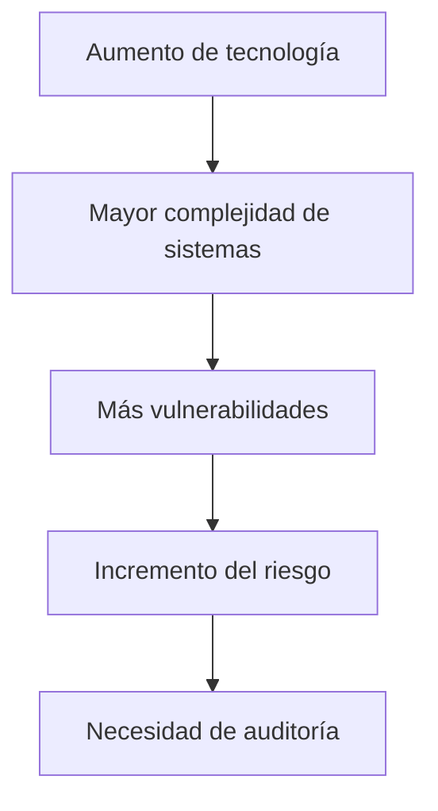
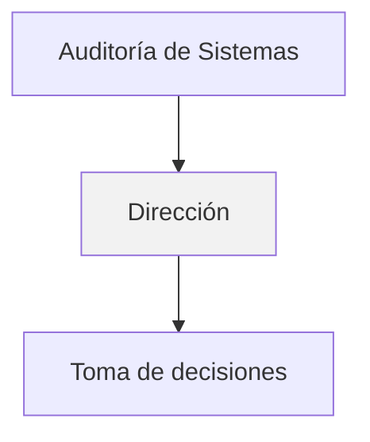
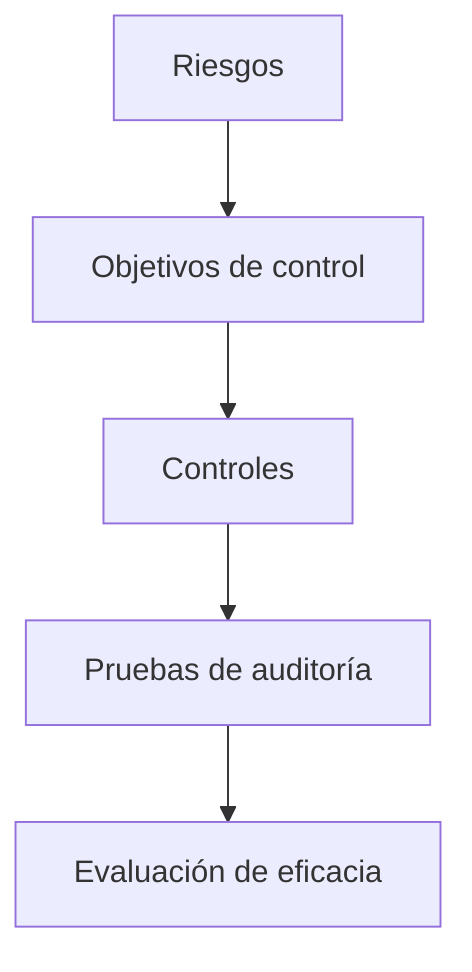
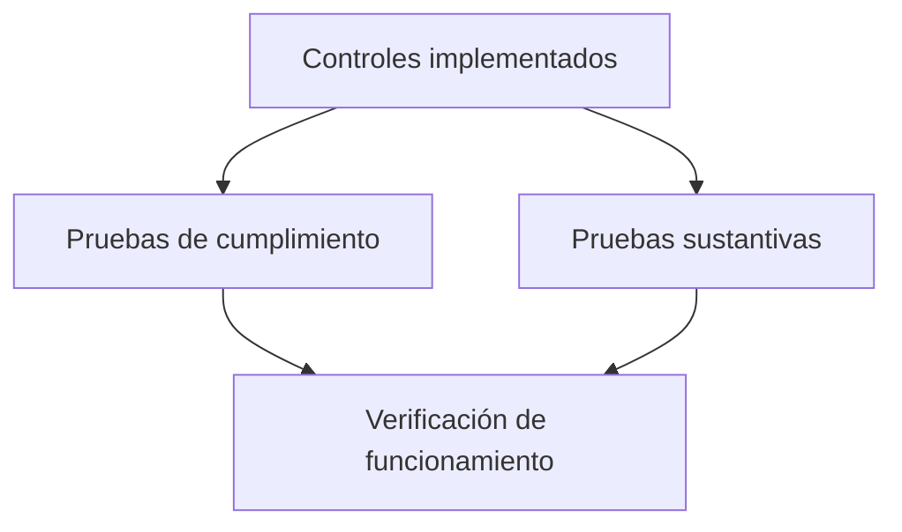

# Fundamentos Y Conceptos De la Auditoría De Sistemas De Información

## 1. Introducción a la Auditoría De Sistemas De Información

Las organizaciones modernas dependen cada vez más de los **sistemas de información (SI)** para realizar sus operaciones. La evolución tecnológica ha generado:

- Mayor **complejidad de los sistemas**
    
- Integración entre **informática y telecomunicaciones**
    
- Acceso a la información **desde cualquier lugar**
    
- Uso de **múltiples dispositivos** (PC, tablet, teléfono)

Esto aumenta significativamente los **riesgos asociados a la información y a la tecnología**, lo que hace necesaria la **auditoría de sistemas de información**.

### Definición

**Auditoría de Sistemas de Información**  
Proceso sistemático de evaluación de los sistemas tecnológicos de una organización para determinar si:

- Protegen adecuadamente la información
    
- Operan de forma eficiente
    
- Cumplen con normativas y controles establecidos
    
- Apoyan los objetivos del negocio

### Contexto Actual

Factores que incrementan la necesidad de auditoría:

|Factor|Descripción|
|---|---|
|Movilidad|Acceso a sistemas desde cualquier lugar|
|Dispositivos múltiples|Uso de computadoras, tablets y smartphones|
|Globalización|Operaciones y trabajo internacional|
|Interconectividad|Integración entre sistemas y redes|

Todos estos factores incrementan la **superficie de riesgo**.

---

## 2. Concepto De Riesgo En Sistemas De Información

El aumento en la complejidad tecnológica implica que las organizaciones deben:

1. **Identificar riesgos**
    
2. **Evaluarlos**
    
3. **Gestionarlos**

### Definición

**Riesgo**  
Probabilidad de que una amenaza explote una vulnerabilidad en un sistema y genere un impacto negativo en la organización.

### Relación Entre Tecnología Y Riesgo

---

## 3. Función De la Auditoría

La auditoría no solo debe realizarse correctamente, sino que también debe **demostrar que se realiza correctamente**.

Principios clave de la función de auditoría:

|Principio|Descripción|
|---|---|
|Demostrar competencia|El auditor debe tener formación técnica y professional|
|Diligencia professional|Trabajo realizado con cuidado y rigor|
|Objetividad|Evaluar sin influencias externas o internas|
|Independencia|Evitar conflictos de interés|
|Alineación estratégica|La auditoría debe apoyar los objetivos de la organización|
|Mejora continua|Buscar constantemente mejoras en procesos|

### Importancia De la Independencia

La auditoría debe estar **organizacionalmente posicionada de forma adecuada**, idealmente **reportando directamente a la dirección**.

Si existe un nivel intermedio en la jerarquía:

- Los informes pueden set **ocultados o modificados**
    
- Los riesgos pueden **no set comunicados**
    
- Se pueden producir **incidentes que ya habían sido detectados**

---

## 4. Competencias Del Auditor De Sistemas

Un auditor de sistemas debe demostrar:

- **Conocimiento técnico**
    
- **Conocimiento en ciberseguridad**
    
- **Capacidad analítica**
    
- **Comunicación efectiva**
    
- **Compromiso con la calidad**

### Áreas De Conocimiento Necesarias

|Área|Importancia|
|---|---|
|Sistemas de información|Comprender arquitectura y funcionamiento|
|Seguridad informática|Evaluar controles y vulnerabilidades|
|Auditoría|Aplicar metodologías de evaluación|
|Gestión de riesgos|Identificar y priorizar amenazas|

---

## 5. Objetivos De la Auditoría De Sistemas De Información

La auditoría tiene múltiples objetivos dentro de la organización.

### Principales Objetivos

|Objetivo|Descripción|
|---|---|
|Evaluar seguridad informática|Analizar controles de seguridad y protección de datos|
|Participar en desarrollo de sistemas|Revisar controles durante el desarrollo|
|Evaluar planes de contingencia|Verificar capacidad de recuperación ante incidentes|
|Revisar uso de recursos informáticos|Analizar eficiencia y aprovechamiento de recursos|
|Controlar cambios en aplicaciones|Verificar gestión de modificaciones|
|Auditar bases de datos|Evaluar integridad y seguridad|
|Revisar redes y telecomunicaciones|Analizar infraestructura de comunicación|
|Evaluar contratos con proveedores|Verificar cumplimiento técnico y de seguridad|

### Evaluación De Planes De Contingencia

Un plan de contingencia incluye:

- **Respaldo de información**
    
- **Planes de recuperación**
    
- **Continuidad operativa**

---

## 6. Finalidad Principal De la Auditoría

La auditoría busca emitir una **opinión objetiva** sobre los sistemas de información.

### Evaluaciones Principales

|Aspecto evaluado|Significado|
|---|---|
|Confiabilidad|Exactitud y consistencia de la información|
|Eficacia|Cumplimiento de los objetivos del sistema|
|Eficiencia|Uso adecuado de recursos tecnológicos|

Además, la auditoría contribuye a mejorar la **eficiencia operativa del área de TI**.

---

## 7. Metodología De Auditoría Basada En Riesgos

La auditoría moderna se basa en una **metodología orientada al riesgo**.

### Etapas Del Proceso

1. Identificación de riesgos
    
2. Definición de objetivos de control
    
3. Implementación de controles
    
4. Realización de pruebas de auditoría

### Controles

Los **controles** son medidas diseñadas para **mitigar riesgos**.

Ejemplos:

- Control de acceso
    
- Copias de seguridad
    
- Monitoreo de redes
    
- Gestión de cambios

---

## 8. Tipos De Pruebas De Auditoría

Para evaluar los controles se utilizan dos tipos principales de pruebas.

|Tipo de prueba|Descripción|
|---|---|
|Pruebas de cumplimiento|Verifican si los controles existen y se aplican correctamente|
|Pruebas sustantivas|Analizan directamente la información o los resultados del sistema|

### Relación Entre Controles Y Pruebas

---

## 9. Importancia De la Auditoría En la Gobernanza De TI

La auditoría de sistemas contribuye a:

- Garantizar el **cumplimiento de políticas y regulaciones**
    
- Asegurar el **gobierno de TI**
    
- Identificar oportunidades de **mejora organizacional**
    
- Proporcionar **recomendaciones a la dirección**

### Definición

**Gobierno de TI (IT Governance)**  
Conjunto de procesos y estructuras que garantizan que la tecnología de información apoye los objetivos estratégicos de la organización.

---

## 10. Buenas Prácticas En Auditoría De Sistemas

Algunas prácticas recomendadas incluyen:

- Evaluaciones periódicas de seguridad
    
- Revisión de controles internos
    
- Documentación clara de auditorías
    
- Comunicación efectiva de resultados
    
- Seguimiento de recomendaciones

---

## 11. Información Adicional Relevante

Existen marcos de referencia ampliamente utilizados en auditoría de sistemas:

|Marco|Propósito|
|---|---|
|COBIT|Gobierno y gestión de TI|
|ISO 27001|Gestión de seguridad de la información|
|ITIL|Gestión de servicios de TI|
|NIST|Estándares de seguridad informática|

Estos marcos ayudan a **estructurar auditorías y controles de forma estandarizada**.

---

## 12. Resumen De Puntos Clave

- La creciente complejidad tecnológica aumenta los **riesgos en sistemas de información**.
    
- La **auditoría de sistemas** permite identificar, evaluar y gestionar estos riesgos.
    
- La función de auditoría debe set **objetiva, independiente y alineada con la dirección**.
    
- Los auditores deben contar con **conocimiento técnico y en ciberseguridad**.
    
- Los objetivos principales incluyen evaluar **seguridad, eficiencia, uso de recursos y continuidad operativa**.
    
- La auditoría moderna se basa en una **metodología basada en riesgos**.
    
- Se utilizan **pruebas de cumplimiento y pruebas sustantivas** para evaluar controles.
    
- La auditoría contribuye al **gobierno de TI y a la mejora continua de la organización**.

---

## MicroTest

1. El objetivo final que tiene el auditor de sistemas es:  
	- La respuesta: B. Dar recomendaciones a la alta gerencia para mejorar o lograr un adecuado control interno en ambientes de tecnología informática con el fin de lograr mayor eficiencia operacional y administrativa.
		
	- Justificación: El objetivo principal de la auditoría de sistemas es proporcionar recomendaciones a la alta dirección para mejorar los controles internos en los sistemas de información y así aumentar la eficiencia operativa y administrativa de la organización.
2. Señala la respuesta incorrecta:  
	- La respuesta: C. Una función del auditor informático puede set revisar el balance contable de una empresa.
		
	- Justificación: Revisar el balance contable de una empresa es una función de la auditoría financiera o contable, no de la auditoría informática. El auditor informático se enfoca en controles internos, sistemas, seguridad y aspectos tecnológicos.
3. La auditoría es una función de:  
	- La respuesta: La Dirección.
	- Justificación: La auditoría depende de la dirección de la organización, ya que debe estar alineada con los objetivos estratégicos y tener independencia para reportar hallazgos directamente a la alta gerencia.