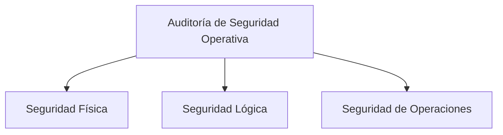

# Tipos Y Clases De Auditoría

## 1. Introducción a Los Tipos De Auditoría

Existen numerosos tipos de auditoría debido a que las organizaciones tienen diferentes:

- Necesidades de control
    
- Riesgos
    
- Requerimientos regulatorios
    
- Objetivos estratégicos

Cada tipo de auditoría se enfoca en **evaluar aspectos específicos de la organización**, como la seguridad, las finanzas, los procesos o el cumplimiento normativo.

### Definición

**Auditoría**  
Proceso sistemático de revisión y evaluación de actividades, procesos, sistemas o información con el objetivo de verificar su correcto funcionamiento, cumplimiento normativo y eficiencia.

---

## 2. Clasificación General De Las Auditorías

Los diferentes tipos de auditoría pueden clasificarse según su **propósito, alcance y quién la realiza**.

|Tipo de Auditoría|Objetivo Principal|
|---|---|
|Auditoría externa|Evaluación independiente realizada por un auditor externo|
|Auditoría interna|Evaluación realizada por personal interno|
|Auditoría operacional|Evaluar eficiencia y productividad de los procesos|
|Auditoría de software|Revisar calidad y funcionamiento del software|
|Auditoría de seguridad|Evaluar protección de sistemas y datos|
|Auditoría de cumplimiento|Verificar cumplimiento de normas o políticas|
|Auditoría pública|Supervisión de entidades públicas|
|Auditoría integral|Evaluación completa de la organización|
|Auditoría forense|Investigación de fraudes o delitos|
|Auditoría fiscal|Verificar cumplimiento de obligaciones tributarias|
|Auditoría financiera|Evaluación de estados financieros|
|Auditoría de recursos humanos|Evaluar gestión del talento|
|Auditoría ambiental|Evaluar impacto ambiental|

---

# 3. Auditoría Externa O Legal

## Definición

**Auditoría externa**  
Evaluación realizada por un **auditor independiente** que no pertenece a la organización.

## Objetivos

- Verificar información financiera
    
- Validar cumplimiento de normas
    
- Garantizar transparencia

## Características

|Característica|Descripción|
|---|---|
|Independencia|El auditor no pertenece a la empresa|
|Objetividad|Evaluación imparcial|
|Formalidad|Sigue normas profesionales|

---

# 4. Auditoría Interna

## Definición

**Auditoría interna**  
Proceso de evaluación realizado por **empleados de la propia organización** para revisar los procesos internos y el sistema de control.

## Objetivos

- Evaluar los métodos de operación
    
- Verificar cumplimiento de políticas
    
- Detectar fallos en procesos internos
    
- Mejorar el control interno

## Resultado

La auditoría interna genera un **informe dirigido a la dirección** que contiene:

- Hallazgos
    
- Recomendaciones
    
- Posibles soluciones

---

# 5. Auditoría Operacional

## Definición

**Auditoría operacional**  
Evaluación enfocada en **analizar la eficiencia y eficacia de los procesos organizacionales**.

## Objetivo

Mejorar:

- Productividad
    
- Gestión empresarial
    
- Uso de recursos

Puede set realizada por:

- Personal interno
    
- Consultores externos especializados

---

# 6. Auditoría De Software

## Definición

Revisión técnica de los **sistemas de software** para evaluar:

- Funcionamiento
    
- Calidad
    
- Seguridad
    
- Cumplimiento de requisitos

## Aspectos Evaluados

|Elemento|Evaluación|
|---|---|
|Código|Calidad y mantenimiento|
|Arquitectura|Diseño del sistema|
|Seguridad|Vulnerabilidades|
|Cumplimiento|Normas y estándares|

---

# 7. Auditoría De Seguridad Operativa O Técnica

Este tipo de auditoría se enfoca en **evaluar la seguridad de los sistemas informáticos y telecomunicaciones**.

## Alcance

Incluye:

- Sistemas informáticos
    
- Redes de telecomunicaciones
    
- Infraestructura tecnológica

## Components De la Seguridad

La auditoría de seguridad técnica evalúa tres áreas principales:

---

# 8. Seguridad Física

## Definición

Protección de los **activos físicos que procesan información**.

## Elementos Protegidos

- Hardware
    
- Infraestructura
    
- Centros de datos
    
- Equipos de comunicación

## Amenazas Evaluadas

|Tipo de amenaza|Ejemplos|
|---|---|
|Naturales|Incendios, terremotos, inundaciones|
|Industriales|Fallos eléctricos, accidentes|
|Físicas|Robo o sabotaje|

---

# 9. Seguridad Lógica

## Definición

Protección de la **información digital y de los sistemas que la procesan**.

## Áreas Evaluadas

|Área|Descripción|
|---|---|
|Control de accesos|Autenticación y autorización|
|Comunicaciones|Seguridad de redes|
|Arquitectura lógica|Diseño del sistema|
|Software|Seguridad del código|

## Ejemplos De Controles

- Autenticación multifactor
    
- Firewalls
    
- Sistemas de detección de intrusos

---

# 10. Seguridad De Operaciones

## Definición

Evaluación de las **operaciones de los centros de procesamiento de datos (CPD)**.

## Objetivos

Verificar que las operaciones:

- Sean eficaces
    
- Cumplan políticas
    
- Sigan procedimientos definidos

## Elementos Evaluados

|Área|Evaluación|
|---|---|
|Operación del CPD|Gestión de centros de datos|
|Procedimientos|Documentación operativa|
|Planes|Continuidad y recuperación|

---

# 11. Auditoría De Cumplimiento De Seguridad De la Información

## Definición

Auditoría enfocada en verificar que la organización **cumpla con estándares o normativas de seguridad**.

## Ejemplos De Estándares

|Estándar|Descripción|
|---|---|
|PCI DSS|Seguridad en pagos con tarjeta|
|ISO 27001|Gestión de seguridad de la información|
|Políticas internas|Normas internas de seguridad|

---

# 12. Auditoría Pública O Gubernamental

## Definición

Auditoría realizada por organismos del estado para supervisar **el uso de recursos públicos**.

## Objetivos

- Garantizar transparencia
    
- Controlar gestión pública
    
- Cumplir normativas legales

---

# 13. Auditoría Integral

## Definición

Auditoría que evalúa **todos los aspectos relevantes de la organización**.

## Áreas Evaluadas

- Información financiera
    
- Estructura organizacional
    
- Sistemas de control interno
    
- Cumplimiento legal
    
- Objetivos empresariales

## Resultado

Proporciona una **visión global del funcionamiento de la empresa**.

---

# 14. Auditoría Forense

## Definición

Auditoría especializada en **investigaciones criminales o fraudes**.

## Objetivos

- Detectar fraude
    
- Recolectar evidencias
    
- Apoyar procesos judiciales

## Ejemplos

- Fraude financiero
    
- Robo de información
    
- Manipulación de datos

---

# 15. Auditoría Fiscal

## Definición

Auditoría enfocada en verificar el **cumplimiento de las obligaciones tributarias**.

## Objetivos

- Verificar pago correcto de impuestos
    
- Cumplir legislación fiscal
    
- Detectar irregularidades fiscales

---

# 16. Auditoría Financiera

También llamada **auditoría contable**.

## Definición

Proceso de revisión de los **estados financieros de una empresa**.

## Objetivos

- Validar información contable
    
- Garantizar cumplimiento de normas contables
    
- Generar confianza en inversores y autoridades

---

# 17. Auditoría De Recursos Humanos

## Definición

Evaluación de la **gestión del personal dentro de la organización**.

## Áreas Evaluadas

|Área|Evaluación|
|---|---|
|Plantilla laboral|Cantidad y perfiles|
|Gestión del talento|Reclutamiento y desarrollo|
|Necesidades de personal|Planificación laboral|

---

# 18. Auditoría Ambiental

## Definición

Evaluación del **impacto ambiental de las actividades de la empresa**.

## Objetivos

- Reducir impacto ambiental
    
- Cumplir normativas ecológicas
    
- Mejorar sostenibilidad

## Aspectos Evaluados

|Aspecto|Evaluación|
|---|---|
|Emisiones|Contaminación|
|Uso de recursos|Agua y energía|
|Gestión de residuos|Manejo de desechos|

---

# 19. Información Adicional Relevante

En auditoría moderna se utilizan marcos de referencia para mejorar la evaluación:

|Marco|Uso|
|---|---|
|COBIT|Gobierno y control de TI|
|ISO 27001|Seguridad de la información|
|ITIL|Gestión de servicios TI|
|NIST|Gestión de riesgos y seguridad|

Estos estándares ayudan a **estructurar auditorías más consistentes y comparables**.

---

# 20. Resumen De Puntos Clave

- Existen múltiples tipos de auditoría según el objetivo y área evaluada.
    
- Las auditorías pueden set **internas o externas**.
    
- La auditoría operacional busca mejorar **eficiencia y productividad**.
    
- La auditoría de seguridad técnica incluye **seguridad física, lógica y operativa**.
    
- Las auditorías de cumplimiento verifican el respeto a **normas y estándares**.
    
- La auditoría forense se utilize para **investigaciones de fraude o delitos**.
    
- Las auditorías financieras y fiscales evalúan **aspectos económicos y tributarios**.
    
- La auditoría integral proporciona una **visión completa de la organización**.

---

## MicroTest

1. La auditoría informática es:
    
    - La respuesta: A. La revisión y la evaluación de los controles, sistemas y procedimientos de informática.
        
    - Justifacion: La auditoría informática se centra en analizar y evaluar los controles, sistemas y procedimientos relacionados con la informática dentro de una organización para asegurar su correcto funcionamiento, seguridad y eficiencia.
        
2. La auditoría de sistemas de información es:
    
    - La respuesta: B. Es una rama especializada de la auditoría que promueve y aplica conceptos de auditoría en el área de sistemas de información.
        
    - Justifacion: La auditoría de sistemas de información se considera una especialización de la auditoría que aplica metodologías y principios de auditoría al área de los sistemas de información para evaluar su gestión, controles y funcionamiento dentro de la organización.
        
3. El rol de la auditoría en el gobierno de tecnologías de la información (TI) consiste en:
    
    - La respuesta: D. Recomendar prácticas a la alta dirección, con el fin de mejorar la calidad y efectividad de las iniciativas del gobierno de TI implantadas y asegura el cumplimiento de las iniciativas de gobierno de TI.
        
    - Justifacion: La auditoría dentro del gobierno de TI tiene una función de evaluación y asesoramiento, proporcionando recomendaciones a la alta dirección para mejorar las iniciativas de gobierno de TI y verificar su cumplimiento, sin asumir funciones de gestión directa.