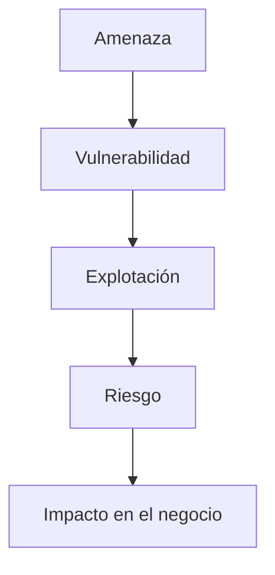

# Para Qué Sirve Una Auditoría Informática

## 1. Introducción

La **auditoría informática** es un proceso de evaluación que permite analizar el funcionamiento de los sistemas de información dentro de una organización.

Su propósito principal es **verificar si los sistemas tecnológicos operan de manera eficiente, segura y alineada con los objetivos del negocio**.

Las auditorías permiten detectar:

- Problemas técnicos
    
- Ineficiencias en el uso de recursos
    
- Riesgos de seguridad
    
- Incumplimientos normativos

Por esta razón, se consideran una **herramienta clave de control y mejora continua en las organizaciones**.

---

# 2. Objetivo De la Auditoría Informática

## Definición

**Auditoría informática**  
Proceso sistemático de **evaluación de sistemas de información, controles tecnológicos y procedimientos operativos**, con el objetivo de determinar su eficiencia, seguridad y cumplimiento con los objetivos organizacionales.

## Propósitos Principales

|Propósito|Descripción|
|---|---|
|Evaluar eficiencia|Determinar si los sistemas funcionan correctamente|
|Detectar problemas|Identificar fallos, vulnerabilidades o debilidades|
|Optimizar recursos|Verificar que los recursos tecnológicos se utilizan adecuadamente|
|Garantizar continuidad|Asegurar que los sistemas funcionen sin interrupciones|

---

# 3. Importancia De Las Auditorías De Seguridad

## Aumento De Riesgos Tecnológicos

En la actualidad, las organizaciones están **cada vez más expuestas a riesgos tecnológicos**, tales como:

- Ciberataques
    
- Fugas de información
    
- Fallos en sistemas
    
- Vulnerabilidades de seguridad

Por esta razón, es fundamental **identificar y gestionar los riesgos** mediante auditorías.

## Conceptos Clave

### Riesgo

Probabilidad de que una amenaza explote una vulnerabilidad y cause daño a la organización.

### Vulnerabilidad

Debilidad en un sistema que puede set explotada por una amenaza.

### Amenaza

Evento potential que puede causar daño a los sistemas o a la información.

### Relación Entre Estos Conceptos

---

# 4. Evaluación Del Gobierno De TI

La auditoría informática también evalúa **el gobierno de tecnologías de la información (TI)** dentro de la organización.

## Definición

**Gobierno de TI**  
Conjunto de procesos, estructuras y políticas que garantizan que la tecnología **apoye los objetivos estratégicos de la organización**.

## Aspectos Evaluados En El Gobierno De TI

|Aspecto evaluado|Descripción|
|---|---|
|Alineación estratégica|Verificar que TI esté alineada con la misión, visión y objetivos de la empresa|
|Eficiencia y eficacia|Evaluar si TI cumple con los objetivos del negocio|
|Cumplimiento legal|Verificar el cumplimiento de leyes y normativas|
|Seguridad|Evaluar controles de seguridad implementados|
|Control interno|Analizar el entorno de control tecnológico|

---

# 5. Evaluación De Riesgos En TI

La auditoría informática analiza los **riesgos inherentes dentro de los sistemas de TI**.

## Elementos Evaluados

|Elemento|Descripción|
|---|---|
|Riesgos inherentes|Riesgos propios de la operación de TI|
|Probabilidad|Posibilidad de que ocurra un incidente|
|Impacto|Consecuencias para el negocio|
|Controles|Medidas para mitigar riesgos|

### Proceso De Evaluación De Riesgos

---

# 6. Cumplimiento Normativo Y Legal

Las auditorías informáticas también verifican si los sistemas **cumplen con normativas y regulaciones aplicables**.

## Objetivo

Garantizar que la organización opere **dentro del marco legal y regulatorio** correspondiente a su sector.

## Ejemplos De Normativas Relacionadas Con TI

|Norma|Propósito|
|---|---|
|ISO 27001|Gestión de seguridad de la información|
|GDPR|Protección de datos personales|
|PCI-DSS|Seguridad en transacciones con tarjetas de pago|
|COBIT|Marco de gobierno y gestión de TI|

## Importancia Del Cumplimiento

El incumplimiento puede provocar:

- Sanciones legales
    
- Pérdida de reputación
    
- Pérdidas económicas
    
- Riesgos operativos

---

# 7. Beneficios De la Auditoría Informática

|Beneficio|Descripción|
|---|---|
|Mejora la seguridad|Identifica vulnerabilidades y fortalece controles|
|Optimiza procesos|Detecta ineficiencias en sistemas|
|Reduce riesgos|Permite gestionar amenazas tecnológicas|
|Apoya la toma de decisiones|Proporciona información objetiva a la dirección|
|Garantiza cumplimiento|Verifica cumplimiento legal y normativo|

---

# 8. Información Adicional Relevante

En auditoría informática se utilizan diversos **marcos y estándares internacionales**, entre ellos:

- **COBIT** (Control Objectives for Information and Related Technologies): marco para gobierno de TI.
    
- **ISO 27001**: estándar internacional de gestión de seguridad de la información.
    
- **ITIL**: buenas prácticas para gestión de servicios de TI.

Estos marcos ayudan a **estructurar las auditorías y mejorar los controles organizacionales**.

---

# 9. Resumen De Puntos Clave

- La auditoría informática permite evaluar la **eficiencia, seguridad y funcionamiento de los sistemas de información**.
    
- Ayuda a **identificar riesgos, vulnerabilidades y problemas operativos**.
    
- Es una herramienta fundamental para **gestionar riesgos tecnológicos**.
    
- Evalúa el **gobierno de TI y su alineación con los objetivos del negocio**.
    
- Analiza **riesgos inherentes, impacto y probabilidad de incidentes**.
    
- Verifica el **cumplimiento de normativas legales y estándares de seguridad**.
    
- Permite mejorar los sistemas tecnológicos y fortalecer los controles internos.

---

## MicroTest

1. Las organizaciones actualmente están más expuestas al riesgo por las siguientes razones:
    
    - La respuesta: D. Todas las anteriores.
        
    - Justifacion: Actualmente las organizaciones necesitan acceder a la información desde cualquier dispositivo, en cualquier memento y desde cualquier localización. Esta accesibilidad aumenta la superficie de exposición a riesgos tecnológicos y de seguridad, lo que incrementa la probabilidad de amenazas y vulnerabilidades.
        
2. ¿Cuál es la razón de la existencia de la función de auditoría de sistemas?
    
    - La respuesta: D. Todas las anteriores son verdaderas.
        
    - Justifacion: La auditoría de sistemas existe porque la información se ha convertido en un recurso crítico para las organizaciones, los riesgos tecnológicos aumentan constantemente y el advance tecnológico genera nuevos sistemas, amenazas y complejidades que requieren supervisión y control.
        
3. ¿Cuál de los siguientes motivos es más importante para justificar la revisión periódica del proceso de planificación de la auditoría?
    
    - La respuesta: A. Considerar los cambios en el entorno de riesgo.
        
    - Justifacion: Los riesgos tecnológicos y del negocio cambian constantemente debido a nuevas tecnologías, amenazas y cambios organizacionales. Por ello, es fundamental revisar periódicamente la planificación de auditoría para adaptarse a estos cambios y evaluar los riesgos actuales.

## Saber Mas

https://isaudit101.wordpress.com/chapter_i/