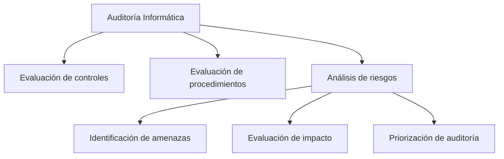
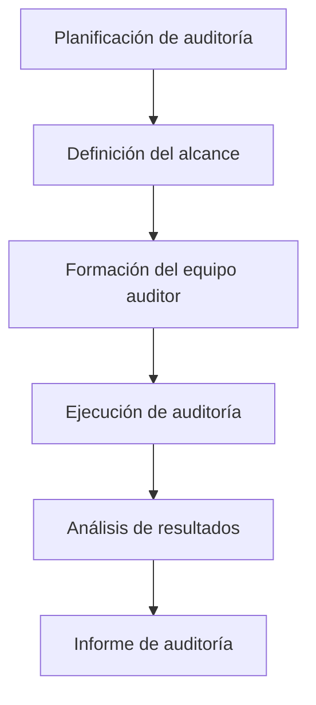

# Auditoría Informática: Funciones Y Objetivos

## 1. Introducción a la Auditoría Informática

La **auditoría informática** es un proceso sistemático cuyo objetivo es **evaluar y comprobar los controles y procedimientos de los sistemas de información** en momentos específicos del tiempo, utilizando **metodologías estructuradas de auditoría**.

### Objetivo Principal

Evaluar si los **controles y procedimientos informáticos** funcionan correctamente y cumplen con estándares establecidos de seguridad, confiabilidad y gestión.

### Elementos Clave Que Se Auditan

- Controles de seguridad
    
- Procedimientos operativos
    
- Infraestructura tecnológica
    
- Sistemas de información
    
- Procesos de gestión de TI

### Importancia De Las Metodologías

El uso de metodologías permite que **diferentes equipos de auditoría obtengan resultados consistentes al analizar un mismo sistema**.

Una de las más utilizadas es:

**Auditoría basada en riesgos**

Se enfoca en analizar primero los **activos y procesos con mayor impacto o probabilidad de riesgo**.

---

# 2. Áreas Que Se Auditan En Un Sistema De Información

La auditoría informática evalúa diversos components relacionados con la **seguridad y operación de los sistemas**.

## 2.1 Organización De la Seguridad

Se analiza **quién es responsible de cada función dentro del sistema de información**.

### Aspectos Evaluados

- Definición de roles
    
- Responsabilidades de seguridad
    
- Administradores de sistemas
    
- Responsables de seguridad informática

### Objetivo

Garantizar que exista **responsabilidad clara en la gestión de seguridad**.

---

## 2.2 Seguridad Física

La auditoría también evalúa la seguridad del **Centro de Procesamiento de Datos (CPD)**.

### Controles Revisados

|Control|Descripción|
|---|---|
|Sistemas anti intrusión|Detectan accesos físicos no autorizados|
|Protección contra incendios|Sistemas de detección y supresión de fuego|
|Energía eléctrica redundante|Uso de UPS o sistemas de alimentación ininterrumpida|
|Climatización del CPD|Control de temperatura y humedad|

Estos controles garantizan la **disponibilidad y protección del hardware crítico**.

---

## 2.3 Seguridad En la Operación Del Sistema

Se evalúan los **procedimientos operativos del área de TI**.

### Ejemplo: Procedimientos De Backup

No solo se revisa si existen **copias de seguridad**, sino también si funcionan correctamente.

Proceso típico de auditoría:

1. Verificar la existencia del procedimiento de backup.
    
2. Solicitar la ejecución de un backup.
    
3. Solicitar una restauración del backup.
    
4. Validar que la recuperación sea exitosa.

Esto permite comprobar que el sistema puede **recuperarse ante pérdida de información**.

---

## 2.4 Seguridad De Sistemas Y Aplicaciones

La auditoría analiza diferentes niveles del software.

### Components Auditados

|Componente|Qué se revisa|
|---|---|
|Sistemas operativos|Configuración y vulnerabilidades|
|Aplicaciones|Seguridad funcional|
|Código fuente|Vulnerabilidades y malas prácticas|
|Configuración del sistema|Permisos y controles|

El **código fuente** es uno de los elementos más importantes a revisar porque permite identificar vulnerabilidades directamente en la lógica del programa.

---

## 2.5 Seguridad De Red

Se revisan las **vías de acceso al sistema**.

### Elementos Evaluados

- Conexión a internet
    
- Puertos abiertos
    
- Redes WiFi
    
- Firewalls
    
- Sistemas de acceso remoto

Un hallazgo frecuente en auditorías es la presencia de **redes WiFi no autorizadas** conectadas a la infraestructura corporativa.

---

## 2.6 Continuidad Del Negocio

Se analiza la capacidad de la organización para **recuperarse ante desastres**.

### Planes Evaluados

- Plan de recuperación ante desastres (DRP)
    
- Plan de continuidad del negocio (BCP)

### Tipos De Pruebas

|Tipo de prueba|Descripción|
|---|---|
|Simulación|Escenario hipotético|
|Prueba parcial|Ejecución de algunos procesos|
|Prueba real|Activación completa del plan|

Las pruebas reales son las más complejas pero las **más efectivas para validar la capacidad de recuperación**.

---

## 2.7 Integridad De Los Datos

Se revisa que los datos:

- No hayan sido modificados sin autorización
    
- No hayan sido eliminados
    
- No hayan sido alterados

Esto garantiza la **confiabilidad de la información dentro del sistema**.

---

# 3. Proceso De Una Auditoría Informática

El auditor sigue un proceso estructurado para realizar la auditoría.

## 3.1 Planificación

Se define el **alcance de la auditoría**.

### Aspectos Clave

- Sistemas a auditar
    
- Número de sistemas
    
- Tecnologías involucradas
    
- Recursos necesarios

---

## 3.2 Formación Del Equipo De Auditoría

El equipo debe tener **habilidades específicas según el tipo de sistema evaluado**.

Ejemplos:

|Tipo de auditoría|Especialista necesario|
|---|---|
|Redes WiFi|Especialista en seguridad inalámbrica|
|Aplicaciones web|Especialista en seguridad web|
|Infraestructura|Administrador de sistemas|

---

## 3.3 Ejecución De la Auditoría

Se analizan:

- Configuraciones
    
- Controles
    
- Procesos
    
- Evidencias de seguridad

Esta fase es donde se **identifican vulnerabilidades y deficiencias**.

---

## 3.4 Informe De Auditoría

El resultado final de la auditoría es un **informe formal** dirigido a la dirección.

### Partes Del Informe

|Sección|Contenido|
|---|---|
|Resumen ejecutivo|Explicación de riesgos en lenguaje de negocio|
|Hallazgos|Problemas encontrados|
|Evidencias|Pruebas que respaldan el hallazgo|
|Recomendaciones|Acciones correctivas|

### Importancia Del Resumen Ejecutivo

El resumen ejecutivo debe explicar los problemas **en términos de riesgo empresarial**, no en términos técnicos.

Ejemplo:

|Forma incorrecta|Forma correcta|
|---|---|
|Vulnerabilidad XSS|Riesgo de robo de información de clientes|

---

# 4. Funciones Del Auditor Informático

Un auditor informático puede realizar diversas actividades dentro de una organización.

## Funciones Principales

|Función|Descripción|
|---|---|
|Revisar seguridad de diseños|Evaluar la seguridad antes de implementar sistemas|
|Analizar controles|Validar políticas y mecanismos de seguridad|
|Evaluar sistemas|Analizar eficacia y confiabilidad|
|Apoyar auditorías financieras|Analizar datos informáticos|
|Verificar cumplimiento|Revisar estándares y procedimientos|

---

# 5. Código Ético Del Auditor Informático

El auditor debe actuar bajo **principios éticos profesionales**.

## Principios Fundamentales

|Principio|Descripción|
|---|---|
|Objetividad|No permitir influencias externas|
|Rigor professional|Aplicar metodologías correctamente|
|Confidencialidad|Proteger la información obtenida|
|Integridad|Actuar con honestidad|
|Competencia professional|Mantener conocimientos actualizados|

## Riesgo Común En Auditorías Internas

Un auditor interno puede desarrollar **relaciones personales con el personal auditado**, lo cual puede afectar su objetividad.

---

# 6. Gestión De Evidencias

Durante una auditoría se recopilan **evidencias**.

Estas pueden set:

- configuraciones
    
- registros del sistema
    
- logs
    
- capturas de evidencia
    
- documentación

Todas las evidencias deben mantenerse **confidenciales** porque una filtración puede causar **perjuicios a la organización**.

---

# Resumen De Puntos Clave

- La auditoría informática evalúa **controles y procedimientos de sistemas de información**.
    
- Se utilizan **metodologías estructuradas**, como la auditoría basada en riesgos.
    
- Se auditan múltiples áreas:
    
    - organización de seguridad
        
    - seguridad física
        
    - operación del sistema
        
    - aplicaciones y código fuente
        
    - redes
        
    - continuidad del negocio
        
    - integridad de datos.
        
- El proceso de auditoría incluye **planificación, ejecución y generación de informes**.
    
- El **resumen ejecutivo** del informe debe explicar los problemas en **lenguaje de negocio**.
    
- El auditor debe seguir principios éticos como **objetividad, confidencialidad y rigor professional**.

---

## MicroTest

1. Un auditor de sistema de información (SI) que participó en el diseño del plan de continuidad del negocio (BCP) de una empresa ha sido asignado para auditar el plan. El auditor de SI debiera:
    
    - La respuesta: D. Comunicar la posibilidad de conflicto de interés a la gerencia antes de comenzar la asignación.
        
    - Justificación: La independencia y objetividad son principios fundamentales de la auditoría. Si el auditor participó en el diseño del BCP, existe un possible conflicto de interés. Por ello, debe comunicarlo a la gerencia antes de iniciar la auditoría para que se evalúe la situación y se mantenga la transparencia del proceso.
        
2. Un auditor de sistemas de información debe asegurar que las medidas de desempeño del gobierno de TI:
    
    - La respuesta: D. Evalúen las actividades de los comités de supervisión de TI.
        
    - Justificación: En el gobierno de TI es importante que las métricas permitan evaluar la efectividad de los mecanismos de supervisión y control, incluyendo los comités responsables del gobierno de TI. Estas medidas ayudan a verificar si las estructuras de gobierno están funcionando correctamente y cumpliendo su función de supervisión.
        
3. ¿Cuál de estos elementos no entra dentro de los objetivos específicos de la auditoria de sistemas?
    
    - La respuesta: B. Identificar faltas del personal a su puesto de trabajo.
        
    - Justificación: La auditoría de sistemas se centra en evaluar controles, seguridad, eficiencia y uso adecuado de los recursos informáticos, incluyendo bases de datos, metodologías y procesos. El control de asistencia del personal es una función administrativa de recursos humanos y no forma parte de los objetivos de una auditoría de sistemas.