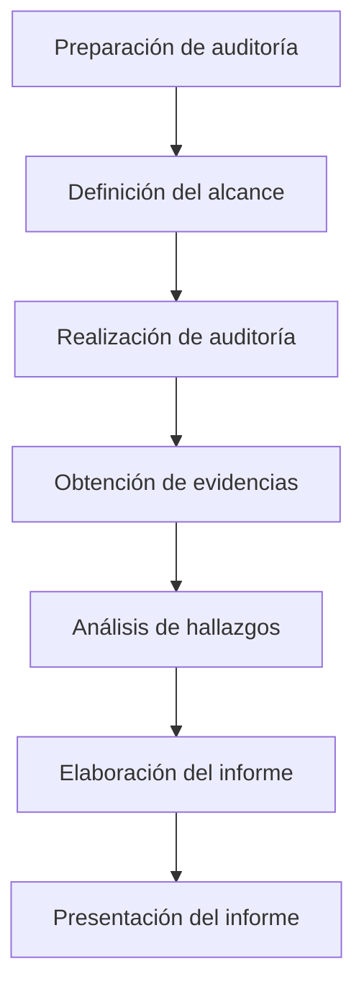

# Proceso De Auditoría De Sistemas

## 1. Introducción Al Proceso De Auditoría De Sistemas

La **auditoría de sistemas** es un proceso estructurado que permite evaluar los controles, procedimientos y mecanismos implementados en los sistemas de información de una organización.

El proceso parte de un principio fundamental:

**Identificar los riesgos de la organización para luego establecer controles internos que permitan mitigarlos.**

La auditoría busca determinar si dichos controles:

- Existen
    
- Funcionan correctamente
    
- Son eficaces para reducir riesgos

---

## 2. Control Interno En Una Organización

### Definición

El **control interno** es el conjunto de:

- Planes
    
- Métodos
    
- Procedimientos
    
- Controles

implementados por una organización para garantizar el funcionamiento adecuado del negocio.

### Objetivos Del Control Interno

|Objetivo|Descripción|
|---|---|
|Información financiera confiable|Garantizar que los datos financieros sean correctos y seguros|
|Salvaguarda de activos|Proteger los recursos de la organización|
|Eficiencia operativa|Asegurar que las operaciones se realicen de manera eficiente|

En el ámbito de **ciberseguridad**, el auditor participa principalmente en la **protección de los activos y sistemas de información**.

---

## 3. Riesgos En El Control Interno

Incluso los controles diseñados para mitigar riesgos pueden tener **riesgos asociados**.

### Tipos De Riesgo Relacionados Con Controles

|Tipo de riesgo|Descripción|
|---|---|
|Riesgo inherente|Riesgo natural presente en un proceso o sistema|
|Riesgo de control|Riesgo de que un control interno no funcione correctamente|
|Riesgo de detección|Riesgo de que la auditoría no detecte un problema existente|

El **riesgo de detección** es especialmente importante para los auditores, ya que implica que el proceso de auditoría podría no identificar una debilidad existente.

---

## 4. Control Interno Informático

El **control interno informático** consiste en los controles implementados específicamente dentro del área de tecnologías de información.

### Áreas Donde Se Aplican Controles Informáticos

- Desarrollo de sistemas
    
- Operación de sistemas
    
- Procesamiento de información
    
- Seguridad de sistemas

Estos controles garantizan que los sistemas informáticos operen de acuerdo con las políticas y estándares definidos por la organización.

---

## 5. Objetivos Del Control Informático

Los **objetivos de control informático** buscan asegurar que las actividades de los sistemas de información se realicen de forma adecuada.

### Objetivos Principales

- Cumplimiento de procedimientos establecidos
    
- Cumplimiento de estándares de seguridad
    
- Uso eficiente de recursos informáticos
    
- Funcionamiento eficaz de los sistemas de información

---

## 6. Tipos De Controles

Los controles pueden clasificarse según su propósito dentro de la organización.

|Tipo de control|Descripción|
|---|---|
|Controles internos|Protegen activos y garantizan la fiabilidad de la información|
|Controles administrativos|Mejoran la eficiencia operativa|
|Controles operacionales|Supervisan actividades diarias del sistema|

Ejemplo:

Un control de seguridad puede consistir en **políticas de acceso a aplicaciones críticas** para proteger datos sensibles.

---

## 7. Hallazgos En Una Auditoría

Los **hallazgos** son debilidades o problemas detectados durante el proceso de auditoría.

### Definición

Un **hallazgo de auditoría** es una situación donde la realidad observada no cumple con un criterio o norma establecida.

### Atributos De Un Hallazgo

|Atributo|Descripción|
|---|---|
|Condición|Situación real encontrada durante la auditoría|
|Criterio|Cómo debería funcionar según normas o estándares|
|Causa|Motivo por el cual existe la diferencia|
|Efecto|Consecuencias para la organización|

### Elementos Adicionales Del Hallazgo

- Evidencia
    
- Opinión basada en evidencia
    
- Recomendaciones de mejora

Es importante destacar que **todas las conclusiones deben estar respaldadas por evidencias**.

---

## 8. Metodología General De Una Auditoría Informática

El proceso de auditoría sigue una metodología estructurada.

### 1. Preparación De la Auditoría

Incluye:

- Comprender el sistema a auditar
    
- Conocer procesos
    
- Definir el alcance

El **alcance** define:

- Sistemas a auditar
    
- Tecnologías involucradas
    
- Procedimientos evaluados

Una mala definición del alcance puede provocar **fallos en la auditoría**.

---

### 2. Realización De la Auditoría

Durante esta etapa se realizan:

- Entrevistas
    
- Revisión documental
    
- Análisis técnico
    
- Escaneos de seguridad

Ejemplo de herramientas utilizadas:

- **Nessus**
    
- **OpenVAS**

Estas herramientas permiten detectar **vulnerabilidades en sistemas y redes**.

---

### 3. Obtención De Evidencias

Las evidencias permiten demostrar si los controles funcionan correctamente.

Las evidencias deben set:

- **Suficientes**
    
- **Competentes**
    
- **Relevantes**

Toda conclusión del auditor debe estar **basada en evidencias verificables**.

---

## 9. Tipos De Pruebas En Auditoría

Para obtener evidencias se utilizan **pruebas de auditoría**.

### Pruebas De Cumplimiento

Verifican si un control:

- Existe
    
- Funciona
    
- Cumple su objetivo

Ejemplo:

Verificar si existe una política de contraseñas y si se aplica.

---

### Pruebas Sustantivas

Se aplican cuando las pruebas de cumplimiento no son suficientes.

Estas pruebas **profundizan en el análisis del control**.

Ejemplo:

Analizar registros de acceso para comprobar si las políticas de seguridad realmente se cumplen.

---

## 10. Informe De Auditoría

El **informe de auditoría** es el resultado final del proceso.

Debe incluir:

- Conclusiones
    
- Hallazgos
    
- Evidencias
    
- Recomendaciones
    
- Observaciones

### Estructura Del Informe

|Sección|Contenido|
|---|---|
|Resumen ejecutivo|Explicación para directivos|
|Hallazgos|Problemas detectados|
|Evidencias|Pruebas recopiladas|
|Recomendaciones|Soluciones propuestas|

El **resumen ejecutivo** es especialmente importante porque está dirigido a **directivos y alta gerencia**, por lo que debe traducir los problemas técnicos en **riesgos empresariales**.

Ejemplo:

En lugar de decir:

"Existe una vulnerabilidad XSS"

Se debe explicar:

"Existe un riesgo de robo de información de clientes."

---

## 11. Presentación Del Informe

El informe debe set presentado en una **reunión final con los auditados**.

Objetivos de esta reunión:

- Explicar resultados
    
- Resolver dudas
    
- Presentar recomendaciones
    
- Discutir acciones correctivas

---

## 12. Cadena De Custodia De Evidencias

Las evidencias deben set registradas y controladas adecuadamente.

Esto implica:

- Registro de acceso
    
- Control de almacenamiento
    
- Integridad de la evidencia

Aunque no es tan estricto como en **informática forense**, sigue siendo necesario garantizar la **integridad de las pruebas**.

---

## 13. Habilidades Del Auditor De Sistemas

El auditor debe combinar dos tipos de habilidades:

### Habilidades Técnicas

Ejemplos:

- Auditoría de redes
    
- Auditoría WiFi
    
- Auditoría de aplicaciones web
    
- Análisis de vulnerabilidades

### Habilidades De Comunicación

Debe set capaz de:

- Traducir problemas técnicos
    
- Explicar riesgos empresariales
    
- Comunicar resultados a directivos

Este es uno de los **retos más importantes de la auditoría de seguridad**.

---

# Resumen De Puntos Clave

- La auditoría de sistemas evalúa controles internos que mitigan riesgos en sistemas de información.
    
- El control interno busca proteger activos, garantizar información confiable y mejorar la eficiencia operativa.
    
- Los hallazgos representan debilidades detectadas durante la auditoría.
    
- Cada hallazgo incluye condición, criterio, causa y efecto.
    
- La auditoría sigue una metodología estructurada: preparación, ejecución, evidencias e informe.
    
- Las pruebas pueden set de cumplimiento o sustantivas.
    
- Todas las conclusiones deben basarse en evidencias verificables.
    
- El informe de auditoría debe traducir problemas técnicos en riesgos empresariales comprensibles para la gerencia.
    
- La comunicación efectiva es una habilidad esencial del auditor de sistemas.

## MicroTest

1. Una diferencia que pude hacerse entre una prueba de cumplimiento y una sustantiva es que la prueba de cumplimiento:
    
    - La respuesta: B. Controla, mientras la prueba sustantiva prueba los detalles.
        
    - Justifacion: Las pruebas de cumplimiento verifican si los controles existen y funcionan correctamente dentro del sistema. En cambio, las pruebas sustantivas profundizan más y analizan los detalles de la información o de las operaciones para comprobar directamente si los resultados o datos son correctos.
        
2. ¿Cuál de los siguientes procesos independientes permite conocer la presencia y eficacia de los controles de seguridad y privacidad y se utilize para determinar el cumplimiento por parte de la organización de los requisitos normativos y de gobernanza (política)?
    
    - La respuesta: B. Auditorías.
        
    - Justifacion: Las auditorías son procesos independientes y sistemáticos que evalúan la existencia, eficacia y cumplimiento de los controles de seguridad, privacidad y gobernanza. Su objetivo es verificar que la organización cumple con normativas, políticas y estándares establecidos.
        
3. El objetivo de todo control es la reducción de riesgo:
    
    - La respuesta: A. Reduciendo su probabilidad de ocurrencia o bien mitigando su impacto.
        
    - Justifacion: Los controles están diseñados para gestionar el riesgo, lo cual puede lograrse reduciendo la probabilidad de que un evento ocurra o disminuyendo el impacto en caso de que suceda. De esta forma se reduce el riesgo total asociado a una amenaza.