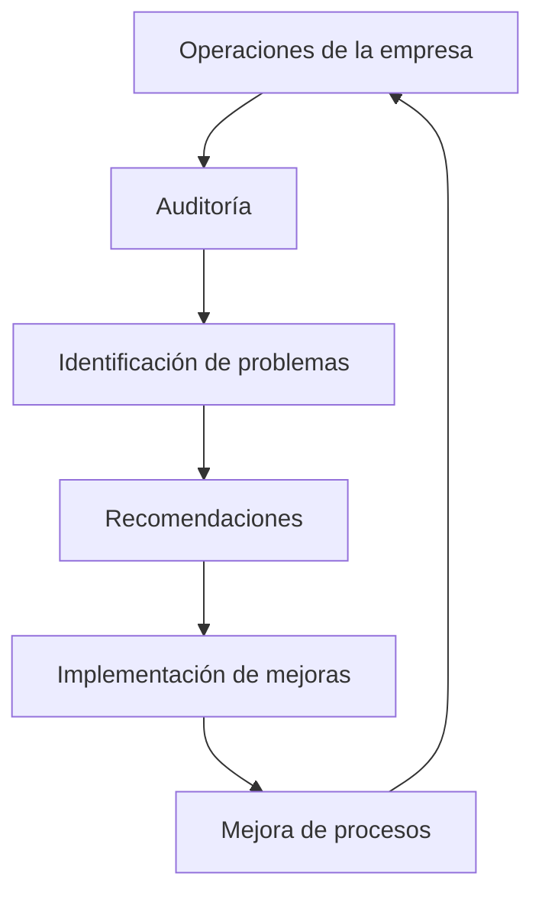

# Ventajas E Inconvenientes De Las Auditorías Informáticas

## 1. Introducción a Las Auditorías Informáticas

Las auditorías informáticas son procesos sistemáticos e independientes que permiten evaluar los sistemas de información de una organización, sus controles, su seguridad y su alineación con los objetivos del negocio.

### Definición De Auditoría Informática

La **auditoría informática** es un proceso de revisión y evaluación de los sistemas de información, controles y procedimientos tecnológicos de una organización con el objetivo de:

- Verificar su **eficacia**
    
- Analizar su **seguridad**
    
- Determinar su **cumplimiento normativo**
    
- Evaluar su **alineación con los objetivos empresariales**

Las auditorías permiten detectar riesgos, vulnerabilidades o ineficiencias en los sistemas informáticos.

---

# 2. Tipos De Auditoría

Las auditorías pueden clasificarse principalmente en:

|Tipo de auditoría|Descripción|
|---|---|
|Auditoría interna|Realizada por personal de la propia organización|
|Auditoría externa|Realizada por profesionales independientes de la empresa|

Cada tipo tiene ventajas y desventajas que afectan su objetividad, costos y alcance.

---

# 3. Ventajas De Las Auditorías Informáticas

Las auditorías ofrecen múltiples beneficios para la gestión y seguridad de la información en las organizaciones.

## 3.1 Evaluación Independiente De Los Sistemas

Una de las principales ventajas es que la auditoría proporciona a la dirección una **evaluación relativamente independiente** sobre la eficacia de los sistemas.

Esto permite a los directivos:

- Obtener una visión objetiva
    
- Identificar problemas ocultos
    
- Tomar decisiones basadas en evidencias

---

## 3.2 Evaluación Global Y Objetiva De la Empresa

Los departamentos suelen interpretar los problemas desde su propia perspectiva.  
La auditoría proporciona una **visión global de la organización**.

Esto permite:

- Identificar problemas interdepartamentales
    
- Detectar debilidades estructurales
    
- Evitar interpretaciones parciales

---

## 3.3 Mejor Conocimiento De Las Operaciones Empresariales

La auditoría genera un análisis profundo de:

- Procesos empresariales
    
- Sistemas informáticos
    
- Flujos de información
    
- Controles internos

Esto proporciona a la dirección una mejor comprensión del funcionamiento de la empresa.

---

## 3.4 Verificación De Datos E Información Financiera

Las auditorías permiten validar:

- La **integridad de la información**
    
- La **correcta gestión de los datos**
    
- La **fiabilidad de los sistemas que procesan información financiera**

Esto es clave para la toma de decisiones empresariales.

---

## 3.5 Reducción De Burocracia Y Rutinas Ineficientes

En organizaciones grandes es común que aparezcan:

- Procesos burocráticos
    
- Procedimientos innecesarios
    
- Actividades repetitivas

Las auditorías ayudan a detectar y eliminar estas ineficiencias.

---

## 3.6 Protección De Activos E Intereses De la Empresa

Las auditorías, especialmente las de seguridad informática, ayudan a proteger:

- Información sensible
    
- Infraestructura tecnológica
    
- Propiedad intellectual
    
- Datos financieros

Esto reduce el riesgo frente a amenazas internas y externas.

---

# 4. Inconvenientes De Las Auditorías Internas

Aunque las auditorías internas son fundamentales, presentan algunos inconvenientes.

## 4.1 Menor Grado De Independencia

Los auditores internos forman parte de la organización, por lo que pueden surgir problemas como:

- Relaciones personales con otros departamentos
    
- Influencias internas
    
- Possible pérdida de objetividad

Aunque el auditor debe mantener siempre su independencia professional.

---

## 4.2 Limitación De Responsabilidad

La responsabilidad del auditor interno está limitada a su **contrato laboral** dentro de la empresa.

Esto implica que su capacidad de actuación puede set más limitada que la de un auditor externo.

---

## 4.3 Conflictos Con El Personal Auditado

Las auditorías pueden generar tensiones con los empleados o departamentos auditados.

Esto ocurre porque:

- Se detectan errores o vulnerabilidades
    
- Los responsables pueden sentirse cuestionados
    
- Puede surgir resistencia al cambio

Un ejemplo típico ocurre en auditorías de seguridad cuando los desarrolladores cuestionan las vulnerabilidades detectadas.

---

# 5. Ventajas De Las Auditorías Externas

Las auditorías externas son realizadas por profesionales independientes, lo que aporta beneficios importantes.

## 5.1 Mayor Imparcialidad

El auditor externo no forma parte de la organización, lo que garantiza:

- Mayor objetividad
    
- Ausencia de conflictos internos
    
- Evaluación independiente

---

## 5.2 Apoyo Cuando Los Recursos Internos Son Insuficientes

Las empresas recurren a auditores externos cuando:

- No tienen especialistas internos
    
- Se require experiencia específica
    
- El alcance de la auditoría es muy amplio

---

## 5.3 Auditorías Para Certificaciones

Las auditorías externas son necesarias para certificaciones internacionales como:

- ISO 27001 (seguridad de la información)
    
- ISO 22301 (continuidad de negocio)
    
- ISO 9001 (gestión de calidad)

En estos casos, organismos certificadores autorizados realizan las auditorías.

---

# 6. Inconvenientes De Las Auditorías Externas

A pesar de su independencia, también presentan algunas desventajas.

## 6.1 Costes Elevados

Las auditorías externas pueden set costosas debido a:

- Honorarios profesionales
    
- Tiempo de auditoría
    
- Complejidad de los sistemas auditados

---

## 6.2 Menor Responsabilidad Operativa

El auditor externo no tiene responsabilidad directa en la operación diaria de la empresa.

Por lo tanto:

- Su rol se limita a emitir un dictamen
    
- No participa directamente en la implementación de mejoras

---

## 6.3 Falta De Seguimiento Continuo

Los auditores externos normalmente:

- Realizan auditorías periódicas
    
- Emiten recomendaciones
    
- No participan en el seguimiento continuo de las mejoras

Este seguimiento suele realizarlo el auditor interno.

---

# 7. Comparación Entre Auditoría Interna Y Externa

|Característica|Auditoría Interna|Auditoría Externa|
|---|---|---|
|Independencia|Menor|Mayor|
|Coste|Menor|Mayor|
|Seguimiento|Continuo|Limitado|
|Responsabilidad|Interna|Limitada|
|Objetividad|Puede verse afectada|Alta|
|Uso principal|Mejora continua|Certificación y verificación|

---

# 8. Relación Entre Auditoría Y Mejora Organizacional

Las auditorías forman parte del ciclo de mejora continua dentro de las organizaciones.

Este ciclo permite mejorar constantemente la seguridad, eficiencia y confiabilidad de los sistemas de información.

---

# 9. Información Adicional Relevante

En la práctica professional de auditoría informática se aplican estándares internacionales como:

|Estándar|Organización|Uso|
|---|---|---|
|ISO 27001|ISO|Gestión de seguridad de la información|
|COBIT|ISACA|Gobierno de TI|
|NIST Cybersecurity Framework|NIST|Gestión de riesgos de ciberseguridad|
|ISO 19011|ISO|Directrices para auditorías|

Estos estándares ayudan a estructurar auditorías de forma sistemática.

---

# 10. Resumen De Puntos Clave

- Las auditorías informáticas permiten evaluar la seguridad, eficacia y cumplimiento de los sistemas de información.
    
- Proporcionan una visión objetiva de los procesos tecnológicos de la organización.
    
- Sus principales ventajas incluyen evaluación independiente, mejora organizacional y protección de activos.
    
- Las auditorías internas permiten seguimiento continuo pero pueden tener menor independencia.
    
- Las auditorías externas ofrecen mayor imparcialidad pero suelen tener mayor coste.
    
- Ambas auditorías son complementarias y necesarias para una gestión adecuada de los sistemas de información.
    
- Son fundamentales para certificaciones internacionales y para mejorar la seguridad empresarial.

---

## MicroTest

1. El grado de objetividad es menor en las auditorias:
    
    - La respuesta: A. Internas.
        
    - Justifacion: Las auditorías internas son realizadas por personal que pertenece a la misma organización, lo que puede generar sesgos o conflictos de interés. En cambio, las auditorías externas son realizadas por terceros independientes, lo que aumenta su nivel de objetividad.
        
2. Que auditorias tienen más posibilidad de causar conflicto con el personal que sea afectado por la actuación de auditoría:
    
    - La respuesta: A. Internas.
        
    - Justifacion: En las auditorías internas los auditores trabajan dentro de la misma organización y evalúan directamente a compañeros o áreas internas. Esto puede generar tensiones o conflictos con el personal evaluado, ya que existe una relación laboral directa.
        
3. Dentro de la responsabilidad que tienen los auditores, ¿en qué tipo de auditoría tienen menos responsabilidad?
    
    - La respuesta: B. En las externas.
        
    - Justifacion: En las auditorías externas el auditor emite una opinión independiente sobre la organización, pero la responsabilidad directa sobre los procesos, controles y cumplimiento sigue siendo de la empresa auditada. En las auditorías internas, los auditores forman parte de la organización y tienen una responsabilidad más directa en la supervisión, mejora y seguimiento de los controles internos.