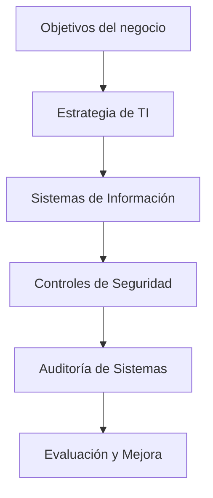
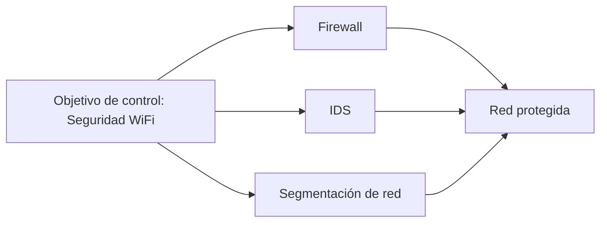
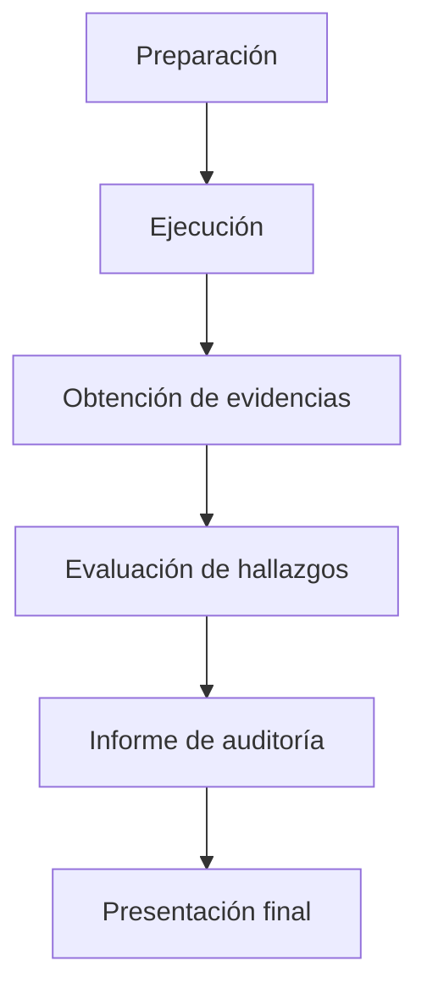

# Tema 6 — Introducción Al Concepto De Auditoría De Sistemas De Información

## 1. Fundamentos De la Auditoría De Sistemas De Información

### Definición

La **Auditoría de Sistemas de Información** es un proceso sistemático de evaluación cuyo objetivo es analizar los sistemas de información de una organización para verificar si:

- Funcionan de forma **eficaz y eficiente**
    
- **Protegen los activos de información**
    
- **Mitigan riesgos de seguridad**
    
- **Apoyan el cumplimiento de los objetivos del negocio**

### Objetivos Principales

|Objetivo|Descripción|
|---|---|
|Mejorar la eficacia|Asegurar que los procesos tecnológicos logran los resultados esperados|
|Mejorar la eficiencia|Garantizar el uso óptimo de los recursos tecnológicos|
|Apoyar objetivos de negocio|Alinear la tecnología con la estrategia empresarial|
|Reducir riesgos|Identificar y mitigar riesgos tecnológicos y de seguridad|

### Importancia De la Auditoría

Actualmente las organizaciones dependen cada vez más de las **tecnologías de información (TI)**. Esto genera:

- Mayor **complejidad tecnológica**
    
- Incremento de **riesgos de seguridad**
    
- Necesidad de **control y supervisión**

Por ello, la auditoría permite identificar riesgos y verificar que los controles implementados funcionan correctamente.

---

## 2. Concepto De Activo En Sistemas De Información

### Definición

Un **activo** es cualquier recurso que **aporta valor a la organización**.

### Ejemplos De Activos

|Tipo de activo|Ejemplos|
|---|---|
|Información|Bases de datos, documentos|
|Tecnología|Servidores, redes, aplicaciones|
|Personas|Conocimiento del personal|
|Procesos|Procedimientos operativos|

La auditoría busca proteger estos activos mediante **controles adecuados**.

---

## 3. Relación Entre TI Y Los Objetivos Estratégicos

Las Tecnologías de Información deben apoyar el **plan estratégico de la organización**.

### Plan De Sistemas De Información

Documento que define:

- Estrategia tecnológica
    
- Sistemas necesarios para el negocio
    
- Inversiones en tecnología
    
- Integración con la estrategia empresarial

### Relación Entre Estrategia, TI Y Auditoría

La auditoría verifica que los **controles implementados** realmente contribuyen a la seguridad y eficiencia del sistema.

---

## 4. Gobierno Corporativo Y Gobierno De TI

### Gobierno Corporativo

Conjunto de mecanismos mediante los cuales una organización es **dirigida y controlada**.

### Gobierno De TI

Subconjunto del gobierno corporativo que se enfoca en:

- Gestión de recursos tecnológicos
    
- Control de riesgos de TI
    
- Alineación con los objetivos del negocio

La auditoría informática tiene el rol de **evaluar la eficacia de los controles implementados dentro del gobierno de TI**.

---

## 5. Rol De la Auditoría Informática

La auditoría informática tiene como función principal:

- Evaluar **controles de seguridad**
    
- Analizar la **eficiencia de los controles**
    
- Verificar la **mitigación de riesgos**

### Ejemplo De Control De Seguridad

**Objetivo de control:** mejorar la seguridad de una red WiFi.

**Controles posibles:**

- Implementar **IDS (Intrusion Detection System)**
    
- Implementar **firewall**
    
- Segmentar la red para proteger la LAN

---

## 6. Proceso General De Una Auditoría De Sistemas

La auditoría sigue tres fases principales.

|Fase|Descripción|
|---|---|
|Preparación|Definición del alcance, planificación y objetivos|
|Ejecución|Recopilación de evidencias y evaluación de controles|
|Presentación|Elaboración y entrega del informe final|

### Flujo Del Proceso De Auditoría

---

## 7. Tipos De Auditoría

### Auditoría Interna

**Definición:**  
Auditoría realizada por personal de la propia organización.

**Ventajas**

- Mayor conocimiento del sistema
    
- Permite seguimiento de mejoras

**Desventajas**

- Possible pérdida de objetividad
    
- Relación cercana con los auditados

---

### Auditoría Externa

**Definición:**  
Auditoría realizada por una entidad independiente.

**Ventajas**

- Mayor objetividad
    
- Credibilidad ante terceros

**Desventajas**

- No suele realizar seguimiento de mejoras
    
- Coste económico

---

### Comparación

|Característica|Auditoría Interna|Auditoría Externa|
|---|---|---|
|Independencia|Menor|Mayor|
|Seguimiento de mejoras|Sí|No (salvo contrato adicional)|
|Conocimiento de la organización|Alto|Medio|
|Coste|Bajo|Alto|

---

## 8. Auditorías Y Certificaciones

En algunos casos es obligatorio realizar **auditorías externas**, por ejemplo en procesos de certificación.

### Ejemplo

Certificación **ISO 27001**

Esta norma establece requisitos para un **Sistema de Gestión de Seguridad de la Información (SGSI)**.

Las auditorías externas verifican el cumplimiento de estos requisitos.

---

## 9. Evidencias En Auditoría

### Definición

Las **evidencias** son los elementos que respaldan los hallazgos del auditor.

Para set válidas deben set:

|Característica|Descripción|
|---|---|
|Competentes|Relacionadas con el objetivo de auditoría|
|Suficientes|Cantidad adecuada para soportar conclusiones|

Una regla fundamental:

Todo lo que aparezca en el **informe de auditoría debe estar respaldado por evidencias**.

Si el auditor no tiene evidencia clara, **no debe incluir el hallazgo en el informe**.

---

## 10. Documentación De la Auditoría

Durante el proceso de auditoría se generan varios documentos.

|Documento|Descripción|
|---|---|
|Plan de auditoría|Define alcance, objetivos y recursos|
|Programa de auditoría|Detalla actividades específicas|
|Informe de auditoría|Documento final con hallazgos y recomendaciones|

---

## 11. El Informe De Auditoría

El **informe final** es el documento más importante del proceso.

Incluye:

- Hallazgos
    
- Evidencias
    
- Evaluación de controles
    
- Recomendaciones

### Sección Clave: Resumen Ejecutivo

El **resumen ejecutivo** es la parte más crítica del informe.

Su objetivo es:

- Traducir resultados técnicos a **lenguaje de negocio**
    
- Explicar **impacto para la organización**

Los directivos no necesitan detalles técnicos, sino saber:

- Qué problema existe
    
- Cómo afecta al negocio
    
- Qué acciones deben tomarse

### Reto Principal Del Auditor

Los auditores suelen set **altamente técnicos**, por lo que uno de los mayores desafíos es:

- Convertir **información técnica compleja** en **explicaciones claras para directivos**

---

## 12. Evaluación De Hallazgos

Los hallazgos se basan en:

1. Evidencias obtenidas
    
2. Análisis del auditor
    
3. Evaluación de controles existentes

Los hallazgos permiten identificar:

- Debilidades de seguridad
    
- Falta de controles
    
- Riesgos operativos

---

# Resumen De Puntos Clave

- La auditoría de sistemas de información evalúa la seguridad, eficiencia y eficacia de los sistemas tecnológicos.
    
- Su objetivo principal es **mejorar las operaciones y apoyar los objetivos del negocio**.
    
- Un **activo** es cualquier recurso que aporta valor a la organización.
    
- La auditoría evalúa **controles de seguridad** que mitigan riesgos tecnológicos.
    
- El proceso de auditoría incluye **preparación, ejecución y presentación de resultados**.
    
- Existen dos tipos principales de auditoría: **interna y externa**, cada una con ventajas y desventajas.
    
- Los hallazgos deben estar respaldados por **evidencias suficientes y competentes**.
    
- El documento más importante es el **informe de auditoría**, especialmente el **resumen ejecutivo**, que traduce información técnica para los directivos.

## MicroTest