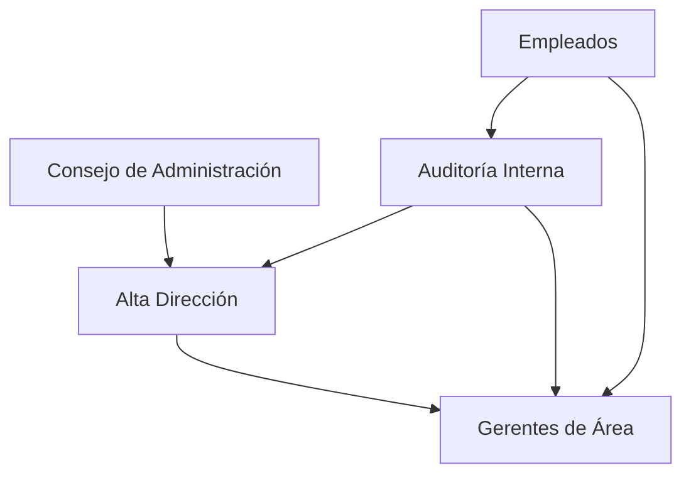
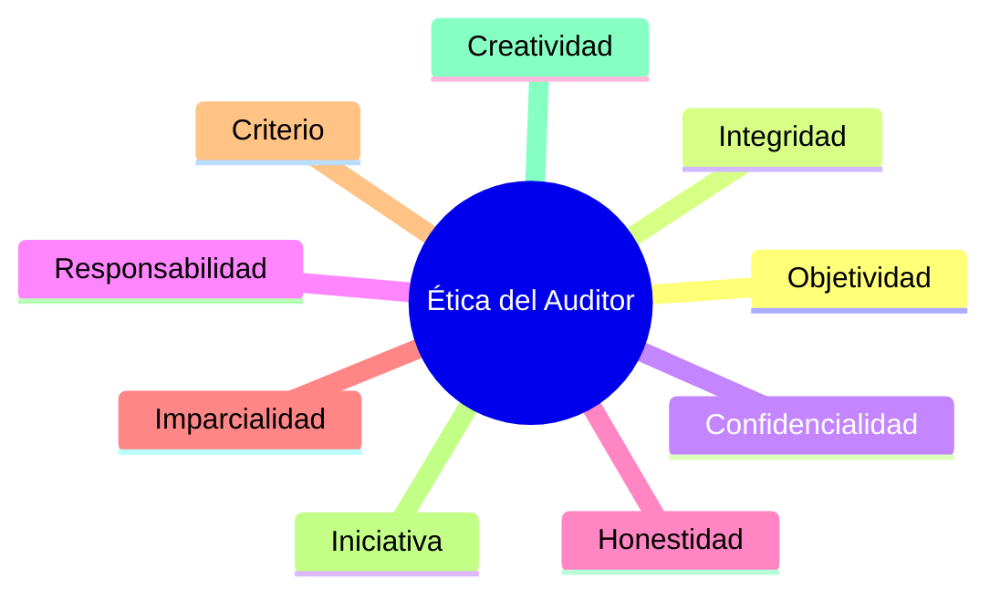

# Gestión De la Función De Auditoría

## 1. Definición De Auditoría Informática

### Concepto

La **auditoría informática** es el proceso de **recoger, agrupar y evaluar evidencias** para determinar si los sistemas de información:

- Salvaguardan los activos.
    
- Mantienen la integridad de los datos.
    
- Cumplen los objetivos de la organización.
    
- Utilizan los recursos de manera eficiente.

Esta definición fue propuesta por **Ron Weber**, uno de los principales referentes en auditoría informática.

### Elemento Central: Evidencia

El elemento más importante dentro de una auditoría es la **obtención de evidencias**.

**Evidencia**  
Información verificable que permite evaluar si los controles, procesos y sistemas funcionan correctamente.

### Components De la Auditoría Según Su Objetivo

|Área|Objetivo|
|---|---|
|Seguridad|Salvaguardar activos|
|Seguridad|Mantener la integridad de los datos|
|Gestión de sistemas|Cumplir los objetivos de la organización|
|Gestión de recursos|Utilizar eficientemente los recursos|

### Alcance De la Auditoría Informática

Una auditoría no debe enfocarse únicamente en aspectos técnicos.

Debe evaluar también:

- Gestión
    
- Planeación
    
- Organización
    
- Procesos administrativos

---

## 2. Importancia De la Auditoría De Sistemas De Información

La auditoría de sistemas es importante debido a varios factores en las organizaciones modernas.

### Principales Razones

|Factor|Descripción|
|---|---|
|Dependencia tecnológica|Las organizaciones dependen cada vez más de los sistemas de información|
|Mayor complejidad|Los sistemas tecnológicos son cada vez más complejos|
|Aumento de amenazas|Existen más riesgos de seguridad y ciberataques|
|Inversión tecnológica|Las organizaciones invierten grandes cantidades en tecnología|
|Cambios tecnológicos|Las tecnologías evolucionan rápidamente|

### Relación Con Los Objetivos Del Negocio

Los **sistemas de información soportan los procesos y objetivos del negocio**.

Organizaciones que no adoptan tecnologías de información corren riesgo de perder competitividad.

---

## 3. Función De la Auditoría

### Objetivo Principal

La función de auditoría busca asegurar que:

- Las tareas se realizan correctamente.
    
- Los objetivos organizacionales se cumplen.
    
- Se mantiene la **independencia** del auditor.
    
- Se mantiene la **competencia professional**.

### Independencia Del Auditor

La **independencia** es fundamental para garantizar que los resultados de la auditoría no estén influenciados por intereses externos.

Un auditor debe poder:

- Evaluar objetivamente.
    
- Resistir presiones internas.
    
- Mantener la integridad de sus informes.

---

## 4. Gestión De Recursos En Auditoría

En departamentos de auditoría es común que los auditores tengan **especializaciones**, aunque todos deben tener conocimientos generales.

### Estrategia De Trabajo

- Todos los auditores deben conocer varias áreas.
    
- Algunos pueden especializarse en temas específicos.
    
- Se recomienda trabajar **en pares** durante las auditorías.

### Beneficios De Trabajar En Pares

|Ventaja|Explicación|
|---|---|
|Mayor precisión|Dos auditores detectan más problemas|
|Reducción de errores|Se revisan mutuamente|
|Transferencia de conocimiento|Un auditor puede aprender del otro|
|Mayor objetividad|Se reduce el sesgo individual|

---

## 5. Competencia Técnica Del Auditor

Los auditores deben mantener una **competencia técnica constante**.

Esto se logra mediante:

- Cursos de formación
    
- Certificaciones
    
- Evaluaciones de desempeño
    
- Resolución de casos prácticos

### Plan De Capacitación Del Personal

Es importante implementar un **plan de capacitación del personal** que garantice que los auditores poseen las habilidades necesarias.

|Elemento|Propósito|
|---|---|
|Formación continua|Actualizar conocimientos|
|Certificaciones|Validar competencias|
|Evaluaciones|Medir desempeño|
|Casos prácticos|Aplicar conocimientos|

---

## 6. Ubicación Del Departamento De Auditoría

El departamento de auditoría debe tener una **posición jerárquica adecuada dentro de la organización**.

Idealmente debe **reportar directamente a la alta dirección**.

### Razón

Esto le permite:

- Tener autoridad
    
- Mantener independencia
    
- Evitar conflictos de interés

---

## 7. Funciones Del Departamento De Auditoría

El departamento de auditoría tiene múltiples funciones dentro de la organización.

### Funciones Principales

|Función|Descripción|
|---|---|
|Investigación|Evaluar procesos y controles|
|Control de objetivos|Verificar cumplimiento de metas|
|Evaluación de políticas|Revisar políticas organizacionales|
|Revisión organizacional|Analizar la estructura de la organización|
|Evaluación de carga de trabajo|Evitar sobrecarga del personal|
|Evaluación de recursos|Analizar eficiencia de recursos humanos y materiales|
|Evaluación de operaciones|Revisar procesos empresariales|
|Evaluación de controles|Analizar métodos de control|

### Gestión Del Trabajo Del Equipo

Una mala distribución del trabajo puede provocar:

- Desmotivación
    
- Burnout
    
- Rotación de personal

Por ello es importante **equilibrar la carga de trabajo**.

---

## 8. Responsabilidades En El Sistema De Control

La auditoría forma parte de un **sistema de control organizacional**.

### Actores Involucrados

|Actor|Responsabilidad|
|---|---|
|Alta dirección|Responsible final del sistema de control|
|Gerentes|Responsables de las áreas operativas|
|Consejo de administración|Define visión y estrategia|
|Auditoría interna|Supervisión del sistema de control|
|Empleados|Reportar desviaciones o irregularidades|

### Relación Del Sistema De Control

---

## 9. Roles En la Función De Auditoría

En un departamento de auditoría existen distintos niveles jerárquicos.

|Rol|Responsabilidad|
|---|---|
|Director de auditoría|Dirigir el departamento|
|Gerente de auditoría|Supervisar auditorías|
|Supervisor de auditoría|Coordinar equipos|
|Encargado de auditoría|Gestionar auditorías específicas|
|Auditor senior|Ejecutar auditorías complejas|
|Auditor junior|Apoyo en auditorías|

---

## 10. Estructura De la Auditoría Interna

La auditoría interna debe organizarse mediante una planificación adecuada.

### Elementos De Planificación

|Elemento|Descripción|
|---|---|
|Programación|Planificación de auditorías|
|Auditorías recurrentes|Auditorías periódicas|
|Auditorías eventuales|Auditorías por incidentes o emergencias|
|Alcance|Qué áreas serán auditadas|
|Recursos|Personal y herramientas disponibles|

Los planes pueden cambiar debido a:

- Incidentes
    
- Cambios organizacionales
    
- Prioridades de dirección

---

## 11. Habilidades Del Equipo Auditor

Los auditores deben poseer diversas habilidades profesionales.

### Conocimientos Requeridos

|Tipo de conocimiento|Ejemplo|
|---|---|
|Conocimiento organizacional|Procesos internos|
|Auditorías anteriores|Informes históricos|
|Casos prácticos|Experiencias reales|
|Estudios comparativos|Buenas prácticas de otras organizaciones|

---

## 12. Principios Éticos Del Auditor

El auditor debe cumplir con una series de valores y principios profesionales.

### Principales Valores

|Valor|Descripción|
|---|---|
|Objetividad|Evaluar hechos sin sesgos|
|Responsabilidad|Cumplir tareas correctamente|
|Integridad|Mantener principios ante presiones|
|Confidencialidad|Proteger la información|
|Compromiso|Cumplir obligaciones profesionales|
|Equilibrio|Interpretar correctamente los hechos|
|Honestidad|Actuar con transparencia|
|Institucionalidad|Respetar normas y ética|
|Criterio|Tomar decisiones equilibradas|
|Iniciativa|Capacidad de acción|
|Imparcialidad|Evitar conflictos personales|
|Creatividad|Innovar en métodos de auditoría|

### Relación De Principios Del Auditor

---

## Resumen De Puntos Clave

- La auditoría informática es el proceso de **recoger, agrupar y evaluar evidencias** sobre sistemas de información.
    
- Sus objetivos incluyen **proteger activos, garantizar integridad de datos, cumplir objetivos organizacionales y optimizar recursos**.
    
- La auditoría debe evaluar **aspectos técnicos, organizacionales y de gestión**.
    
- La **independencia del auditor** es fundamental para asegurar la objetividad.
    
- Los departamentos de auditoría requieren **capacitación continua y especialización**.
    
- La auditoría interna debe tener **independencia jerárquica y comunicación directa con la alta dirección**.
    
- Los auditores deben cumplir con **principios éticos como objetividad, integridad, confidencialidad e imparcialidad**.
    
- El trabajo en **equipos de auditoría (pares)** mejora la calidad de los resultados.

---

## MicroTest

1. Según Ron Weber, la auditoría de sistemas de información:
    
    - La respuesta: C. Es el proceso de recoger, agrupar y evaluar evidencias para determinar si un sistema informático salvaguarda los activos, mantiene la integridad de los datos, lleva a cabo los fines de la organización y utilize eficientemente los recursos.
        
    - Justifacion: Ron Weber define la auditoría informática como un proceso basado en la obtención y evaluación de evidencias para verificar que los sistemas de información protegen los activos, garantizan la integridad de los datos, cumplen los objetivos organizacionales y utilizan los recursos de forma eficiente.
        
2. ¿Por qué son importantes las auditorías de seguridad de sistemas de información?
    
    - La respuesta: D. Todas las anteriores son correctas.
        
    - Justifacion: Las auditorías de sistemas son importantes debido a la creciente dependencia de la información y de los sistemas que la gestionan, el alto costo de las inversiones tecnológicas actuales y futuras, y el incremento de vulnerabilidades y amenazas, incluidas las ciberamenazas.
        
3. El nivel donde deberá quedar la unidad departamental de auditoría interna reunirá las siguientes características:
    
    - La respuesta: D. Todas las anteriores son correctas.
        
    - Justifacion: El departamento de auditoría interna debe tener suficiente jerarquía para revisar cualquier área de la organización, realizar funciones relacionadas con dirección, control y coordinación, y contar con autoridad suficiente para evaluar adecuadamente a los demás departamentos.