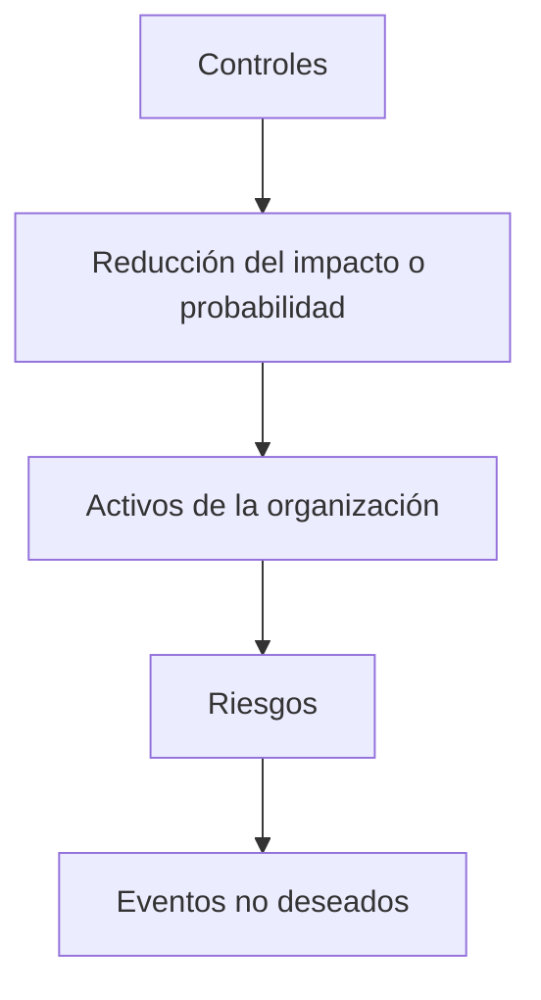
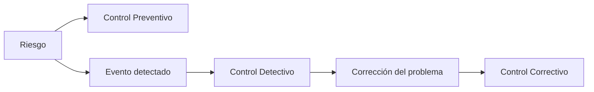

# Clasificación De Los Controles

## 1. Definición De Control

### Concepto

Un **control** es una acción, mecanismo o medida diseñada para **prevenir o reducir el impacto de eventos no deseados** que representan un riesgo para los activos de una organización.

En el contexto de seguridad y auditoría, los controles funcionan como **medidas de mitigación del riesgo**.

### Objetivo De Los Controles

Los controles buscan:

- Reducir la probabilidad de ocurrencia de incidentes.
    
- Reducir el impacto si un incidente ocurre.
    
- Proteger los activos de la organización.
    
- Apoyar el cumplimiento de objetivos de seguridad y negocio.

### Relación Entre Riesgo Y Controles

Los controles actúan como una **barrera de protección** frente a los riesgos.

---

## 2. Gestión Del Riesgo Y Eventos De Alto Impacto

La gestión moderna del riesgo reconoce que existen eventos llamados **“cisnes negros”**.

### Cisne Negro

Evento que tiene:

- **Muy baja probabilidad**
    
- **Impacto extremadamente alto**

Aunque estos eventos son poco frecuentes, pueden provocar **grandes daños organizacionales**.

Por esta razón, los controles deben considerar escenarios poco probables pero de gran impacto.

---

## 3. Aspectos a Evaluar En Los Controles

Durante una auditoría se deben analizar diversos aspectos relacionados con los controles.

### Actividades Principales

|Actividad|Descripción|
|---|---|
|Identificación|Detectar qué controles existen|
|Evaluación|Analizar su efectividad frente a riesgos|
|Revisión|Analizar su implementación y diseño|
|Planificación|Determinar cómo se aplicarán los controles|
|Definición de atributos|Determinar características y requisitos|

### Regla Fundamental De Auditoría De Controles

El auditor debe:

1. **Identificar los controles**
    
2. **Evaluar su efectividad**
    
3. **Revisar su implementación**

---

## 4. Qué Auditar

Los elementos que normalmente se auditan incluyen:

|Elemento|Motivo|
|---|---|
|Cumplimiento de requisitos legales|Verificar cumplimiento normativo|
|Sensibilidad al riesgo|Evaluar exposición a amenazas|
|Resultados de auditorías anteriores|Analizar problemas previous|

---

## 5. Cuándo Auditar

Las auditorías deben realizarse de manera **planificada y periódica**, pero también pueden ajustarse según las necesidades de la organización.

### Factores Para Definir El Memento De Auditoría

|Factor|Explicación|
|---|---|
|Prioridades de la dirección|La dirección puede modificar prioridades|
|Recursos disponibles|Personal y tiempo|
|Plan annual de auditoría|Planificación inicial|
|Cambios organizacionales|Eventos que requieren auditoría|

Los planes de auditoría deben **revisarse periódicamente**, ya que pueden cambiar.

---

## 6. Requisitos De la Información En Un Control

La información utilizada en los controles debe cumplir ciertas características.

### Características Clave

|Requisito|Descripción|
|---|---|
|Relevancia|Debe aportar valor al proceso de auditoría|
|Pertinencia|Debe estar relacionada con el control evaluado|
|Oportunidad|Debe estar disponible en el memento adecuado|
|Corrección|Debe set precisa|
|Consistencia|Debe mantenerse coherente en el tiempo|

### Seguridad De la Información En Los Controles

La información utilizada debe garantizar:

|Propiedad|Descripción|
|---|---|
|Confidencialidad|Solo accessible a personas autorizadas|
|Integridad|Información exacta y no alterada|
|Confiabilidad|Información adecuada para la toma de decisiones|

### Cadena De Custodia

La información debe mantenerse bajo **control y seguimiento**, evitando accesos no autorizados o manipulación.

---

## 7. Atributos De Un Control

Un control debe tener varios atributos que permitan comprender cómo funciona.

|Atributo|Descripción|
|---|---|
|Objetivo del control|Qué se pretende lograr|
|Descripción del control|Cómo funciona el control|
|Frecuencia|Con qué frecuencia se ejecuta|
|Forma de ejecución|Manual, automático o mixto|
|Monitorización|Cómo se supervisa el control|
|Reportes|Cómo se informa su resultado|

---

# Clasificación De Los Controles

## 8. Clasificación General De Controles

### Tipos De Controles

|Tipo|Descripción|
|---|---|
|Voluntarios|Diseñados por la organización para mejorar procesos|
|Obligatorios|Exigidos por regulaciones o leyes|
|Manuales|Ejecutados por personas|
|Automáticos|Ejecutados por sistemas informáticos|
|Generales|Aplican al entorno tecnológico|
|De aplicación|Aplican a software o aplicaciones específicas|

---

## 9. Clasificación Por Naturaleza

Esta es una de las clasificaciones más utilizadas en auditoría.

### Tipos De Controles Por Naturaleza

|Tipo|Función|
|---|---|
|Preventivos|Reducen la probabilidad de que ocurra un evento|
|Detectivos|Detectan eventos cuando ocurren|
|Correctivos|Corrigen los efectos de un incidente|
|Compensatorios|Sustituyen controles que no pueden implementarse|

### Relación Entre Controles

### Ejemplos

|Tipo|Ejemplo|
|---|---|
|Preventivo|Firewall o puerta de acceso restringido|
|Detectivo|Sistema de detección de intrusiones|
|Correctivo|IPS que bloquea ataques|
|Compensatorio|Revisión manual de registros|

---

## 10. Clasificación Por Aplicabilidad

### Tipos De Controles

|Tipo|Descripción|Ejemplo|
|---|---|---|
|Físicos|Protegen infraestructura física|Puertas de seguridad|
|Lógicos|Protegen sistemas informáticos|Antivirus, firewall|
|Administrativos|Políticas y procedimientos|Política de seguridad|

---

## 11. Clasificación Por Comportamiento

### Controles Defensivos

|Tipo|Función|
|---|---|
|Salvaguarda|Prevenir y disuadir amenazas|
|Contramedidas|Detener o corregir incidentes|

### Controles Ofensivos

|Tipo|Función|
|---|---|
|Pasivos|No violan controles defensivos|
|Activos|Pueden afectar sistemas si se usan incorrectamente|

---

## 12. Controles Generales De TI

Los controles generales de TI se aplican al entorno tecnológico completo.

### Tipos De Controles Generales

|Tipo|Descripción|
|---|---|
|Controles de operación|Controlan procesos del sistema|
|Controles de desarrollo|Regulan el desarrollo de sistemas|
|Controles de hardware y software|Protegen infraestructura tecnológica|

---

## 13. Controles De Aplicación

Los **controles de aplicación** garantizan que la información procesada por los sistemas sea correcta.

### Objetivos

- Validar entradas
    
- Procesar datos correctamente
    
- Garantizar integridad de datos
    
- Proteger información

### Components De Controles De Aplicación

|Control|Función|
|---|---|
|Autenticación|Verificar identidad|
|Control de acceso|Limitar acceso a recursos|
|Validación de datos|Verificar entradas|
|Manejo de errores|Registrar errores|
|Protección de datos|Evitar accesos indebidos|
|Seguridad de APIs|Proteger servicios web|
|Configuración|Garantizar configuraciones seguras|

---

## Resumen De Puntos Clave

- Un **control** es una medida que reduce riesgos en una organización.
    
- Los controles buscan **prevenir, detectar o corregir incidentes**.
    
- La auditoría evalúa la **identificación, evaluación y revisión de controles**.
    
- La información utilizada en auditoría debe set **relevante, oportuna, confiable y segura**.
    
- Los controles pueden clasificarse por:
    
    - **Naturaleza**
        
    - **Aplicabilidad**
        
    - **Comportamiento**
        
    - **Tipo de implementación**
        
- Los controles de TI incluyen **controles generales** y **controles de aplicación**.
    
- Los controles de aplicación aseguran **integridad y seguridad de los datos procesados por sistemas**.

---

## MicroTest

1. Según los controles, los más importantes son:
    
    - La respuesta: D. Todos son importantes, siempre dependen del riesgo, amenaza y la compañía.
        
    - Justifacion: No existe un tipo de control que sea siempre el más importante. La efectividad de un control depende del contexto del riesgo, las amenazas existentes y las necesidades de la organización. Los controles preventivos, detectivos y correctivos cumplen funciones complementarias dentro del sistema de seguridad.
        
2. Según el comportamiento de los controles, los podemos clasificar en:
    
    - La respuesta: D. Ninguna de las anteriores.
        
    - Justifacion: Según su comportamiento, los controles se clasifican en defensivos y ofensivos, incluyendo subcategorías como salvaguardas, contramedidas, controles pasivos y activos. Las opciones propuestas (voluntarios, manuales y generales) corresponden a otras clasificaciones de controles, no a la clasificación por comportamiento.
        
3. Un tipo de clasificación de controles puede set:
    
    - La respuesta: C. Controles generales (organización y operación, desarrollo de sistemas y documentación, hardware y software de sistemas), controles de aplicación (entrada de datos, tratamiento de datos, salida de datos) y controles por área.
        
    - Justifacion: Esta clasificación corresponde a la estructura típica en auditoría de sistemas, donde los controles se dividen en controles generales de TI (relacionados con la gestión del entorno tecnológico) y controles de aplicación (relacionados con el procesamiento de datos dentro de las aplicaciones), además de clasificaciones por área organizacional.