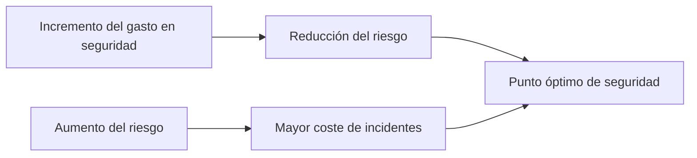
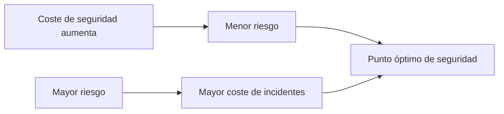

# La Regla De Oro En la Implementación De Controles De Seguridad

## 1. Introducción a la Regla De Oro

En auditoría y seguridad informática, la **regla de oro** se refiere al **principio de proporcionalidad entre riesgo, control y coste**.

Este principio establece que **los controles de seguridad deben implementarse considerando su costo en relación con el impacto del riesgo que pretenden mitigar**.

No todos los riesgos justifican inversiones elevadas en seguridad. Por ello, el objetivo es encontrar un **equilibrio entre el nivel de seguridad y el costo de los controles**.

---

## 2. Principio De Proporcionalidad

El principio de proporcionalidad implica que **la inversión en controles debe set razonable en relación con el riesgo existente**.

Para aplicar este principio se deben analizar tres elementos fundamentales:

|Elemento|Descripción|
|---|---|
|Riesgo|Posibilidad de que una amenaza explote una vulnerabilidad|
|Control|Medida implementada para reducir el riesgo|
|Coste|Recursos económicos necesarios para implementar y mantener el control|

El objetivo es **equilibrar estos tres elementos para lograr una seguridad eficiente**.

---

## 3. Costes Asociados a Los Controles

Cuando se implementa un control de seguridad, no solo se debe considerar el costo inicial. Existen varios tipos de costos asociados.

### Costes Del Control

|Tipo de coste|Descripción|
|---|---|
|Diseño|Coste de planificación y diseño del control|
|Implementación|Coste de instalar o desplegar el control|
|Monitorización|Coste de supervisar el funcionamiento del control|
|Mantenimiento|Coste de mantener y actualizar el control a lo largo del tiempo|

Estos costos deben evaluarse antes de decidir implementar un control.

---

## 4. Coste Del Riesgo

El **coste del riesgo** representa el impacto económico que tendría la materialización de una amenaza.

### Elementos Que Determinan El Coste Del Riesgo

|Elemento|Descripción|
|---|---|
|Amenaza|Evento potential que puede causar daño|
|Vulnerabilidad|Debilidad que puede set explotada|
|Impacto|Consecuencia económica o operativa para la organización|

Si una amenaza se materializa, el impacto puede incluir:

- Pérdidas económicas
    
- Interrupción de operaciones
    
- Daño reputacional
    
- Pérdida de información

---

## 5. Coste De No Implementar El Control

También se debe considerar el **coste potential de no implementar un control**.

Este costo corresponde a las **pérdidas que ocurrirían si el riesgo se materializa y no existe una medida que lo mitigue**.

Por lo tanto, la organización debe evaluar:

- El coste de implementar el control
    
- El coste de sufrir el incidente

---

## 6. Equilibrio Entre Riesgo, Coste Y Control

El objetivo es encontrar el **punto de equilibrio donde el costo de seguridad sea razonable frente al riesgo existente**.

### Relación Entre Coste De Seguridad Y Riesgo

En este punto óptimo:

- El costo de implementar controles es **proporcional al riesgo existente**
    
- El riesgo residual es **acceptable para la organización**

Este punto se denomina **nivel de riesgo aceptado**.

---

## 7. Curva De Costes De Seguridad Y Riesgo

El análisis económico de controles suele representarse mediante dos curvas:

|Curva|Significado|
|---|---|
|Coste de seguridad|Aumenta cuando se implementan más controles|
|Coste de incidentes|Disminuye cuando aumenta la seguridad|

El punto donde ambas curvas se intersectan representa el **equilibrio óptimo de seguridad**.

Este punto representa:

- **Nivel de riesgo acceptable**
    
- **Uso eficiente de recursos de seguridad**

---

## 8. Ejemplo Práctico De Aplicación

Supongamos el siguiente escenario:

|Elemento|Valor|
|---|---|
|Coste de un firewall avanzado|400,000 €|
|Impacto máximo de un incidente|40,000 €|

En este caso:

- El coste del control es **10 veces mayor que el impacto potential**.
    
- Por lo tanto, **no sería proporcional implementar ese control**.

Una solución más adecuada podría set:

|Alternativa|Coste aproximado|
|---|---|
|Firewall intermedio|50,000 €|
|Firewall open source (ej. pfSense)|Coste de configuración y soporte|

Esto permitiría **reducir el riesgo con un coste mucho más razonable**.

---

## 9. Importancia De la Regla De Oro En Auditoría

La regla de oro es fundamental en auditoría porque:

- Evita **sobrecostes en seguridad**
    
- Permite **optimizar recursos**
    
- Facilita la **toma de decisiones basada en riesgo**
    
- Ayuda a justificar inversiones en seguridad ante la dirección

Los auditores deben evaluar si los controles implementados **son proporcionales al riesgo real**.

---

## 10. Información Adicional Relevante

En gestión de riesgos, esta idea se relaciona con el concepto de:

### Riesgo Residual

El **riesgo residual** es el riesgo que permanece **después de aplicar controles de seguridad**.

Las organizaciones deben decidir cuál es el **nivel de riesgo residual que están dispuestas a aceptar**.

Este nivel depende de:

- Estrategia empresarial
    
- Regulaciones
    
- Tolerancia al riesgo de la organización

---

# Resumen De Puntos Clave

- La **regla de oro** establece que debe existir proporcionalidad entre **riesgo, control y coste**.
    
- Implementar controles demasiado costosos para riesgos pequeños **no es eficiente**.
    
- Se deben evaluar tres elementos principales:
    
    - Coste del control
        
    - Impacto del riesgo
        
    - Coste de no implementar el control
        
- Existe un **punto óptimo de seguridad** donde el coste de los controles es proporcional al riesgo.
    
- Este punto define el **nivel de riesgo acceptable para la organización**.
    
- La correcta aplicación de esta regla permite **optimizar inversiones en seguridad** y mejorar la gestión de riesgos.

---

## MicroTest

1. ¿Cuál es la regla de oro?
    
    - La respuesta: C. Riesgo vs. control vs. coste.
        
    - Justifacion: La regla de oro en seguridad y auditoría establece que debe existir un equilibrio o proporcionalidad entre el riesgo existente, el control que se implementa y el coste de dicho control. Un control solo debe implementarse cuando su coste es razonable en comparación con el impacto potential del riesgo que se quiere mitigar.
        
2. El objetivo de todo control es la reducción de riesgo:
    
    - La respuesta: A. Reduciendo su probabilidad de ocurrencia o bien mitigando su impacto.
        
    - Justifacion: Los controles de seguridad buscan reducir el riesgo de dos formas principales: disminuyendo la probabilidad de que ocurra una amenaza (controles preventivos) o reduciendo el impacto en caso de que el evento ocurra (controles correctivos o de mitigación).
        
3. Una empresa ha instalado recientemente un parche de seguridad que dejó bloqueado un servidor. Para minimizar la probabilidad que vuelva a ocurrir este hecho, el auditor debe:
    
    - La respuesta: D. Asegurar que se haya implantado en la organización un buen proceso de administración de cambios.
        
    - Justifacion: El problema no es solo el parche, sino la falta de un proceso adecuado de gestión de cambios. Un proceso formal de administración de cambios incluye pruebas en entornos de prueba, evaluación de impacto, aprobación y planificación antes de implementar cambios en producción, lo que reduce el riesgo de fallos como el ocurrido.