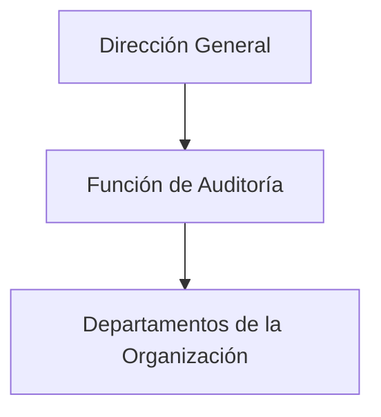
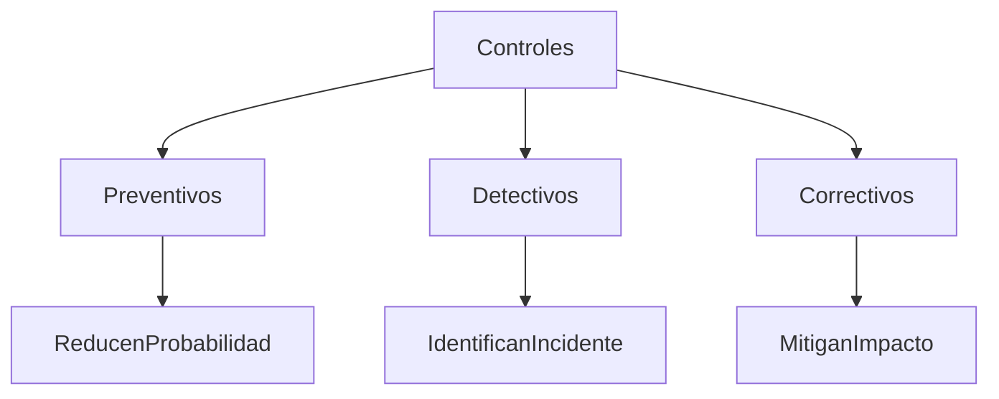
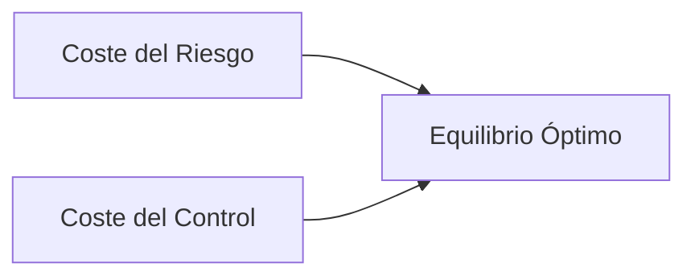

# Tema 7 — Gobierno Y Gestión De la Función De Auditoría

## 1. Gobierno Y Gestión De la Función De Auditoría

La **función de auditoría** dentro de una organización tiene como objetivo evaluar sistemas, procesos y controles para asegurar que funcionen correctamente y que los riesgos estén gestionados de forma adecuada.

La gestión de la auditoría implica principalmente:

- Organización del equipo de auditoría
    
- Planificación de auditorías
    
- Ejecución de auditorías
    
- Elaboración de informes y recomendaciones
    
- Seguimiento de las mejoras propuestas

Un aspecto clave es que la auditoría **debe estar cercana a la dirección de la organización**. Esto asegura que:

- Los resultados tengan impacto real.
    
- Las recomendaciones se implementen.
    
- Los informes no sean ignorados.

Si la auditoría no tiene suficiente relevancia organizacional, los informes pueden terminar **sin aplicarse**, lo que con el tiempo puede provocar problemas de seguridad o gestión.

---

## 2. Recursos De la Función De Auditoría

La auditoría se basa principalmente en la **gestión de personas**, pero también require recursos tecnológicos especializados.

### 2.1 Recursos Humanos

Los auditores son el recurso más importante del proceso de auditoría.

La organización debe gestionar adecuadamente:

- Selección del personal
    
- Especialización
    
- Experiencia técnica
    
- Capacidad de análisis

### 2.2 Recursos Materiales

Los auditores suelen utilizar equipos informáticos especializados con características avanzadas.

Características comunes del equipo de auditoría:

- Portátiles de alto rendimiento
    
- Gran capacidad de memoria (ejemplo: 32 GB de RAM)
    
- Capacidad para ejecutar múltiples máquinas virtuales

Estas máquinas virtuales permiten utilizar diferentes sistemas operativos y herramientas de auditoría sin comprometer el equipo principal.

---

## 3. Entornos De Trabajo Para Auditoría Técnica

Los auditores suelen trabajar con diferentes entornos virtualizados para realizar pruebas de seguridad.

### Ejemplo De Estructura De Entorno De Auditoría

|Sistema|Uso principal|
|---|---|
|Linux (distribuciones de seguridad)|Herramientas de pentesting|
|Windows|Auditoría de aplicaciones web|
|Máquinas virtuales|Aislamiento de pruebas|

Herramientas mencionadas:

|Herramienta|Uso|
|---|---|
|Nessus|Escáner de vulnerabilidades|
|Metasploit|Framework para explotación de vulnerabilidades|
|WebScarab / herramientas similares|Auditoría de aplicaciones web|

Estas herramientas permiten:

- Identificar vulnerabilidades
    
- Analizar servicios web
    
- Evaluar configuraciones de seguridad

---

## 4. Ubicación Organizacional De la Auditoría

La auditoría debe estar **lo más cerca possible de la dirección** dentro de la estructura organizacional.

### Razones

1. Mayor autoridad
    
2. Mayor independencia
    
3. Mayor probabilidad de que las recomendaciones se implementen

Si la auditoría está demasiado lejos de la dirección:

- Los informes pueden ignorarse
    
- Las mejoras no se implementan
    
- Los riesgos permanecen sin mitigación

### Relación Jerárquica Ideal

La auditoría reporta directamente a la dirección y revisa el funcionamiento de los departamentos.

---

## 5. Estructura Del Equipo De Auditoría

Dentro de un equipo de auditoría existen diferentes roles con distintos niveles de responsabilidad.

### Roles Principales

|Rol|Descripción|
|---|---|
|Responsible de Auditoría|Dirige la función de auditoría|
|Encargado de Auditoría|Coordina auditorías específicas|
|Auditor Junior|Ejecuta tareas técnicas bajo supervisión|
|Auditor Experto|Especialista en áreas técnicas específicas|

Cada rol cumple funciones diferentes en el proceso de auditoría.

---

## 6. Habilidades Y Cualidades De Un Auditor

Un auditor debe poseer tanto habilidades técnicas como cualidades profesionales.

### Cualidades Profesionales Importantes

|Cualidad|Descripción|
|---|---|
|Independencia|Capacidad de evaluar sin influencias|
|Honestidad|Actuar con integridad|
|Objetividad|Evaluar hechos sin sesgos|
|Integridad|Mantener principios éticos|
|Responsabilidad|Asumir consecuencias del trabajo|
|Imparcialidad|No favorecer intereses particulares|
|Iniciativa|Capacidad de proponer mejoras|
|Creatividad|Buscar soluciones innovadoras|
|Equilibrio|Tomar decisiones razonadas|

Estas cualidades garantizan que la auditoría sea **fiable y professional**.

---

## 7. Clasificación De Los Controles De Seguridad

Los controles son mecanismos diseñados para **reducir o gestionar riesgos** dentro de un sistema.

Una forma común de clasificarlos es **según su naturaleza**.

### 7.1 Controles Preventivos

Son controles que **actúan antes de que ocurra un incidente**.

Objetivo:

- Reducir la probabilidad del riesgo.

Ejemplo:

- Puertas blindadas en un CPD
    
- Control de acceso
    
- Políticas de seguridad

---

### 7.2 Controles Detectivos

Son controles que **identifican eventos no deseados cuando ocurren**.

Objetivo:

- Detectar incidentes rápidamente.

Ejemplo:

- Sistemas IDS
    
- Registros de eventos
    
- Monitorización de seguridad

---

### 7.3 Controles Correctivos

Actúan **después de detectar un incidente** para minimizar el impacto.

Objetivo:

- Corregir o detener el ataque.

Ejemplo:

- Sistemas IPS
    
- Procedimientos de recuperación
    
- Parcheo de vulnerabilidades

---

### Clasificación General De Controles

---

## 8. Diferencia Entre Salvaguarda Y Contramedida

Es común confundir estos dos conceptos en seguridad.

### Salvaguarda

Una **salvaguarda** es una medida destinada a:

- Prevenir
    
- Gestionar
    
- Disuadir amenazas

Ejemplo:

- Sistema IDS

**IDS (Intrusion Detection System)**:  
Es un **sistema de detección de intrusiones** que monitoriza el tráfico de red o las actividades de un sistema para **identificar comportamientos sospechosos o ataques**.  
Su función principal es **detectar y alertar**, registrando eventos potencialmente maliciosos, pero **no bloquea directamente el ataque**.

---

### Contramedida

Una **contramedida** se utilize para:

- Identificar
    
- Detener
    
- Container
    
- Corregir una amenaza

Ejemplo:

- Sistema IPS

**IPS (Intrusion Prevention System)**:  
Es un **sistema de prevención de intrusiones** que además de analizar el tráfico de red **puede actuar automáticamente para bloquear o detener ataques**.  
A diferencia del IDS, el IPS **interviene activamente**, por ejemplo:

- Bloqueando paquetes maliciosos
    
- Cerrando conexiones sospechosas
    
- Aplicando reglas de seguridad para detener el ataque.
---

### Comparación

|Concepto|Función|
|---|---|
|Salvaguarda|Previene o dissuade amenazas|
|Contramedida|Responde y mitiga amenazas|

---

## 9. Regla De Oro En Seguridad: Principio De Proporcionalidad

El **principio de proporcionalidad** establece que el coste de implementar un control **no debe set mayor que el impacto del riesgo que se intenta mitigar**.

En otras palabras:

No tiene sentido gastar más en el control que en el daño potential que se quiere evitar.

---

### Relación Entre Coste De Riesgo Y Coste De Control

Existe un punto óptimo donde:

- El coste del control
    
- El coste del riesgo

se equilibran.

Este punto representa el **nivel adecuado de inversión en seguridad**.

---

## 10. Información Adicional Relevante

En auditoría de seguridad se suelen seguir estándares internacionales como:

|Estándar|Uso|
|---|---|
|ISO 27001|Gestión de seguridad de la información|
|ISO 19011|Auditoría de sistemas de gestión|
|NIST Cybersecurity Framework|Gestión de riesgos de seguridad|

Estos marcos ayudan a estructurar procesos de auditoría de forma professional.

---

# Resumen De Puntos Clave

- La función de auditoría evalúa sistemas y controles para gestionar riesgos.
    
- Debe estar cercana a la dirección para garantizar que sus recomendaciones se implementen.
    
- La auditoría se basa principalmente en la gestión de personas, aunque require herramientas técnicas especializadas.
    
- Los auditores utilizan entornos virtualizados y herramientas de seguridad como escáneres de vulnerabilidades y frameworks de explotación.
    
- Un auditor debe poseer cualidades como independencia, objetividad, honestidad e imparcialidad.
    
- Los controles de seguridad se clasifican en preventivos, detectivos y correctivos.
    
- Las salvaguardas previenen amenazas, mientras que las contramedidas responden a ellas.
    
- El principio de proporcionalidad establece que el coste de un control no debe superar el impacto del riesgo.

