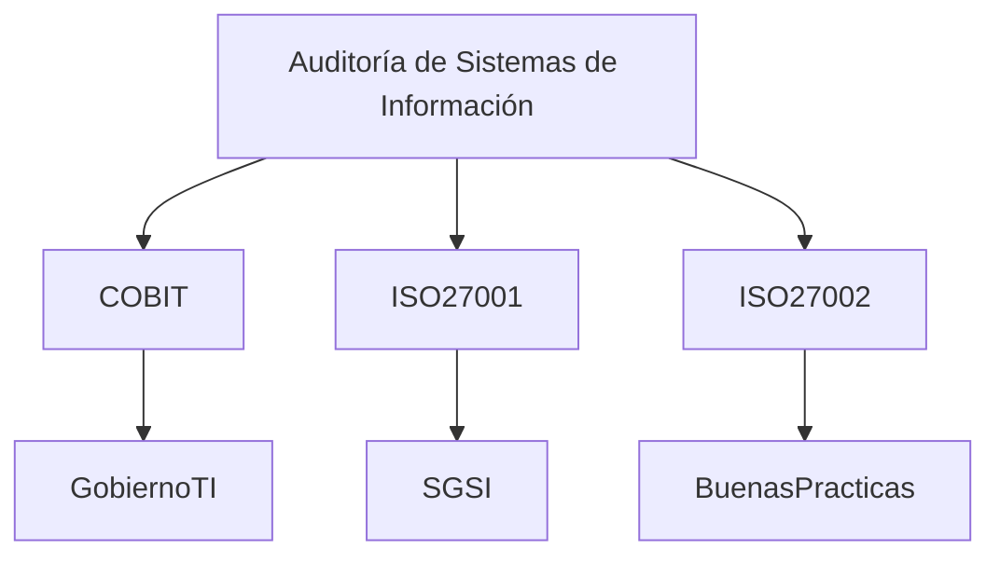

# Estándares De Auditoría De Sistemas De Información

## 1. Importancia De Los Estándares En la Auditoría De Sistemas

La **auditoría de sistemas de información** es una disciplina especializada que require:

- Conocimientos técnicos avanzados
    
- Metodologías estructuradas
    
- Normas profesionales claras

Debido a esta especialización, es necesario utilizar **estándares de auditoría** que definan cómo deben realizarse las auditorías y cómo deben presentarse sus resultados.

### Definición De Estándar De Auditoría

Un **estándar de auditoría** es un conjunto de **reglas, directrices y prácticas recomendadas** que establecen:

- Cómo realizar una auditoría
    
- Qué criterios utilizar para evaluar sistemas
    
- Cómo elaborar los informes de auditoría

Estos estándares permiten asegurar que las auditorías:

- Sean consistentes
    
- Cumplan niveles mínimos de calidad
    
- Sean comparables entre organizaciones

---

## 2. Función De Los Estándares En Una Auditoría

Las auditorías se realizan siempre basándose en un **patrón de referencia**, el cual puede set:

- Un estándar
    
- Un marco de control
    
- Un conjunto de buenas prácticas

Estos elementos sirven como **criterios de evaluación** para determinar si un sistema cumple con los requisitos de seguridad, control y gestión.

### Funciones Principales De Los Estándares

|Función|Descripción|
|---|---|
|Definir requisitos|Establecen los requisitos mínimos para realizar auditorías|
|Guiar la auditoría|Proporcionan metodologías y buenas prácticas|
|Establecer criterios|Permiten evaluar el estado de los sistemas|
|Estandarizar informes|Definen cómo deben presentarse los resultados|

---

## 3. Principales Estándares De Auditoría De Sistemas

Existen numerosos estándares aplicables a auditoría informática. Entre los más importantes se encuentran los siguientes.

### 3.1 COBIT

**COBIT (Control Objectives for Information and Related Technologies)** es un marco de referencia diseñado para:

- Gobernanza de TI
    
- Gestión de tecnología de información
    
- Control de procesos de TI

Su objetivo principal es asegurar que las tecnologías de información **apoyen los objetivos del negocio y mantengan la seguridad de los sistemas**.

### Características De COBIT

|Característica|Descripción|
|---|---|
|Marco de gobierno de TI|Permite gestionar y controlar procesos tecnológicos|
|Orientado a auditoría|Facilita la evaluación de controles|
|Basado en objetivos|Define objetivos de control para TI|

### Ejemplo De Áreas Que Cubre COBIT

- Gestión de riesgos
    
- Seguridad de la información
    
- Gestión de servicios de TI
    
- Control de procesos tecnológicos

---

### 3.2 ISO 27002

El estándar **ISO 27002** proporciona un **código de buenas prácticas para la seguridad de la información**.

Este estándar incluye recomendaciones para implementar controles de seguridad en una organización.

### Áreas Cubiertas Por ISO 27002

|Área|Descripción|
|---|---|
|Gestión de accesos|Control de acceso a sistemas|
|Seguridad física|Protección de instalaciones|
|Seguridad operativa|Gestión segura de sistemas|
|Gestión de incidentes|Manejo de incidentes de seguridad|

ISO 27002 se utilize comúnmente como **guía para implementar controles de seguridad**, lo que también lo hace útil en auditorías.

---

### 3.3 ISO 27001

El estándar **ISO 27001** define los **requisitos para establecer un Sistema de Gestión de Seguridad de la Información (SGSI)**.

Este estándar permite a una organización:

- Implementar políticas de seguridad
    
- Gestionar riesgos de información
    
- Auditar el cumplimiento de controles de seguridad

### Components De ISO 27001

|Componente|Descripción|
|---|---|
|SGSI|Sistema de gestión de seguridad de la información|
|Gestión de riesgos|Identificación y tratamiento de riesgos|
|Auditoría interna|Evaluación periódica del sistema|
|Mejora continua|Optimización constante de los controles|

---

### Relación Entre Los Estándares

---

## 4. Objetivo De Los Estándares De Auditoría

El objetivo principal de los estándares es **definir el nivel mínimo acceptable para el ejercicio professional de la auditoría de sistemas**.

Estos estándares ayudan a los auditores a:

- Cumplir con responsabilidades profesionales
    
- Aplicar metodologías reconocidas
    
- Mantener consistencia en las auditorías

Además, proporcionan orientación sobre:

- Cómo cumplir los requisitos profesionales
    
- Cómo evaluar controles tecnológicos
    
- Cómo generar informes de auditoría confiables

---

## 5. Organismos Internacionales De Auditoría

Los estándares de auditoría suelen set desarrollados por **organizaciones internacionales especializadas**.

Estas organizaciones investigan, desarrollan metodologías y promueven buenas prácticas.

---

## 6. ISACA

**ISACA (Information Systems Audit and Control Association)** es una de las principales organizaciones internacionales relacionadas con auditoría de sistemas.

### Historia

- Fundada en **1967**
    
- Inicialmente enfocada en auditoría de procesamiento electrónico de datos
    
- Posteriormente amplió su alcance a **gobierno, control y auditoría de TI**

### Actividades De ISACA

|Actividad|Descripción|
|---|---|
|Desarrollo de estándares|Publicación de marcos como COBIT|
|Investigación|Estudios sobre gobierno y control de TI|
|Certificaciones|Certificaciones profesionales en auditoría y seguridad|
|Educación|Formación en auditoría y gobierno de TI|

ISACA ha contribuido significativamente al desarrollo del campo de **auditoría de sistemas y gobierno de TI**.

---

## 7. Institute of Internal Auditors (IIA)

El **Institute of Internal Auditors (IIA)** es una organización professional internacional dedicada a la auditoría interna.

### Características

|Característica|Descripción|
|---|---|
|Fundación|1941|
|Sede|Estados Unidos|
|Miembros|Más de 200,000|
|Presencia|Más de 170 países|

### Actividades Del IIA

- Organización de conferencias internacionales
    
- Investigación en auditoría
    
- Certificación professional de auditores
    
- Desarrollo de guías técnicas

El IIA es reconocido mundialmente como **una autoridad en auditoría interna**, siendo líder en:

- Certificación professional
    
- Formación especializada
    
- Desarrollo de estándares

---

## 8. Importancia De Investigar Otros Estándares

Existen numerosos estándares relacionados con:

- Auditoría informática
    
- Seguridad de la información
    
- Gestión de riesgos
    
- Gobierno de TI

Por ello, es recomendable que los auditores realicen **búsquedas adicionales de estándares aplicables** según el tipo de auditoría que estén realizando.

Ejemplos adicionales incluyen:

|Estándar|Área|
|---|---|
|NIST Cybersecurity Framework|Seguridad y gestión de riesgos|
|ISO 22301|Continuidad del negocio|
|ITIL|Gestión de servicios de TI|

---

# Resumen De Puntos Clave

- La auditoría de sistemas require estándares específicos debido a su carácter técnico y especializado.
    
- Los estándares establecen requisitos, metodologías y criterios para realizar auditorías.
    
- COBIT es un marco de referencia para el gobierno y control de TI.
    
- ISO 27002 proporciona buenas prácticas para la seguridad de la información.
    
- ISO 27001 define los requisitos para implementar un sistema de gestión de seguridad de la información.
    
- Organismos internacionales como ISACA y el IIA desarrollan estándares, investigación y certificaciones en auditoría.
    
- Es recomendable investigar múltiples estándares para seleccionar los más adecuados según el contexto de auditoría.

---

## MicroTest

1. Dentro del mundo ISACA y en relación con la certificación CISA, podemos afirmar que:
    
    - La respuesta: **D. Es una certificación que garantiza, con la aprobación de un examen y la demostración de una experiencia professional en TIC, la valía de su poseedor para auditar sistemas de información.**
        
    - Justifacion:  
        La certificación **CISA (Certified Information Systems Auditor)** de ISACA require **aprobar un examen y demostrar experiencia professional en tecnologías de la información**. Esta certificación valida la capacidad del professional para **auditar sistemas de información**, evaluar controles y gestionar riesgos de TI.
        
2. ¿Qué metodología de auditoria se adapta mejor a las compañías?
    
    - La respuesta: **C. La que sea completa y este adecuada a las necesidades de la compañía.**
        
    - Justifacion:  
        No existe una única metodología universal para todas las organizaciones. La metodología de auditoría debe **adaptarse al contexto, tamaño, sector y riesgos de la empresa**, aunque puede basarse en estándares reconocidos como COBIT o ISO.
        
3. ¿Qué criterios o requerimientos del negocio deben cumplir los controles según COBIT?
    
    - La respuesta: **A. Efectividad.**
        
    - Justifacion:  
        En **COBIT**, uno de los criterios de información que deben cumplir los controles es la **efectividad**, que implica que la información sea **relevante, oportuna, correcta y útil para el negocio**. Los otros criterios de COBIT incluyen eficiencia, confidencialidad, integridad, disponibilidad, cumplimiento y confiabilidad.