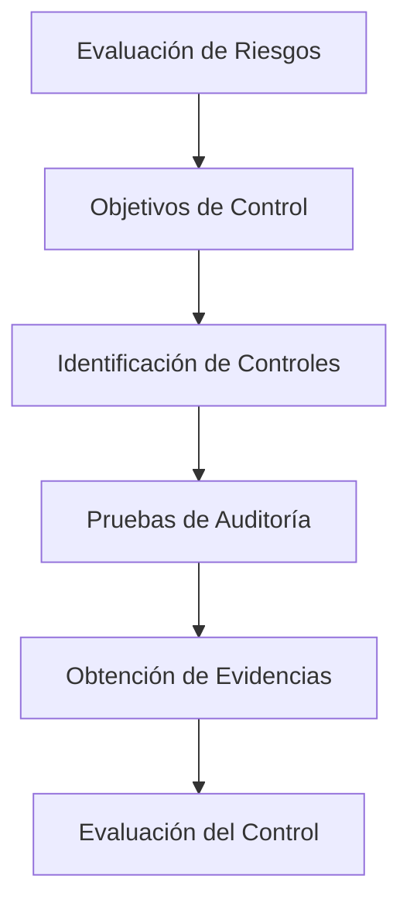

# Metodología De Auditoría De Seguridad

## 1. Concepto De Metodología De Auditoría

En el ámbito de la auditoría de sistemas de información y ciberseguridad, no existe una única **metodología universal obligatoria** para realizar auditorías. Sin embargo, existen **estándares, principios y buenas prácticas** que guían el proceso.

Muchas organizaciones y firmas de auditoría desarrollan **metodologías propias**, adaptadas a sus procesos internos y a los servicios que ofrecen.

Entre las organizaciones que promueven marcos y buenas prácticas se encuentran:

- ISACA
    
- Grandes firmas de auditoría (por ejemplo: KPMG, Deloitte, PwC, EY)

### Definición De Metodología

Una **metodología** es un conjunto estructurado de:

- Procedimientos
    
- Pasos
    
- Técnicas
    
- Actividades documentadas

que se utilizan para **alcanzar un objetivo específico**.

En auditoría, la metodología permite ejecutar el proceso de auditoría de manera **sistemática, repetible y controlada**.

### Definición Aplicada a Auditoría

Una **metodología de auditoría** puede definirse como:

Un conjunto de **procedimientos documentados de auditoría** diseñados para alcanzar los objetivos establecidos dentro del **alcance y el programa de trabajo de la auditoría**.

---

## 2. Importancia De la Metodología En Las Auditorías

El uso de una metodología estructurada es fundamental para garantizar la calidad del proceso de auditoría.

### Beneficios Principales

|Beneficio|Descripción|
|---|---|
|Consistencia|Diferentes equipos obtienen resultados similares|
|Repetibilidad|Las auditorías pueden repetirse con el mismo método|
|Estandarización|Se siguen procesos claros y definidos|
|Reducción de dependencia del auditor|El resultado depende menos de la persona|

Esto significa que **dos equipos de auditoría distintos**, utilizando la misma metodología y auditando el mismo sistema, deberían obtener **resultados similares**.

---

## 3. Estructura General De Una Metodología

Una metodología puede representarse como una **secuencia de pasos interrelacionados**.

Cada paso incluye:

- Entradas (inputs)
    
- Actividades
    
- Salidas (outputs)

Estos pasos se ejecutan de manera:

- Sequential
    
- Paralela
    
- Iterativa

dependiendo del diseño de la metodología.

---

## 4. Metodologías De Auditoría Basadas En Riesgo

La metodología más utilizada en auditoría de seguridad es la **basada en riesgo**.

### Risk Oriented Approach (ROA)

La **Risk Oriented Approach (ROA)** o **Risk Assessment Approach** es una metodología recomendada por **ISACA**.

Esta metodología se centra en:

- Identificar riesgos
    
- Evaluar su impacto
    
- Auditar los controles que mitigan esos riesgos

### Características

|Característica|Descripción|
|---|---|
|Basada en riesgos|Prioriza los riesgos más importantes|
|Enfoque estructurado|Sigue un proceso claro|
|Orientada a controles|Evalúa la eficacia de los controles|

---

## 5. Tipos De Metodologías De Auditoría

Existen diferentes tipos de metodologías según su complejidad y enfoque.

### Clasificación

|Tipo|Características|
|---|---|
|Evaluación de riesgos|Auditoría centrada en identificar y analizar riesgos|
|ROA (Risk Oriented Approach)|Auditoría basada en riesgos recomendada por ISACA|
|Metodología simplificada|Basada en cuestionarios o listas de comprobación|
|Metodología avanzada|Enfocada en auditoría de productos o sistemas informáticos complejos|

---

## 6. Elementos Principales De Una Metodología De Auditoría

Una metodología de auditoría suele incluir varios elementos clave que estructuran el proceso.

### Proceso General

1. Evaluación de riesgos
    
2. Definición de objetivos de control
    
3. Identificación de controles
    
4. Pruebas de auditoría
    
5. Obtención de evidencias
    
6. Evaluación de resultados

---

## 7. Evaluación De Riesgos

La **evaluación de riesgos** es el punto de partida de muchas auditorías.

### Definición

La **evaluación de riesgos** consiste en identificar:

- Amenazas
    
- Vulnerabilidades
    
- Impacto potential

sobre los sistemas de información de una organización.

Si la empresa auditada **no tiene un análisis de riesgos**, el auditor puede necesitar realizarlo como parte del proceso.

---

## 8. Objetivos De Control

Los **objetivos de control** representan lo que se desea lograr con los controles de seguridad.

### Definición

Un **objetivo de control** es una meta que busca garantizar que un sistema opere de forma:

- Segura
    
- Confiable
    
- Controlada

### Ejemplo

Objetivo:

Garantizar la **seguridad de las aplicaciones web expuestas a Internet**.

---

## 9. Controles

Los **controles** son mecanismos implementados para cumplir los objetivos de control.

### Ejemplos De Controles En Aplicaciones Web

|Control|Descripción|
|---|---|
|Autenticación|Verificación de identidad del usuario|
|Autorización|Control de permisos de acceso|
|Validación de entradas|Protección contra ataques como inyección|
|Gestión de sesiones|Control de sesiones de usuario|

Estos controles deben set **evaluados durante la auditoría**.

---

## 10. Pruebas De Auditoría

Para verificar si los controles funcionan correctamente, el auditor realiza **pruebas de auditoría**.

Existen dos tipos principales.

### 10.1 Pruebas De Cumplimiento

Las **pruebas de cumplimiento** verifican si un control:

- Existe
    
- Está implementado
    
- Funciona correctamente

Ejemplo:

Verificar que existe un **procedimiento documentado de gestión de accesos**.

---

### 10.2 Pruebas Sustantivas

Las **pruebas sustantivas** se realizan cuando:

- El auditor no está completamente satisfecho con las pruebas de cumplimiento
    
- Es necesario profundizar más en el análisis

Estas pruebas implican un análisis más detallado.

Ejemplo:

- Seleccionar una muestra de usuarios
    
- Revisar si sus permisos fueron aprobados correctamente

---

## 11. Importancia De la Evidencia En Auditoría

Una regla fundamental en auditoría es que **toda conclusión debe basarse en evidencia**.

### Definición

La **evidencia de auditoría** es la información obtenida durante la auditoría que permite demostrar:

- Si un control existe
    
- Si funciona correctamente
    
- Si hay deficiencias

Si no existe evidencia suficiente, el auditor **no debería emitir una conclusión**.

---

## 12. Matriz De Auditoría (Ejemplo)

En muchas auditorías se utilize una **matriz de control** para organizar el proceso.

### Ejemplo De Estructura

|Riesgo|Objetivo de Control|Control|Prueba de Cumplimiento|Prueba Sustantiva|Evidencia|
|---|---|---|---|---|---|
|Acceso no autorizado|Controlar accesos a sistemas|Procedimiento de gestión de accesos|Verificar que existe el procedimiento documentado|Revisar muestra de perfiles de usuario|Documentación y registros|

Esta matriz permite:

- Organizar el trabajo de auditoría
    
- Documentar pruebas realizadas
    
- Registrar evidencias obtenidas

---

## 13. Factores Que Influyen En la Auditoría

El alcance y profundidad de las pruebas dependen de varios factores.

### Variables Importantes

|Variable|Impacto|
|---|---|
|Tiempo disponible|Limita el número de pruebas|
|Recursos del equipo auditor|Determina capacidad de análisis|
|Nivel de riesgo|Riesgos altos requieren pruebas más profundas|

El auditor debe decidir **hasta qué nivel profundizar en las pruebas sustantivas** según estas variables.

---

# Resumen De Puntos Clave

- No existe una única metodología universal para auditorías de seguridad.
    
- Las auditorías suelen basarse en estándares y metodologías desarrolladas por organismos o firmas especializadas.
    
- La metodología más utilizada es la **basada en riesgos (Risk Oriented Approach)**.
    
- Una metodología de auditoría consiste en un conjunto estructurado de procedimientos documentados.
    
- El proceso comienza con la **evaluación de riesgos**.
    
- A partir de los riesgos se definen **objetivos de control y controles**.
    
- Los controles se verifican mediante **pruebas de cumplimiento y pruebas sustantivas**.
    
- Todas las conclusiones de auditoría deben estar respaldadas por **evidencias**.
    
- Las auditorías suelen documentarse mediante **matrices de control** que relacionan riesgos, controles, pruebas y evidencias.

---

## MicroTest

1. ¿Cuáles son los atributos claves de una metodología?
    
    - La respuesta: **D. Todas las anteriores.**
        
    - Justifacion:  
        Una metodología de auditoría debe set **sistemática**, seguir una **disciplina o proceso estructurado**, y mantener **objetividad** para garantizar resultados consistentes, repetibles y basados en evidencias. Estos tres elementos permiten que diferentes auditores obtengan resultados similares aplicando el mismo método.
        
2. En un enfoque de auditoría basado en riesgo (EDR), un auditor, además del riesgo, estaría influenciado por:
    
    - La respuesta: **D. La existencia de controles internos.**
        
    - Justifacion:  
        En un **enfoque de auditoría basado en riesgos (EDR)**, el auditor analiza no solo los riesgos identificados, sino también **los controles internos existentes** que pueden mitigar esos riesgos. La eficacia o debilidad de estos controles influye directamente en el alcance y profundidad de las pruebas de auditoría.
        
3. El EDR es una metodología de auditorías de sistemas de información basada en:
    
    - La respuesta: **C. Riesgos.**
        
    - Justifacion:  
        El **EDR (Enfoque de Auditoría Basado en Riesgos)** se centra en **identificar, analizar y priorizar los riesgos** asociados a los sistemas de información. A partir de esos riesgos se definen los objetivos de control, los controles a evaluar y las pruebas de auditoría necesarias.