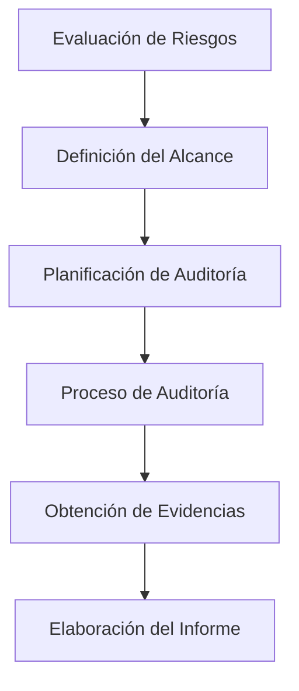

# Planificación De la Auditoría De Sistemas

## 1. Introducción a la Planificación De la Auditoría

La **planificación de la auditoría** es una de las etapas más importantes dentro del proceso de auditoría de sistemas de información.

Antes de iniciar una auditoría, el auditor debe realizar una series de pasos que permitan:

- Entender el contexto de la organización
    
- Identificar riesgos
    
- Definir el alcance de la auditoría
    
- Establecer los procedimientos que se seguirán

Una planificación adecuada permite ejecutar la auditoría de forma **organizada, eficiente y alineada con los objetivos establecidos**.

---

## 2. Proceso General De Una Auditoría

El proceso de auditoría sigue una secuencia lógica de actividades.

### Etapas Principales

1. Evaluación de riesgos
    
2. Definición del alcance
    
3. Planificación de auditoría
    
4. Ejecución de la auditoría
    
5. Obtención de evidencias
    
6. Elaboración del informe

---

## 3. Evaluación De Riesgos

La **evaluación de riesgos** es el primer paso en muchas metodologías de auditoría, especialmente en el **Enfoque de Auditoría Basado en Riesgos (EDR)**.

### Definición

La evaluación de riesgos consiste en identificar y analizar:

- Amenazas
    
- Vulnerabilidades
    
- Impactos potenciales

en los sistemas de información de la organización.

### Objetivo

Determinar qué áreas del sistema requieren mayor atención durante la auditoría.

Si la organización **no cuenta con una evaluación de riesgos previa**, el auditor puede tener que realizarla como parte del proceso.

---

## 4. Comprensión Del Negocio

Antes de definir el alcance de la auditoría, el auditor debe **comprender el contexto de la organización**.

### Aspectos Que Debe Analizar

|Elemento|Descripción|
|---|---|
|Modelo de negocio|Actividades principales de la empresa|
|Infraestructura tecnológica|Sistemas, servidores y redes|
|Arquitectura de red|Diseño y estructura de la red|
|Tecnologías utilizadas|Software y hardware empleados|
|Problemáticas existentes|Incidentes o debilidades conocidas|

Comprender el negocio permite al auditor **identificar áreas críticas y riesgos relevantes**.

---

## 5. Definición Del Alcance De la Auditoría

El **alcance** es uno de los elementos más importantes de la planificación.

### Definición

El **alcance de auditoría** define:

- Qué sistemas serán auditados
    
- Qué tecnologías serán evaluadas
    
- Qué áreas quedan fuera de la auditoría

Si el alcance no está claramente definido, la auditoría puede:

- Expandirse sin control
    
- No cumplir los objetivos establecidos

### Ejemplos De Elementos Dentro Del Alcance

|Elemento auditado|Ejemplo|
|---|---|
|Aplicaciones web|Auditoría de seguridad de una web|
|Servidores|Revisión de configuración y accesos|
|Redes inalámbricas|Evaluación de seguridad WiFi|
|Código fuente|Análisis de seguridad del software|

---

## 6. Acuerdo De Autorización

Antes de realizar ciertas pruebas, especialmente **pruebas técnicas agresivas**, es necesario contar con autorización formal.

### Ejemplo: Pruebas De Penetración

Las **pruebas de penetración (pentesting)** pueden provocar:

- Caídas de servidores
    
- Interrupciones del servicio
    
- Impacto en operaciones

Por esta razón se firma un **acuerdo de autorización** entre:

- La organización auditada
    
- El equipo auditor

### Objetivos Del Acuerdo

|Objetivo|Descripción|
|---|---|
|Autorización formal|Permite realizar pruebas técnicas|
|Protección legal|Evita responsabilidades legales|
|Definición de límites|Establece qué sistemas pueden set evaluados|

---

## 7. Programa De Auditoría

Una vez definido el alcance, se elabora el **programa de auditoría**.

### Definición

El **programa de auditoría** es un conjunto de:

- Procedimientos
    
- Instrucciones
    
- Actividades

que deben ejecutarse paso a paso para cumplir los objetivos de la auditoría.

### Components De Un Programa De Auditoría

|Elemento|Descripción|
|---|---|
|Objetivo principal|Propósito general de la auditoría|
|Objetivos secundarios|Metas específicas|
|Alcance|Sistemas y tecnologías incluidos|
|Planificación previa|Recursos y herramientas necesarias|
|Procedimientos de auditoría|Pasos técnicos a ejecutar|

---

## 8. Identificación De Recursos

Durante la planificación se deben identificar los recursos necesarios para la auditoría.

### Tipos De Recursos

|Tipo|Ejemplo|
|---|---|
|Recursos humanos|Auditores especializados|
|Recursos técnicos|Herramientas de análisis|
|Fuentes de información|Documentación y registros|

Los auditores se asignan según sus **habilidades y perfiles técnicos**.

---

## 9. Procedimientos De Auditoría

Los procedimientos definen **cómo se realizará la auditoría**.

### Actividades Comunes

- Recopilación de datos
    
- Identificación de personas a entrevistar
    
- Selección del enfoque de trabajo
    
- Revisión de políticas y normas
    
- Selección de metodologías de prueba

### Ejemplos De Metodologías Técnicas

|Área|Metodología|
|---|---|
|Auditoría WiFi|Metodologías de análisis de redes inalámbricas|
|Seguridad web|OWASP Testing Methodology|

La **OWASP (Open Web Application Security Project)** proporciona metodologías para evaluar la seguridad de aplicaciones web.

---

## 10. Comunicación Y Seguimiento

La planificación también debe considerar:

- Comunicación con la dirección
    
- Presentación de resultados
    
- Seguimiento de recomendaciones

Esto asegura que los hallazgos de auditoría **generen mejoras reales en la organización**.

---

## 11. Planificación De Auditoría a Corto Y Largo Plazo

Las auditorías suelen planificarse en diferentes horizontes temporales.

### Planificación Típica

|Tipo de planificación|Duración|
|---|---|
|Corto plazo|1 año|
|Medio o largo plazo|3 años|

Este enfoque permite organizar múltiples auditorías en diferentes áreas.

---

## 12. Ejemplos De Auditorías Planificadas

Durante la planificación annual se pueden incluir diferentes tipos de auditoría.

### Ejemplos

|Auditoría|Objetivo|
|---|---|
|Seguridad de proveedores|Evaluar cumplimiento de seguridad|
|Licencias de software|Verificar uso legal de aplicaciones|
|Continuidad de negocio|Evaluar capacidad de recuperación|
|Seguridad de aplicaciones|Revisar código y configuración|

---

## 13. Ejemplo De Auditoría De Seguridad De Proveedores

### Descripción

Evaluación de los **controles de seguridad aplicados por proveedores externos**.

### Actividades Principales

|Paso|Actividad|
|---|---|
|1|Planificación|
|2|Identificación de proveedores|
|3|Definición del marco de control|
|4|Revisión de contratos|
|5|Evaluación de controles|
|6|Elaboración de resultados|
|7|Definición de plan de acción|

![[Pasted image 20260306200108.png]]

---

## 14. Ejemplo De Auditoría De Licencias De Software

### Objetivo

Verificar la **legalidad y correcta utilización de las licencias de software** en la organización.

### Actividades

|Paso|Actividad|
|---|---|
|1|Identificación de aplicaciones utilizadas|
|2|Revisión de licencias adquiridas|
|3|Comparación con instalaciones reales|
|4|Identificación de incumplimientos|
|5|Estimación de impacto económico|

![[Pasted image 20260306200130.png]]

---

# Resumen De Puntos Clave

- La planificación es una de las etapas más importantes de la auditoría.
    
- El proceso comienza con una **evaluación de riesgos**.
    
- El auditor debe comprender el **negocio, sistemas y tecnologías** de la organización.
    
- El **alcance de la auditoría** define qué será evaluado y debe estar claramente establecido.
    
- Antes de realizar pruebas técnicas, es necesario firmar un **acuerdo de autorización**.
    
- El **programa de auditoría** describe paso a paso los procedimientos que se ejecutarán.
    
- La planificación incluye identificación de **recursos, herramientas y metodologías**.
    
- Las auditorías suelen planificarse en horizontes de **1 año y 3 años**.
    
- Existen diferentes tipos de auditorías como seguridad de proveedores, licencias de software o continuidad de negocio.

---

## MicroTest

1. Para realizar una planificación de las auditorias, es importante recursos y tiempo.
    
    - La respuesta: **C. Son dos términos para tener en cuenta.**
        
    - Justifacion:  
        En la planificación de una auditoría es fundamental considerar **tanto los recursos disponibles (auditores, herramientas, conocimientos)** como **el tiempo asignado**. Ambos factores determinan el alcance de la auditoría, la profundidad de las pruebas y la viabilidad del plan de trabajo.
        
2. Un elemento clave en la planificación de una auditoría de sistemas de información es:
    
    - La respuesta: **B. Traducir los objetivos de auditoría básicos y de amplio alcance en objetivos específicos de auditoría de sistemas de información.**
        
    - Justifacion:  
        Durante la planificación, el auditor debe **transformar los objetivos generales de auditoría en objetivos específicos y medibles** que puedan aplicarse a los sistemas de información. Esto permite definir el alcance, los controles a revisar y las pruebas de auditoría necesarias.
        
3. La primera etapa de una auditoría de un sistema de información es:
    
    - La respuesta: **A. Planificación.**
        
    - Justifacion:  
        La **planificación** es la primera etapa de una auditoría porque permite comprender el negocio, identificar riesgos, definir el alcance y establecer el programa de auditoría. Sin una planificación adecuada, la auditoría puede carecer de dirección y objetivos claros.