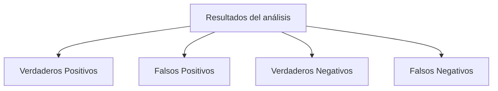

# Herramientas Y Técnicas De Auditoría De Sistemas

## 1. Introducción a Las Herramientas De Auditoría

En una auditoría de sistemas de información es fundamental contar con **herramientas especializadas** que ayuden al auditor a analizar sistemas, detectar vulnerabilidades y evaluar controles de seguridad.

Estas herramientas permiten:

- Automatizar tareas complejas
    
- Analizar grandes volúmenes de datos
    
- Detectar vulnerabilidades en sistemas
    
- Reducir el tiempo necesario para realizar la auditoría

Sin herramientas adecuadas, muchas tareas de auditoría serían **prácticamente imposibles de realizar manualmente**, especialmente cuando se analizan:

- Logs de sistemas
    
- Infraestructuras TI
    
- Código fuente
    
- Redes

### Definición De Herramientas De Auditoría

Las **herramientas de auditoría** son aplicaciones o programas informáticos utilizados para **apoyar al auditor en la ejecución de técnicas y procedimientos de auditoría**.

---

## 2. Objetivos Del Uso De Herramientas En Auditoría

Las herramientas se utilizan para diferentes propósitos dentro del proceso de auditoría.

### Usos Principales

|Uso|Descripción|
|---|---|
|Análisis de registros|Evaluación de logs de seguridad|
|Verificación de controles|Comprobación de controles de seguridad|
|Investigación de incidentes|Análisis de eventos sospechosos|
|Auditoría de procesos|Verificación del funcionamiento de procesos|
|Evaluación de seguridad|Identificación de vulnerabilidades|

También pueden utilizarse para:

- Auditar código fuente
    
- Analizar redes inalámbricas
    
- Evaluar aplicaciones web
    
- Revisar transacciones y operaciones

---

## 3. Técnicas De Auditoría De Sistemas

La auditoría informática utilize diversas técnicas para obtener información y evidencias.

### Técnicas Principales

|Técnica|Descripción|
|---|---|
|Inspección|Revisión directa de sistemas o documentos|
|Observación|Análisis de procesos en ejecución|
|Entrevistas|Obtención de información de personal clave|
|Revisión documental|Análisis de políticas y procedimientos|
|Procedimientos analíticos|Uso de herramientas para analizar sistemas|

---

## 4. Procedimientos Analíticos En Auditoría

Los **procedimientos analíticos** implican el uso de herramientas automáticas para analizar sistemas.

### Ejemplos

|Herramienta|Uso|
|---|---|
|OpenVAS|Escaneo de vulnerabilidades|
|Expose / Nexpose|Identificación de vulnerabilidades|
|Fortify|Análisis de seguridad de código fuente|

Estas herramientas permiten detectar:

- Vulnerabilidades conocidas
    
- Errores de configuración
    
- Problemas de seguridad en aplicaciones

---

## 5. Importancia De Las Herramientas En Auditoría Informática

En auditoría informática el objeto auditado suele set:

- Sistemas informáticos
    
- Infraestructuras TI
    
- Bases de datos
    
- Redes

Debido a la **gran cantidad de información** que generan estos sistemas, el análisis manual resulta inviable.

Por esta razón las herramientas permiten:

- Automatizar análisis
    
- Detectar patrones
    
- Procesar grandes volúmenes de datos

---

## 6. Tipos De Herramientas De Auditoría

Las herramientas utilizadas en auditoría pueden clasificarse en diferentes categorías.

### Clasificación

|Tipo|Ejemplo|Uso|
|---|---|---|
|Cuestionarios|Listas de comprobación|Verificación de cumplimiento|
|Entrevistas|Guías de preguntas|Obtención de información|
|Herramientas técnicas|Escáneres de vulnerabilidades|Análisis de seguridad|
|Herramientas de planificación|Software de gestión de proyectos|Planificación de auditorías|
|Herramientas de análisis|Software especializado|Evaluación de sistemas|

---

## 7. Entrevistas En Auditoría

Las entrevistas son una técnica común para obtener información de los responsables de sistemas.

Existen dos tipos principales.

### Tipos De Entrevistas

|Tipo|Características|
|---|---|
|Entrevistas libres|Conversación abierta sin preguntas predefinidas|
|Entrevistas dirigidas|Preguntas previamente preparadas|

Las **entrevistas dirigidas** suelen set más recomendables porque permiten:

- Obtener información específica
    
- Mantener control del proceso
    
- Optimizar el tiempo de auditoría

---

## 8. Herramientas Técnicas De Seguridad

Existen numerosas herramientas utilizadas en auditoría de seguridad.

### Ejemplos De Herramientas

|Herramienta|Uso|
|---|---|
|Nessus|Escaneo de vulnerabilidades|
|Nexpose|Identificación de vulnerabilidades|
|Metasploit|Explotación de vulnerabilidades|
|Fortify|Auditoría de código fuente|
|Wireshark|Análisis de tráfico de red|
|Nmap|Escaneo de puertos|
|OWASP tools|Auditoría de aplicaciones web|

Estas herramientas permiten analizar diferentes components de una infraestructura TI.

---

## 9. Escáneres De Vulnerabilidades

Los **escáneres de vulnerabilidades** son herramientas que analizan sistemas para identificar posibles fallos de seguridad.

### Funcionamiento

1. Analizan sistemas o aplicaciones
    
2. Comparan configuraciones con bases de datos de vulnerabilidades
    
3. Generan reportes con posibles riesgos

### Problema Común: Falsos Positivos

Los escáneres de seguridad pueden generar errores en sus resultados.

---

## 10. Falsos Positivos Y Falsos Negativos

Cuando una herramienta analiza vulnerabilidades, puede producir distintos tipos de resultados.

### Matriz De Clasificación



### Definiciones

|Tipo|Significado|
|---|---|
|Verdadero positivo|La herramienta detecta correctamente una vulnerabilidad real|
|Falso positivo|La herramienta indica un problema que en realidad no existe|
|Verdadero negativo|La herramienta indica correctamente que no existe problema|
|Falso negativo|Existe una vulnerabilidad pero la herramienta no la detecta|

Los **falsos negativos** son especialmente peligrosos porque el auditor puede creer que el sistema es seguro cuando en realidad no lo es.

---

## 11. Métricas De Evaluación De Herramientas

Para evaluar la eficacia de una herramienta se utilizan métricas basadas en la matriz anterior.

### Precisión (Precision)

La **precisión** mide qué proporción de las detecciones positivas son correctas.

Fórmula:

```Python
Precision = Verdaderos Positivos / (Verdaderos Positivos + Falsos Positivos)
```

---

### Exactitud (Accuracy)

La **exactitud** mide qué tan correctas son todas las predicciones.

Fórmula:

```Python
Accuracy = (Verdaderos Positivos + Verdaderos Negativos) / Total de casos
```

Para usar correctamente esta métrica es importante que el **conjunto de datos esté equilibrado** entre casos positivos y negativos.

---

## 12. Dataset Para Evaluación De Herramientas

Para evaluar herramientas de seguridad se utilize un **dataset**.

### Definición

Un **dataset** es un conjunto de datos utilizado para evaluar el rendimiento de una herramienta o modelo.

Ejemplo:

Si se analiza una herramienta de análisis de código, el dataset puede incluir:

- Código con vulnerabilidades
    
- Código seguro

Ambos tipos deben estar **equilibrados** para obtener métricas fiables.

---

## 13. Recomendaciones Para Seleccionar Herramientas

Debido a la gran cantidad de herramientas disponibles, es recomendable:

- Investigar las herramientas más utilizadas
    
- Realizar pruebas antes de adquirir herramientas comerciales
    
- Seleccionar un conjunto reducido de herramientas confiables

### Criterios De Selección

|Criterio|Descripción|
|---|---|
|Precisión|Capacidad de detectar vulnerabilidades reales|
|Facilidad de uso|Interfaz y configuración|
|Compatibilidad|Soporte para sistemas y tecnologías|
|Coste|Precio de licencia|

---

# Resumen De Puntos Clave

- Las herramientas de auditoría permiten automatizar el análisis de sistemas y mejorar la eficiencia del proceso.
    
- Se utilizan para analizar registros, verificar controles y detectar vulnerabilidades.
    
- La auditoría informática emplea técnicas como inspección, observación, entrevistas y procedimientos analíticos.
    
- Las entrevistas dirigidas son más eficaces que las entrevistas libres.
    
- Existen muchas herramientas de seguridad como Nessus, Nexpose, Metasploit, Nmap y Wireshark.
    
- Los escáneres de vulnerabilidades pueden generar falsos positivos y falsos negativos.
    
- Los falsos negativos son especialmente peligrosos porque ocultan vulnerabilidades reales.
    
- Las métricas como precisión y exactitud se utilizan para evaluar el rendimiento de herramientas.
    
- Es recomendable evaluar herramientas antes de adquirirlas y seleccionar un conjunto confiable.

---

## MicroTest

1. ¿Cuál no es una herramienta de auditoria?
    
    - La respuesta: D. Exámenes.
        
    - Justifacion: En auditoría informática se utilizan herramientas como entrevistas, cuestionarios y trazas o huellas para recopilar información y analizar sistemas. Los exámenes no forman parte de las herramientas o técnicas utilizadas en procesos de auditoría, ya que están más asociados a evaluaciones académicas y no a procesos de verificación o análisis de sistemas.
        
2. ¿Cuántas herramientas de auditoría de seguridad existen?
    
    - La respuesta: D. Hay infinidad de herramientas, siendo cada una útil para unos objetivos concretos.
        
    - Justifacion: En el ámbito de la auditoría de seguridad existen numerosas herramientas especializadas para diferentes tareas, como análisis de vulnerabilidades, auditoría de código, escaneo de puertos o análisis de tráfico. Debido a la gran variedad de objetivos y tecnologías, no existe un número limitado de herramientas, sino una gran cantidad de ellas.
        
3. La fórmula VP/(VP+FP) corresponde con la siguiente métrica:
    
    - La respuesta: B. Precisión.
        
    - Justifacion: La fórmula VP/(VP+FP) representa la métrica de precisión (Precision). Esta mide qué proporción de los resultados positivos detectados por una herramienta son realmente positivos. Es decir, evalúa la calidad de los verdaderos positivos frente a los falsos positivos detectados por el sistema.