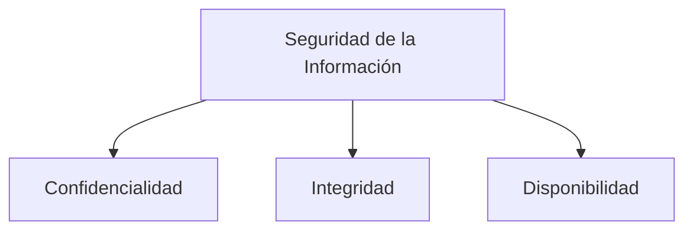
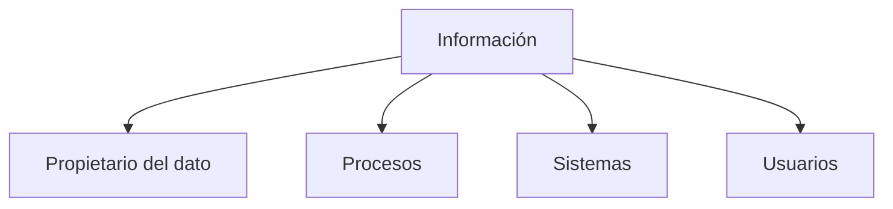

# Objetivos De la Auditoría De Sistemas De Información

## 1. Introducción

La **auditoría de sistemas de información** tiene como objetivo principal evaluar cómo una organización **gestiona, protege y utilize la información**.

El **elemento central de la auditoría** es el **dato** o **información**, ya que los sistemas de información existen principalmente para **capturar, almacenar, procesar y presentar datos** que apoyan la toma de decisiones.

---

# 2. Objetivos Principales De la Auditoría

Los objetivos principales de una auditoría de sistemas de información se centran en verificar que la organización **gestiona correctamente su información**.

## Objetivos Generales

|Objetivo|Descripción|
|---|---|
|Verificación de la información|Evaluar cómo la organización gestiona su información|
|Clasificación de la información|Determinar si existe un proceso formal de clasificación|
|Protección de la información|Verificar controles que protegen la información|
|Uso adecuado de la información|Evaluar cómo se procesa y utilize la información|
|Cumplimiento normativo|Verificar cumplimiento de leyes de protección de datos|

---

# 3. Clasificación De la Información

Una auditoría debe verificar si la organización posee un **procedimiento de clasificación de la información**.

## Definición

La **clasificación de la información** es el proceso mediante el cual se categoriza la información según su **nivel de sensibilidad o criticidad**.

### Ejemplo De Clasificación

|Nivel de información|Descripción|
|---|---|
|Confidencial|Información sensible que require máxima protección|
|Interna|Información de uso interno|
|Pública|Información que puede set compartida sin restricciones|

### Importancia De la Clasificación

La clasificación permite:

- Aplicar **controles de seguridad adecuados**
    
- Priorizar la **protección de datos críticos**
    
- Cumplir **regulaciones legales**

---

# 4. Protección De la Información

Una vez clasificada la información, se deben implementar controles que garanticen su seguridad.

Estos controles deben proteger tres propiedades fundamentales.

## Triada De Seguridad De la Información

|Propiedad|Definición|
|---|---|
|Confidencialidad|Solo las personas autorizadas pueden acceder a la información|
|Integridad|La información no debe set alterada sin autorización|
|Disponibilidad|La información debe estar accessible cuando se necesite|

---

# 5. Sistemas De Prevención De Fuga De Información (DLP)

## Definición

Los sistemas **DLP (Data Loss Prevention)** son herramientas diseñadas para **evitar la fuga o filtración de información sensible fuera de la organización**.

### Funciones Principales

|Función|Descripción|
|---|---|
|Monitorización|Detectar movimientos de información sensible|
|Control|Bloquear o registrar transferencias no autorizadas|
|Trazabilidad|Registrar quién accede o intenta extraer datos|
|Prevención|Evitar que datos confidenciales salgan de la organización|

### Ejemplo

Un sistema DLP puede detectar cuando:

- Un empleado intenta enviar datos confidenciales por correo
    
- Se copian archivos sensibles a un USB
    
- Se sube información confidencial a la nube

---

# 6. Disponibilidad De la Información

La auditoría también debe verificar que la información esté disponible para los usuarios que la necesitan.

## Elementos Evaluados

|Elemento|Descripción|
|---|---|
|Sistemas informáticos|Plataformas que almacenan o procesan información|
|Servicios|Servicios que permiten acceder a la información|
|Infraestructura|Recursos tecnológicos que soportan los sistemas|

### Controles Asociados

- Autenticación
    
- Control de acceso
    
- Gestión de identidades
    
- Registro de actividad (logs)

---

# 7. Control De Acceso Y Trazabilidad

## Autenticación

La **autenticación** es el proceso mediante el cual se verifica la identidad de un usuario antes de permitirle acceder a un sistema.

Ejemplos:

- Usuario y contraseña
    
- Autenticación multifactor
    
- Certificados digitales

## Control De Acceso

El **control de acceso** determina **qué recursos puede utilizar un usuario** dentro de un sistema.

Se basa generalmente en:

- Roles
    
- Permisos
    
- Perfil del usuario

## Trazabilidad

La **trazabilidad** permite registrar las acciones realizadas sobre la información.

### Objetivos De la Trazabilidad

|Objetivo|Descripción|
|---|---|
|Auditoría|Revisar actividades realizadas|
|Seguridad|Detectar accesos indebidos|
|Responsabilidad|Identificar quién realizó una acción|

---

# 8. Auditoría De Personas Y Terceros

La auditoría no solo revisa sistemas tecnológicos.

También debe evaluar:

- Usuarios internos
    
- Administradores
    
- Proveedores externos
    
- Empresas colaboradoras

## Riesgo Asociado a Terceros

Muchos incidentes de seguridad se producen debido a:

- Proveedores externos
    
- Contratistas
    
- Accesos compartidos
    
- Fallos de seguridad en terceros

### Evaluación De Terceros

|Elemento|Qué se revisa|
|---|---|
|Accesos|Qué información pueden consultar|
|Permisos|Nivel de acceso|
|Controles de seguridad|Medidas aplicadas por el tercero|
|Cumplimiento contractual|Obligaciones de seguridad|

---

# 9. Uso De la Información En la Organización

La auditoría también evalúa cómo se utilize la información dentro de la organización.

## Aspectos Evaluados

|Aspecto|Descripción|
|---|---|
|Almacenamiento|Dónde se guarda la información|
|Procesamiento|Cómo se transforma la información|
|Presentación|Cómo se entrega a los usuarios|
|Modificación|Qué procesos alteran la información|

---

# 10. Validación De Procesos

Los sistemas que procesan información deben set **validados** para garantizar que los resultados son correctos.

## Validación De Procesos

La auditoría debe comprobar:

- Que los procesos están documentados
    
- Que han sido validados
    
- Que siguen funcionando correctamente

## Ejemplos De Validación

|Proceso|Validación|
|---|---|
|Procesamiento de datos|Verificar exactitud|
|Transformación de datos|Comprobar reglas de negocio|
|Generación de reportes|Validar resultados|

---

# 11. Cumplimiento De Normativas De Protección De Datos

Actualmente las organizaciones deben cumplir **regulaciones estrictas de protección de datos**.

Estas regulaciones exigen:

- Gestión del riesgo
    
- Protección de información personal
    
- Controles de seguridad
    
- Auditorías periódicas

## Ejemplos De Regulaciones

|Regulación|Región|
|---|---|
|GDPR|Unión Europea|
|Leyes de protección de datos|América Latina|
|Normativas de privacidad|Estados Unidos|

---

# 12. Gobierno De la Información

La auditoría de sistemas de información también evalúa el **gobierno de los datos**.

## Definición

El **gobierno de la información** es el conjunto de políticas, procesos y responsabilidades que definen **cómo se gestiona la información dentro de la organización**.

### Elementos Del Gobierno De Datos

|Elemento|Descripción|
|---|---|
|Propietarios de datos|Responsables de la información|
|Políticas de datos|Normas para el uso de datos|
|Procesos de gestión|Cómo se gestionan los datos|
|Seguridad|Protección de la información|

---

# Resumen De Puntos Clave

- El **objetivo principal de la auditoría de sistemas de información** es evaluar cómo la organización gestiona y protege su información.
    
- La auditoría debe verificar si existe una **clasificación formal de la información**.
    
- La seguridad de la información se basa en la **confidencialidad, integridad y disponibilidad**.
    
- Los sistemas **DLP** ayudan a prevenir la fuga de datos sensibles.
    
- La auditoría evalúa **sistemas, procesos, usuarios y terceros**.
    
- Es importante revisar **controles de acceso, autenticación y trazabilidad**.
    
- También se debe evaluar **cómo se almacena, procesa y presenta la información**.
    
- La auditoría debe verificar el **cumplimiento de regulaciones de protección de datos**.
    
- El **gobierno de la información** define cómo se gestionan los datos dentro de la organización.

---

## MicroTest

1. ¿Cuál de los siguientes NO es un objetivo de una auditoría informática?
    
    - La respuesta: D. La mejora de los procesos de compras.
        
    - Justifacion: La auditoría informática se centra en evaluar los sistemas de información, la seguridad de los datos, la eficiencia de los sistemas y la operatividad tecnológica. Los procesos de compras pertenecen al área de gestión empresarial o auditoría administrativa, no a los objetivos directos de una auditoría de sistemas.
        
2. ¿Cuál de los siguientes NO es un objetivo de una auditoría informática?
    
    - La respuesta: D. La mejora de la contabilidad.
        
    - Justifacion: La auditoría informática evalúa cómo se gestionan los sistemas de información y la seguridad de los datos. Aunque puede mejorar procesos que afectan a la contabilidad, su objetivo no es mejorar la contabilidad en sí misma, lo cual corresponde a una auditoría financiera o contable.
        
3. ¿Cuál de los siguientes NO es un objetivo de una auditoría informática?
    
    - La respuesta: B. La mejora de las ventas.
        
    - Justifacion: La auditoría informática se enfoca en verificar la información de la organización, cómo se utilize dicha información y la eficiencia de los sistemas que la procesan. La mejora de las ventas es un objetivo comercial del negocio y no forma parte de los objetivos de una auditoría de sistemas de información.
      
      