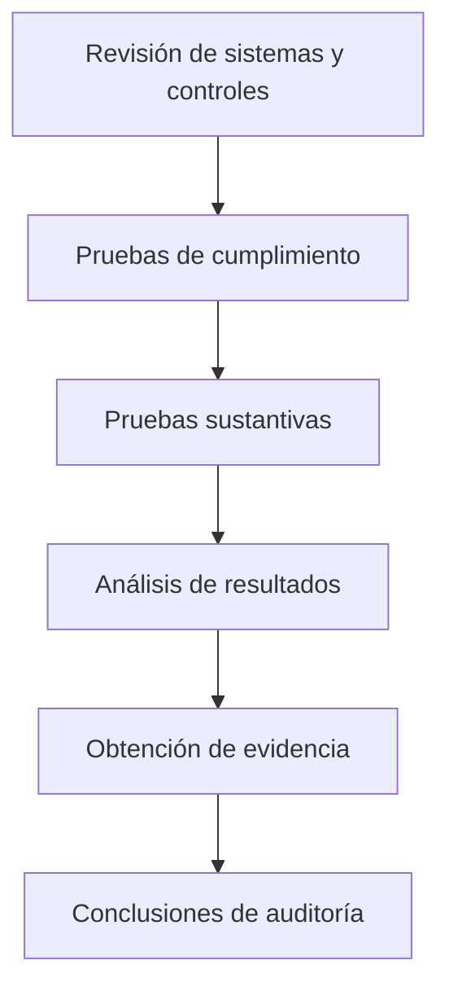

# Evidencia En Auditoría De Sistemas De Información

## 1. Introducción

La **evidencia de auditoría** es uno de los elementos más importantes dentro del proceso de auditoría.

Todas las **conclusiones de una auditoría deben estar respaldadas por evidencia**, ya que sin evidencia suficiente no es possible justificar los hallazgos ni las recomendaciones del auditor.

---

# 2. Definición De Evidencia

## Concepto

La **evidencia de auditoría** es cualquier información utilizada por el auditor para determinar si:

- Los sistemas
    
- Los procesos
    
- Los datos

cumplen con los **criterios, controles o objetivos establecidos**.

### Definición Formal

La evidencia es la **información que soporta las conclusiones de auditoría**.

Esto significa que:

- Las conclusiones del informe deben basarse en evidencia.
    
- Si no existe evidencia suficiente, **no se deben emitir conclusiones**.

---

# 3. Importancia De la Evidencia

La evidencia permite:

|Función|Explicación|
|---|---|
|Justificar conclusiones|Respaldar los hallazgos del auditor|
|Demostrar cumplimiento|Verificar si los controles funcionan|
|Evaluar riesgos|Identificar vulnerabilidades|
|Elaborar informes|Fundamentar el informe de auditoría|

En auditoría professional se exige que las conclusiones estén basadas en evidencia:

- **Suficiente**
    
- **Relevante**
    
- **Competente**

---

# 4. Planificación De la Evidencia

Durante la planificación de la auditoría el auditor debe decidir:

- Qué tipo de evidencia necesita
    
- Cómo la va a obtener
    
- Cuál será su nivel de fiabilidad

Esto depende de:

|Factor|Descripción|
|---|---|
|Objetivos de auditoría|Qué se quiere comprobar|
|Controles existentes|Qué controles se evaluarán|
|Nivel de confianza requerido|Fiabilidad de los resultados|

---

# 5. Proceso De Obtención De Evidencias

El proceso general para obtener evidencia en una auditoría puede representarse de la siguiente forma:

## Etapas Del Proceso

|Etapa|Descripción|
|---|---|
|Revisión de controles|Analizar controles existentes|
|Pruebas de cumplimiento|Verificar que los controles funcionan|
|Pruebas sustantivas|Evaluar directamente los datos|
|Análisis de resultados|Analizar los resultados obtenidos|
|Evidencias|Documentar los hallazgos|
|Conclusiones|Elaborar el informe de auditoría|

---

# 6. Pruebas De Auditoría

## 6.1 Pruebas De Cumplimiento

Las **pruebas de cumplimiento** verifican si los controles definidos en la organización **funcionan correctamente**.

Ejemplo:

- Verificar si se realizan backups según el procedimiento definido.

---

## 6.2 Pruebas Sustantivas

Las **pruebas sustantivas** se utilizan para evaluar directamente los datos o los resultados de un sistema.

Ejemplo:

- Revisar registros de actividad
    
- Analizar transacciones
    
- Validar saldos o registros

---

# 7. Características De la Evidencia

Para que la evidencia sea válida debe cumplir dos características principales.

## 7.1 Suficiencia

La **suficiencia** se refiere a la **cantidad de evidencia** obtenida.

Cuanta más evidencia exista, mayor será el nivel de confianza en los resultados.

Ejemplo:

Si se auditan **15,000 ordenadores**, no se revisan todos, sino una **muestra representativa**.

---

## 7.2 Competencia

La **competencia** se refiere a la **calidad y confiabilidad de la evidencia**.

Una evidencia competente debe:

- Basarse en hechos verificables
    
- Set objetiva
    
- Set fiable

---

# 8. Factores Que Afectan la Confiabilidad De la Evidencia

La calidad de la evidencia depende de varios factores.

|Factor|Descripción|
|---|---|
|Independencia|La evidencia debe provenir de fuentes independientes|
|Fuente|Credibilidad del proveedor de información|
|Objetividad|Basada en hechos verificables|
|Método de obtención|Procedimientos utilizados para obtenerla|

---

# 9. Tipos De Evidencia

Las evidencias pueden clasificarse en varios tipos.

## 9.1 Evidencia Física

Se obtiene mediante **inspección directa de elementos físicos**.

Ejemplos:

- Fotografías
    
- Inspección de infraestructura
    
- Verificación de dispositivos de seguridad

Ejemplo:

- Detectar que una cámara de seguridad tiene un punto ciego.

---

## 9.2 Evidencia Testimonial

Se obtiene mediante **entrevistas o declaraciones de personas**.

Ejemplos:

- Entrevistas a administradores de sistemas
    
- Declaraciones de responsables de seguridad

En este tipo de evidencia es importante evaluar:

- Experiencia del entrevistado
    
- Credibilidad
    
- Confianza en la fuente

---

## 9.3 Evidencia Documental

Se obtiene a partir de **documentación existente en la organización**.

Ejemplos:

- Políticas de seguridad
    
- Procedimientos
    
- Manuales
    
- Registros de actividad

---

## 9.4 Evidencia Analítica

Se obtiene mediante **herramientas técnicas o análisis automatizado**.

Ejemplos:

|Herramienta|Uso|
|---|---|
|Fortify|Análisis de código fuente|
|Metasploit|Pruebas de explotación|
|Escáneres de vulnerabilidades|Identificación de fallos de seguridad|

---

# 10. Métodos De Recopilación De Evidencia

Los auditores utilizan diferentes métodos para recopilar evidencias.

## 10.1 Revisión Documental

Consiste en analizar documentos relevantes.

Ejemplo:

- Procedimientos de backup
    
- Políticas de seguridad

---

## 10.2 Inspección

Consiste en observar directamente los sistemas o infraestructura.

Ejemplo:

- Verificar si los backups se realizan correctamente.

---

## 10.3 Observación

Consiste en observar cómo se ejecutan los procesos.

Ejemplo:

- Observar el proceso de recuperación de un backup.

---

## 10.4 Entrevistas

Se realizan entrevistas con:

- Administradores
    
- Responsables de seguridad
    
- Personal técnico

---

## 10.5 Procedimientos Analíticos

Se utilizan herramientas para analizar sistemas.

Ejemplos:

- Escaneo de vulnerabilidades
    
- Auditoría de aplicaciones web
    
- Análisis de logs

---

# 11. Muestreo En Auditoría

Cuando la población de elementos es muy grande, se utilize **muestreo estadístico**.

Ejemplo:

- 15,000 ordenadores en una organización.

En lugar de auditar todos los equipos, se selecciona una **muestra representativa**.

## Normas De Muestreo

Se pueden utilizar normas estadísticas como:

- **ISO 2859**

Esta norma permite determinar el tamaño de la muestra según:

|Parámetro|Descripción|
|---|---|
|Nivel de confianza|Fiabilidad del resultado|
|Tamaño de la población|Número total de elementos|
|Margen de error|Tolerancia al error|

Por ejemplo:

- Nivel de confianza del **99%**

Esto permite justificar técnicamente el tamaño de la muestra auditada.

---

# Resumen De Puntos Clave

- La **evidencia es la base de toda auditoría**.
    
- Las conclusiones deben basarse en **evidencia suficiente y competente**.
    
- Existen dos tipos principales de pruebas:
    
    - **Pruebas de cumplimiento**
        
    - **Pruebas sustantivas**
        
- La evidencia debe set:
    
    - Suficiente (cantidad)
        
    - Competente (calidad)
        
- Existen distintos tipos de evidencia:
    
    - Física
        
    - Testimonial
        
    - Documental
        
    - Analítica
        
- Los auditores utilizan diferentes métodos para recopilar evidencia:
    
    - Revisión documental
        
    - Inspección
        
    - Observación
        
    - Entrevistas
        
    - Procedimientos analíticos
        
- Cuando existen muchos elementos se utilize **muestreo estadístico**, apoyado por normas como **ISO 2859**.

---

## MicroTest

1. La evidencia es:
    
    - La respuesta: B. Un resultado de una prueba.
        
    - Justifacion: En auditoría, la evidencia se obtiene a partir de la aplicación de pruebas de auditoría. Es decir, el auditor realiza pruebas (de cumplimiento o sustantivas) y el resultado de esas pruebas constituye la evidencia que permite sustentar sus conclusiones. Por eso, la evidencia no es la prueba en sí, sino el resultado obtenido de ella.
		
2. Los determinantes para evaluar la confiabilidad de la evidencia de auditoría incluyen:
    
    - La respuesta: D. Todas las anteriores.
        
    - Justifacion: La confiabilidad de la evidencia depende de varios factores como la independencia de la fuente que proporciona la evidencia, las credenciales o competencia de la persona que proporciona la información y la objetividad de la evidencia. Todos estos elementos influyen en la calidad y confiabilidad de la evidencia obtenida.
        
3. Las evidencias tienen tres características:
    
    - La respuesta: A. Son pertinentes, fehacientes y suficientes.
        
    - Justifacion: Para que la evidencia de auditoría sea válida debe set pertinente (relacionada con el objetivo de auditoría), fehaciente o confiable (basada en hechos verificables) y suficiente (cantidad adecuada de evidencia para respaldar las conclusiones). Estas características garantizan que las conclusiones del auditor sean sólidas.