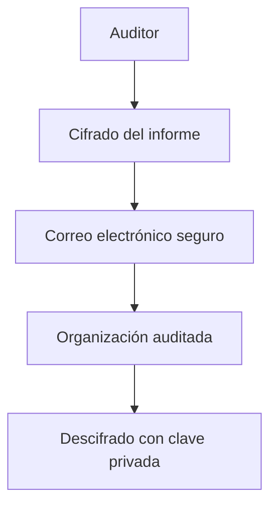

# Comunicación De Los Resultados De la Auditoría

## 1. Introducción

La **comunicación de resultados de una auditoría** es una fase clave dentro del proceso de auditoría. No solo consiste en presentar los hallazgos, sino en **establecer previamente un plan de comunicación** que defina cómo se compartirán los resultados con la organización auditada.

Un buen proceso de comunicación permite:

- Evitar malentendidos
    
- Proteger información sensible
    
- Facilitar la implementación de mejoras
    
- Presentar los resultados de forma clara y comprensible

Por ello, el **plan de comunicación debe incluirse dentro del plan de auditoría**.

---

# 2. Plan De Comunicación En la Auditoría

## Definición

El **plan de comunicación de auditoría** es el acuerdo que establece:

- **Cómo** se comunicarán los resultados
    
- **Cuándo** se comunicarán
    
- **Quiénes** serán los responsables de comunicarlos

Este plan se acuerda entre el **equipo auditor** y la **organización auditada**.

### Elementos Que Debe Incluir

|Elemento|Descripción|
|---|---|
|Responsables de comunicación|Personas autorizadas para transmitir información|
|Canales de comunicación|Correo, reuniones, teléfono, etc.|
|Frecuencia de comunicación|Reuniones iniciales, intermedias y finales|
|Seguridad de la información|Uso de cifrado y protección de datos sensibles|
|Formato de informes|Informes ejecutivos, anexos técnicos, presentaciones|

---

# 3. Seguridad En la Comunicación De Resultados

Durante la auditoría se manejan **datos altamente sensibles**, por lo que es fundamental proteger la información.

## Reglas Principales

- Nunca transmitir información sensible **en texto plano por internet**
    
- Cifrar los documentos enviados
    
- Firmar digitalmente los correos cuando sea possible

### Ejemplo De Mecanismos De Seguridad

|Mecanismo|Uso|
|---|---|
|Cifrado PGP|Proteger informes y documentos|
|Firma digital|Garantizar autenticidad del remitente|
|Claves públicas|Permitir intercambio seguro de información|

### Ejemplo De Flujo De Comunicación Segura

---

# 4. Responsables De la Comunicación

La comunicación debe realizarse **directamente entre los responsables designados**.

Normalmente:

|Rol|Responsabilidad|
|---|---|
|Director de auditoría|Comunicar los resultados|
|Responsible de la organización auditada|Recibir y gestionar los resultados|

Esto evita:

- Malentendidos
    
- Mensajes distorsionados
    
- Interpretaciones incorrectas

---

# 5. Canales De Comunicación En Una Auditoría

Los auditores pueden utilizar distintos medios de comunicación.

|Canal|Uso|
|---|---|
|Teléfono|Comunicación rápida|
|Correo electrónico cifrado|Envío de documentos|
|Comunicación verbal|Avisos urgentes|
|Reuniones|Discusión formal de resultados|

## Comunicación De Vulnerabilidades Críticas

Si durante la auditoría se detecta una **vulnerabilidad grave**, el auditor debe:

1. Informar inmediatamente.
    
2. Contactar directamente al responsible.
    
3. Permitir que la organización comience la mitigación.

---

# 6. Reuniones En El Proceso De Auditoría

Las auditorías suelen incluir **dos reuniones principales**.

## 6.1 Reunión Inicial (Kick-off)

Se realiza al inicio de la auditoría.

Objetivos:

- Presentar al equipo auditor
    
- Explicar alcance de la auditoría
    
- Definir reglas de comunicación
    
- Establecer calendario

---

## 6.2 Reunión Final

Es la reunión más importante del proceso de comunicación.

Objetivos:

- Presentar resultados de la auditoría
    
- Explicar hallazgos
    
- Discutir recomendaciones
    
- Acordar acciones correctivas

---

# 7. Formatos De Presentación De Resultados

Los resultados de auditoría se presentan generalmente en tres formatos.

## 7.1 Resumen Ejecutivo

El **resumen ejecutivo** es un informe breve dirigido a la alta dirección.

Características:

- Lenguaje claro
    
- Enfoque en impacto en el negocio
    
- Sin excesivo detalle técnico

### Objetivo

Permitir que los directivos comprendan rápidamente:

- Problemas detectados
    
- Riesgos para el negocio
    
- Recomendaciones principales

---

## 7.2 Informe Técnico Detallado

Los detalles técnicos se incluyen normalmente en **anexos**.

Contenido típico:

- Evidencias
    
- Detalles de vulnerabilidades
    
- Resultados de pruebas
    
- Datos técnicos

---

## 7.3 Presentación Visual

En la reunión final suele utilizarse una **presentación visual**.

Ejemplo:

- Presentación tipo PowerPoint
    
- Gráficos de riesgos
    
- Resumen de hallazgos

---

# 8. Discusión De Hallazgos Antes Del Informe Final

Antes de presentar los resultados a la **alta dirección**, el auditor debe discutir los hallazgos con el equipo directivo de la organización auditada.

## Objetivos De Esta Discusión

|Objetivo|Explicación|
|---|---|
|Validar hechos|Confirmar que los hallazgos son correctos|
|Evitar conflictos|Evitar sorpresas en la presentación final|
|Ajustar recomendaciones|Adaptarlas a la realidad del negocio|
|Definir acciones correctivas|Establecer medidas concretas|

---

# 9. Presentación Constructiva De Los Hallazgos

Los resultados de una auditoría deben presentarse de forma **constructiva**, no punitiva.

## Enfoque Correcto

- Mostrar problemas
    
- Explicar riesgos
    
- Proponer soluciones

## Enfoque Incorrecto

- Culpar a personas
    
- Presentar resultados de forma agresiva
    
- Crear conflictos con la organización

El objetivo de la auditoría es **ayudar a mejorar la organización**.

---

# 10. Recomendaciones Realistas

Las recomendaciones deben set **realistas y aplicables**.

Un error común es proponer soluciones técnicamente correctas pero **inviables económicamente o operativamente**.

## Ejemplo

Problema:

- Vulnerabilidad en una aplicación.

Solución ideal:

- Modificar código fuente.

Problema real:

- La aplicación pertenece a un proveedor externo.

Consecuencia:

- La modificación puede set muy costosa o impossible.

Por ello, el auditor debe proponer **alternativas viables**.

---

# 11. Plan De Acciones Correctivas

Durante la reunión final se deben acordar:

- Acciones correctivas
    
- Responsables
    
- Fechas de implementación

## Ejemplo De Estructura

|Hallazgo|Recomendación|Responsible|Fecha|
|---|---|---|---|
|Vulnerabilidad web|Implementar WAF|Equipo de seguridad|30 días|
|Falta de backups|Automatizar backups|Administrador TI|15 días|

---

# 12. Independencia Del Auditor

Un principio fundamental es que el auditor **debe mantener su independencia**.

## Regla Clave

El auditor **no debe prestar servicios de consultoría a la organización auditada**.

### Motivo

Si el auditor:

- Diseña soluciones
    
- Implementa controles
    
- Realiza consultoría

entonces **pierde su independencia**, lo que compromete la objetividad de futuras auditorías.

---

# Resumen De Puntos Clave

- La comunicación de resultados es una fase esencial de la auditoría.
    
- Debe existir un **plan de comunicación** dentro del plan de auditoría.
    
- La información sensible debe transmitirse **cifrada y protegida**.
    
- La comunicación debe realizarse entre **responsables designados**.
    
- Existen dos reuniones principales:
    
    - Reunión inicial
        
    - Reunión final
        
- Los resultados se presentan mediante:
    
    - Resumen ejecutivo
        
    - Informe técnico detallado
        
    - Presentación visual
        
- Los hallazgos deben presentarse de forma **constructiva**.
    
- Las recomendaciones deben set **realistas y aplicables**.
    
- El auditor debe mantener **independencia** y evitar prestar consultoría.

---

## MicroTest

1. La última fase de una auditoria es:
    
    - La respuesta: B. Comunicación de resultados bajo el plan de comunicación.
        
    - Justifacion: La fase final de una auditoría consiste en comunicar formalmente los resultados a la organización auditada siguiendo el plan de comunicación definido en el plan de auditoría. Esta etapa incluye la presentación de hallazgos, recomendaciones y conclusiones a la gerencia.
        
2. Las comunicaciones por correo con la organización auditada deberían:
    
    - La respuesta: B. Estar cifradas.
        
    - Justifacion: Durante una auditoría se manejan datos sensibles como vulnerabilidades, informes técnicos y resultados de seguridad. Por esta razón, los correos electrónicos deben enviarse cifrados (por ejemplo usando PGP) para evitar la exposición de información crítica a través de internet.
        
3. En cuanto a la reunión final de auditoría:
    
    - La respuesta: A. Provee al auditor de sistemas de información la oportunidad de discutir los hallazgos y las recomendaciones con la gerencia.
        
    - Justifacion: La reunión final es el memento clave en el que el auditor presenta los resultados de la auditoría y discute los hallazgos y recomendaciones con la gerencia de la organización auditada. Esto permite validar los resultados y acordar acciones correctivas.