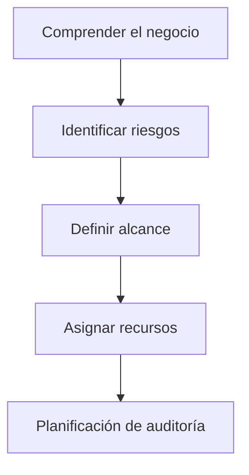
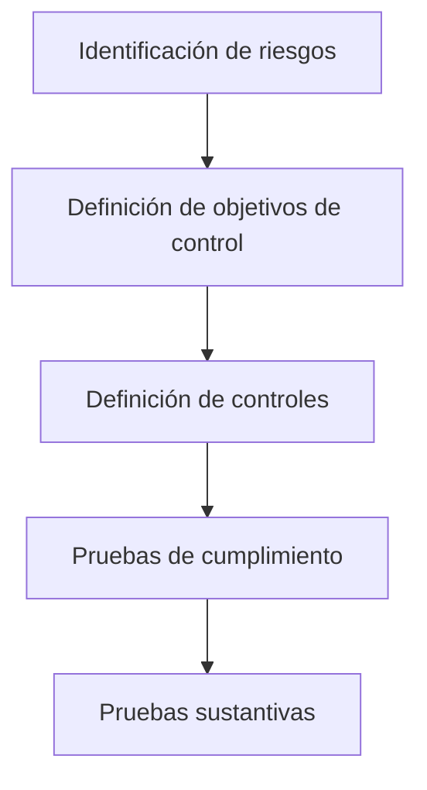

# Proceso De Auditoría De Sistemas De Información – Resumen Del Tema

## 1. Introducción Al Proceso De Auditoría De Sistemas De Información

La **auditoría de sistemas de información** es un proceso sistemático cuyo objetivo es evaluar:

- Los sistemas informáticos
    
- Los controles de seguridad
    
- La gestión de la información
    
- Los procesos tecnológicos

El propósito principal es determinar si los sistemas:

- Protegen adecuadamente la información
    
- Funcionan correctamente
    
- Cumplen con los objetivos de seguridad y control establecidos.

---

# 2. Estándares Y Certificaciones En Auditoría

Las auditorías de sistemas se basan en **estándares y buenas prácticas internacionales**.

## Principales Organizaciones Y Estándares

|Organización|Descripción|
|---|---|
|ISACA|Organización internacional dedicada a auditoría y gobierno de TI|
|ISO|Organización que desarrolla estándares internacionales|
|Common Criteria|Estándar internacional de evaluación de seguridad|

## Certificación CISA

La certificación **CISA (Certified Information Systems Auditor)** es una de las certificaciones más reconocidas a nivel internacional en auditoría de sistemas.

### Características

|Característica|Descripción|
|---|---|
|Organización|ISACA|
|Área|Auditoría de sistemas de información|
|Reconocimiento|Internacional|
|Objetivo|Certificar competencias en auditoría, control y seguridad de TI|

---

# 3. Herramientas Y Técnicas De Auditoría

Los auditores utilizan diferentes herramientas y técnicas para analizar sistemas.

## Técnicas De Auditoría

|Técnica|Descripción|
|---|---|
|Revisión|Análisis de documentación y configuraciones|
|Inspección|Verificación directa de sistemas|
|Entrevistas|Obtención de información del personal|
|Observación|Análisis del funcionamiento de procesos|
|Procedimientos analíticos|Uso de herramientas técnicas|

---

## Herramientas Utilizadas

Algunas herramientas permiten realizar **análisis automatizados de seguridad**.

|Herramienta|Uso|
|---|---|
|OpenVAS|Escaneo de vulnerabilidades|
|Fortify|Análisis de código fuente|
|Nmap|Escaneo de red|
|Metasploit|Pruebas de penetración|

---

# 4. Falsos Positivos Y Falsos Negativos

Las herramientas automáticas pueden generar resultados incorrectos.

## Falso Positivo

Un **falso positivo** ocurre cuando la herramienta detecta un problema que **realmente no existe**.

Ejemplo:

- El escáner detecta una vulnerabilidad inexistente.

## Falso Negativo

Un **falso negativo** ocurre cuando la herramienta **no detecta un problema real**.

Ejemplo:

- Existe una vulnerabilidad, pero el escáner no la identifica.

### Comparación

|Tipo|Descripción|Impacto|
|---|---|---|
|Falso positivo|Error detectado que no existe|Menor impacto|
|Falso negativo|Error real no detectado|Mayor riesgo|

Los **falsos negativos son más peligrosos**, porque generan una **falsa sensación de seguridad**.

---

# 5. Planificación De la Auditoría

La planificación es una etapa fundamental en la auditoría.

## Tipos De Planificación

|Tipo|Descripción|
|---|---|
|Planificación estratégica|Generalmente a 3 años|
|Planificación annual|Auditorías específicas del año|

En la práctica, la planificación suele modificarse debido a:

- Cambios en el negocio
    
- Nuevos riesgos
    
- Cambios tecnológicos

---

## Elementos Necesarios Para Planificar

Antes de planificar una auditoría es necesario definir el **alcance**.

### Alcance De Auditoría

El alcance define:

- Qué sistemas se auditarán
    
- Qué tecnologías se revisarán
    
- Qué procesos serán evaluados
    
- Qué áreas de la organización se analizarán

Ejemplos de alcance:

- Infraestructura tecnológica
    
- Políticas de seguridad
    
- Procedimientos operativos
    
- Sistemas de información

---

### Relación Entre Alcance Y Planificación

Sin un **alcance claramente definido**, la planificación de auditoría es prácticamente impossible.

---

# 6. Metodologías De Auditoría

Existen distintas metodologías para realizar auditorías.

## Metodología Basada En Riesgos

Una de las metodologías más comunes sigue el siguiente enfoque:

### Fases

|Fase|Descripción|
|---|---|
|Identificación de riesgos|Riesgos a los que está expuesta la organización|
|Objetivos de control|Qué se busca proteger|
|Controles|Mecanismos de mitigación|
|Pruebas de cumplimiento|Verificar que los controles existen|
|Pruebas sustantivas|Evaluar eficacia de los controles|

---

## Matriz De Auditoría

La auditoría suele documentarse mediante una **matriz de auditoría**.

|Riesgo|Control|Prueba|Resultado|Evidencia|
|---|---|---|---|---|

Esta matriz permite:

- Organizar el proceso de auditoría
    
- Documentar resultados
    
- Registrar evidencias

---

## Metodologías Basadas En Checklist

Otra metodología consiste en usar **listas de comprobación**.

Características:

- Muy utilizadas en auditoría
    
- Permiten verificar controles específicos
    
- Facilitan auditorías repetitivas

---

## Auditoría De Equipos Específicos

Para auditar dispositivos de seguridad se pueden usar metodologías específicas.

Ejemplos:

- Firewalls
    
- Sistemas IDS/IPS
    
- Dispositivos de red

### Common Criteria

El estándar **Common Criteria** es utilizado para evaluar seguridad de productos tecnológicos.

|Estándar|ISO 15408|
|---|---|

Este estándar define criterios de evaluación de seguridad para productos de TI.

---

# 7. Objetivos De Una Auditoría De Sistemas De Información

Los objetivos principales incluyen evaluar:

|Elemento|Evaluación|
|---|---|
|Información|Protección y disponibilidad|
|Sistemas de información|Funcionamiento correcto|
|Procesos|Gestión de la información|
|Usuarios|Uso adecuado de los sistemas|
|Herramientas|Software utilizado|

El auditor analiza **cómo se utilize la información dentro de la organización**.

---

# 8. Evidencias En Auditoría

La **evidencia** es la base de las conclusiones de una auditoría.

## Definición

La evidencia es la **información que respalda los hallazgos y conclusiones del auditor**.

---

## Gestión De Evidencias

Las evidencias deben:

- Set almacenadas
    
- Estar protegidas
    
- Mantener una cadena de custodia

La **cadena de custodia** permite garantizar:

- Integridad de la evidencia
    
- Trazabilidad
    
- Autenticidad

---

## Técnicas De Recopilación De Evidencia

|Técnica|Descripción|
|---|---|
|Revisión|Análisis de documentos|
|Inspección|Verificación física o técnica|
|Observación|Evaluación de procesos|
|Entrevistas|Información del personal|
|Procedimientos analíticos|Uso de herramientas técnicas|

---

# 9. Muestreo En Auditoría

Cuando existe un gran número de elementos, se utilizan **técnicas de muestreo**.

Ejemplo:

- 15,000 ordenadores en una organización.

No es possible auditar todos, por lo que se selecciona una **muestra representativa**.

---

## Tipos De Muestreo

|Tipo|Descripción|
|---|---|
|No estadístico|Selección sin base matemática|
|Estadístico|Basado en normas y probabilidad|

### Norma ISO 2859

La norma **ISO 2859** permite determinar:

- Tamaño de la muestra
    
- Nivel de confianza
    
- Nivel de error permitido

---

# 10. Comunicación De Resultados De Auditoría

Una parte esencial de la auditoría es **comunicar los resultados a la organización auditada**.

## Reuniones Principales

|Reunión|Objetivo|
|---|---|
|Reunión inicial|Presentar auditoría|
|Reunión final|Presentar resultados|

---

## Seguridad En la Comunicación

Cuando se envían resultados por correo electrónico:

- Deben **cifrarse**
    
- Debe utilizarse **PGP**

### Herramienta Mencionada

|Herramienta|Uso|
|---|---|
|PGP4Win|Cifrado de correos en Windows|

Esto protege información como:

- Vulnerabilidades
    
- Informes de auditoría
    
- Resultados de seguridad

---

# Resumen De Puntos Clave

- La auditoría de sistemas evalúa seguridad, controles y procesos tecnológicos.
    
- La certificación **CISA** es la más reconocida internacionalmente en auditoría de TI.
    
- Se utilizan herramientas como **OpenVAS, Fortify, Nmap y Metasploit**.
    
- Las herramientas pueden generar:
    
    - **Falsos positivos**
        
    - **Falsos negativos** (más peligrosos).
        
- La planificación de auditoría depende del **alcance definido**.
    
- Las metodologías pueden set:
    
    - Basadas en riesgos
        
    - Basadas en checklist.
        
- El estándar **Common Criteria (ISO 15408)** se utilize para evaluar seguridad de productos.
    
- Las **evidencias** respaldan las conclusiones de auditoría.
    
- Se utilizan técnicas de recopilación como revisión, inspección y entrevistas.
    
- Cuando hay muchos elementos se usa **muestreo estadístico (ISO 2859)**.
    
- Los resultados de auditoría deben comunicarse mediante reuniones y correos **cifrados con PGP**.

---

## MicroTest