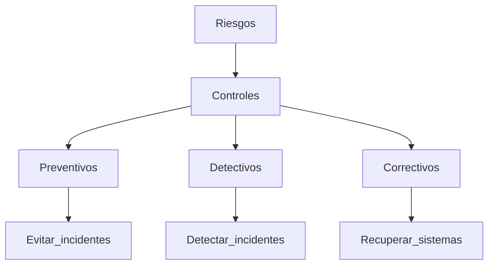

# Auditorías De la Seguridad De Infraestructura Física

## 1. Introducción

Las **auditorías de seguridad de infraestructura física** evalúan si las instalaciones donde se alojan los sistemas de información de una organización están adecuadamente protegidas contra diferentes tipos de riesgos.

Uno de los entornos más críticos dentro de una organización es el **Centro de Procesamiento de Datos (CPD)** o **Data Center**, donde se concentran los recursos necesarios para procesar, almacenar y transmitir información.

### Centro De Procesamiento De Datos (CPD)

**Definición**

Un **CPD** es una instalación física que alberga:

- Servidores
    
- Sistemas de almacenamiento
    
- Equipos de red
    
- Sistemas de alimentación eléctrica
    
- Sistemas de climatización
    
- Sistemas de seguridad

Su objetivo es **garantizar el procesamiento continuo y seguro de la información** de una organización.

### Infraestructura Física Y Ambiental

Un CPD require varios components de infraestructura:

|Componente|Función|
|---|---|
|Infraestructura física|Protege físicamente los sistemas|
|Climatización|Controla temperatura y humedad|
|Conectividad de red|Permite comunicación entre sistemas|
|Infraestructura eléctrica|Proporciona energía estable|
|Seguridad física|Evita accesos no autorizados|

---

## 2. Riesgos En la Infraestructura Física

Las instalaciones de TI están expuestas a múltiples tipos de riesgos.

### Clasificación De Riesgos

|Tipo de riesgo|Descripción|Ejemplos|
|---|---|---|
|Industriales|Fallos técnicos o condiciones físicas|Subidas de tensión, incendios|
|Errores humanos|Fallos por acciones accidentales|Apagar un interruptor eléctrico|
|Maliciosos|Acciones deliberadas de ataque|Intrusión física, ataques informáticos|
|Naturales|Eventos ambientales|Inundaciones, terremotos, huracanes|

Estos riesgos pueden afectar tres pilares fundamentales de la seguridad:

- **Confidencialidad**
    
- **Integridad**
    
- **Disponibilidad**

---

## 3. Controles De Seguridad En la Infraestructura

Para mitigar los riesgos, las organizaciones implementan **controles de seguridad**.

### Clasificación De Controles

Los controles pueden clasificarse según **su naturaleza** y **su tipo**.

|Tipo de control|Preventivo|Detectivo|Correctivo|
|---|---|---|---|
|Administrativo|Procesos de gestión de usuarios|Auditorías|Revocación de accesos|
|Técnico|Control de acceso lógico|Sistemas de detección de intrusiones|Segmentación de redes|
|Físico|Vallas o puertas blindadas|Sensores de movimiento|Puertas contra incendios|

### Tipos De Controles

**Controles administrativos**

Políticas, procedimientos y procesos organizativos que regulan la seguridad.

Ejemplos:

- Gestión de usuarios
    
- Auditorías
    
- Políticas de acceso

**Controles técnicos**

Se implementan mediante sistemas informáticos o tecnológicos.

Ejemplos:

- Control de acceso lógico
    
- Sistemas IDS (Intrusion Detection System)
    
- Segmentación de redes
    
- VPN

**Controles físicos**

Protegen las instalaciones físicamente.

Ejemplos:

- Vallas perimetrales
    
- Puertas blindadas
    
- Sensores de movimiento
    
- Sistemas antiincendios

### Relación Entre Controles Y Objetivos

---

## 4. Sistemas Que Deben Auditarse En la Infraestructura Física

Durante una auditoría, se deben revisar múltiples sistemas de seguridad.

### 4.1 Sistemas De Control De Acceso

Permiten restringir el acceso físico a áreas críticas.

Ejemplos:

- Tarjetas de acceso
    
- Sistemas biométricos
    
- Cerraduras electrónicas

Objetivo:

Garantizar que **solo el personal autorizado pueda acceder al CPD**.

---

### 4.2 Sistemas De Detección De Intrusiones

Detectan accesos no autorizados dentro o alrededor de la instalación.

Ejemplos:

- Sensores volumétricos
    
- Sistemas perimetrales
    
- Alarmas

---

### 4.3 Circuito Cerrado De Televisión (CCTV)

Sistema de vigilancia mediante cámaras.

Funciones:

- Monitorizar accesos
    
- Registrar eventos
    
- Servir como evidencia en incidentes

---

### 4.4 Sistemas De Protección contra Incendios

Previenen y controlan incendios dentro del centro de datos.

Ejemplos:

- Detectores de humo
    
- Sistemas de extinción automática
    
- Puertas contra incendios

---

### 4.5 Sistemas De Alimentación Eléctrica

Garantizan la disponibilidad energética.

Principales components:

|Sistema|Función|
|---|---|
|SAI (Sistema de Alimentación Ininterrumpida)|Mantiene la energía durante cortes breves|
|Generadores eléctricos|Proveen energía en cortes prolongados|
|Sistemas de distribución eléctrica|Distribuyen energía de forma segura|

---

### 4.6 Sistemas De Climatización De Precisión

Los centros de datos requieren **climatización especializada**, diferente a la doméstica.

Características:

- Control preciso de temperatura
    
- Control preciso de humedad
    
- Estabilidad térmica constante

Ejemplo de parámetros típicos:

|Parámetro|Valor aproximado|
|---|---|
|Temperatura|22 – 22.5 °C|
|Humedad|40 – 45 %|

La climatización adecuada evita:

- Sobrecalentamiento
    
- Fallos de hardware
    
- Condensación

---

### 4.7 Protección TEMPEST

**TEMPEST** se refiere a técnicas para proteger equipos contra **emanaciones electromagnéticas** que podrían set utilizadas para robar información.

#### Ejemplo De Ataque

Un atacante podría:

1. Colocar equipos de captura electromagnética fuera del edificio.
    
2. Detectar señales emitidas por monitores o dispositivos.
    
3. Reconstruir información mostrada en pantalla.

Este tipo de ataque:

- No deja rastros
    
- Puede realizarse desde cierta distancia
    
- Es difícil de detectar

---

## 5. Papel Del Auditor En la Infraestructura Física

El **auditor de seguridad** tiene como objetivo verificar que los controles implementados protegen adecuadamente los sistemas.

### Responsabilidades Principales

- Verificar que los **controles funcionan correctamente**
    
- Validar que existen **procedimientos documentados**
    
- Evaluar la **eficacia de las medidas de seguridad**
    
- Confirmar que se protege la:

|Pilar|Objetivo|
|---|---|
|Confidencialidad|Evitar acceso no autorizado|
|Integridad|Prevenir modificaciones indebidas|
|Disponibilidad|Garantizar continuidad del servicio|

---

## 6. Áreas De Auditoría En Infraestructura Física

Las auditorías suelen analizar diferentes áreas clave.

|Área|Elementos evaluados|
|---|---|
|Factores externos|Ubicación del CPD|
|Seguridad física|Puertas, paredes, accesos|
|Controles ambientales|Temperatura y humedad|
|Alimentación eléctrica|SAI y generadores|
|Protección contra incendios|Sistemas de detección y extinción|
|Protección TEMPEST|Control de emanaciones electromagnéticas|

---

## 7. Listas De Comprobación En Auditoría

Las auditorías utilizan **checklists** para asegurar que todos los aspectos relevantes son revisados.

### 7.1 Factores Externos

Aspectos a revisar:

- Alimentación eléctrica externa
    
- Iluminación exterior
    
- Orientación del edificio
    
- Cercado o vallado perimetral
    
- Características del vecindario

También se analiza:

- Distancia a servicios de emergencia
    
- Riesgos naturales de la zona

Ejemplos:

- Historial de huracanes
    
- Riesgo de inundaciones
    
- Actividad sísmica

---

### 7.2 Seguridad Física Del CPD

Elementos evaluados:

- Resistencia de paredes y puertas
    
- Sistemas de autenticación física
    
- Control de accesos

Ejemplo de evaluación:

|Elemento|Pregunta de auditoría|
|---|---|
|Puertas|¿Son resistentes y seguras?|
|Paredes|¿Protegen adecuadamente la instalación?|
|Acceso físico|¿Existe autenticación adecuada?|
|Controles de entrada|¿Funcionan correctamente?|

Una pared débil (por ejemplo, de materiales ligeros) podría facilitar una intrusión física.

---

## 8. Resumen De Puntos Clave

- El **CPD** es el núcleo de procesamiento de información de una organización.
    
- Las infraestructuras físicas enfrentan riesgos **industriales, humanos, maliciosos y naturales**.
    
- Los controles de seguridad se clasifican en **administrativos, técnicos y físicos**.
    
- También se dividen por su función en **preventivos, detectivos y correctivos**.
    
- Los sistemas clave que deben auditarse incluyen:
    
    - Control de acceso
        
    - Detección de intrusiones
        
    - CCTV
        
    - Protección contra incendios
        
    - Alimentación eléctrica
        
    - Climatización
        
    - Protección TEMPEST
        
- El auditor debe validar que los controles protegen la **confidencialidad, integridad y disponibilidad**.
    
- Las auditorías utilizan **listas de comprobación** para revisar factores externos, seguridad física y controles ambientales.

---

## MicroTest

1. Señala la respuesta incorrecta. Actualmente, los CPD concentran los recursos necesarios para el procesamiento de la información de una organización. Proporcionan una infraestructura física y ambiental en cuanto a temperatura y humedad, conectividad de red, energía eléctrica, protección contra incendios y seguridad física. Afrontan riesgos de distinta naturaleza, algunos están relacionados con:
    
    - La respuesta: D. Ninguna de las anteriores.
        
    - Justifacion: Los CPD afrontan riesgos relacionados con acciones malintencionadas, problemas industriales y errores humanos, tal como se menciona en el contenido del tema. Por lo tanto, todas las opciones A, B y C son correctas, y la opción incorrecta es “Ninguna de las anteriores”.
        
2. Señala la respuesta incorrecta. De acuerdo con ISACA, los controles de seguridad física pueden clasificarse de la siguiente forma:
    
    - La respuesta: A. Normativa.
        
    - Justifacion: Según la clasificación presentada por ISACA en el material, los controles se dividen en administrativos, técnicos y físicos. “Normativa” no forma parte de esta clasificación específica, por lo que es la opción incorrecta.
        
3. En relación con los controles de seguridad física, un sistema de detección de intrusiones se puede clasificar como:
    
    - La respuesta: B. Técnico y detectivo.
        
    - Justifacion: Un sistema de detección de intrusiones (IDS) es un control técnico porque se implementa mediante tecnología y software especializado. Además, es detectivo porque su función principal es identificar intentos de intrusión o actividad sospechosa, no prevenirlos directamente ni corregirlos.