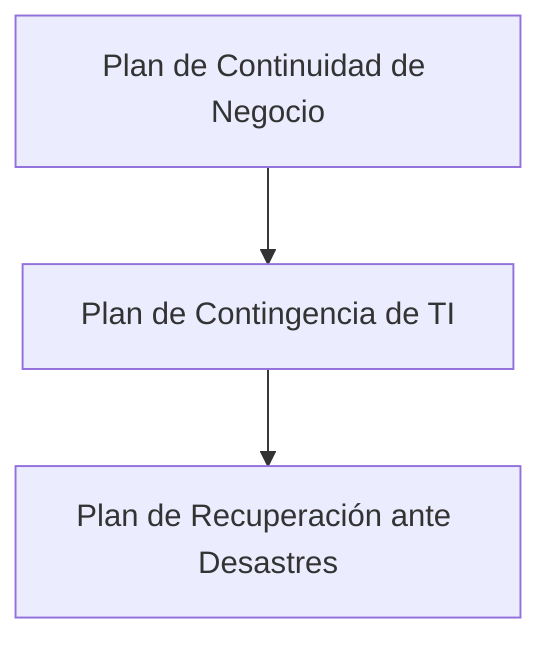
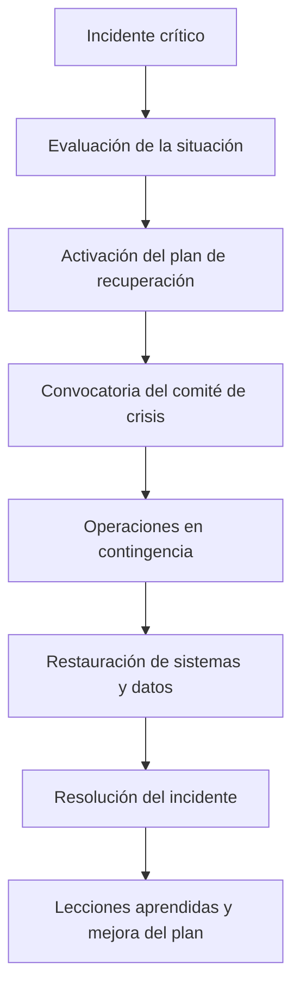
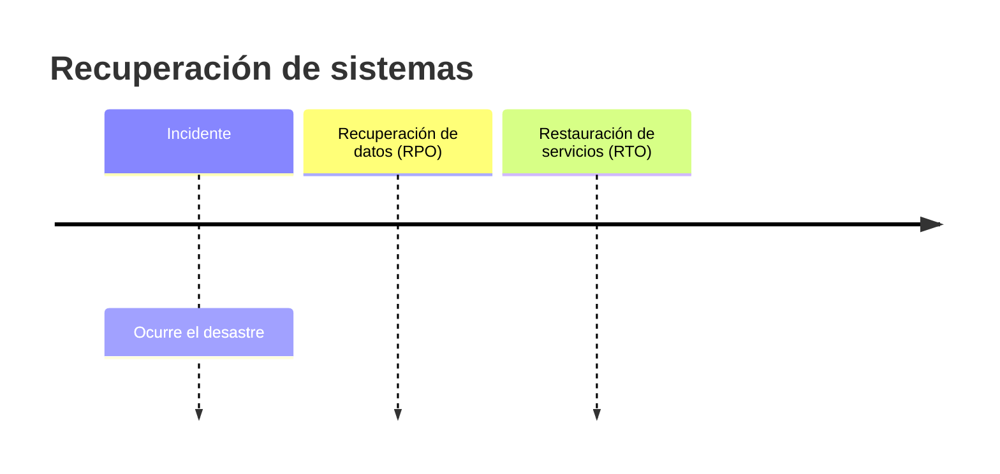

# Auditorías De Sistemas De Recuperación Ante Desastres

## 1. Introducción

Los **Centros de Procesamiento de Datos (CPD)** de cualquier organización están expuestos a diversos riesgos, tales como:

- Desastres naturales (terremotos, huracanes, incendios).
    
- Incidentes causados por el set humano (errores, sabotaje, ataques informáticos).

Por esta razón, las organizaciones deben contar con **planes estructurados** que permitan mantener la operación del negocio incluso ante eventos críticos.

El elemento central para lograr esto es el **Plan de Continuidad de Negocio**.

---

## 2. Plan De Continuidad De Negocio (BCP)

### Definición

El **Plan de Continuidad de Negocio (Business Continuity Plan - BCP)** es un conjunto de estrategias y procedimientos que permiten a una organización **continuar operando durante o después de un incidente grave**.

Su objetivo principal es **garantizar la continuidad de los procesos críticos del negocio**.

### Estructura Del Plan De Continuidad

El BCP está compuesto por varios planes especializados.

|Plan|Descripción|
|---|---|
|Plan de Continuidad de Negocio|Estrategia global para asegurar que la organización siga operando ante incidentes graves|
|Plan de Contingencia de TI|Define cómo mantener operativos los sistemas de información|
|Plan de Recuperación ante Desastres (DRP)|Procedimientos para restaurar sistemas después de un desastre|

### Importancia En Auditoría

En auditoría de seguridad informática, el foco principal suele set el **Plan de Recuperación ante Desastres (DRP)**.

Este incluye:

- Procedimientos
    
- Hardware
    
- Software
    
- Documentación
    
- Personal
    
- Soporte logístico

Todo orientado a **restaurar los sistemas de información**.

---

## 3. Plan De Recuperación Ante Desastres (Disaster Recovery Plan - DRP)

### Definición

Un **Plan de Recuperación ante Desastres** es un conjunto de procedimientos que permiten **restaurar los sistemas de información después de un evento disruptivo**.

Según INCIBE, un plan de contingencia consiste en:

- Recursos de respaldo
    
- Organización de emergencia
    
- Procedimientos de actuación

Su objetivo es lograr una **restauración ordenada, progresiva y ágil de los sistemas de información** que soportan los procesos críticos del negocio.

---

## 4. Cronología De Un Incidente

Cuando ocurre un incidente crítico, debe seguirse una secuencia organizada de acciones.

### Pasos Principales

1. **Detección del incidente**
    
2. **Evaluación inicial**
    
3. **Activación del plan de recuperación**
    
4. **Formación del comité de crisis**
    
5. **Operación en modo contingencia**
    
6. **Restauración de sistemas y servicios**
    
7. **Análisis posterior y mejora del plan**

---

## 5. Métricas Clave De Recuperación

En los planes de recuperación se definen dos indicadores fundamentales:

|Métrica|Definición|Enfoque|
|---|---|---|
|RPO (Recovery Point Objective)|Memento más reciente al que se pueden recuperar los datos|Datos|
|RTO (Recovery Time Objective)|Tiempo máximo acceptable para restaurar los servicios|Servicios|

### Relación Entre RPO Y RTO

Primero se recuperan los **datos**, luego se restablecen los **servicios**.

---

## 6. Técnicas De Recuperación Según El RPO

|Técnica|Tiempo de recuperación de datos|
|---|---|
|Mirroring / replicación en tiempo real|Menos de 1 hora|
|Backups en disco|1 a 4 horas|
|Replicación retardada|1 a 4 horas|
|Backups en cinta|4 a 24 horas|

### Explicación

**Mirroring (replicación en tiempo real)**

- Los datos se duplican simultáneamente en otro sistema.
    
- Permite recuperación casi inmediata.

**Backups en disco**

- Copias frecuentes almacenadas en almacenamiento secundario.

**Backups en cinta**

- Método tradicional, más económico pero con recuperación más lenta.

---

## 7. Estrategias De Recuperación Según El RTO

|Estrategia|Tiempo de recuperación de servicios|
|---|---|
|Clúster activo-activo|Menos de 1 hora|
|Activo-pasivo|1 a 4 horas|
|Cold standby|4 a 24 horas|

### Descripción

**Activo-Activo**

- Dos centros de datos operan simultáneamente.
    
- Alta disponibilidad.

**Activo-Pasivo**

- Un sistema principal y otro de respaldo.
    
- El secundario se activa cuando falla el principal.

**Cold Standby**

- Infraestructura preparada pero apagada.
    
- Require tiempo para activarse.

---

## 8. Elementos Que Debe Container El Plan De Recuperación

Un DRP debe incluir:

1. Identificación de **actividades críticas del negocio**
    
2. Identificación de **escenarios de riesgo**
    
3. Evaluación de riesgos por escenario
    
4. Identificación de **personas afectadas**
    
5. Definición de **roles y responsabilidades**
    
6. Definición de **controles y herramientas**
    
7. Evaluación posterior del incidente

---

## 9. Escenarios De Crisis

|Escenario|Ejemplo|
|---|---|
|Indisponibilidad de instalaciones|Daño estructural del edificio|
|Indisponibilidad de personal|Pandemia|
|Fallo tecnológico|Ataque hacker|
|Fallo de proveedores|Caída del proveedor cloud|
|Crisis reputacional|Fuga de información|

Cualquier evento que afecte significativamente al negocio puede convertirse en una **crisis empresarial**.

---

## 10. Controles En Auditoría De Recuperación

Durante una auditoría se verifican diversos controles.

### Resiliencia Del Sistema

- Verificar redundancia de hardware
    
- Verificar duplicación de sistemas críticos

### Copias De Seguridad

|Control|Descripción|
|---|---|
|Procedimientos de backup|Validar que existan y se ejecuten|
|Restauración de datos|Probar recuperación desde backups|
|Recuperación externa|Verificar acceso a copias externas|
|Recuperación de archivos vitales|Evaluar capacidad de recuperación|

Una auditoría debe incluir **pruebas reales de restauración**, no solo revisión documental.

---

## 11. Causas De Activación Del Plan De Recuperación

El DRP puede activarse por diversas causas.

|Causa|Descripción|
|---|---|
|Pérdida de conectividad de red|Especialmente en sistemas cloud|
|Caída de sistemas críticos|Sistemas clave para el negocio|
|Pérdida del centro de datos|Incendios, desastres naturales|
|Pérdida de datos críticos|Corrupción o eliminación|
|Fallo de proveedor|Servicios externos indisponibles|

---

## 12. Pruebas Del Plan De Recuperación

Para garantizar su efectividad, el plan debe set probado regularmente.

### Tipos De Pruebas

|Tipo de prueba|Descripción|Impacto|
|---|---|---|
|Prueba de escritorio|Simulación teórica|Nulo|
|Simulacro de crisis|Ejercicio coordinado con roles|Bajo|
|Interrupción parcial|Detención de algunos servicios|Medio|
|Interrupción total|Parada completa del sistema|Alto|

### Características

**Prueba de escritorio**

- Discusión del plan paso a paso.

**Simulación de crisis**

- Simulación realista de un incidente.

**Interrupción parcial**

- Se detienen algunos sistemas para probar recuperación.

**Interrupción total**

- Simulación completa de desastre.

---

## 13. Buenas Prácticas En DRP

1. Mantener el plan **actualizado**.
    
2. Realizar **pruebas periódicas**.
    
3. Definir claramente **roles y responsabilidades**.
    
4. Documentar **lecciones aprendidas**.
    
5. Garantizar **redundancia en sistemas críticos**.

---

# Resumen De Puntos Clave

- Los **CPD** pueden verse afectados por desastres naturales o incidentes humanos.
    
- El **Plan de Continuidad de Negocio** garantiza la continuidad operativa.
    
- Dentro de este plan se encuentra el **Plan de Contingencia de TI**, que incluye el **Plan de Recuperación ante Desastres**.
    
- El **DRP** define cómo restaurar sistemas y datos después de un incidente.
    
- Dos métricas fundamentales son:
    
    - **RPO:** punto de recuperación de datos.
        
    - **RTO:** tiempo de recuperación de servicios.
        
- Las técnicas de recuperación incluyen:
    
    - replicación
        
    - backups
        
    - clústeres de alta disponibilidad.
        
- Las auditorías verifican controles como:
    
    - redundancia
        
    - copias de seguridad
        
    - pruebas de restauración.
        
- El plan debe probarse mediante simulaciones o interrupciones controladas.
    
- Después de cada incidente o prueba deben registrarse **lecciones aprendidas**.

---

## MicroTest

1. Un auditor de seguridad que revisa el plan de recuperación ante desastres de una organización debería verificar que sea:
    
    - La respuesta: B. Revisado y actualizado periódicamente.
        
    - Justifacion: Un plan de recuperación ante desastres debe mantenerse actualizado para reflejar cambios en la infraestructura, sistemas, riesgos y procesos del negocio. Si no se revisa y actualiza periódicamente, el plan puede volverse obsoleto y no funcionar correctamente cuando ocurra un incidente. Aunque probarlo o comunicarlo es importante, el requisito fundamental que un auditor debe verificar es que el plan se revise y actualice regularmente.
        
2. Si el objetivo del tiempo de recuperación (RTO) aumenta:
    
    - La respuesta: A. La tolerancia al desastre aumenta.
        
    - Justifacion: El RTO (Recovery Time Objective) define el tiempo máximo acceptable para restaurar los servicios después de un desastre. Si el RTO aumenta, significa que la organización puede tolerar más tiempo sin servicio, es decir, tiene mayor tolerancia al desastre. En estos casos normalmente se pueden usar soluciones de recuperación más simples y menos costosas.
        
3. Señala a qué corresponde la siguiente definición: «Una estrategia planificada en fases, constituida por un conjunto de recursos de respaldo, una organización de emergencia y unos procedimientos de actuación, encaminados a conseguir una restauración ordenada, progresiva y ágil de los sistemas de información que soportan la información y los procesos de negocio considerados críticos para la empresa».
    
    - La respuesta: C. Plan de contingencia de las tecnologías de la información y las comunicaciones (TIC).
        
    - Justifacion: La definición corresponde específicamente al plan de contingencia de TIC, que según organismos como INCIBE se describe como una estrategia estructurada que incluye recursos de respaldo, organización de emergencia y procedimientos para restaurar los sistemas de información de forma ordenada y progresiva, garantizando la continuidad de los procesos críticos del negocio.