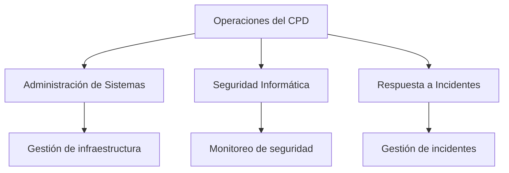

# Auditoría De Las Operaciones En Un CPD

## 1. Introducción a la Auditoría De Operaciones

### Definición

La **auditoría de las operaciones de un CPD (Centro de Procesamiento de Datos)** es el proceso de evaluación sistemática de las políticas, procedimientos y controles operativos que garantizan que el centro de datos funcione de manera **eficiente, segura y disponible**.

### Objetivo

El objetivo principal es verificar que el CPD opere bajo condiciones que garanticen:

- Seguridad física y lógica
    
- Continuidad del servicio
    
- Uso eficiente de los recursos
    
- Cumplimiento de políticas y procedimientos establecidos

### Importancia

Un CPD es el núcleo tecnológico de muchas organizaciones. Una mala gestión operativa puede provocar:

- Pérdida de datos
    
- Interrupciones del servicio
    
- Incidentes de seguridad
    
- Costos operativos elevados

---

## 2. Políticas, Procedimientos Y Planes Operativos

Para que un CPD funcione correctamente, deben existir **documentos formales que regulen su operación**.

### Components Principales

|Elemento|Descripción|Importancia|
|---|---|---|
|Políticas|Normas generales que regulan la operación del CPD|Establecen reglas y estándares|
|Procedimientos|Pasos detallados para ejecutar tareas operativas|Garantizan consistencia|
|Planes|Estrategias para responder a situaciones específicas|Preparación ante incidentes|

### Ejemplos De Planes Necesarios

- Plan de mantenimiento
    
- Plan de respuesta a incidentes
    
- Plan de recuperación ante desastres
    
- Plan de capacidad

---

## 3. Vigilancia Y Seguridad De Las Instalaciones

### Definición

La **vigilancia de las instalaciones** consiste en implementar mecanismos que protejan físicamente el CPD contra accesos no autorizados o incidentes.

### Controles Típicos

- Cámaras de seguridad
    
- Sistemas de control de acceso
    
- Alarmas
    
- Monitoreo físico de instalaciones

### Relevancia En Auditoría

El auditor debe verificar que:

- Los sistemas de seguridad estén instalados.
    
- Las alarmas estén activas y monitoreadas continuamente.
    
- Existan registros de acceso a las instalaciones.

---

## 4. Roles Y Responsabilidades Del Personal

### Definición

Las **responsabilidades del personal** determinan qué tareas realiza cada miembro del equipo del CPD.

### Importancia

Una estructura clara de responsabilidades permite:

- Mejor control operativo
    
- Mayor seguridad
    
- Reducción de errores humanos

### Aspectos Que Debe Revisar Una Auditoría

- Funciones claramente definidas
    
- Personal capacitado
    
- Asignación adecuada de responsabilidades

---

## 5. Segregación De Funciones

### Definición

La **segregación de funciones** es un principio de control interno que establece que **una sola persona no debe tener control total sobre procesos críticos**.

### Objetivo

Reducir riesgos de:

- Fraude
    
- Abuso de privilegios
    
- Errores operativos

### Ejemplo

|Función|Responsible|
|---|---|
|Operación del CPD|Equipo de operaciones|
|Respuesta a incidentes|Equipo de seguridad|
|Administración de sistemas|Equipo de sistemas|

---

### Relación Entre Roles Y Segregación

---

## 6. Planes De Emergencia Y Desastres

### Definición

Los **planes de emergencia y desastres** son procedimientos diseñados para responder ante eventos que puedan afectar la continuidad del CPD.

### Ejemplos De Emergencias

- Incendios
    
- Fallos eléctricos
    
- Desastres naturales
    
- Ataques cibernéticos

### Elementos Que Debe Verificar Una Auditoría

- Existencia de planes documentados
    
- Personal capacitado para ejecutarlos
    
- Simulacros realizados periódicamente

---

## 7. Mantenimiento De Equipos

### Definición

El **mantenimiento de equipos** consiste en realizar actividades preventivas y correctivas para garantizar el funcionamiento adecuado del hardware del CPD.

### Registro De Mantenimiento

Cada equipo debe contar con un **registro o historial de mantenimiento** donde se documente:

- Fecha de intervención
    
- Tipo de mantenimiento
    
- Técnico responsible
    
- Observaciones

### Beneficios

- Prevención de fallos
    
- Mayor disponibilidad
    
- Mejor gestión de recursos

---

## 8. Planificación De Capacidad

### Definición

La **planificación de capacidad** consiste en prever la demanda futura de recursos del CPD para garantizar que los sistemas continúen funcionando sin interrupciones.

### Recursos a Planificar

- Servidores
    
- Almacenamiento
    
- Ancho de banda
    
- Energía eléctrica

### Impacto En Seguridad

Una mala planificación puede provocar:

- Caídas del sistema
    
- Sobrecarga de servidores
    
- Baja disponibilidad de servicios

---

## 9. Gestión De Activos E Inventario

### Definición

La **gestión de activos** consiste en controlar y registrar todos los recursos tecnológicos del CPD.

### Activos Incluidos

- Hardware
    
- Software
    
- Dispositivos de red
    
- Licencias

### Objetivo Del Inventario

Saber:

- Qué recursos existen
    
- Dónde están
    
- Quién los utilize
    
- Su estado operativo

### Importancia En Ciberseguridad

El inventario es uno de los controles fundamentales porque:

- Permite detectar equipos no autorizados
    
- Facilita la gestión de vulnerabilidades
    
- Mejora el control de licencias

---

## 10. Almacenamiento Fuera De Línea (Offline Storage)

### Definición

El **almacenamiento fuera de línea** consiste en guardar copias de información o backups en medios que **no estén conectados permanentemente a la red**.

### Ejemplos

- Cintas de respaldo
    
- Discos externos
    
- Almacenamiento seguro externo

### Buenas Prácticas

- Los medios deben estar claramente **etiquetados con su contenido**
    
- Deben almacenarse **fuera del CPD**
    
- Deben existir controles de acceso

### Beneficios

- Protección contra ataques ransomware
    
- Mayor resiliencia ante desastres
    
- Recuperación segura de datos

---

## 11. Lista De Verificación De Auditoría Operativa Del CPD

Durante una auditoría se revisan varios controles operativos.

### Controles Principales

|Control|Objetivo|
|---|---|
|Sistema de alarmas y monitoreo|Detectar incidentes rápidamente|
|Sistema de gestión de red y aplicaciones|Identificar problemas operativos|
|Roles del personal definidos|Claridad en responsabilidades|
|Segregación de funciones|Reducir riesgos|
|Procedimientos de emergencia|Responder ante incidentes|
|Controles de operación|Garantizar eficiencia|
|Mantenimiento de equipos|Mantener disponibilidad|
|Formación del personal|Mejorar capacidades|
|Planificación de capacidad|Evitar saturación|
|Gestión de activos|Control de inventario|
|Almacenamiento offline|Protección de datos|

---

## 12. Capacitación Del Personal

### Importancia

El personal del CPD debe recibir **formación continua** para cumplir correctamente sus responsabilidades.

### Elementos Que Debe Verificar Una Auditoría

- Existencia de un plan de formación
    
- Registro de cursos realizados
    
- Formación acorde al rol del empleado

### Ejemplos De Capacitación

- Seguridad informática
    
- Gestión de incidentes
    
- Operación de sistemas
    
- Continuidad del negocio

---

# Resumen De Puntos Clave

- La auditoría de operaciones evalúa la **eficiencia y seguridad del funcionamiento del CPD**.
    
- Un CPD require **políticas, procedimientos y planes operativos bien definidos**.
    
- La **seguridad física** incluye cámaras, control de acceso y monitoreo continuo.
    
- Es fundamental definir **roles y responsabilidades del personal**.
    
- La **segregación de funciones** evita que una sola persona controle procesos críticos.
    
- Los **planes de emergencia y desastres** permiten mantener la continuidad operativa.
    
- El **mantenimiento de equipos** garantiza la disponibilidad de los sistemas.
    
- La **planificación de capacidad** previene sobrecargas del sistema.
    
- La **gestión de activos e inventario** es un control clave en ciberseguridad.
    
- El **almacenamiento offline** protege los datos ante incidentes graves o ciberataques.
    
- La **formación continua del personal** es esencial para mantener la seguridad operativa.

---

## MicroTest

1. Señalar la respuesta incorrecta. En relación con las auditorias de las operaciones, se deberían cubrir las siguientes áreas:
    
    - La respuesta: B. Funciones y responsabilidades del personal del centro de seguridad.
        
    - Justificación: En la auditoría de operaciones del CPD se revisan las funciones y responsabilidades del **personal del centro de datos**, no específicamente del centro de seguridad. Las otras opciones (vigilancia de instalaciones, segregación de tareas y respuesta a emergencias) sí forman parte directa de las áreas que se auditan en las operaciones del CPD.
        
2. Señalar la respuesta incorrecta. En relación con las auditorias de las operaciones, se deberían cubrir las siguientes áreas:
    
    - La respuesta: B. Planificación de la capacidad de la organización.
        
    - Justificación: La auditoría de operaciones revisa la **planificación de capacidad del CPD o centro de datos**, no la planificación de capacidad de toda la organización. Las otras opciones (mantenimiento, gestión de activos y almacenamiento fuera de línea) sí son áreas directamente auditadas dentro de las operaciones del CPD.
        
3. La auditoría de la seguridad operativa o técnica abarca los conceptos de:
    
    - La respuesta: C. Seguridad física, lógica y las operaciones.
        
    - Justificación: La **auditoría de seguridad operativa o técnica** se centra en evaluar los controles que garantizan el funcionamiento seguro de los sistemas y del entorno tecnológico. Esto incluye la **seguridad física (protección de instalaciones), seguridad lógica (controles de acceso, autenticación, sistemas) y las operaciones del CPD**. Las otras opciones incluyen elementos que no corresponden exactamente a la clasificación estándar de la auditoría operativa o técnica.