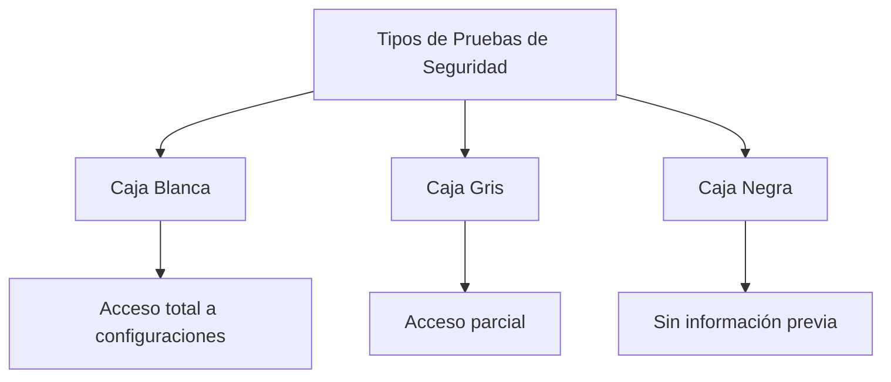
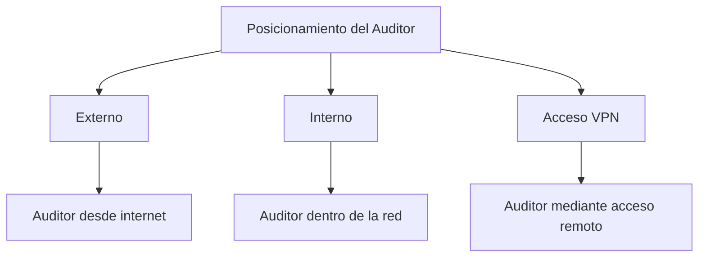
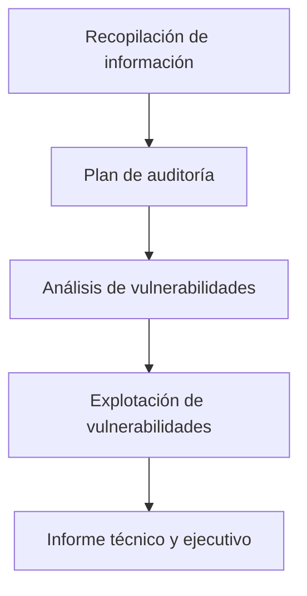

# Auditorías Técnicas De Seguridad

## 1. Introducción a Las Auditorías Técnicas De Seguridad

### Definición

Las **auditorías técnicas de seguridad** son evaluaciones especializadas destinadas a analizar el **nivel de seguridad de los sistemas de información, telecomunicaciones y servicios tecnológicos** de una organización.

Estas auditorías buscan identificar vulnerabilidades, errores de configuración y debilidades en la infraestructura tecnológica.

### Objetivo

El objetivo principal es:

- Evaluar la **seguridad real de los sistemas**
    
- Detectar **vulnerabilidades técnicas**
    
- Validar la **configuración de seguridad**
    
- Determinar el **riesgo de ataques**

### Método Utilizado

Para lograrlo se utilizan **baterías de pruebas planificadas** que simulan el comportamiento de un atacante.

Estas pruebas permiten observar cómo reaccionan los sistemas ante ataques reales.

---

## 2. Simulación Del Comportamiento De Un Atacante

Las auditorías técnicas suelen incluir **pruebas de ataque controladas**.

### Características

- Simulan técnicas usadas por hackers
    
- Identifican vulnerabilidades explotables
    
- Permiten validar configuraciones de seguridad

### Relación Con Seguridad Del Software

Estas pruebas están relacionadas con conceptos de **seguridad en el desarrollo de software**, donde se evalúan aplicaciones simulando ataques para comprobar su resistencia.

---

## 3. Tipos De Auditorías Técnicas De Seguridad

Existen múltiples tipos de auditorías técnicas enfocadas en diferentes components del sistema.

### Tabla De Tipos De Auditoría

|Tipo de auditoría|Descripción|
|---|---|
|Auditoría de sistemas|Evalúa sistemas de información y bases de datos, incluyendo configuraciones administrativas|
|Auditoría de redes|Analiza la arquitectura de red, conexiones externas y seguridad de comunicaciones|
|Pruebas de penetración|Simulan ataques reales para intentar acceder a sistemas|
|Auditoría de aplicaciones web|Analiza vulnerabilidades en aplicaciones web mediante pruebas dinámicas|
|Auditoría de redes WiFi|Evalúa la seguridad de redes inalámbricas|
|Auditoría de seguridad perimetral|Analiza firewalls, IDS, arquitectura de red y controles perimetrales|
|Auditoría de aplicaciones móviles|Evalúa aplicaciones móviles y su interacción con servicios externos|
|Pruebas de denegación de servicio|Analizan la resistencia del sistema ante ataques DoS|
|Auditoría de sistemas VoIP|Analiza sistemas de telefonía IP basados en protocolos como SIP|

### Importancia

Cada tipo de auditoría se centra en **components específicos de la infraestructura tecnológica**, permitiendo un análisis completo del entorno de seguridad.

---

## 4. Auditoría De Sistemas De Información

### Definición

Consiste en evaluar **sistemas corporativos críticos** que gestionan información relevante de la organización.

### Ejemplos De Sistemas Auditados

- Sistemas de nómina
    
- Sistemas de gestión empresarial
    
- Sistemas administrativos
    
- Bases de datos corporativas

### Características

- Se require **acceso administrativo**
    
- Se revisan **configuraciones del sistema**
    
- Se analizan **vulnerabilidades técnicas**

---

## 5. Auditoría De Redes

### Objetivo

Analizar la **arquitectura de red** y verificar la seguridad de las comunicaciones.

### Elementos Analizados

- Segmentación de redes
    
- Conexiones a internet
    
- Rutas de comunicación
    
- Configuración de dispositivos de red

### Riesgo Común Detectado

Un problema frecuente es la existencia de **conexiones a internet no controladas**, lo que puede permitir accesos no autorizados.

---

## 6. Pruebas De Penetración (Pentesting)

### Definición

Las **pruebas de penetración** son simulaciones de ataques informáticos realizadas por auditores para evaluar la capacidad de defensa de los sistemas.

### Objetivo

- Obtener acceso no autorizado
    
- Identificar vulnerabilidades explotables
    
- Evaluar controles de seguridad

### Proceso General

1. Identificación de vulnerabilidades
    
2. Explotación de vulnerabilidades
    
3. Escalada de privilegios
    
4. Documentación de resultados

---

## 7. Auditoría De Aplicaciones Web

### Definición

Consiste en analizar la seguridad de aplicaciones web para detectar vulnerabilidades.

### Método Principal

Se utilizan **pruebas de análisis dinámico (Dynamic Application Security Testing - DAST)**.

Estas pruebas analizan el comportamiento de la aplicación mientras está en ejecución.

### Vulnerabilidades Comunes

- Inyección SQL
    
- Cross-Site Scripting (XSS)
    
- Fallos de autenticación
    
- Exposición de datos sensibles

---

## 8. Auditoría De Redes WiFi

### Objetivo

Evaluar la seguridad de redes inalámbricas.

### Aspectos Revisados

- Protocolos de seguridad (WPA2, WPA3)
    
- Configuración de acceso
    
- Posibilidad de intrusión inalámbrica

### Metodología Utilizada

Una metodología común es **WISAN**, utilizada para evaluar redes inalámbricas.

---

## 9. Auditoría De Seguridad Perimetral

### Definición

Evalúa los mecanismos que protegen la red interna frente a amenazas externas.

### Elementos Analizados

- Firewalls
    
- IDS/IPS
    
- Arquitectura de red
    
- Segmentación de redes
    
- Procedimientos de seguridad

### Objetivo

Detectar posibles **puntos de acceso no controlados** hacia la red interna.

---

## 10. Auditoría De Aplicaciones Móviles

### Enfoque Principal

- Análisis del **código fuente**
    
- Revisión de **configuraciones**
    
- Verificación de conexiones con servicios externos

### Riesgos Analizados

- Exposición de datos
    
- Autenticación insegura
    
- Conexiones no cifradas

---

## 11. Pruebas De Denegación De Servicio (DoS)

### Definición

Las pruebas de **Denegación de Servicio (DoS)** evalúan la capacidad de un sistema para resistir ataques que buscan **saturar los recursos y provocar la caída del servicio**.

### Recomendación Práctica

Estas pruebas deberían realizarse **antes de que ocurra un ataque real**, como parte de una auditoría preventiva.

---

## 12. Auditoría De Sistemas VoIP

### Definición

Evalúa la seguridad de los sistemas de **telefonía IP**.

### Protocolo Principal

El protocolo más utilizado en estos sistemas es:

- **SIP (Session Initiation Protocol)**

### Aspectos Auditados

- Configuración del sistema
    
- Seguridad de comunicaciones
    
- Autenticación

---

# 13. Clasificación De Pruebas: Caja Blanca, Caja Gris Y Caja Negra

Las auditorías técnicas pueden clasificarse según el **nivel de información disponible para el auditor**.

## Tabla De Clasificación

|Tipo|Acceso a información|Características|
|---|---|---|
|Caja blanca|Acceso total|Se conocen sistemas, configuraciones y arquitectura|
|Caja gris|Acceso parcial|Se tiene información limitada|
|Caja negra|Sin acceso|Se simula un atacante externo|

## Relación Conceptual

---

# 14. Clasificación De Auditorías Según El Tipo De Prueba

## Caja Blanca

|Auditoría|Motivo|
|---|---|
|Auditoría de sistemas|Require acceso a configuración|
|Auditoría de redes|Se revisa arquitectura|
|Auditoría de aplicaciones|Se analiza código y configuración|
|Auditoría móvil|Se require acceso al sistema|
|Auditoría VoIP|Se analizan configuraciones|

## Caja Gris

|Auditoría|Característica|
|---|---|
|Pruebas de penetración|Información parcial del sistema|

## Caja Negra

|Auditoría|Característica|
|---|---|
|Aplicaciones web (análisis dinámico)|No se accede al código|
|Redes WiFi|Ataque desde el exterior|
|Pruebas de penetración externas|Simulación de atacante externo|
|Pruebas de denegación de servicio|Ataque sin acceso interno|

---

# 15. Posicionamiento Del Auditor

Las auditorías técnicas pueden realizarse desde diferentes posiciones dentro o fuera de la organización.

## Tipos De Posicionamiento

|Tipo|Descripción|
|---|---|
|Externo|Auditoría desde fuera de la organización|
|Interno|Auditoría desde dentro de la red|
|A través de VPN|Auditoría mediante acceso remoto|

## Ejemplos

- Ataques desde internet
    
- Ataques desde una red interna
    
- Intentos de movimiento lateral entre redes

---

## Diagrama De Posicionamiento

---

# 16. Fases Generales De Una Auditoría Técnica

Las auditorías técnicas siguen un proceso estructurado.

## Tabla De Fases

|Fase|Descripción|
|---|---|
|Recopilación de información|Obtención de datos sobre sistemas y redes|
|Plan de auditoría|Definición de pruebas y alcance|
|Análisis de vulnerabilidades|Identificación de debilidades|
|Explotación de vulnerabilidades|Intento controlado de explotación|
|Elaboración de informe|Documentación de resultados|

---

## Flujo Del Proceso

---

# 17. Autorización Para Realizar Auditorías

## Importancia

Antes de iniciar cualquier auditoría técnica es **obligatorio contar con autorización formal**.

## Elementos Que Debe Incluir la Autorización

|Elemento|Descripción|
|---|---|
|Alcance de las pruebas|Sistemas y redes que se auditarán|
|Tipo de pruebas permitidas|Por ejemplo, pentesting|
|Recursos utilizados|Herramientas y técnicas|
|Sistemas autorizados|Equipos que pueden set evaluados|

## Riesgo De no Tener Autorización

Sin autorización, las pruebas podrían:

- Provocar **inestabilidad en los sistemas**
    
- Interrumpir servicios
    
- Set consideradas **ataques ilegales**

---

# Resumen De Puntos Clave

- Las auditorías técnicas de seguridad evalúan el nivel de protección de los **sistemas de información y telecomunicaciones**.
    
- Se utilizan **pruebas que simulan ataques reales** para detectar vulnerabilidades.
    
- Existen distintos tipos de auditorías: **sistemas, redes, aplicaciones web, móviles, WiFi, VoIP y pruebas de penetración**.
    
- Las pruebas se clasifican en **caja blanca, caja gris y caja negra**, según el acceso a información.
    
- Las auditorías pueden realizarse desde **posiciones externas, internas o mediante VPN**.
    
- El proceso de auditoría incluye **recopilación de información, análisis de vulnerabilidades, explotación y elaboración de informes**.
    
- Es obligatorio contar con **autorización formal antes de realizar pruebas técnicas**, especialmente pentesting.

---

## MicroTest

1. Tipo de auditoria en la que se simulan ataques reales, pero conociendo de antemano gran parte de la información técnica. Se tiene un conocimiento limitado de los activos y las defensas que los protegen y se simula un ataque que puede set realizado por un miembro de la organización interno desde la red interna.
    
    - La respuesta: C. Caja gris.
        
    - Justificación: Las pruebas **de caja gris** se caracterizan porque el auditor tiene **acceso parcial a la información del sistema**, como ciertos datos técnicos o conocimiento limitado de la infraestructura. Esto simula el comportamiento de un **usuario interno o atacante con información previa**, lo cual coincide con la descripción del enunciado.
        
2. De acuerdo con el concepto de visibilidad, las auditorias de seguridad se clasifican en:
    
    - La respuesta: A. Pruebas de caja blanca, negra y gris.
        
    - Justificación: Según el **nivel de visibilidad o conocimiento del sistema**, las auditorías de seguridad se clasifican en **caja blanca (acceso total a información), caja gris (acceso parcial) y caja negra (sin información previa)**. Esta clasificación es el estándar utilizado en auditorías técnicas y pruebas de penetración.
        
3. Las pruebas de penetración son del tipo:
    
    - La respuesta: D. Todas las anteriores.
        
    - Justificación: Las **pruebas de penetración (pentesting)** pueden realizarse en modalidad **caja blanca, caja gris o caja negra**, dependiendo del nivel de información que se proporcione al auditor. Cada modalidad permite simular distintos escenarios de ataque, desde atacantes externos hasta usuarios internos con acceso parcial o completo al sistema.