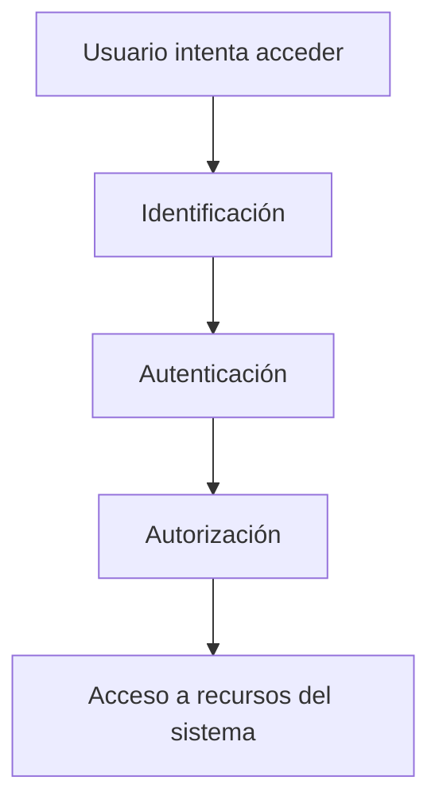

# Auditoría Del Acceso Lógico

## 1. Introducción Al Acceso Lógico

### Definición

El **acceso lógico** se refiere al conjunto de **mecanismos y controles de seguridad que regulan quién puede acceder a sistemas, redes, aplicaciones y datos dentro de una organización**.

Estos controles determinan:

- Qué usuarios pueden acceder a un sistema
    
- Qué recursos pueden utilizar
    
- Qué acciones pueden realizar

### Importancia En Seguridad De la Información

El acceso lógico es uno de los **controles primarios de protección de los activos de información**.

Su objetivo principal es evitar:

- Accesos no autorizados
    
- Uso indebido de sistemas
    
- Exposición de datos sensibles

Un fallo común en muchas organizaciones ocurre cuando **usuarios que ya no trabajan en la empresa siguen teniendo acceso a los sistemas**, lo que representa un riesgo grave de seguridad.

---

## 2. Objetivo De la Auditoría Del Acceso Lógico

La **auditoría del acceso lógico** tiene como objetivo evaluar si los mecanismos de control de acceso son **adecuados, eficientes y efectivos**.

### Actividades Principales Del Auditor

1. Comprender los **riesgos de seguridad** asociados a los sistemas de información.
    
2. Identificar las **rutas potenciales de acceso** a sistemas y redes.
    
3. Evaluar los **controles existentes** sobre dichas rutas.
    
4. Probar la efectividad de los controles de acceso.
    
5. Analizar los resultados de pruebas y evidencias de auditoría.
    
6. Comparar los controles con **estándares y buenas prácticas de seguridad**.

---

## 3. Evaluación Del Entorno De Control De Acceso

El auditor debe analizar el **ambiente de control de acceso** para determinar si los controles cumplen los objetivos de seguridad.

### Elementos Evaluados

|Elemento|Descripción|
|---|---|
|Políticas de seguridad|Normas que regulan el acceso a sistemas|
|Procedimientos|Métodos para otorgar, modificar o revocar accesos|
|Controles técnicos|Sistemas de autenticación y autorización|
|Evidencias de auditoría|Registros y resultados de pruebas|

---

## 4. Autenticación Y Identificación De Usuarios

### Definición

La **autenticación** es el proceso mediante el cual un sistema **verifica la identidad de un usuario**.

La **identificación** consiste en asignar a cada usuario un **identificador único**.

### Mecanismo Básico De Autenticación

El método más común en las organizaciones es:

- **Usuario único**
    
- **Contraseña segura**

### Mejores Prácticas

Un sistema de autenticación seguro debe incluir:

- Identificadores únicos por usuario
    
- Contraseñas seguras
    
- Políticas de complejidad

### Métodos De Autenticación Más Seguros

|Método|Descripción|
|---|---|
|Contraseña|Método básico de autenticación|
|Tarjetas inteligentes|Dispositivos físicos para autenticación|
|Autenticación multifactor|Combina varios métodos de verificación|

---

## 5. Autorización De Acceso

### Definición

La **autorización** determina **qué acciones puede realizar un usuario después de haber sido autenticado**.

Esto incluye:

- Acceso a datos
    
- Ejecución de funciones
    
- Modificación de información

### Principio De Mínimo Privilegio

Los usuarios deben tener **solo los permisos estrictamente necesarios para realizar su trabajo**.

### Ejemplo

|Usuario|Permisos|
|---|---|
|Administrador|Control total del sistema|
|Empleado|Acceso limitado a funciones específicas|
|Auditor|Acceso de lectura a registros|

---

## 6. Control De Accesos Administrativos

### Importancia

Las cuentas de **administrador** poseen privilegios elevados y representan un objetivo prioritario para los atacantes.

### Controles Recomendados

- Monitoreo constante de cuentas administrativas
    
- Registro de actividades
    
- Control estricto de privilegios

### Riesgo

Si una cuenta administrativa es comprometida, un atacante puede:

- Acceder a todos los sistemas
    
- Modificar configuraciones
    
- Acceder a información crítica

---

## 7. Gestión Del Ciclo De Vida De Los Accesos

El acceso a los sistemas debe gestionarse durante **todo el ciclo de vida del usuario dentro de la organización**.

### Procesos Clave

|Proceso|Objetivo|
|---|---|
|Alta de usuario|Crear cuentas cuando un empleado se incorpora|
|Modificación de permisos|Ajustar accesos según el rol|
|Baja de usuario|Eliminar accesos cuando ya no son necesarios|

### Situaciones Que Requieren Revocar Accesos

- Terminación del contrato laboral
    
- Cambio de puesto dentro de la organización
    
- Finalización de proyectos

---

## 8. Políticas De Contraseñas

### Definición

Las **políticas de contraseñas** establecen reglas que garantizan la seguridad de las credenciales de acceso.

### Reglas Comunes

- Longitud mínima (por ejemplo 12–14 caracteres)
    
- Uso de mayúsculas y minúsculas
    
- Inclusión de números
    
- Uso de caracteres especiales

### Ejemplo De Política

|Regla|Ejemplo|
|---|---|
|Longitud mínima|12 caracteres|
|Complejidad|Letras, números y símbolos|
|Cambio periódico|Cada 90 días|

---

## 9. Control De Sesiones E Inactividad

### Definición

Los sistemas deben cerrar automáticamente las sesiones cuando un usuario permanece **inactivo durante un período determinado**.

Este mecanismo se conoce como **timeout de sesión**.

### Objetivo

Evitar accesos no autorizados en equipos que quedan abiertos sin supervisión.

### Ejemplo

|Situación|Acción del sistema|
|---|---|
|Usuario inactivo 15 minutos|Cierre automático de sesión|
|Nuevo acceso|Usuario debe autenticarse nuevamente|

---

## 10. Cifrado De Datos En El Control De Acceso

### Definición

El **cifrado** es una técnica que protege la información transformándola en un formato que solo puede set leído por usuarios autorizados.

### Aplicación En Acceso Lógico

Se utilize para proteger:

- Contraseñas
    
- Datos de autenticación
    
- Información transmitida durante el acceso

### Beneficios

- Protección contra interceptación de datos
    
- Mayor seguridad en la autenticación

---

## 11. Monitoreo Y Revisión De Logs

### Definición

Los **logs de acceso** son registros que documentan las actividades realizadas dentro de un sistema.

### Información Registrada

- Intentos de inicio de sesión
    
- Accesos exitosos
    
- Intentos fallidos
    
- Acceso a recursos

### Importancia En Auditoría

La revisión de logs permite detectar:

- Intentos de intrusión
    
- Accesos sospechosos
    
- Fallos de autenticación

---

## 12. Lista De Verificación De Auditoría Del Acceso Lógico

### Controles Que Debe Revisar El Auditor

|Control|Objetivo|
|---|---|
|Identificación única de usuarios|Garantizar trazabilidad|
|Autenticación segura|Verificar identidad|
|Autorización adecuada|Controlar permisos|
|Gestión de cuentas|Administrar ciclo de vida de accesos|
|Políticas de contraseña|Fortalecer seguridad|
|Timeout de sesión|Evitar accesos indebidos|
|Cifrado de datos|Proteger credenciales|
|Revisión de logs|Detectar incidentes|

---

## 13. Relación Entre Identificación, Autenticación Y Autorización

### Explicación Del Proceso

1. **Identificación**: el usuario se identifica mediante un ID.
    
2. **Autenticación**: el sistema verifica su identidad (contraseña u otro método).
    
3. **Autorización**: el sistema determina qué recursos puede utilizar.

---

# Resumen De Puntos Clave

- El **acceso lógico** controla quién puede acceder a sistemas y datos dentro de una organización.
    
- La auditoría del acceso lógico evalúa la **efectividad de los controles de acceso**.
    
- Los controles principales incluyen **identificación, autenticación y autorización**.
    
- Es fundamental aplicar el **principio de mínimo privilegio** para limitar los permisos de los usuarios.
    
- Las **cuentas administrativas** deben estar estrictamente monitorizadas.
    
- La gestión del ciclo de vida de accesos incluye **alta, modificación y baja de usuarios**.
    
- Las **políticas de contraseñas** deben exigir credenciales complejas.
    
- Los sistemas deben implementar **timeout de sesión** para evitar accesos indebidos.
    
- El **cifrado protege las credenciales y datos sensibles**.
    
- Los **logs de acceso** permiten detectar actividades sospechosas.

---

## MicroTest

1. Cuando se revisa la seguridad de acceso lógico de una organización, ¿cuál se los siguientes sería de más preocupación para el auditor de seguridad?
    
    - La respuesta: B. Los archivos de contraseña están encriptados.
        
    - Justificación: En este tipo de pregunta se busca identificar el control **menos preocupante para el auditor**, es decir, una situación que representa una **buena práctica de seguridad**. Que **los archivos de contraseñas estén encriptados** es un control adecuado porque protege las credenciales frente a accesos no autorizados o filtraciones. Las otras opciones representan situaciones potencialmente más problemáticas desde el punto de vista del control del acceso lógico.
        
2. Señala la respuesta incorrecta. A la hora de auditar el acceso lógico a las redes y sistemas de una organización, el auditor debe:
    
    - La respuesta: D. Evaluar el ambiente de control de acceso para determinar si se logran los objetivos del negocio analizando los resultados de las pruebas y otras evidencias de auditoría.
        
    - Justificación: La auditoría del acceso lógico se centra en evaluar **objetivos de seguridad y control**, no directamente los **objetivos del negocio**. Las otras opciones corresponden correctamente a tareas del auditor: comprender riesgos, evaluar controles de acceso y probar su efectividad.
        
3. Señala la respuesta incorrecta. ¿Cuál de los siguientes controles no lo es del acceso lógico?
    
    - La respuesta: C. Verificar que la aplicación tenga los controles del análisis estático de código.
        
    - Justificación: El **análisis estático de código** pertenece al ámbito de **seguridad del desarrollo de software o auditorías de aplicaciones**, no a controles de acceso lógico. Los otros controles (gestión de accesos, eliminación de cuentas y timeout de sesión) sí forman parte directa del control del acceso lógico.