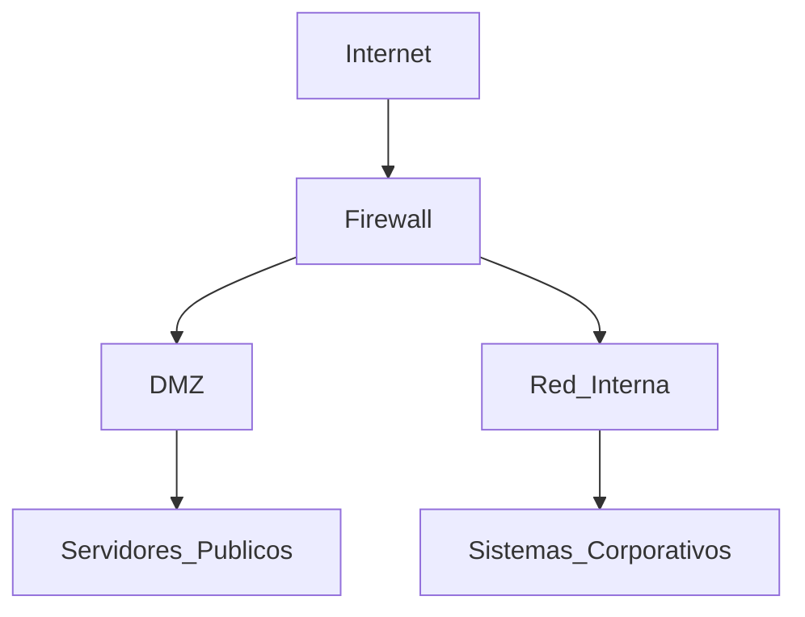
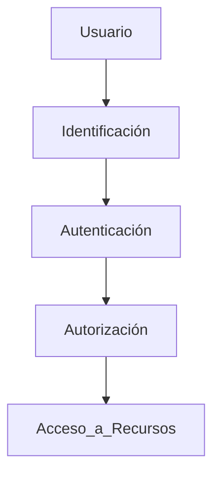

# Resumen Del Tema 9: Auditorías Operativas Y Técnicas En Ciberseguridad

## 1. Introducción Al Tema

El tema aborda las **principales auditorías operativas y técnicas** que se realizan en el ámbito de la **ciberseguridad** dentro de una organización.

Estas auditorías permiten evaluar:

- La seguridad de la infraestructura tecnológica
    
- La continuidad del negocio
    
- La protección de los activos de información
    
- La efectividad de los controles de seguridad

Las áreas principales analizadas son:

1. Seguridad de la infraestructura física
    
2. Recuperación ante desastres
    
3. Auditoría de operaciones del CPD
    
4. Auditorías técnicas de seguridad
    
5. Auditoría del acceso lógico

---

# 2. Auditoría De Seguridad De la Infraestructura Física

## Definición

La **auditoría de la infraestructura física** evalúa los controles y sistemas que protegen físicamente los centros de datos y sistemas informáticos de una organización.

Su objetivo es evitar accesos no autorizados, daños físicos o interrupciones de servicio.

## Sistemas De Seguridad Evaluados

|Sistema|Función|
|---|---|
|Sistemas de detección de intrusiones físicas|Detectan accesos no autorizados|
|CCTV (Circuito Cerrado de Televisión)|Monitoreo visual mediante cámaras|
|Sistemas de gestión de seguridad|Supervisión centralizada de seguridad|
|Sistemas eléctricos redundantes|Garantizan continuidad energética|
|Sistemas UPS (SAI)|Alimentación ininterrumpida|
|Generadores eléctricos|Respaldo ante fallos eléctricos|
|Sistemas de climatización de precisión|Control de temperatura en CPD|
|Protección perimetral|Control de accesos al perímetro|

## Amenazas a la Infraestructura Física

Los CPD pueden verse afectados por diferentes tipos de amenazas:

|Tipo de amenaza|Ejemplo|
|---|---|
|Desastres naturales|Terremotos, inundaciones|
|Errores humanos|Fallos operativos|
|Actos intencionales|Sabotaje|
|Accidentes industriales|Incendios|

---

# 3. Auditoría De Recuperación Ante Desastres

## Definición

La **auditoría de recuperación ante desastres (Disaster Recovery Audit)** evalúa la capacidad de una organización para **recuperar sus sistemas tras un incidente grave**.

El elemento principal auditado es el **Plan de Recuperación ante Desastres (DRP)**.

---

## Conceptos Clave

### RTO – Recovery Time Objective

Tiempo máximo permitido para recuperar un sistema después de un desastre.

RTO = \text{Tiempo máximo acceptable para restaurar un servicio}

### RPO – Recovery Point Objective

Cantidad máxima de datos que una organización está dispuesta a perder.

RPO = \text{Máxima pérdida de datos acceptable medida en tiempo}

---

## Tipos De Pruebas Del Plan De Recuperación

|Tipo de prueba|Descripción|
|---|---|
|Simulación|Evaluación teórica del plan|
|Prueba parcial|Se prueban components específicos|
|Prueba completa|Interrupción real de sistemas para validar el plan|

---

# 4. Auditoría De Las Operaciones Del CPD

## Definición

La **auditoría de operaciones del CPD (Centro de Procesamiento de Datos)** evalúa los procesos operativos que garantizan el funcionamiento seguro y eficiente del centro de datos.

---

## Control De Inventario

Uno de los controles más importantes en seguridad es la **gestión del inventario de activos**.

### Activos Controlados

- Hardware
    
- Software
    
- Equipos de red
    
- Sistemas operativos
    
- Aplicaciones

### Importancia Del Inventario

El inventario permite saber:

- Qué recursos existen
    
- Dónde están
    
- Quién los usa
    
- Qué recursos no deberían existir

Un riesgo frecuente es encontrar **hardware o software no autorizado**, lo cual puede representar una vulnerabilidad de seguridad.

---

# 5. Auditorías Técnicas De Seguridad

## Definición

Las **auditorías técnicas de seguridad** analizan el nivel de protección de los sistemas tecnológicos mediante pruebas técnicas.

Estas auditorías permiten detectar vulnerabilidades antes de que sean explotadas.

---

## Tipos De Auditorías Técnicas

|Auditoría|Objetivo|
|---|---|
|Auditoría de sistemas|Evaluar sistemas de información|
|Auditoría de redes|Analizar seguridad de redes LAN y WAN|
|Pruebas de penetración|Simular ataques reales|
|Auditoría de aplicaciones web|Detectar vulnerabilidades web|
|Auditoría de redes WiFi|Evaluar seguridad inalámbrica|
|Auditoría de seguridad perimetral|Revisar firewalls y arquitectura de red|
|Auditoría de aplicaciones|Analizar código fuente|
|Auditoría VoIP|Evaluar sistemas de telefonía IP|
|Auditoría de dispositivos móviles|Revisar seguridad en móviles|
|Pruebas de denegación de servicio|Analizar resistencia a ataques DoS|

---

## Auditoría De Aplicaciones Web

En estas auditorías se utilizan **pruebas de análisis dinámico (DAST)**.

### Características

- Se envían peticiones maliciosas a la aplicación
    
- Se detectan vulnerabilidades durante la ejecución

### Ejemplos De Vulnerabilidades

- SQL Injection
    
- Cross-Site Scripting
    
- Exposición de datos

---

## Auditoría De Redes WiFi

Las redes inalámbricas representan un punto de entrada frecuente para atacantes.

### Riesgo Común

Un atacante puede crear un **punto de acceso falso (Evil Twin)**.

Funcionamiento:

1. El atacante crea un punto de acceso con el mismo nombre de la red.
    
2. Los usuarios se conectan automáticamente.
    
3. El atacante captura credenciales.

---

# 6. Auditoría De Seguridad Perimetral

## Definición

La seguridad perimetral protege la red interna frente a amenazas externas.

### Elementos Analizados

- Firewalls
    
- IDS/IPS
    
- Arquitectura de red
    
- DMZ (zona desmilitarizada)

---

## Arquitectura De Seguridad Perimetral

---

# 7. Auditoría De Sistemas VoIP

## Definición

La auditoría de **VoIP (Voice over IP)** analiza la seguridad de los sistemas de telefonía basados en IP.

### Protocolo Principal

SIP – **Session Initiation Protocol**

Este protocolo gestiona:

- Establecimiento de llamadas
    
- Control de sesiones de voz

---

# 8. Auditoría De Seguridad En Dispositivos Móviles

## Objetivo

Evaluar la seguridad de dispositivos móviles utilizados en la organización.

### Aspectos Evaluados

- Configuración del dispositivo
    
- Seguridad de las aplicaciones
    
- Conexiones a redes externas
    
- Protección de datos

---

# 9. Pruebas De Denegación De Servicio (DoS)

## Definición

Las pruebas de **Denegación de Servicio (DoS)** analizan la capacidad de los sistemas para resistir ataques que intentan **saturar los recursos del sistema**.

### Importancia

Estas pruebas deberían realizarse **de forma preventiva**, antes de que ocurra un ataque real.

---

# 10. Auditoría Del Acceso Lógico

## Definición

La auditoría del **acceso lógico** evalúa los controles que regulan el acceso a sistemas y datos.

---

## Controles Clave

|Control|Función|
|---|---|
|Autenticación|Verifica identidad|
|Autorización|Determina permisos|
|Gestión de cuentas|Controla altas y bajas de usuarios|
|Políticas de contraseña|Protegen credenciales|
|Registro de accesos|Permite auditoría de actividades|

---

## Problema Frecuente En Organizaciones

Un error común es **no revocar accesos cuando un empleado abandona la organización**.

Esto puede provocar accesos no autorizados incluso años después.

---

## Proceso De Control De Acceso

---

# Resumen De Puntos Clave

- Las auditorías operativas y técnicas evalúan la **seguridad de sistemas, operaciones e infraestructura**.
    
- La auditoría de **infraestructura física** revisa sistemas de seguridad, energía y protección del CPD.
    
- La auditoría de **recuperación ante desastres** analiza el plan DRP y conceptos como **RTO y RPO**.
    
- La auditoría de **operaciones del CPD** destaca la importancia del **inventario de activos**.
    
- Las **auditorías técnicas de seguridad** incluyen pentesting, auditorías de redes, aplicaciones web, WiFi y VoIP.
    
- Las **redes WiFi** pueden set vulnerables a ataques de puntos de acceso falsos.
    
- Las auditorías de **seguridad perimetral** revisan firewalls, IDS y arquitectura de red.
    
- Las pruebas de **denegación de servicio** evalúan la resiliencia de los sistemas.
    
- La auditoría de **acceso lógico** verifica autenticación, autorización y gestión de cuentas.

---

## MicroTest