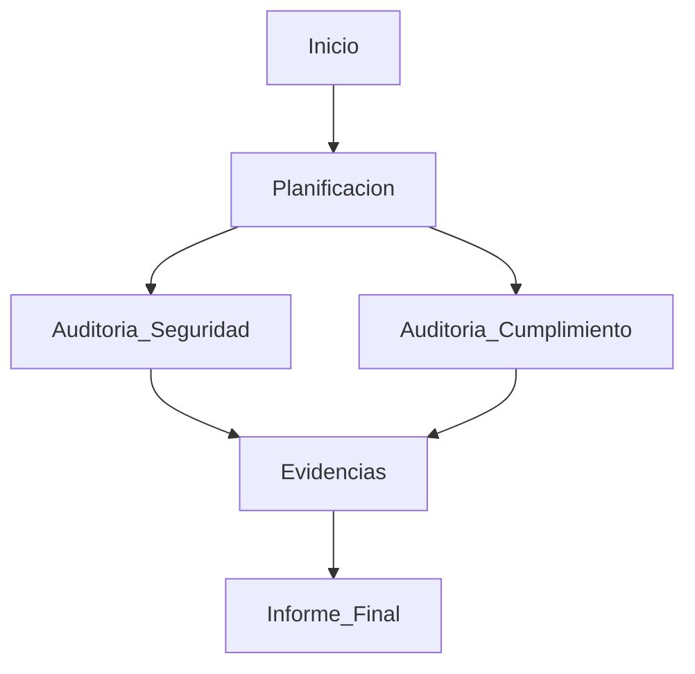
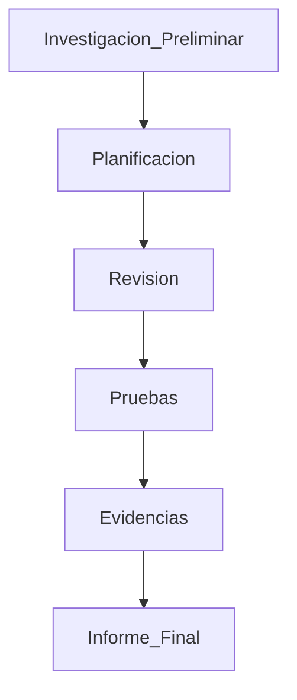

# Auditorías De Cumplimiento En Seguridad De la Información

## 1. Introducción a Las Auditorías De Cumplimiento

Las **auditorías de cumplimiento (compliance audits)** evalúan si una organización cumple con **normativas, leyes, estándares y regulaciones** relacionadas con la seguridad de la información.

Estas auditorías son diferentes de las **auditorías operativas o técnicas**, ya que no solo analizan la seguridad tecnológica, sino también el **cumplimiento normativo y regulatorio**.

### Objetivo Principal

El objetivo de una auditoría de cumplimiento es **identificar la brecha (gap)** entre:

- Lo que exige una **norma o regulación**
    
- Lo que realmente está **implementado en la organización**

### Conceptos Clave Evaluados

Las auditorías de cumplimiento también verifican los principios fundamentales de la seguridad de la información:

|Principio|Definición|
|---|---|
|Confidencialidad|La información solo es accessible por personas autorizadas|
|Integridad|La información no ha sido modificada de forma no autorizada|
|Disponibilidad|La información y los sistemas están accesibles cuando se necesitan|

---

## 2. Tipos De Auditorías De Cumplimiento

Las auditorías pueden realizarse contra diferentes normas o regulaciones.

Ejemplos comunes:

- Auditoría de **protección de datos**
    
- Auditoría del **Esquema Nacional de Seguridad (ENS)**
    
- Auditoría de **ISO 27001**
    
- Auditoría de **PCI DSS**
    
- Auditoría de **certificación de sistemas de gestión**

Estas auditorías buscan detectar:

- Incumplimientos normativos
    
- Riesgos regulatorios
    
- Oportunidades de mejora

---

# 3. Auditoría De Protección De Datos

## Definición

Una **auditoría de protección de datos** verifica que una organización gestiona los **datos personales** de acuerdo con la legislación vigente.

Ejemplos de legislaciones:

- GDPR (Europa)
    
- LOPD (España)
    
- Leyes nacionales de privacidad de datos

---

## Qué Son Los Datos Personales

Los **datos personales** son cualquier información que permita identificar directa o indirectamente a una persona.

### Ejemplos De Datos Personales

|Tipo de dato|Ejemplo|
|---|---|
|Identificación|Nombre, DNI, pasaporte|
|Información médica|Historial clínico|
|Datos financieros|Información bancaria|
|Datos ideológicos|Creencias políticas|
|Datos privados|Información personal o familiar|

Estos datos requieren **medidas de seguridad especiales** para evitar su uso indebido.

---

## Método De Auditoría De Protección De Datos

Las auditorías de protección de datos siguen un proceso estructurado.

### Fases Principales

|Fase|Descripción|
|---|---|
|Inicio y planificación|Definir alcance, objetivos y equipo auditor|
|Auditoría de seguridad|Revisar medidas técnicas de protección|
|Auditoría de cumplimiento|Revisar aspectos legales y regulatorios|
|Informe final|Presentación de resultados y recomendaciones|

### Importancia Del Equipo Multidisciplinario

En esta auditoría participan:

|Perfil|Función|
|---|---|
|Auditores técnicos|Analizan controles de seguridad|
|Especialistas legales|Verifican cumplimiento de la legislación|

---

# 4. Auditoría Del Esquema Nacional De Seguridad (ENS)

## Definición

El **Esquema Nacional de Seguridad (ENS)** es un marco normativo que establece **controles de seguridad obligatorios para sistemas de información del sector público en España**.

El ENS define controles organizados en tres marcos principales.

---

## Marcos De Seguridad Del ENS

|Marco|Número de controles|Descripción|
|---|---|---|
|Marco organizativo|4|Políticas y gobernanza de seguridad|
|Marco operacional|33|Gestión operativa de seguridad|
|Medidas de protección|36|Controles técnicos|

---

## Ejemplos De Controles ENS

### Marco Organizativo

- Políticas de seguridad
    
- Normativa interna
    
- Gestión de responsabilidades

### Marco Operacional

- Control de acceso
    
- Gestión de servicios externos
    
- Seguridad en servicios cloud

### Medidas De Protección

- Protección de equipos
    
- Seguridad de comunicaciones
    
- Protección de soportes de información

---

# 5. Método General De Auditoría De Cumplimiento

Las auditorías de cumplimiento siguen un proceso estructurado similar al de otras auditorías.

## Etapas Principales

|Etapa|Actividades|
|---|---|
|Investigación preliminar|Definir alcance y objetivos|
|Planificación|Definir plan de auditoría|
|Revisión|Analizar documentación|
|Pruebas|Entrevistas, análisis y observaciones|
|Informe|Resultados y recomendaciones|

Uno de los objetivos clave del informe es indicar:

- **Grado de cumplimiento**
    
- **Acciones correctivas necesarias**

---

# 6. Auditoría De Sistemas De Gestión De Seguridad De la Información (ISO 27001)

## Definición

La **ISO 27001** es un estándar internacional para implementar un **Sistema de Gestión de Seguridad de la Información (SGSI)**.

Un SGSI establece procesos, políticas y controles para proteger la información de una organización.

---

## Auditoría Interna Del SGSI

Antes de solicitar una certificación externa, la organización debe realizar **auditorías internas**.

### Fases

|Fase|Descripción|
|---|---|
|Inicio|Definición del alcance|
|Planificación|Preparación del plan de auditoría|
|Auditoría documental|Revisión de políticas y procedimientos|
|Auditoría de controles|Verificación de efectividad|
|Informe|Resultados y mejoras|

Es recomendable realizar **varias auditorías internas** antes de solicitar la certificación.

---

## Auditoría Externa De Certificación

La certificación ISO 27001 la realiza una **entidad certificadora externa**.

### Etapas

|Etapa|Actividad|
|---|---|
|Fase 1|Revisión documental|
|Fase 2|Evaluación de controles|
|Informe|Resultados de auditoría|
|Acciones correctivas|Corrección de fallos|

Si la organización cumple los requisitos, se obtiene la **certificación ISO 27001**.

---

## Ciclo De Certificación

La certificación require auditorías periódicas.

---

# 7. Auditoría PCI DSS

## Definición

**PCI DSS (Payment Card Industry Data Security Standard)** es un estándar de seguridad para proteger **datos de tarjetas de pago**.

Es obligatorio para organizaciones que:

- Procesan pagos con tarjeta
    
- Almacenan datos de tarjetas
    
- Transmiten información de tarjetas

---

## Objetivo Principal

Proteger:

- Datos del titular de la tarjeta
    
- Información de autenticación
    
- Transacciones financieras

---

## Proceso De Auditoría PCI DSS

### Paso 1: Definir El Alcance

Identificar:

- Sistemas que procesan pagos
    
- Flujos de datos de tarjetas
    
- Infraestructura relacionada

### Paso 2: Revisar Documentación

Se revisan:

- Políticas de seguridad
    
- Arquitectura de red
    
- Procesos de pago

### Paso 3: Evaluación De Controles

Incluye:

- Pruebas técnicas
    
- Entrevistas al personal
    
- Análisis de evidencias

---

# 8. Tipos De Informes PCI DSS

Dependiendo del tipo de organización, existen diferentes mecanismos de validación.

|Tipo|Descripción|
|---|---|
|SAQ (Self Assessment Questionnaire)|Cuestionario de autoevaluación|
|ROC (Report on Compliance)|Informe completo de cumplimiento|

---

## Clasificación De Organizaciones

|Nivel|Tipo de organización|
|---|---|
|Nivel 1|Grandes entidades financieras|
|Nivel 2|Empresas con alto volumen de transacciones|
|Nivel 3|Comercios medianos|
|Nivel 4|Comercios pequeños|

---

## Requisitos De Evaluación

|Nivel|Requisito|
|---|---|
|Nivel 1|Auditoría completa (ROC)|
|Nivel 2-4|SAQ|

---

## Evaluadores Certificados

Las auditorías PCI DSS deben set realizadas por:

**QSA – Qualified Security Assessor**

Estos son auditores certificados para evaluar cumplimiento PCI DSS.

---

## Escaneos Obligatorios

Las organizaciones deben realizar **escaneos de vulnerabilidades**.

|Nivel|Frecuencia|
|---|---|
|Nivel 1|Escaneo trimestral obligatorio|
|Nivel 2-4|Dependiendo del tipo de SAQ|

Los escaneos deben set realizados por un:

**ASV – Approved Scanning Vendor**

---

# Resumen De Puntos Clave

- Las **auditorías de cumplimiento** verifican si una organización cumple con normas, leyes y estándares.
    
- El objetivo principal es identificar la **brecha entre la normativa y la implementación real**.
    
- Las auditorías pueden realizarse contra diferentes estándares como **protección de datos, ENS, ISO 27001 y PCI DSS**.
    
- La auditoría de **protección de datos** analiza la gestión de datos personales y require tanto expertos técnicos como legales.
    
- El **Esquema Nacional de Seguridad (ENS)** organiza los controles en tres marcos: organizativo, operacional y medidas de protección.
    
- La **ISO 27001** establece un sistema de gestión de seguridad de la información que require auditorías internas y externas.
    
- Las certificaciones ISO requieren auditorías de **seguimiento annual** y renovación periódica.
    
- **PCI DSS** protege la información de tarjetas de pago y require evaluaciones específicas dependiendo del nivel de la organización.
    
- Las auditorías PCI DSS pueden incluir **SAQ (auto evaluación) o ROC (informe completo)**.

---

## MicroTest

1. Señala la respuesta incorrecta. Están obligadas a realizar la auditoría de protección de datos todas aquellas organizaciones que, tratando datos de carácter personal, traten datos de alguno de los siguientes tipos:
    
    - La respuesta: B. Los referentes a los datos de identificación del individuo.
        
    - Justificación: Las auditorías obligatorias de protección de datos se aplican principalmente cuando se tratan **datos especialmente sensibles**, como ideología, infracciones o sanciones y datos que permitan evaluar la personalidad del individuo. Los **datos de identificación básicos** (nombre, DNI, etc.) son datos personales, pero no pertenecen necesariamente a categorías de alto nivel de riesgo que obliguen por sí mismas a este tipo de auditoría, por lo que esta opción es la incorrecta.
        
2. Señala la respuesta incorrecta. Las medidas de seguridad que establece el Esquema Nacional de Seguridad de España se clasifican conforme a:
    
    - La respuesta: A. El marco normativo.
        
    - Justificación: El **Esquema Nacional de Seguridad (ENS)** clasifica sus controles en tres grupos: **marco organizativo, marco operacional y medidas de protección**. El **marco normativo** no forma parte de esta clasificación, por lo que esta opción es la incorrecta.
        
3. Las normas de seguridad de los datos de la industria de las tarjetas de pago (PCI DSS) de aplican obligatoriamente:
    
    - La respuesta: C. A las empresas que almacenan, procesan o transmiten datos de tarjetas de pago.
        
    - Justificación: El estándar **PCI DSS (Payment Card Industry Data Security Standard)** se aplica a **todas las organizaciones que almacenan, procesan o transmiten datos de tarjetas de pago**, independientemente de si son bancos, comercios u otros proveedores de servicios. Por ello, la opción C describe correctamente el alcance obligatorio de esta normativa.